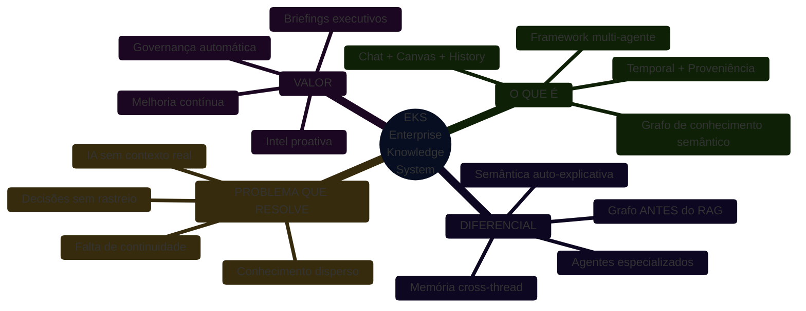
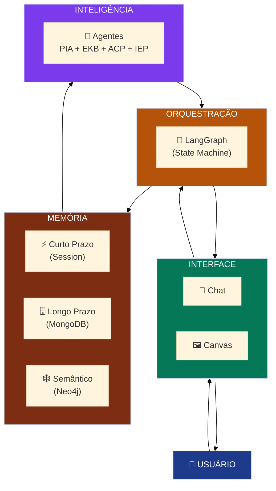
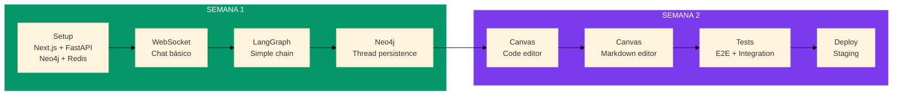
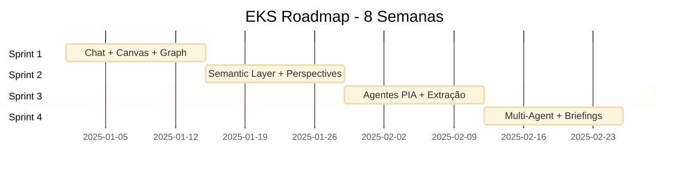
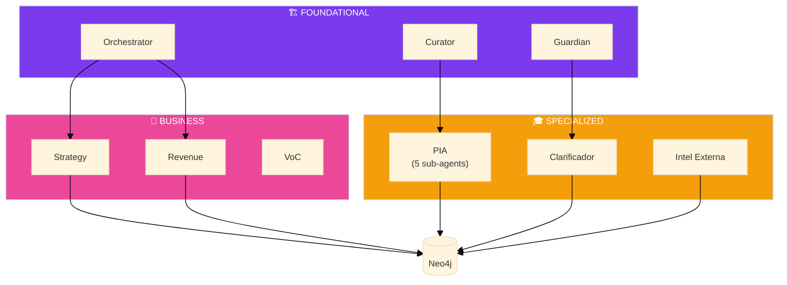

# 🎯 EKS Framework - Resumo Visual Executivo

## Quick Navigation
- [Framework Completo](./eks-framework-complete.md) - Visão macro do TODO
- [Sprint 1 MVP](./eks-sprint1-mvp.md) - O que fazer AGORA

---

## 🌍 Visão Geral: O que é o EKS?



---

## 🏗️ Arquitetura em 30 Segundos



---

## 📊 Comparação: Antes vs Depois

| Aspecto | ❌ Sem EKS | ✅ Com EKS |
|---------|-----------|-----------|
| **Conhecimento** | Espalhado (PPTs, emails, cabeça das pessoas) | Estruturado em grafo semântico |
| **Decisões** | Sem dono/prazo, perdidas no chat | Rastreadas com owner, deadline, evidência |
| **Memória IA** | Esquece tudo entre conversas | Cross-thread, aprende continuamente |
| **Contexto** | Prompt gigante ou incompleto | Context Engineering (select + compress) |
| **RAG** | Vector search black-box | Grafo semântico + vector + relational |
| **Governança** | Manual, reativa | Automática, proativa (5 gatilhos) |
| **Briefings** | Feitos à mão, incompletos | Gerados automaticamente (daily/weekly/monthly) |
| **Análise** | Difícil rastrear "por quê" | Explicável (prova → decisão → impacto) |

---

## 🎯 Sprint 1: O Que Fazer AGORA (2 semanas)



### Entregáveis Sprint 1:
- ✅ Chat funcional (send/receive messages)
- ✅ Canvas interativo (code + markdown)
- ✅ Thread history persistido em Neo4j
- ✅ WebSocket real-time
- ✅ Auth básico (email/senha)

---

## 🗺️ Roadmap Completo (4 Sprints)



---

## 🔑 Conceitos-Chave para Entender o EKS

### 1️⃣ **Grafo Semântico ANTES do RAG**
> "O grafo não É o RAG, mas sim a base estruturada que o alimenta"

- **Grafo** = Semantic map (mostra relações)
- **Vector** = Semantic search (acha similar)
- **Juntos** = Context Engineering

### 2️⃣ **Golden Rule GR-001: Temporalidade + Proveniência**
```
Toda informação relevante precisa:
├── valid_from / valid_to (quando vale)
├── asserted_at (quando foi registrado)
├── source / evidence (de onde veio)
└── confidence / status (quão confiável)
```

### 3️⃣ **Resumos = Diretrizes (não fim)**
```
CompanySnapshot → PerspectiveSummary → Trilhas → Micro (Prova)
      TODO              MACRO              MESO      MICRO
```

### 4️⃣ **Poucas Perguntas**
```
Orçamento padrão: 1 pergunta/rodada
Modo: Surpresa inicial (entrega valor antes de perguntar)
```

### 5️⃣ **Context Engineering > RAG 1.0**
```
Write    → Persistir entre tasks
Compress → Sumarizar contexto
Isolate  → Dividir entre agentes
Select   → Escolher tool certa (graph/vector/grep/relational)
```

---

## 🤖 Ecossistema de Agentes (Futuro)



---

## 📈 Métricas de Sucesso

### Sprint 1 (MVP)
- ✅ Chat latency < 500ms (p95)
- ✅ Thread load < 1s
- ✅ Zero message loss
- ✅ 100% WebSocket uptime (local)

### Sprint 2 (Semantic Layer)
- ✅ Grafo com 3 perspectivas mapeadas
- ✅ 100% decisions com owner + deadline
- ✅ CompanySnapshot + ProfileSnapshot implementados

### Sprint 3 (Agentes)
- ✅ PIA extrai processos automaticamente
- ✅ ACP resolve dúvidas qualificadas
- ✅ Precision de extração ≥ 85%

### Sprint 4 (Multi-Agent)
- ✅ Daily briefing gerado automaticamente
- ✅ 5 gatilhos de governança funcionando
- ✅ IEP monitora fontes externas

---

## 🛠️ Tech Stack Resumido

```
Frontend:  Next.js 15 + React 19 + shadcn/ui + Tailwind
Backend:   FastAPI + LangGraph + LangChain
Storage:   Neo4j (graph) + MongoDB (memory) + Redis (cache)
AI:        OpenAI GPT-4o + Claude + text-embedding-3
Deploy:    Vercel (FE) + Railway (BE) + Neo4j Aura + Atlas
```

---

## 🎓 Recursos para Estudar

### Já Pesquisado:
- ✅ Canvas Pattern (Vercel/LangGraph)
- ✅ Context Engineering > RAG 2.0
- ✅ Semantic Layer (Graphwise)
- ✅ GraphRAG Architecture (Neo4j)
- ✅ Multi-Agent Memory (MongoDB + LangGraph)
- ✅ Multi-Tenancy Neo4j (Composite DB)

### Próximos a Pesquisar:
- 🔜 **Projeto mencionado pelo usuário** (aguardando link)
- 🔜 LangGraph Custom Checkpointers
- 🔜 Neo4j Temporal Queries Best Practices
- 🔜 FastAPI WebSocket at Scale

---

## ✅ Checklist Antes de Começar Sprint 1

```mermaid
%%{init: {'theme': 'base', 'themeVariables': { 'primaryColor': '#10b981'}}}%%
graph LR
    C1[" Docker instalado"]
    C2[" Node.js 20+"]
    C3[" Python 3.11+"]
    C4[" Neo4j Desktop/Docker"]
    C5[" Redis Docker"]
    C6[" OpenAI API Key"]
    C7[" GitHub repo criado"]
    C8[" .env configurado"]
    
    C1 --> C2
    C2 --> C3
    C3 --> C4
    C4 --> C5
    C5 --> C6
    C6 --> C7
    C7 --> C8
    
    style C1 fill:#10b981,color:#fff
    style C2 fill:#10b981,color:#fff
    style C3 fill:#10b981,color:#fff
    style C4 fill:#10b981,color:#fff
    style C5 fill:#10b981,color:#fff
    style C6 fill:#10b981,color:#fff
    style C7 fill:#10b981,color:#fff
    style C8 fill:#10b981,color:#fff
```



---

## 🚀 Comando para Iniciar

```bash
# 1. Clonar repo (assumindo que já existe)
git clone <repo-url>
cd Spec-Orchestrator

# 2. Subir infraestrutura
docker-compose up -d  # Neo4j + Redis

# 3. Backend
cd backend
python -m venv venv
source venv/bin/activate  # Windows: venv\Scripts\activate
pip install -r requirements.txt
uvicorn app.main:app --reload

# 4. Frontend (outro terminal)
cd frontend
npm install
npm run dev

# 5. Abrir http://localhost:3000
```

---

## 📞 Próximo Passo

**Aguardando**: Link do projeto para pesquisar

**Depois**: Executar `/speckit-specify` para criar especificação detalhada do Sprint 1

---

**Última atualização**: 13/12/2024
**Status**: ✅ Pesquisas completas | 🔜 Aguardando projeto do usuário
