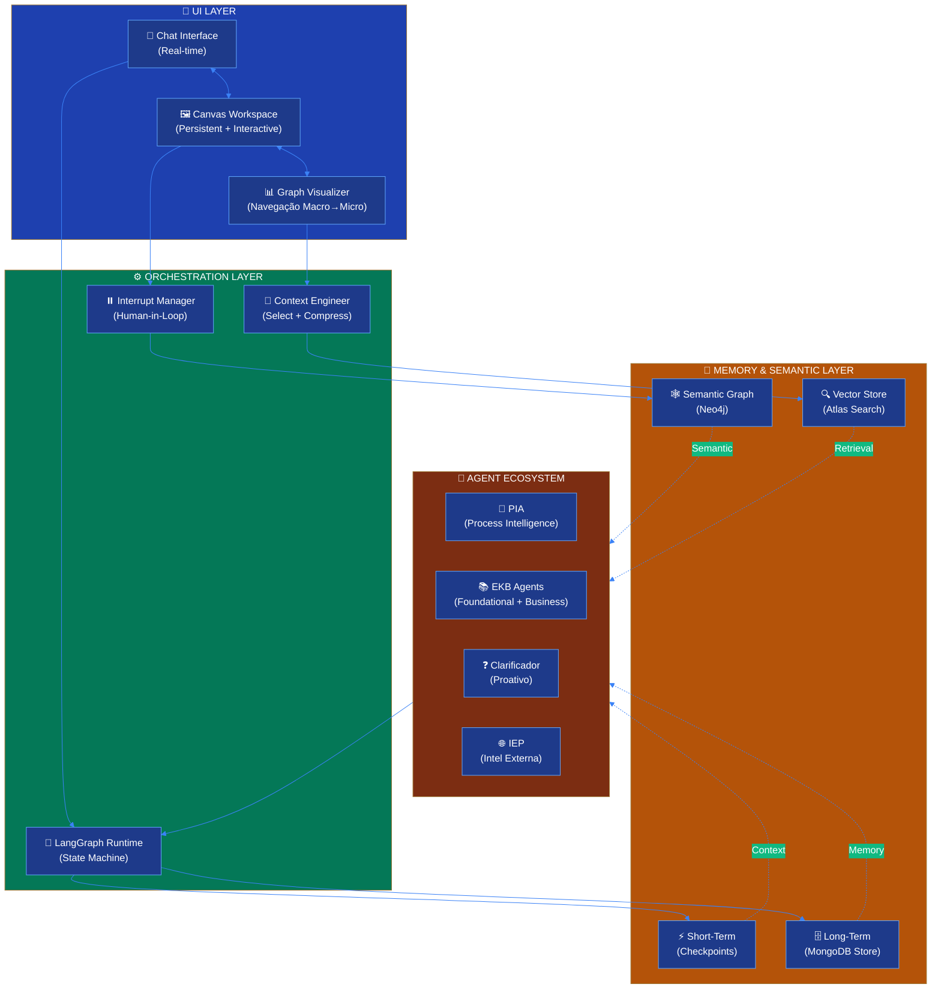
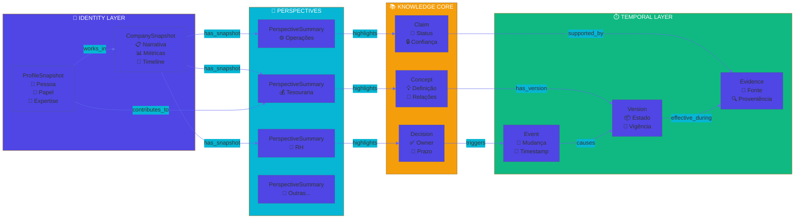
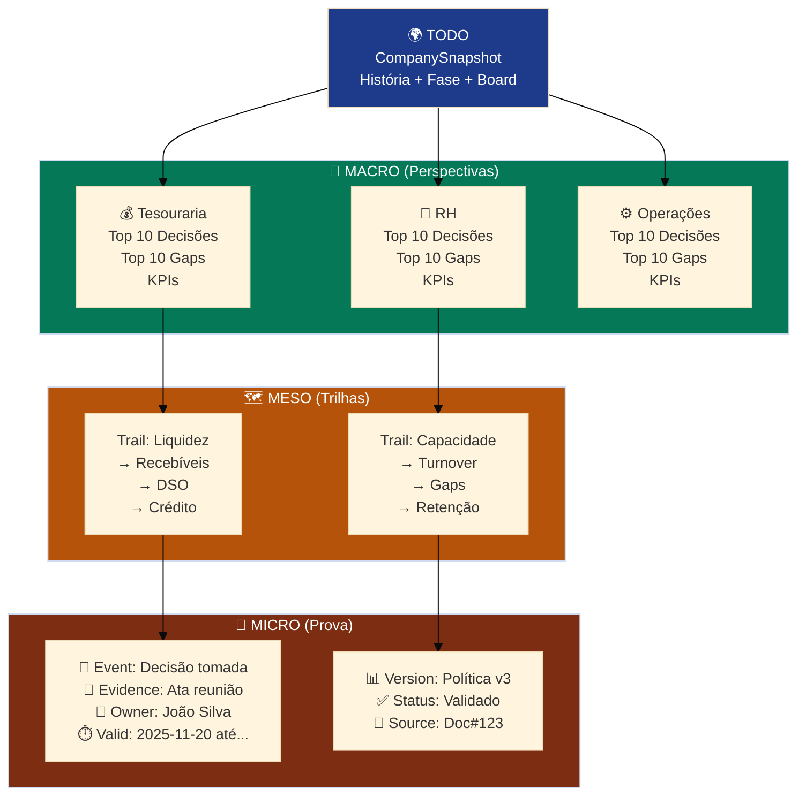
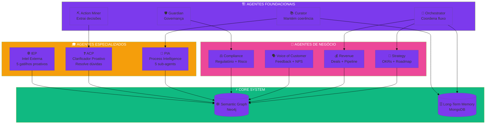
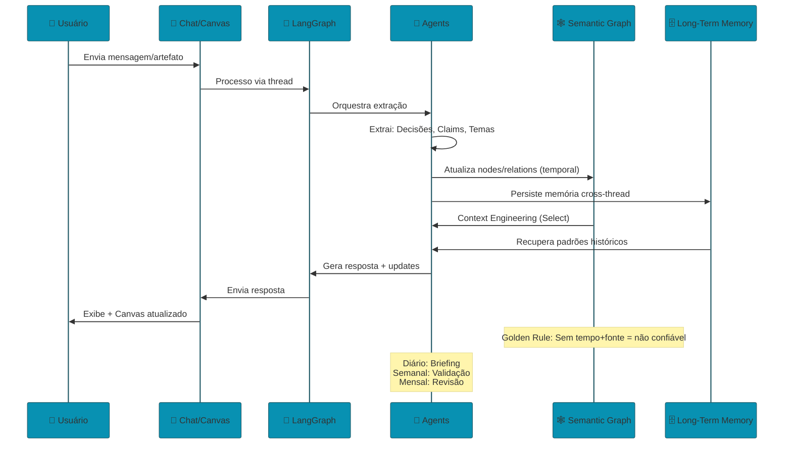
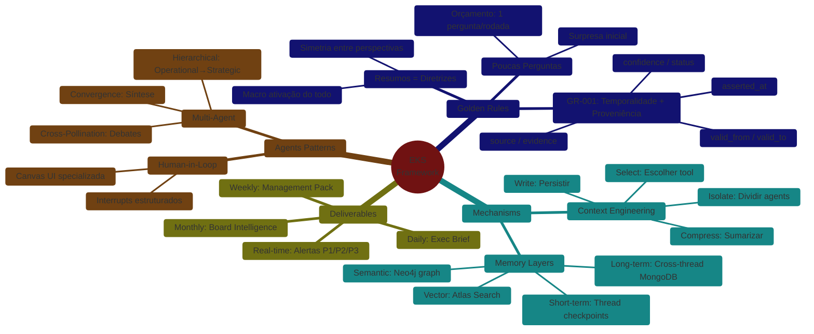
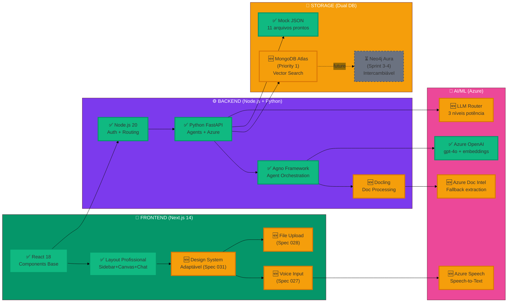
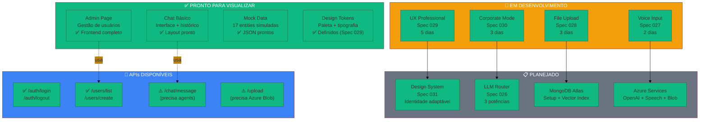
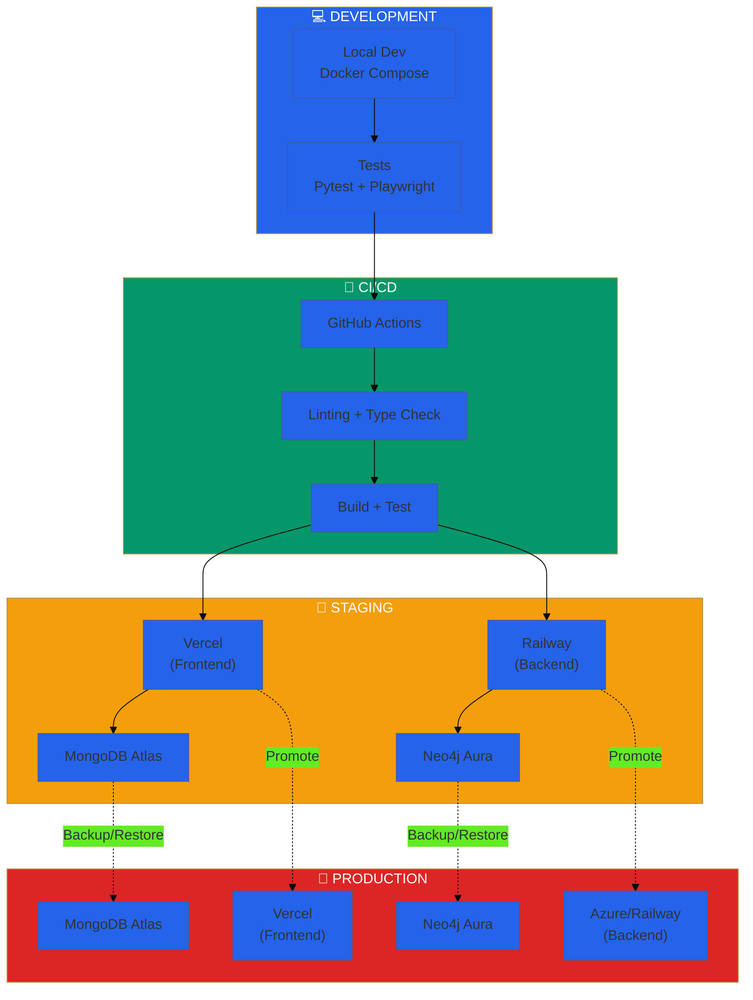

# Framework EKS - Visão Completa

## 1. Arquitetura Macro (4 Camadas)

---

## 2. Semantic Graph - Ontologia Base

---

## 3. Navegação: Todo → Micro

---

## 4. Ecossistema de Agentes

---

## 5. Data Flow: Ingestão → Briefing

---

## 6. Golden Rules & Mechanisms

---

## 7. Tech Stack MVP v1

**Legenda**:
- ✅ **Pronto**: Implementado ou com mock funcional
- 🆕 **Novo**: Spec criada, pronto para implementar (Sprint 1-2)
- ⏳ **Futuro**: Planejado para Sprint 3-4

---

## 8. Features Implementadas (MVP v1 Status)

**Status Atual**:
- ✅ **Frontend Base**: Layout admin funcional
- ✅ **Mock Data**: 11 arquivos JSON prontos para simulação
- 🔨 **4 Specs Novas**: UX (029), Corporate (030), Voice (027), File (028)
- ⚠️ **APIs Parciais**: Auth OK, Chat precisa agents backend
- 📋 **Próximo**: Design System (Spec 031) + implementação Sprint 1

---

## 9. Deployment & DevOps

