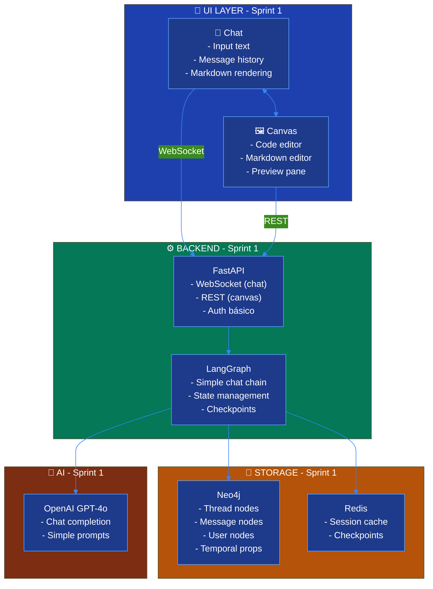
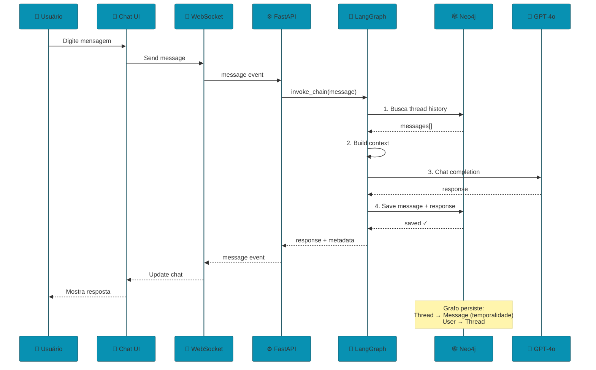
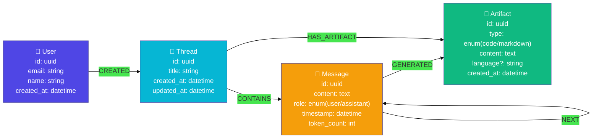
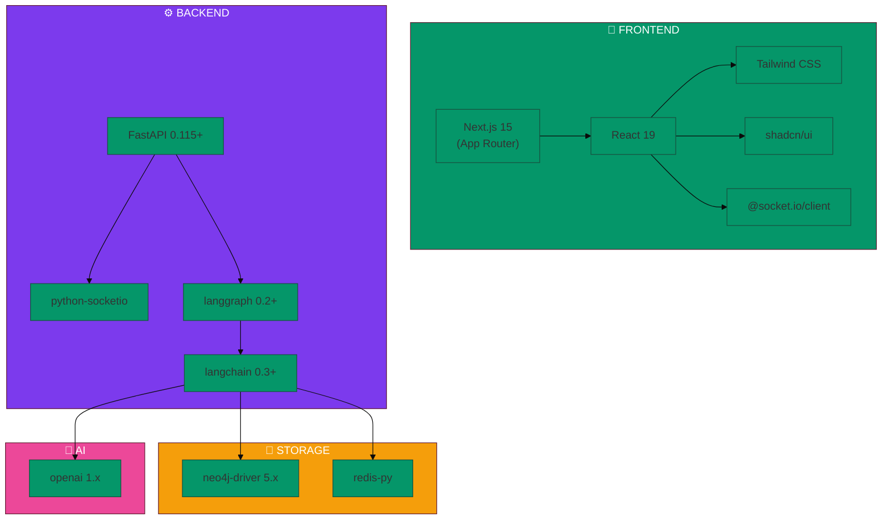
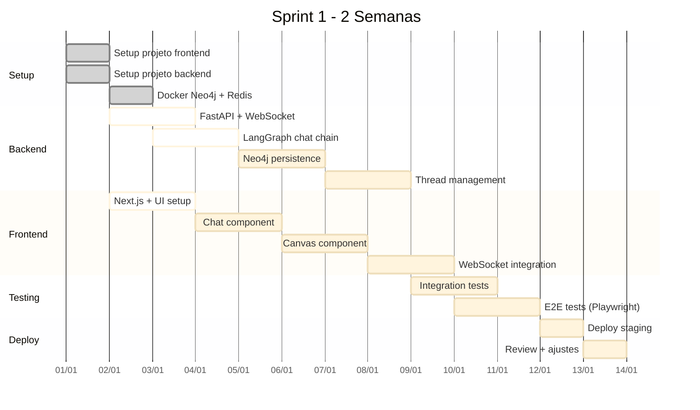
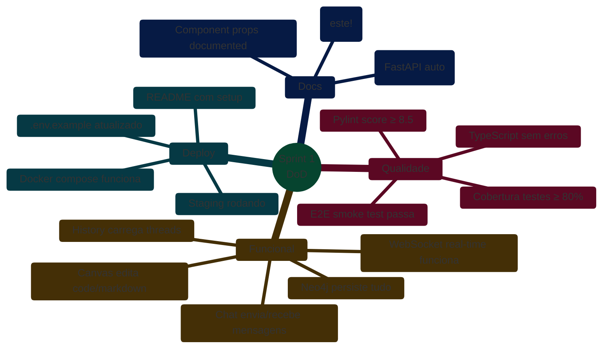
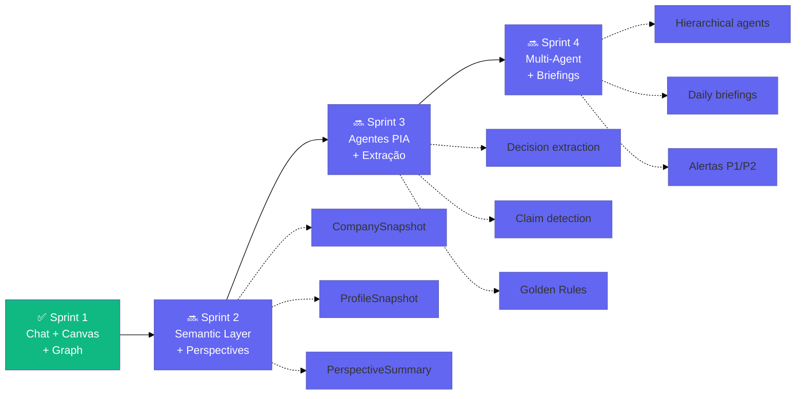

# EKS - Sprint 1: Chat + Canvas + Semantic Graph MVP

## 🎯 Objetivo do Sprint 1
**Entregar**: Chat funcional + Canvas interativo + Histórico semântico persistido em grafo Neo4j

**Duração**: 2 semanas

---

## 1. Arquitetura Sprint 1 (Simplificada)



---

## 2. Fluxo de Dados Sprint 1



---

## 3. Modelo de Dados Neo4j - Sprint 1



**Cypher Schema**:
```cypher
// User
CREATE (u:User {
  id: randomUUID(),
  email: 'user@example.com',
  name: 'João Silva',
  created_at: datetime()
})

// Thread
CREATE (t:Thread {
  id: randomUUID(),
  title: 'Nova conversa',
  created_at: datetime(),
  updated_at: datetime()
})

// Message
CREATE (m:Message {
  id: randomUUID(),
  content: 'Hello, world!',
  role: 'user',
  timestamp: datetime(),
  token_count: 42
})

// Relationships
CREATE (u)-[:CREATED]->(t)
CREATE (t)-[:CONTAINS]->(m1)
CREATE (m1)-[:NEXT]->(m2)
```

---

## 4. Tech Stack Sprint 1



---

## 5. Features Sprint 1 (Priorização)

```mermaid
%%{init: {'theme': 'base', 'themeVariables': { 'fontSize': '14px'}}}%%
graph TD
    P0["🔴 P0 - CRÍTICO<br/>(Deve ter)"]
    P1["🟡 P1 - IMPORTANTE<br/>(Bom ter)"]
    P2["🟢 P2 - DESEJÁVEL<br/>(Pode ter depois)"]
    
    P0 --> F1["✅ Chat básico funcional"]
    P0 --> F2["✅ Canvas code editor"]
    P0 --> F3["✅ Persistência Neo4j"]
    P0 --> F4["✅ Thread history"]
    P0 --> F5["✅ WebSocket real-time"]
    
    P1 --> F6["🔹 Canvas markdown editor"]
    P1 --> F7["🔹 Syntax highlighting"]
    P1 --> F8["🔹 Auth básico (email/senha)"]
    P1 --> F9["🔹 Export thread (JSON/MD)"]
    
    P2 --> F10["⚪ Multi-user threads"]
    P2 --> F11["⚪ Canvas preview live"]
    P2 --> F12["⚪ Rich markdown (Mermaid)"]
    P2 --> F13["⚪ Voice input"]
    
    style P0 fill:#dc2626,color:#fff
    style P1 fill:#f59e0b,color:#fff
    style P2 fill:#10b981,color:#fff
```



---

## 6. Estrutura de Pastas Sprint 1

```
Spec-Orchestrator/
├── frontend/                    # Next.js app
│   ├── app/
│   │   ├── (auth)/
│   │   │   ├── login/
│   │   │   └── signup/
│   │   ├── chat/
│   │   │   └── [threadId]/
│   │   │       └── page.tsx
│   │   └── layout.tsx
│   ├── components/
│   │   ├── chat/
│   │   │   ├── ChatInput.tsx
│   │   │   ├── MessageList.tsx
│   │   │   └── ThreadSidebar.tsx
│   │   ├── canvas/
│   │   │   ├── CodeEditor.tsx
│   │   │   ├── MarkdownEditor.tsx
│   │   │   └── PreviewPane.tsx
│   │   └── ui/                 # shadcn components
│   ├── lib/
│   │   ├── socket.ts           # WebSocket client
│   │   └── api.ts              # REST client
│   └── package.json
│
├── backend/                     # FastAPI app
│   ├── app/
│   │   ├── api/
│   │   │   ├── routes/
│   │   │   │   ├── chat.py     # WebSocket endpoints
│   │   │   │   ├── threads.py  # REST endpoints
│   │   │   │   └── auth.py     # Auth endpoints
│   │   │   └── deps.py         # Dependencies
│   │   ├── core/
│   │   │   ├── config.py
│   │   │   └── security.py
│   │   ├── db/
│   │   │   ├── neo4j.py        # Neo4j connection
│   │   │   └── redis.py        # Redis connection
│   │   ├── agents/
│   │   │   └── chat_agent.py   # LangGraph chain
│   │   └── main.py
│   ├── tests/
│   ├── requirements.txt
│   └── pyproject.toml
│
├── docker-compose.yml           # Neo4j + Redis local
├── .env.example
└── README.md
```

---

## 7. Milestones Sprint 1



---

## 8. Definition of Done (Sprint 1)



---

## 9. Riscos & Mitigações Sprint 1

| Risco | Probabilidade | Impacto | Mitigação |
|-------|--------------|---------|-----------|
| WebSocket latency | Média | Alto | Redis para checkpoints rápidos |
| Neo4j query performance | Baixa | Médio | Índices compostos desde início |
| Canvas state sync | Alta | Médio | Debounce + optimistic updates |
| OpenAI rate limits | Média | Alto | Exponential backoff + fallback |
| Auth complexity | Baixa | Baixo | Usar NextAuth.js simples |

---

## 10. Próximos Passos (Pós-Sprint 1)


