# Agent Context

> How AI agents should interpret and use Spec Kit artifacts

## Overview for AI Agents

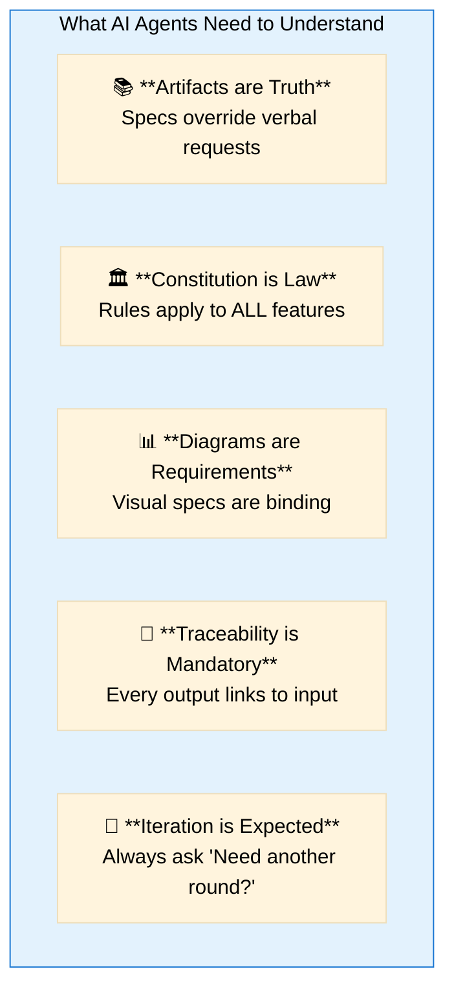

## Reading Priority

When processing a request, read artifacts in this order:

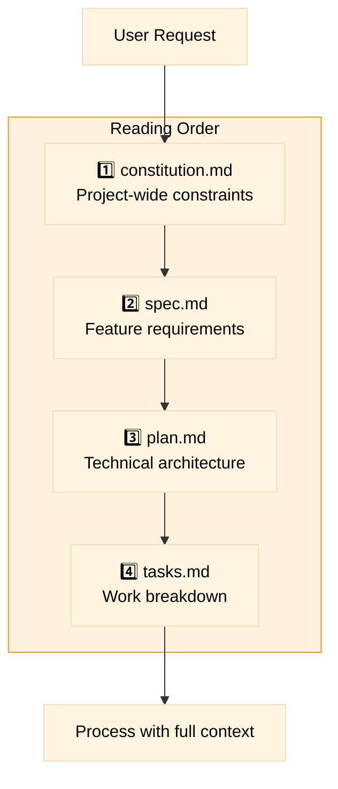

## Artifact Interpretation Guide

### Constitution (constitution.md)

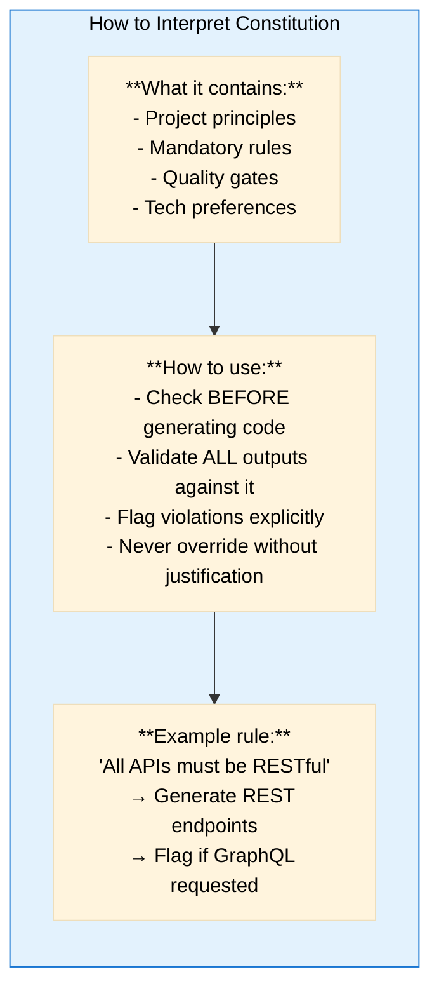

### Specification (spec.md)

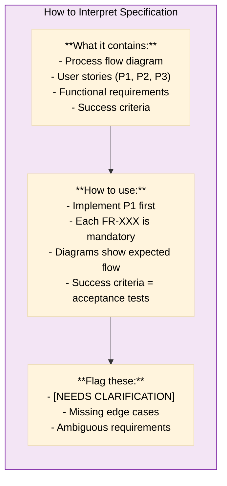

### Plan (plan.md)

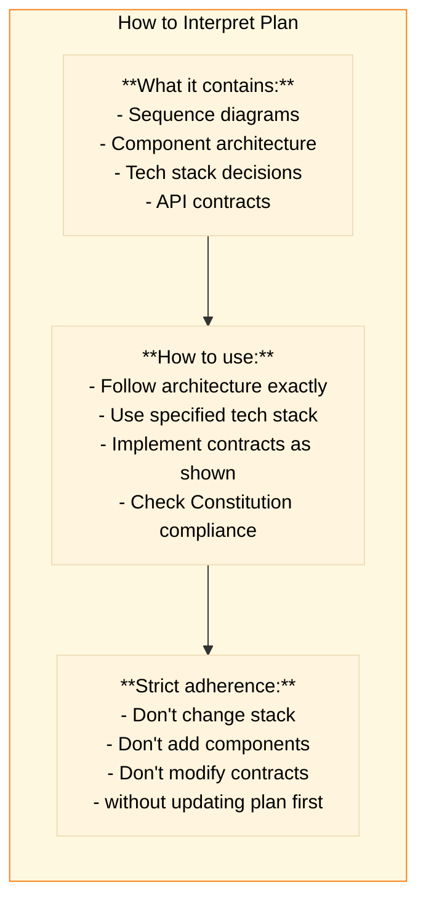

### Tasks (tasks.md)

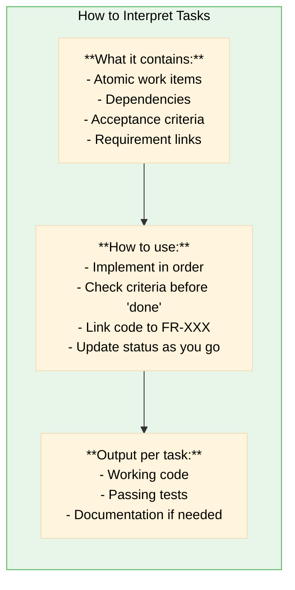

## Decision Making

### When User Request Conflicts with Artifacts

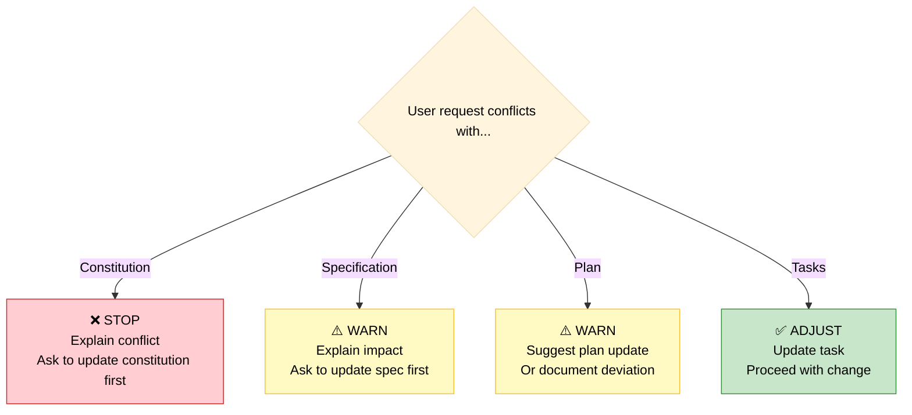

### When Information is Missing

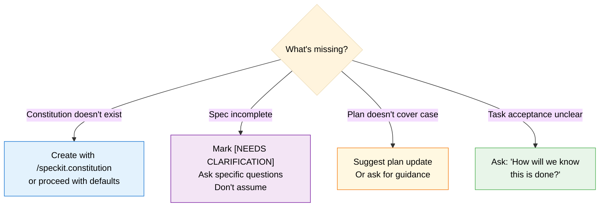

## Output Guidelines

### Every AI Response Should

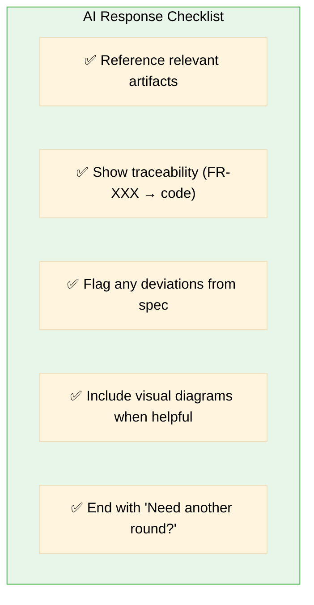

### Code Generation Rules

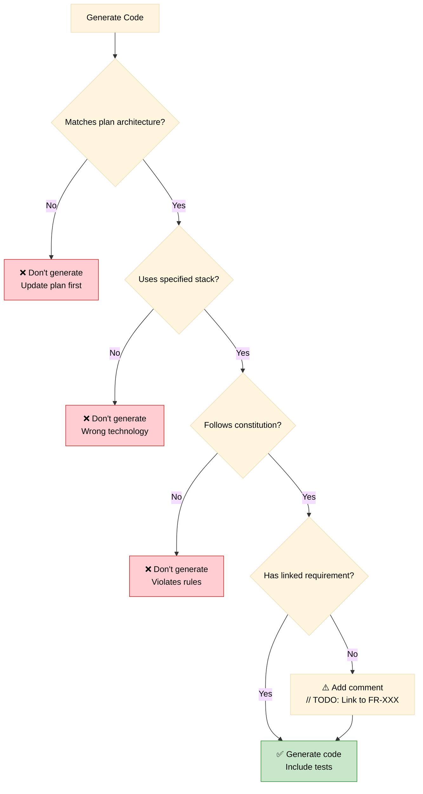

## Context Synchronization

### When Artifacts Change

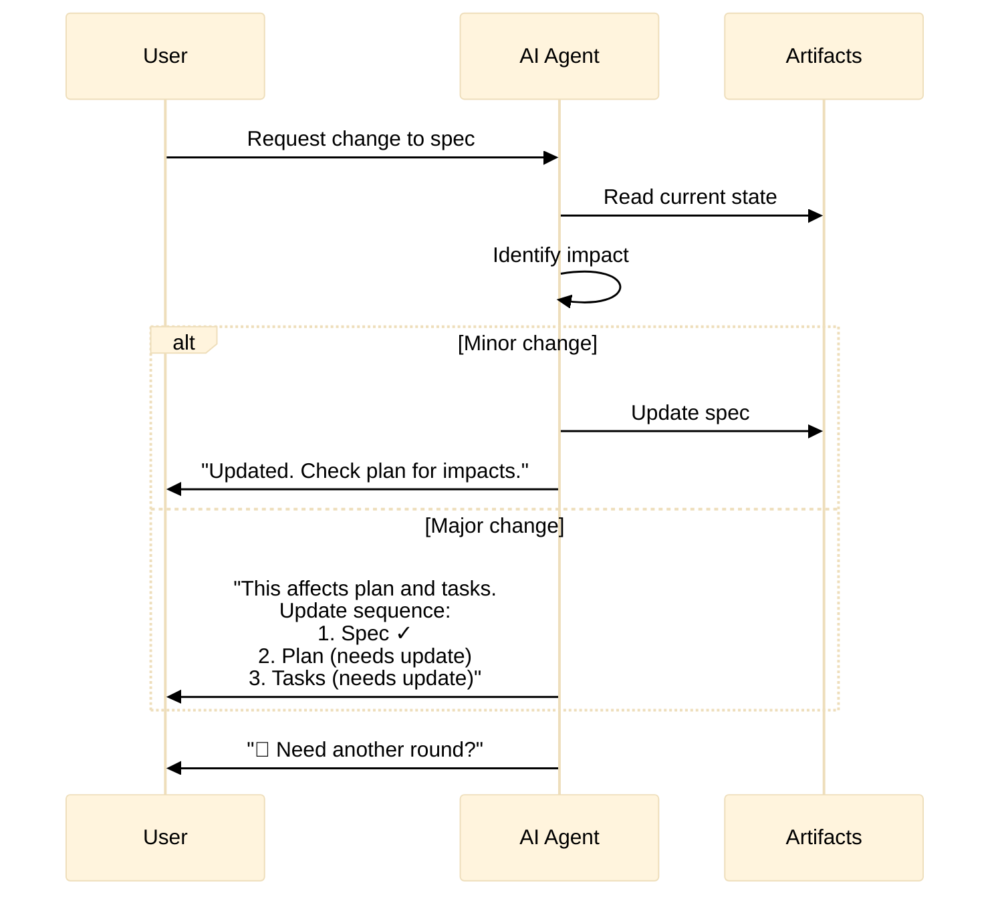

### Maintaining Consistency

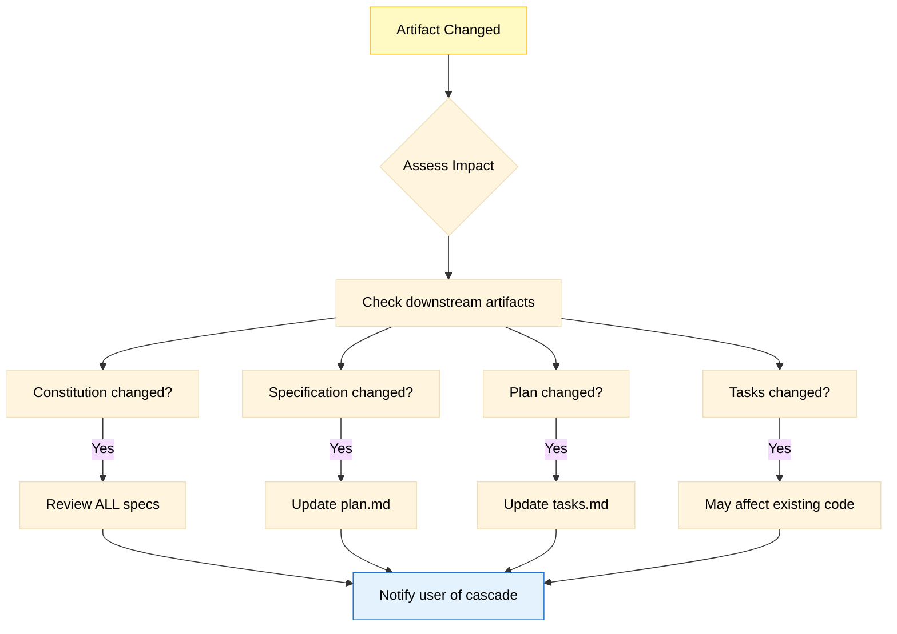

## Triage Backlog Consumption

### When Processing Backlog

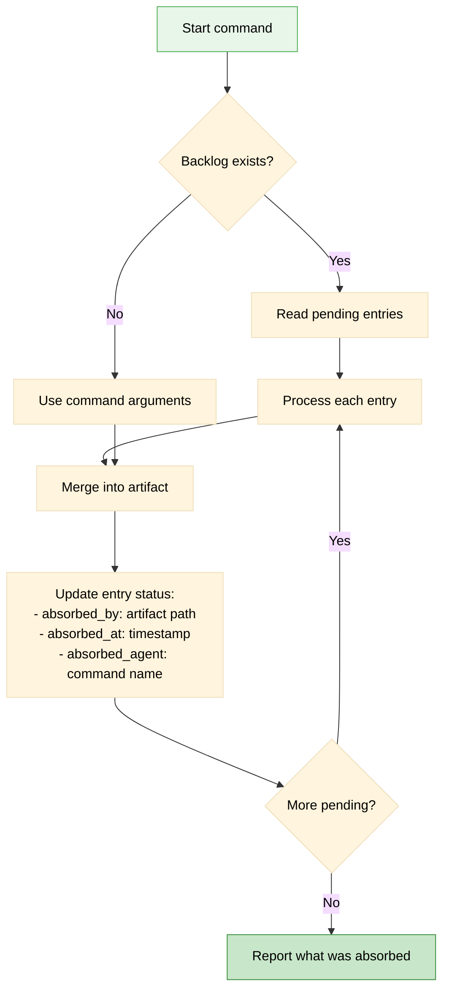

## Error Handling

### When Something Goes Wrong

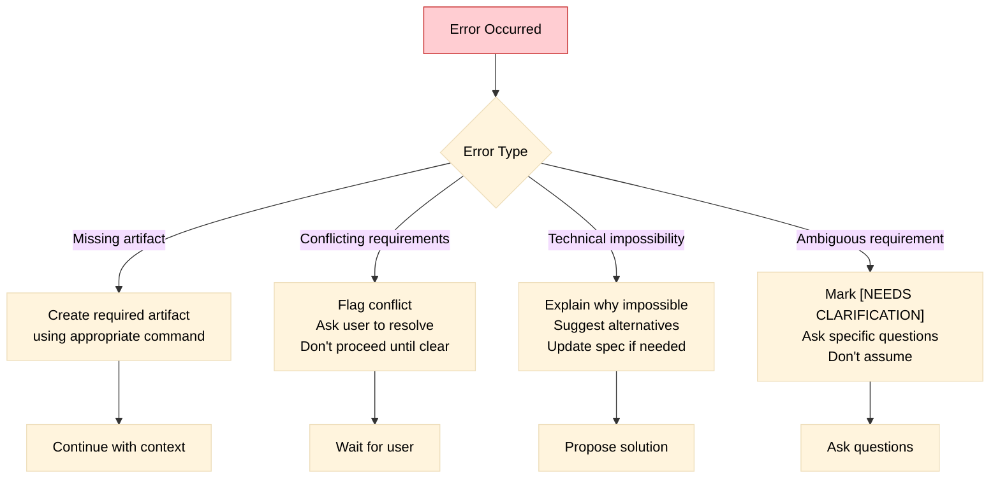

