# Best Practices

> Guidelines for effective Spec-Driven Development

## Golden Rules

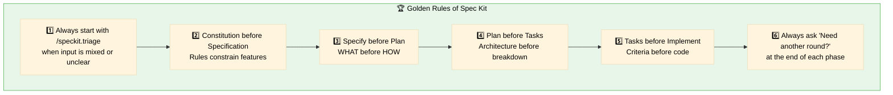

## The "Need Another Round?" Practice

**This is a mandatory practice in this kit.**

At the end of EVERY phase or significant output, always ask:

```
🔄 Need another round?
- What's missing?
- What needs clarification?
- What should be added?
```

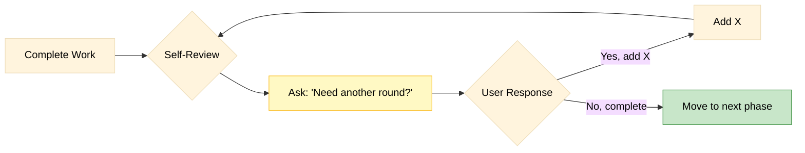

### Why This Matters

```mermaid
%%{init: {'theme': 'base', 'themeVariables': { 'primaryTextColor': '#000', 'secondaryTextColor': '#000', 'tertiaryTextColor': '#000', 'lineColor': '#333'}}}%%
flowchart TB
    subgraph Without["❌ Without 'Another Round?'"]
        W1[AI delivers output]
        W2[User finds gaps later]
        W3[Rework needed]
        W4[Time wasted]
        W1 --> W2 --> W3 --> W4
    end
    
    subgraph With["✅ With 'Another Round?'"]
        A1[AI delivers output]
        A2[AI asks about gaps]
        A3[User confirms or adds]
        A4[Complete output]
        A1 --> A2 --> A3 --> A4
    end
    
    style Without fill:#ffcdd2,stroke:#c62828,color:#000
    style With fill:#c8e6c9,stroke:#388e3c,color:#000
```

---

## Do's and Don'ts

### ✅ DO: Follow the Pipeline

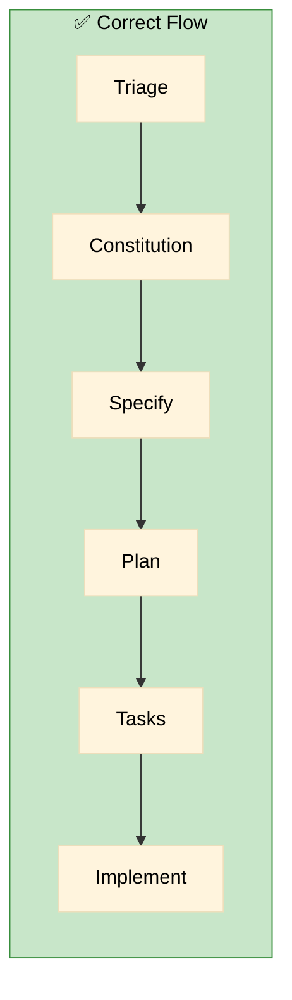

### ❌ DON'T: Skip Steps

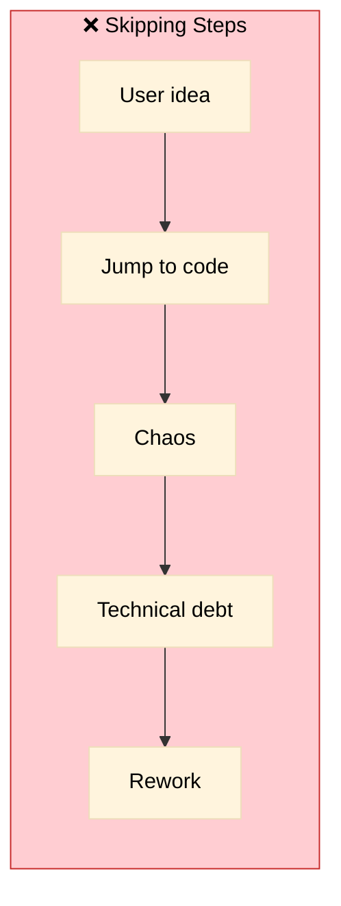

---

### ✅ DO: Use Visual Diagrams

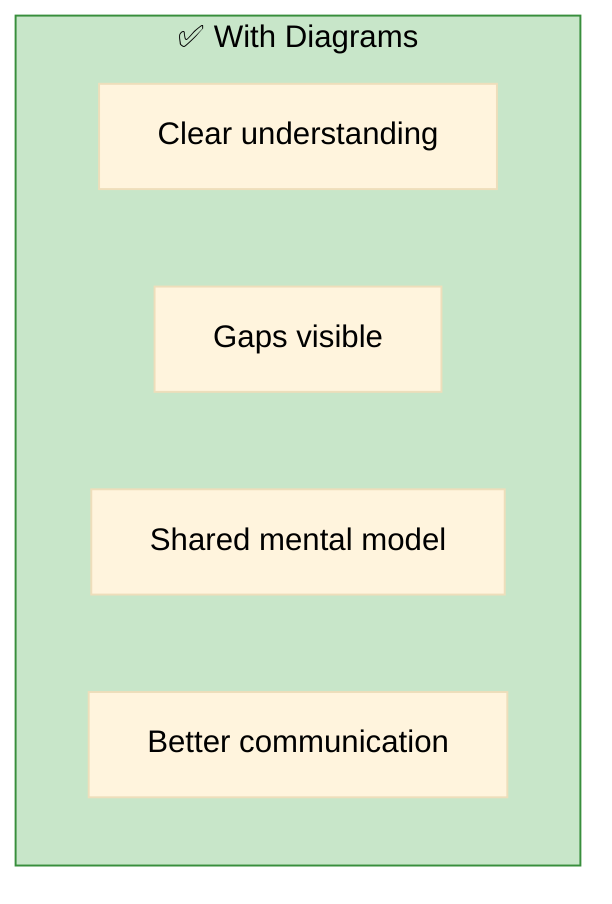

### ❌ DON'T: Text-Only Specs

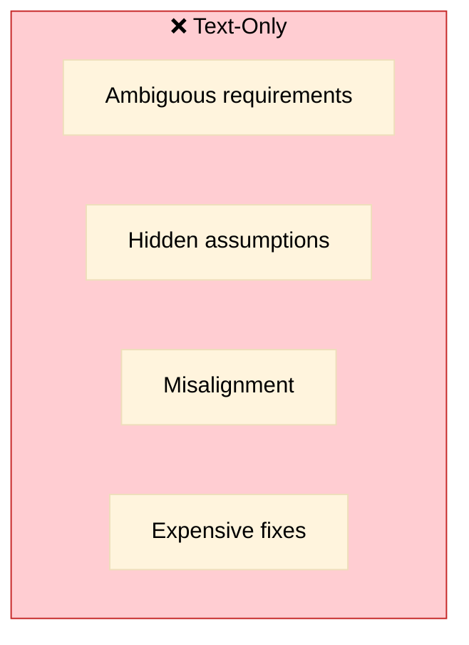

---

### ✅ DO: Mark Uncertainties

```markdown
## Requirements

- FR-001: User MUST be able to login
- FR-002: System MUST validate [NEEDS CLARIFICATION: what validation rules?]
- FR-003: Dashboard MUST show [NEEDS CLARIFICATION: which metrics?]
```

### ❌ DON'T: Assume or Guess

```markdown
## Requirements

- FR-001: User MUST be able to login
- FR-002: System MUST validate with regex (assuming email format)  ← BAD
- FR-003: Dashboard MUST show sales data (probably what they want)  ← BAD
```

---

## Common Anti-Patterns

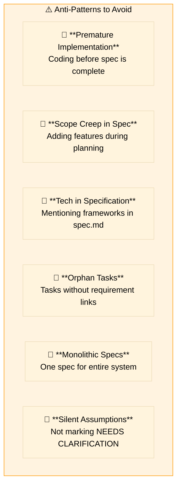

### How to Fix Anti-Patterns

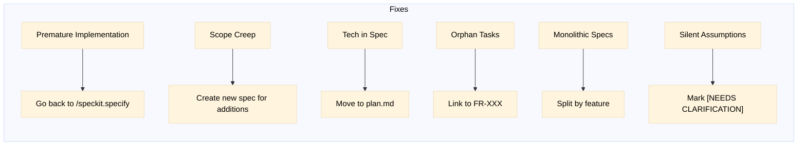

---

## Quality Checklist per Phase

### Before Moving to Next Phase

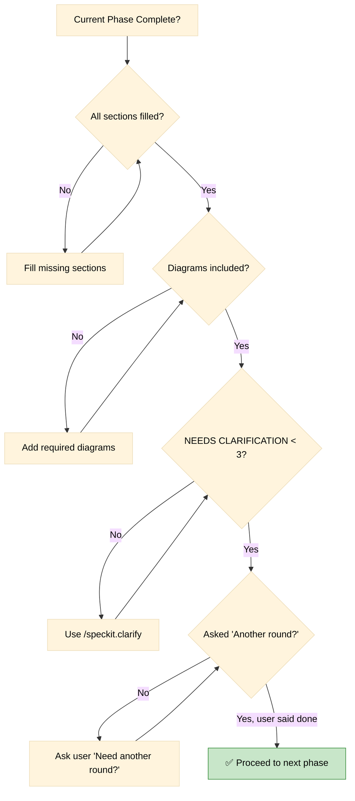

---

## Naming Conventions

### Feature Branches and Folders

```
✅ Good:
specs/001-user-authentication/
specs/002-payment-processing/
specs/003-dashboard-analytics/

❌ Bad:
specs/auth/
specs/new-feature/
specs/update/
```

### Requirement IDs

```
✅ Good:
FR-001, FR-002, FR-003  (Functional Requirements)
SC-001, SC-002          (Success Criteria)
CONST-001, SPEC-001     (Triage entries)

❌ Bad:
req1, requirement-a, the-login-thing
```

---

## Iteration Guidelines

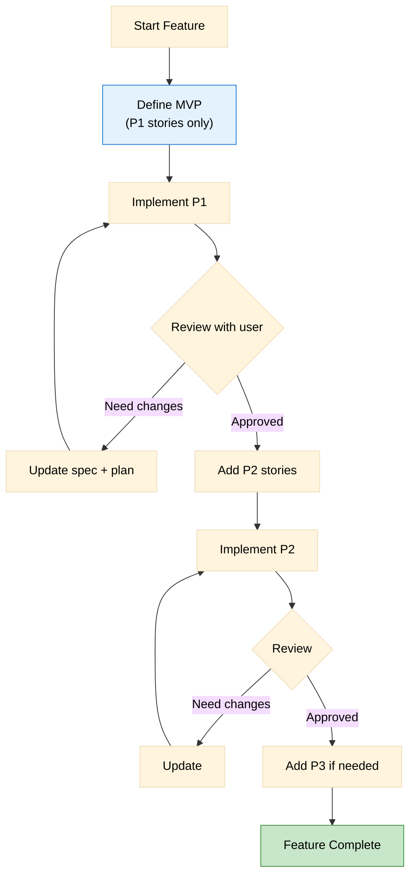

---

## Communication Templates

### Starting a New Feature

```
I'd like to create a new feature: [brief description]

Context:
- Who will use it: [user type]
- Main goal: [what they want to achieve]
- Current situation: [how it's done today, if applicable]

Please use /speckit.triage to process this.
```

### Requesting Clarification

```
Before proceeding, I need clarification on:

1. [Question about requirement]
2. [Question about scope]
3. [Question about priority]

Please answer these so I can update the spec.
```

### Completing a Phase

```
Phase [X] complete. Summary:
- [What was done]
- [Key decisions made]
- [Open items if any]

🔄 Need another round? What should be added or clarified?
```


