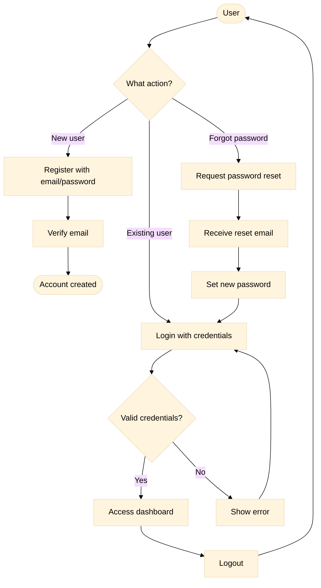
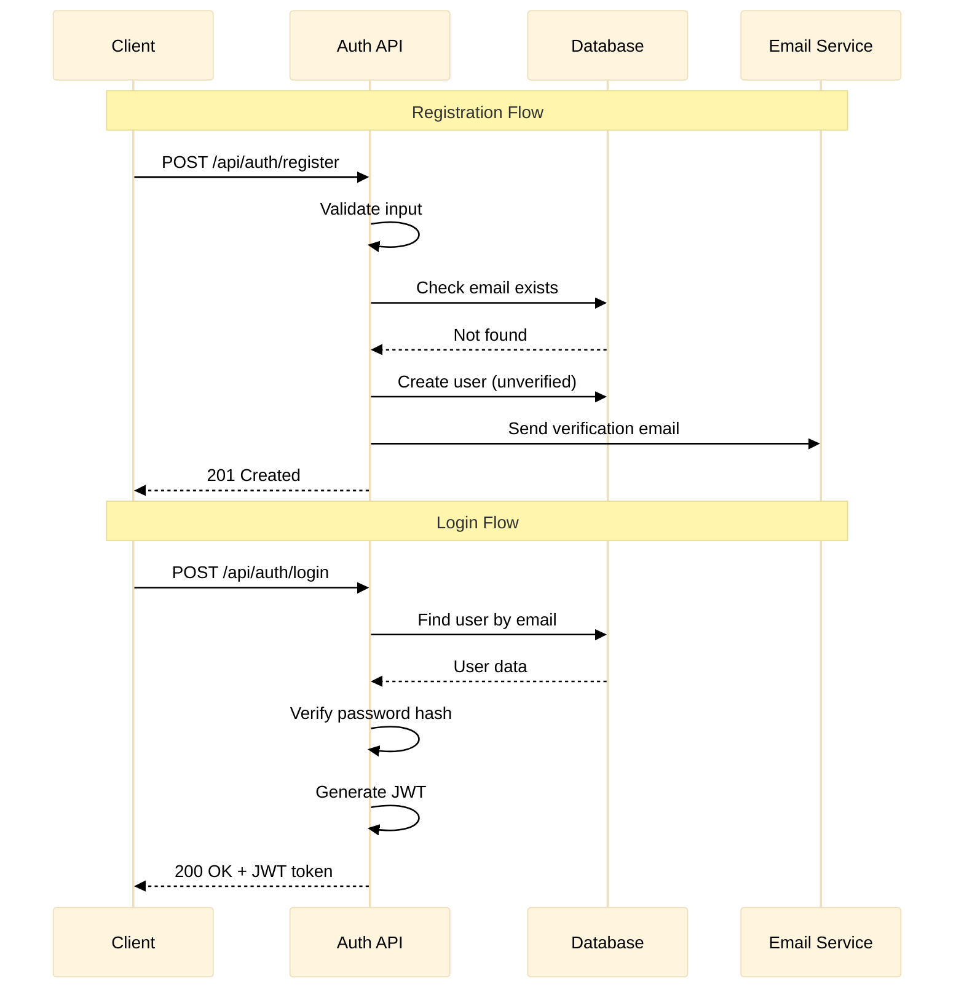
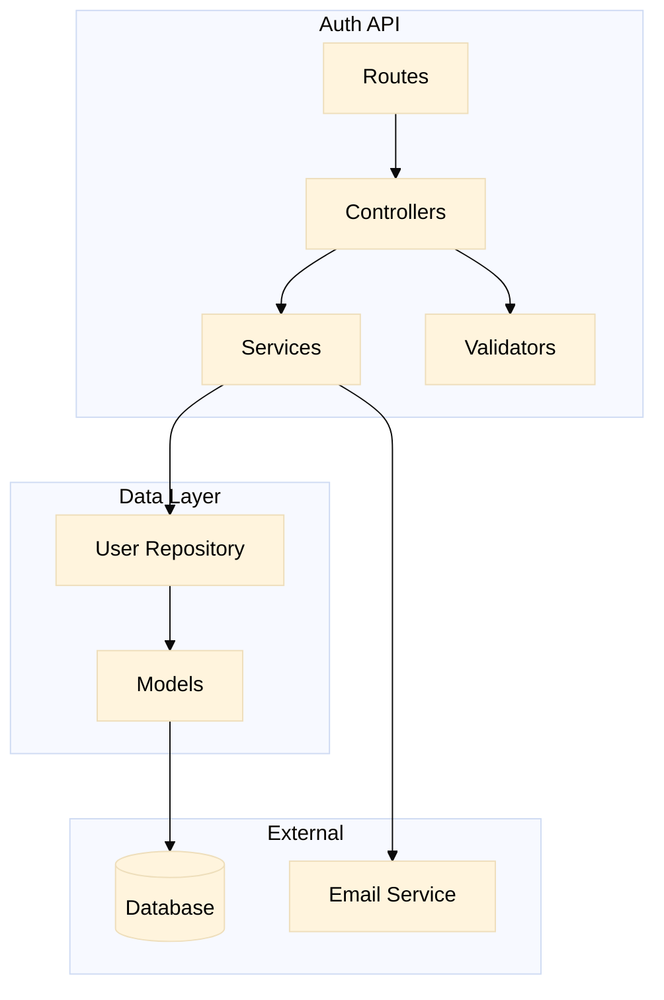

# Complete Example

> A feature from start to finish using Spec Kit

This example walks through creating a **User Authentication** feature using all Spec Kit commands.

---

## Phase 0: Triage

### User Input

```
I need to build user authentication for my app. 

Users should be able to register with email/password, login, logout, 
and reset their password. 

Also, I want all APIs to be RESTful and use JWT for tokens.
The system should follow OWASP security guidelines.
```

### Command: /speckit.triage

The AI analyzes and separates:

**→ Constitution Items** (project-wide rules):
- "All APIs must be RESTful"
- "Use JWT for authentication tokens"
- "Follow OWASP security guidelines"

**→ Specification Items** (feature behaviors):
- "Users can register with email/password"
- "Users can login"
- "Users can logout"
- "Users can reset password"

### Output: Triage Backlogs

**triage_constitution.md**:
```markdown
### Entry: CONST-001
**Added**: 2024-01-15T10:00:00
**Status**: pending
**Content**: All APIs must be RESTful
---

### Entry: CONST-002
**Added**: 2024-01-15T10:00:00
**Status**: pending
**Content**: Use JWT for authentication tokens
---

### Entry: CONST-003
**Added**: 2024-01-15T10:00:00
**Status**: pending
**Content**: Follow OWASP security guidelines
```

**triage_specification.md**:
```markdown
### Entry: SPEC-001
**Added**: 2024-01-15T10:00:00
**Status**: pending
**Content**: User registration with email/password
---

### Entry: SPEC-002
**Added**: 2024-01-15T10:00:00
**Status**: pending
**Content**: User login functionality
---

### Entry: SPEC-003
**Added**: 2024-01-15T10:00:00
**Status**: pending
**Content**: User logout functionality
---

### Entry: SPEC-004
**Added**: 2024-01-15T10:00:00
**Status**: pending
**Content**: Password reset functionality
```

---

## Phase 1: Constitution

### Command: /speckit.constitution

Processes the constitution backlog and creates/updates `constitution.md`:

**constitution.md** (excerpt):
```markdown
# Project Constitution

## Core Principles

### I. RESTful APIs
All APIs must follow REST principles:
- Use HTTP methods correctly (GET, POST, PUT, DELETE)
- Use proper status codes
- Resource-based URLs

### II. JWT Authentication
Authentication tokens must use JWT:
- Signed tokens with appropriate expiration
- Refresh token rotation
- Secure token storage guidelines

### III. OWASP Compliance
All security implementations must follow OWASP guidelines:
- Input validation
- Output encoding
- Authentication best practices
- Session management
```

Backlog entries marked as `absorbed`.

---

## Phase 2: Specification

### Command: /speckit.specify

Processes specification backlog and creates feature spec:

**specs/001-user-auth/spec.md**:

```markdown
# Feature Specification: User Authentication

**Feature Branch**: `001-user-auth`
**Created**: 2024-01-15
**Status**: Draft

## Process Flow (Business View)
```



```markdown
### Flow Insights

- **Gaps identified**: No account lockout after failed attempts
- **Opportunities**: Could add social login later
- **Risks**: Email verification may cause user drop-off

---

## User Scenarios & Testing

### User Story 1 - Registration (Priority: P1)

As a new user, I want to create an account so I can access the application.

**Why this priority**: Core functionality, no app without users.

**Independent Test**: Can register and receive verification email.

**Acceptance Scenarios**:

1. **Given** valid email and password, **When** user submits registration, **Then** account is created and verification email sent
2. **Given** existing email, **When** user tries to register, **Then** error message shown
3. **Given** weak password, **When** user submits, **Then** validation error shown

---

### User Story 2 - Login (Priority: P1)

As a registered user, I want to login so I can access my account.

**Acceptance Scenarios**:

1. **Given** valid credentials, **When** user logs in, **Then** JWT token issued and user redirected
2. **Given** invalid credentials, **When** user logs in, **Then** generic error shown (no info leak)

---

### User Story 3 - Password Reset (Priority: P2)

As a user who forgot my password, I want to reset it securely.

**Acceptance Scenarios**:

1. **Given** registered email, **When** reset requested, **Then** reset link sent (time-limited)
2. **Given** valid reset link, **When** new password submitted, **Then** password updated

---

## Requirements

### Functional Requirements

- **FR-001**: System MUST allow registration with email and password
- **FR-002**: System MUST validate email format and password strength
- **FR-003**: System MUST send verification email after registration
- **FR-004**: System MUST authenticate users with email/password
- **FR-005**: System MUST issue JWT token on successful login
- **FR-006**: System MUST allow password reset via email link
- **FR-007**: System MUST invalidate sessions on logout

### Key Entities

- **User**: email, password_hash, verified, created_at
- **Session**: user_id, token, expires_at
- **PasswordReset**: user_id, token, expires_at, used

## Success Criteria

- **SC-001**: Registration completes in under 30 seconds
- **SC-002**: Login response time under 500ms
- **SC-003**: Zero password storage in plain text
- **SC-004**: Reset tokens expire after 1 hour
```

---

## Phase 3: Plan

### Command: /speckit.plan

Creates technical implementation plan:

**specs/001-user-auth/plan.md**:

```markdown
# Implementation Plan: User Authentication

**Branch**: `001-user-auth` | **Spec**: spec.md

## Summary

Implement secure user authentication with JWT tokens, following RESTful principles and OWASP guidelines.

## System Interaction Diagram (Technical View)
```



```markdown
### Component Architecture
```



```markdown
## Technical Context

**Language/Version**: TypeScript 5.0 / Node.js 20 LTS
**Primary Dependencies**: Express.js, bcrypt, jsonwebtoken, nodemailer
**Storage**: PostgreSQL (users, sessions)
**Testing**: Jest + Supertest

## API Contracts

| Endpoint | Method | Request | Response |
|----------|--------|---------|----------|
| /api/auth/register | POST | `{email, password}` | `{user_id, message}` |
| /api/auth/login | POST | `{email, password}` | `{token, expires_in}` |
| /api/auth/logout | POST | `Authorization: Bearer` | `{message}` |
| /api/auth/reset-request | POST | `{email}` | `{message}` |
| /api/auth/reset-confirm | POST | `{token, new_password}` | `{message}` |

## Project Structure

```text
backend/
├── src/
│   ├── routes/
│   │   └── auth.routes.ts
│   ├── controllers/
│   │   └── auth.controller.ts
│   ├── services/
│   │   ├── auth.service.ts
│   │   └── email.service.ts
│   ├── models/
│   │   └── user.model.ts
│   ├── validators/
│   │   └── auth.validator.ts
│   └── middleware/
│       └── auth.middleware.ts
└── tests/
    └── auth.test.ts
```

## Constitution Check

- ✅ RESTful endpoints
- ✅ JWT for tokens
- ✅ OWASP: bcrypt for passwords, input validation, no info leaks
```

---

## Phase 4: Tasks

### Command: /speckit.tasks

Breaks plan into actionable tasks:

**specs/001-user-auth/tasks.md**:

```markdown
# Tasks: User Authentication

## Task 1: Setup Project Structure
**Linked to**: FR-001
**Priority**: P1
**Estimate**: Small
**Dependencies**: None

**Acceptance Criteria**:
- [ ] Directory structure created
- [ ] Dependencies installed
- [ ] TypeScript configured

---

## Task 2: Create User Model
**Linked to**: FR-001, FR-002
**Priority**: P1
**Estimate**: Small
**Dependencies**: Task 1

**Acceptance Criteria**:
- [ ] User schema with email, password_hash, verified
- [ ] Database migration created

---

## Task 3: Implement Registration Endpoint
**Linked to**: FR-001, FR-002, FR-003
**Priority**: P1
**Estimate**: Medium
**Dependencies**: Task 2

**Acceptance Criteria**:
- [ ] POST /api/auth/register works
- [ ] Email validation
- [ ] Password strength validation
- [ ] Duplicate email check
- [ ] Password hashed with bcrypt
- [ ] Unit tests passing

---

## Task 4: Implement Email Verification
**Linked to**: FR-003
**Priority**: P1
**Estimate**: Medium
**Dependencies**: Task 3

**Acceptance Criteria**:
- [ ] Verification email sent
- [ ] Verification endpoint works
- [ ] Token expires after 24h

---

## Task 5: Implement Login Endpoint
**Linked to**: FR-004, FR-005
**Priority**: P1
**Estimate**: Medium
**Dependencies**: Task 2

**Acceptance Criteria**:
- [ ] POST /api/auth/login works
- [ ] JWT token generated
- [ ] Invalid credentials handled
- [ ] Unit tests passing

---

## Task 6: Implement Password Reset
**Linked to**: FR-006
**Priority**: P2
**Estimate**: Medium
**Dependencies**: Task 4

**Acceptance Criteria**:
- [ ] Reset request endpoint
- [ ] Reset confirm endpoint
- [ ] Token expires after 1h
- [ ] Email sent with link

---

## Task 7: Implement Logout
**Linked to**: FR-007
**Priority**: P2
**Estimate**: Small
**Dependencies**: Task 5

**Acceptance Criteria**:
- [ ] POST /api/auth/logout works
- [ ] Session invalidated
```

---

## Phase 5: Implementation

### Command: /speckit.implement

Generates code following tasks. Example output for Task 3:

**src/routes/auth.routes.ts**:
```typescript
// Linked to: FR-001, FR-002, FR-003
import { Router } from 'express';
import { AuthController } from '../controllers/auth.controller';
import { validateRegistration } from '../validators/auth.validator';

const router = Router();
const controller = new AuthController();

// FR-001: Registration endpoint
router.post('/register', validateRegistration, controller.register);

export default router;
```

**src/services/auth.service.ts**:
```typescript
// Linked to: FR-001, FR-002
import bcrypt from 'bcrypt';
import { User } from '../models/user.model';
import { EmailService } from './email.service';

export class AuthService {
  // FR-001: Create user with hashed password
  async register(email: string, password: string): Promise<User> {
    // FR-002: Password is hashed (OWASP compliance)
    const passwordHash = await bcrypt.hash(password, 12);
    
    const user = await User.create({
      email,
      password_hash: passwordHash,
      verified: false
    });
    
    // FR-003: Send verification email
    await EmailService.sendVerification(user);
    
    return user;
  }
}
```

---

## Summary

| Phase | Command | Input | Output |
|-------|---------|-------|--------|
| 0 | /speckit.triage | Mixed user input | Sorted backlogs |
| 1 | /speckit.constitution | Constitution backlog | constitution.md |
| 2 | /speckit.specify | Spec backlog | spec.md with diagrams |
| 3 | /speckit.plan | spec.md | plan.md with architecture |
| 4 | /speckit.tasks | plan.md | tasks.md with breakdown |
| 5 | /speckit.implement | tasks.md | Source code |

---

## 🔄 Need Another Round?

This example covers the happy path. Consider adding:
- Error handling examples
- Edge case specifications
- Test file examples

