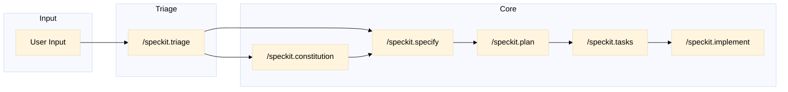
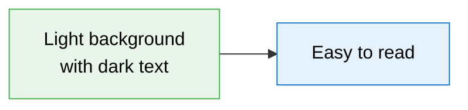

# Spec Kit Visual Flows

> Mermaid diagrams documenting the Spec Kit methodology

## 📖 How to View

1. Install **"Markdown Preview Mermaid Support"** extension (Matt Bierner)
2. Open any `.md` file → `Ctrl+Shift+V` for Preview

---

## 📊 Flow Diagrams Index

| File | Description | Diagrams |
|------|-------------|----------|
| [overview.md](./overview.md) | High-level Spec-Driven Development methodology | 5 |
| [command-flow.md](./command-flow.md) | Detailed flow for each `/speckit.*` command | 12 |
| [triage-system.md](./triage-system.md) | How the triage backlog system works | 7 |
| [artifact-relationships.md](./artifact-relationships.md) | Relationships between all artifacts | 8 |
| [entry-lifecycle.md](./entry-lifecycle.md) | Lifecycle of entries in the triage system | 9 |
| [decision-tree.md](./decision-tree.md) | When to use which command | 6 |
| [gap-notation.md](./gap-notation.md) | How to visualize gaps and uncertainties in diagrams | 8 |

**Total: ~55 diagrams**

---

## 🚀 Quick Overview

---

## 🎨 Diagram Style Guide

All diagrams in this folder use dark text on light backgrounds for readability:

---

## 🔄 Need Another Round?

Missing a flow diagram? Let us know what should be added.

