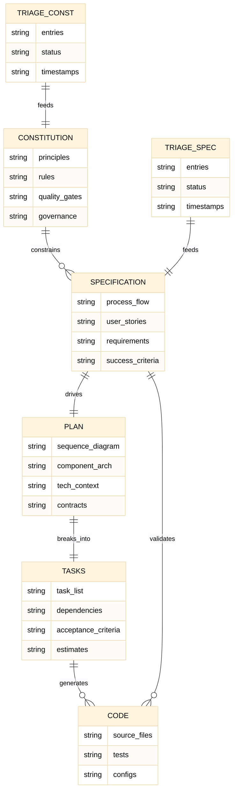
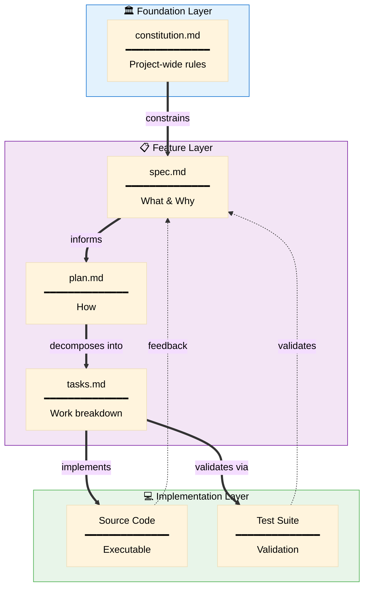
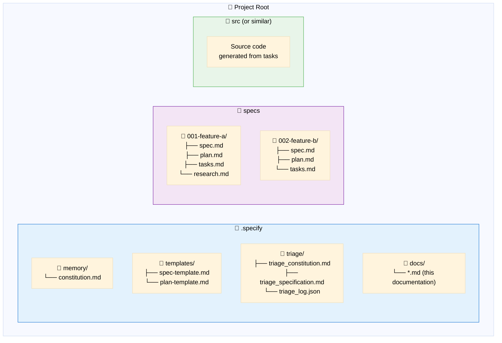
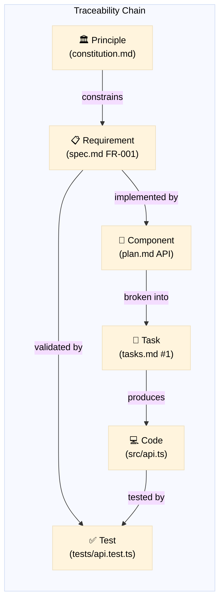
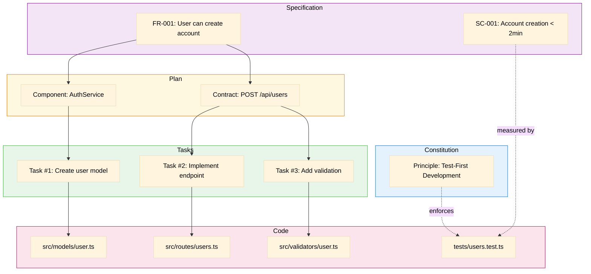
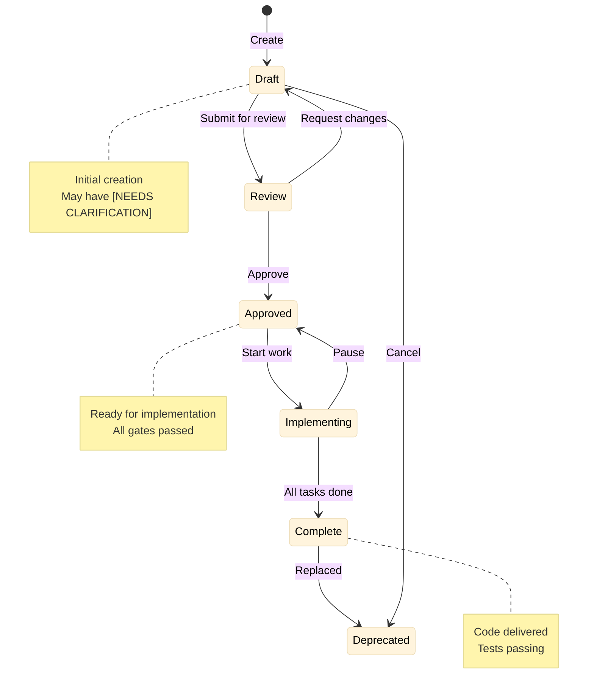
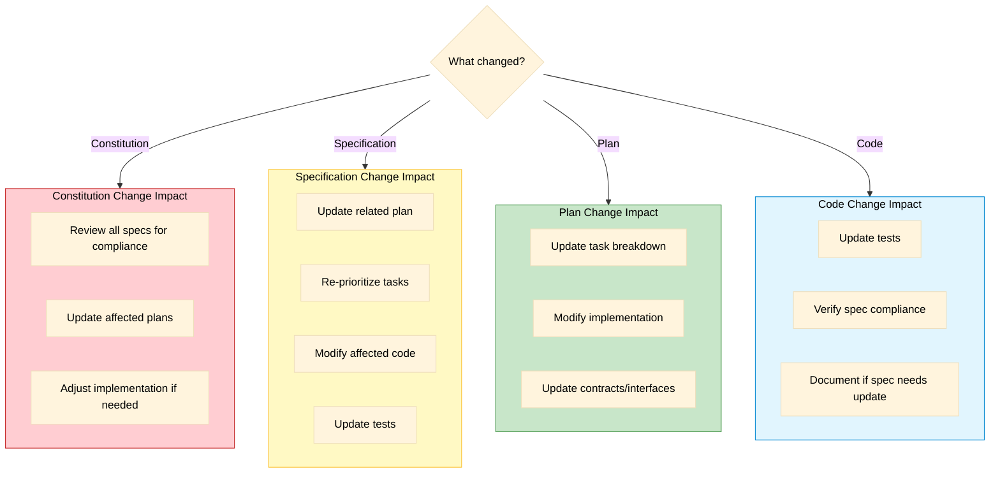

# Artifact Relationships

> How all Spec Kit artifacts relate to each other

## Complete Artifact Map

## Dependency Chain

## File System Structure

## Traceability Matrix

## Cross-Reference Example

## Version & Change Tracking

## Impact Analysis

When a change occurs, what needs updating?

