# Command Flows

> Detailed flow diagrams for each Spec Kit command

## /speckit.triage

Analyzes mixed user input and separates it into Constitution vs Specification content.


---

## /speckit.constitution

Defines and maintains project-wide principles, rules, and quality gates.


---

## /speckit.specify

Creates feature specifications with business flows and user stories.

```mermaid
%%{init: {'theme': 'base', 'themeVariables': { 'primaryTextColor': '#000', 'secondaryTextColor': '#000', 'tertiaryTextColor': '#000', 'lineColor': '#333'}}}%%
flowchart TD
    Start([User invokes /speckit.specify]) --> Check{Backlog exists?}
    
    Check -->|Yes| ReadBacklog[Read triage_specification.md]
    Check -->|No| ReadArgs[Read feature description]
    
    ReadBacklog --> Pending[Get pending entries]
    ReadArgs --> Pending
    
    Pending --> LoadConst[Load constitution.md for constraints]
    
    LoadConst --> Analyze[Analyze feature requirements]
    
    Analyze --> Flow[Create Process Flow diagram]
    Flow --> Stories[Define User Stories with priorities]
    Stories --> Requirements[Extract Functional Requirements]
    Requirements --> Criteria[Define Success Criteria]
    
    Criteria --> MultiAgent{Multi-agent feature?}
    
    MultiAgent -->|Yes| AgentFlow[Create Agent Collaboration diagram]
    MultiAgent -->|No| Skip[Skip agent section]
    
    AgentFlow --> Gaps[Identify Gaps, Risks, Opportunities]
    Skip --> Gaps
    
    Gaps --> Write[Write specs/###-feature/spec.md]
    
    Write --> Mark[Mark backlog entries as 'absorbed']
    
    Mark --> AskRound["🔄 Ask: Need another round?"]
    AskRound --> UserCheck{User confirms?}
    UserCheck -->|Add more| Analyze
    UserCheck -->|Complete| Done([Specification created])
    
    style Start fill:#f3e5f5,stroke:#7b1fa2,color:#000
    style Done fill:#c8e6c9,stroke:#388e3c,color:#000
    style AskRound fill:#fff3e0,stroke:#ff9800,color:#000
```



### Specification Content Structure

```mermaid
%%{init: {'theme': 'base', 'themeVariables': { 'primaryTextColor': '#000', 'secondaryTextColor': '#000', 'tertiaryTextColor': '#000', 'lineColor': '#333'}}}%%
flowchart LR
    subgraph spec.md
        direction TB
        
        subgraph Visual["🎨 Visual Section"]
            ProcessFlow[Process Flow Diagram]
            AgentCollab[Agent Collaboration]
        end
        
        subgraph Stories["📖 User Stories"]
            US1[P1: Critical Path]
            US2[P2: Important]
            US3[P3: Nice to Have]
        end
        
        subgraph Technical["📋 Requirements"]
            FR[Functional Requirements]
            Entities[Key Entities]
            Success[Success Criteria]
        end
    end
    
    style Visual fill:#e8f5e9,stroke:#4caf50,color:#000
    style Stories fill:#fff3e0,stroke:#ff9800,color:#000
    style Technical fill:#e3f2fd,stroke:#1976d2,color:#000
```



---

## /speckit.plan

Creates technical implementation plans with architecture diagrams.


### Plan Content Structure

```mermaid
%%{init: {'theme': 'base', 'themeVariables': { 'primaryTextColor': '#000', 'secondaryTextColor': '#000', 'tertiaryTextColor': '#000', 'lineColor': '#333'}}}%%
flowchart LR
    subgraph plan.md
        direction TB
        
        subgraph Diagrams["📊 Technical Diagrams"]
            SeqDiag[Sequence Diagram]
            CompArch[Component Architecture]
        end
        
        subgraph Context["🔧 Technical Context"]
            Lang[Language/Version]
            Deps[Dependencies]
            Storage[Storage Solution]
        end
        
        subgraph Contracts["📝 Contracts"]
            API[API Contracts]
            AgentIO[Agent I/O Schemas]
        end
        
        subgraph Structure["📁 Project Structure"]
            Dirs[Directory Layout]
            Files[Key Files]
        end
    end
    
    style Diagrams fill:#e8f5e9,stroke:#4caf50,color:#000
    style Context fill:#fff3e0,stroke:#ff9800,color:#000
    style Contracts fill:#e3f2fd,stroke:#1976d2,color:#000
    style Structure fill:#f3e5f5,stroke:#7b1fa2,color:#000
```



---

## /speckit.tasks

Breaks down the plan into actionable, prioritized tasks.

```mermaid
%%{init: {'theme': 'base', 'themeVariables': { 'primaryTextColor': '#000', 'secondaryTextColor': '#000', 'tertiaryTextColor': '#000', 'lineColor': '#333'}}}%%
flowchart TD
    Start([User invokes /speckit.tasks]) --> LoadPlan[Load plan.md]
    
    LoadPlan --> LoadSpec[Load spec.md for priorities]
    
    LoadSpec --> Parse[Parse technical components]
    
    Parse --> Breakdown[Break into atomic tasks]
    
    Breakdown --> Prioritize[Prioritize by dependencies]
    
    Prioritize --> Link[Link tasks to requirements]
    
    Link --> Criteria[Define acceptance criteria per task]
    
    Criteria --> Dependencies[Map task dependencies]
    
    Dependencies --> Estimate[Estimate complexity]
    
    Estimate --> Write[Write specs/###-feature/tasks.md]
    
    Write --> AskRound["🔄 Ask: Need another round?"]
    AskRound --> UserCheck{User confirms?}
    UserCheck -->|Add more| Parse
    UserCheck -->|Complete| Done([Tasks created])
    
    style Start fill:#e8f5e9,stroke:#4caf50,color:#000
    style Done fill:#c8e6c9,stroke:#388e3c,color:#000
    style AskRound fill:#fff3e0,stroke:#ff9800,color:#000
```



### Task Structure

```mermaid
%%{init: {'theme': 'base', 'themeVariables': { 'primaryTextColor': '#000', 'secondaryTextColor': '#000', 'tertiaryTextColor': '#000', 'lineColor': '#333'}}}%%
flowchart TB
    subgraph tasks.md
        Task1["Task 1: Setup project structure<br/>━━━━━━━━━━━━━━━━━━━━━<br/>📋 Linked to: FR-001<br/>✅ Criteria: Directories exist<br/>⏱️ Estimate: Small<br/>🔗 Deps: None"]
        
        Task2["Task 2: Implement data model<br/>━━━━━━━━━━━━━━━━━━━━━<br/>📋 Linked to: FR-002, FR-003<br/>✅ Criteria: Schema validated<br/>⏱️ Estimate: Medium<br/>🔗 Deps: Task 1"]
        
        Task3["Task 3: Create API endpoints<br/>━━━━━━━━━━━━━━━━━━━━━<br/>📋 Linked to: FR-004<br/>✅ Criteria: Tests pass<br/>⏱️ Estimate: Large<br/>🔗 Deps: Task 2"]
    end
    
    Task1 --> Task2 --> Task3
```



---

## /speckit.implement

Executes implementation following the tasks.

```mermaid
%%{init: {'theme': 'base', 'themeVariables': { 'primaryTextColor': '#000', 'secondaryTextColor': '#000', 'tertiaryTextColor': '#000', 'lineColor': '#333'}}}%%
flowchart TD
    Start([User invokes /speckit.implement]) --> LoadTasks[Load tasks.md]
    
    LoadTasks --> LoadPlan[Load plan.md for context]
    
    LoadPlan --> LoadConst[Load constitution.md for rules]
    
    LoadConst --> Select[Select next pending task]
    
    Select --> Context[Build implementation context]
    
    Context --> Generate[Generate/assist code]
    
    Generate --> Validate{Meets criteria?}
    
    Validate -->|No| Refine[Refine implementation]
    Refine --> Validate
    
    Validate -->|Yes| MarkDone[Mark task complete]
    
    MarkDone --> More{More tasks?}
    
    More -->|Yes| Select
    More -->|No| Summary[Generate implementation summary]
    
    Summary --> AskRound["🔄 Ask: Need another round?"]
    AskRound --> UserCheck{User confirms?}
    UserCheck -->|More tasks| Select
    UserCheck -->|Complete| Done([Implementation complete])
    
    style Start fill:#fce4ec,stroke:#c2185b,color:#000
    style Done fill:#c8e6c9,stroke:#388e3c,color:#000
    style AskRound fill:#fff3e0,stroke:#ff9800,color:#000
```



---

## Supporting Commands

### /speckit.clarify

```mermaid
%%{init: {'theme': 'base', 'themeVariables': { 'primaryTextColor': '#000', 'secondaryTextColor': '#000', 'tertiaryTextColor': '#000', 'lineColor': '#333'}}}%%
flowchart LR
    Input[Artifact with<br/>NEEDS CLARIFICATION] --> Clarify[/speckit.clarify]
    Clarify --> Questions[Structured Questions]
    Questions --> User([User Answers])
    User --> Updated[Updated Artifact]
    
    style Input fill:#ffcdd2,stroke:#c62828,color:#000
    style Updated fill:#c8e6c9,stroke:#388e3c,color:#000
```

### /speckit.analyze

```mermaid
%%{init: {'theme': 'base', 'themeVariables': { 'primaryTextColor': '#000', 'secondaryTextColor': '#000', 'tertiaryTextColor': '#000', 'lineColor': '#333'}}}%%
flowchart LR
    Artifacts[All Artifacts] --> Analyze[/speckit.analyze]
    Analyze --> Report[Consistency Report]
    Report --> Issues[Detected Issues]
    Report --> Suggestions[Improvement Suggestions]
    
    style Artifacts fill:#e3f2fd,stroke:#1976d2,color:#000
    style Report fill:#fff9c4,stroke:#fbc02d,color:#000
```

### /speckit.checklist

```mermaid
%%{init: {'theme': 'base', 'themeVariables': { 'primaryTextColor': '#000', 'secondaryTextColor': '#000', 'tertiaryTextColor': '#000', 'lineColor': '#333'}}}%%
flowchart LR
    Phase[Current Phase] --> Checklist[/speckit.checklist]
    Checklist --> Gates[Quality Gate Items]
    Gates --> Status[Pass/Fail Status]
    
    style Phase fill:#f3e5f5,stroke:#7b1fa2,color:#000
    style Status fill:#c8e6c9,stroke:#388e3c,color:#000
```

