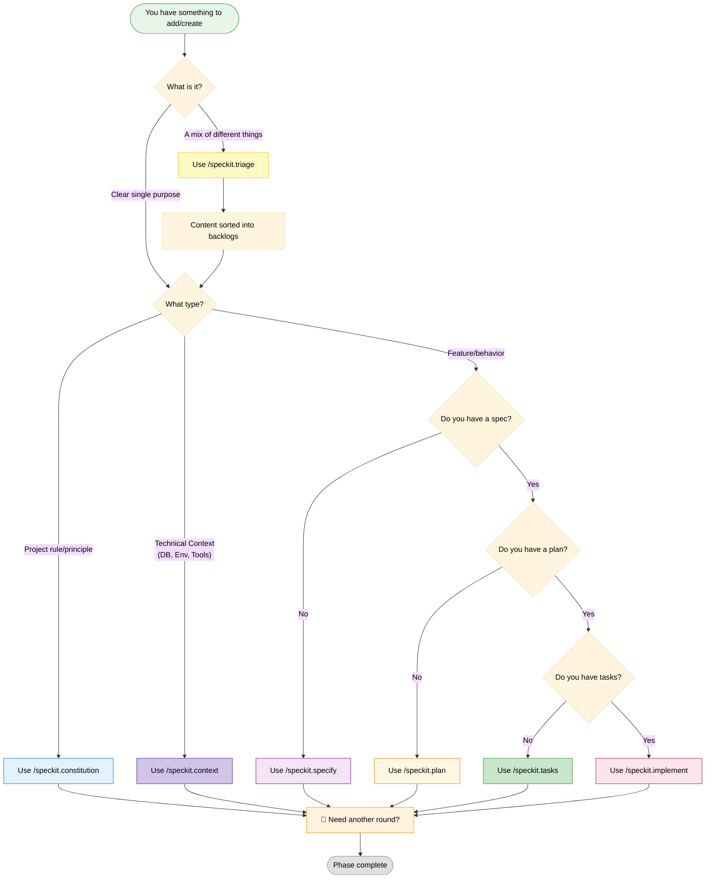
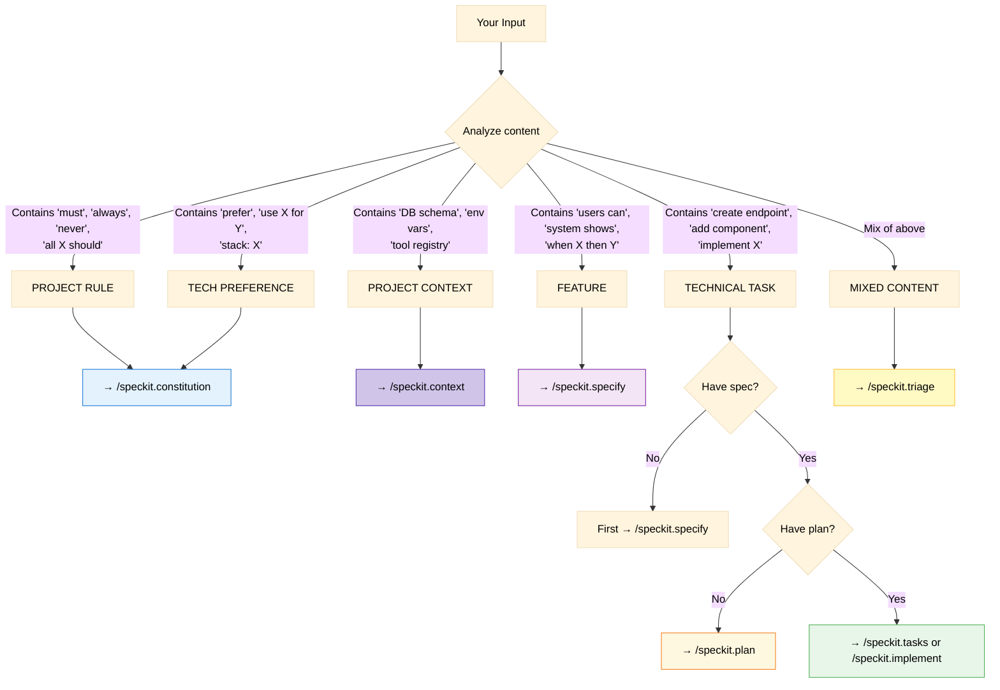
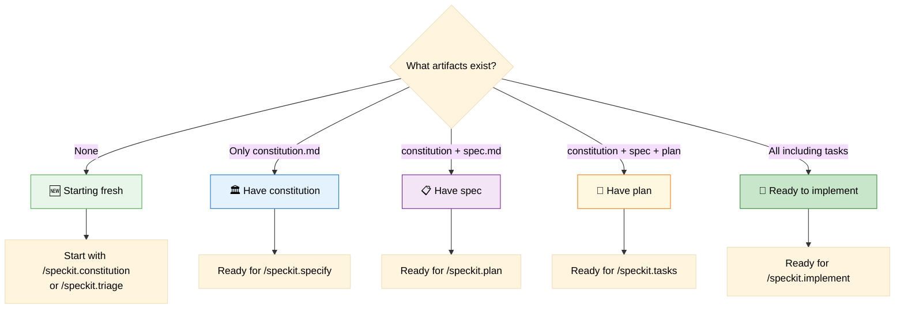
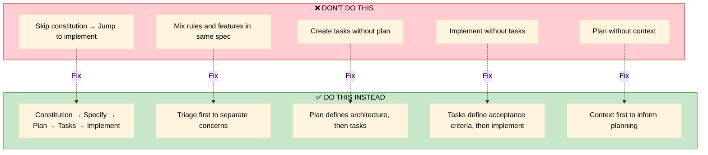

# Decision Tree

> When to use which command - a practical guide

## Main Decision Flow



## Input Type Decision



## Artifact State Decision



## Problem-Based Decision

```mermaid
%%{init: {'theme': 'base', 'themeVariables': { 'primaryTextColor': '#000', 'secondaryTextColor': '#000', 'tertiaryTextColor': '#000', 'lineColor': '#333'}}}%%
flowchart TD
    Problem{What problem are you solving?}
    
    Problem -->|"Need to document<br/>technical context"| P1_5
    Problem -->|"Need to establish<br/>project standards"| P1
    Problem -->|"New feature request<br/>from stakeholder"| P2
    Problem -->|"Spec exists but<br/>no architecture"| P3
    Problem -->|"Plan exists but<br/>work not organized"| P4
    Problem -->|"Tasks defined,<br/>need code"| P5
    Problem -->|"Don't know where<br/>to start"| P6
    Problem -->|"Spec unclear,<br/>need questions"| P7
    
    P1_5["Document Context"] --> Sol1_5[/speckit.context]
    P1["Standards & Rules"] --> Sol1[/speckit.constitution]
    P2["New Feature"] --> Sol2[/speckit.triage or /speckit.specify]
    P3["Need Architecture"] --> Sol3[/speckit.plan]
    P4["Need Task Breakdown"] --> Sol4[/speckit.tasks]
    P5["Need Implementation"] --> Sol5[/speckit.implement]
    P6["Confused/Mixed Input"] --> Sol6[/speckit.triage]
    P7["Ambiguity"] --> Sol7[/speckit.clarify]
    
    style Sol1_5 fill:#d1c4e9,stroke:#512da8,color:#000
    style Sol1 fill:#e3f2fd,stroke:#1976d2,color:#000
    style Sol2 fill:#f3e5f5,stroke:#7b1fa2,color:#000
    style Sol3 fill:#fff8e1,stroke:#f57f17,color:#000
    style Sol4 fill:#e8f5e9,stroke:#4caf50,color:#000
    style Sol5 fill:#fce4ec,stroke:#c2185b,color:#000
    style Sol6 fill:#fff9c4,stroke:#fbc02d,color:#000
    style Sol7 fill:#e1f5fe,stroke:#0288d1,color:#000
```

## Quick Reference Table

| If you have... | And you want... | Use this command |
|----------------|-----------------|------------------|
| Mixed input | Sorted backlogs | `/speckit.triage` |
| Technical context | Documented context | `/speckit.context` |
| Project rules | Documented constitution | `/speckit.constitution` |
| Feature idea | Formal specification | `/speckit.specify` |
| Specification | Technical plan | `/speckit.plan` |
| Plan | Actionable tasks | `/speckit.tasks` |
| Tasks | Working code | `/speckit.implement` |
| Unclear requirements | Questions to ask | `/speckit.clarify` |
| All artifacts | Consistency check | `/speckit.analyze` |
| Phase transition | Quality checklist | `/speckit.checklist` |

## Command Chain Examples

### Example 1: Complete New Feature

```mermaid
%%{init: {'theme': 'base', 'themeVariables': { 'primaryTextColor': '#000', 'secondaryTextColor': '#000', 'tertiaryTextColor': '#000', 'lineColor': '#333'}}}%%
flowchart LR
    Input["User describes<br/>payment feature"]
    
    Input --> T[/speckit.triage]
    T --> CTX[/speckit.context<br/>if context exists]
    T --> C[/speckit.constitution<br/>if rules exist]
    T --> S[/speckit.specify]
    CTX --> S
    C --> S
    S --> P[/speckit.plan]
    P --> K[/speckit.tasks]
    K --> I[/speckit.implement]
    I --> Done["✅ Feature complete"]
    
    style Input fill:#e8f5e9,stroke:#4caf50,color:#000
    style Done fill:#c8e6c9,stroke:#388e3c,color:#000
```

### Example 2: Add Rule to Existing Project

```mermaid
%%{init: {'theme': 'base', 'themeVariables': { 'primaryTextColor': '#000', 'secondaryTextColor': '#000', 'tertiaryTextColor': '#000', 'lineColor': '#333'}}}%%
flowchart LR
    Input["'All APIs must be versioned'"]
    
    Input --> C[/speckit.constitution]
    C --> Review["Review existing specs"]
    Review --> Update["Update affected specs"]
    Update --> Done["✅ Rule applied"]
    
    style Input fill:#e8f5e9,stroke:#4caf50,color:#000
    style Done fill:#c8e6c9,stroke:#388e3c,color:#000
```

### Example 3: Existing Spec Needs Implementation

```mermaid
%%{init: {'theme': 'base', 'themeVariables': { 'primaryTextColor': '#000', 'secondaryTextColor': '#000', 'tertiaryTextColor': '#000', 'lineColor': '#333'}}}%%
flowchart LR
    Input["Have spec.md,<br/>need code"]
    
    Input --> CTX[/speckit.context<br/>(first time)]
    CTX --> P[/speckit.plan]
    P --> K[/speckit.tasks]
    K --> I[/speckit.implement]
    I --> Done["✅ Code generated"]
    
    style Input fill:#e8f5e9,stroke:#4caf50,color:#000
    style Done fill:#c8e6c9,stroke:#388e3c,color:#000
```

## Anti-Patterns




