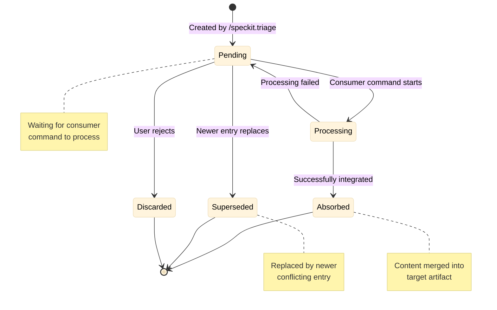
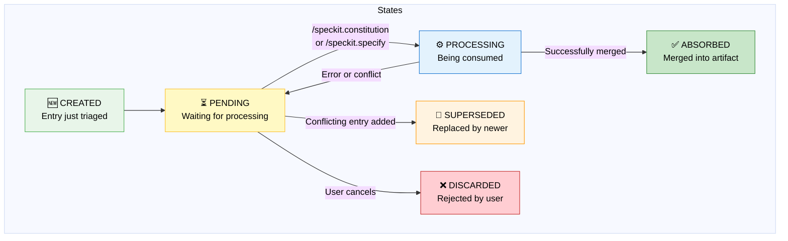
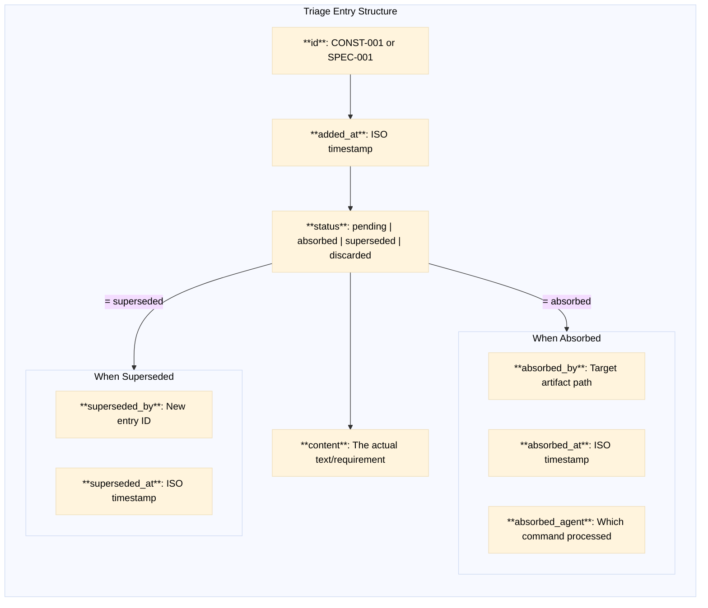
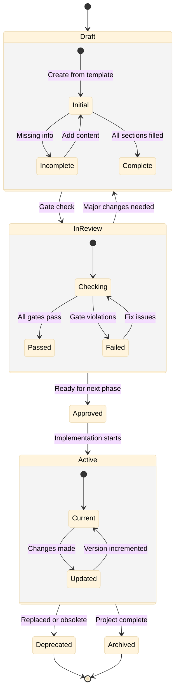
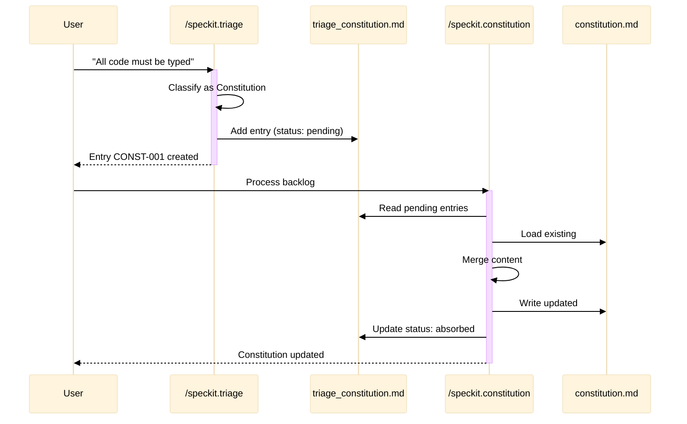
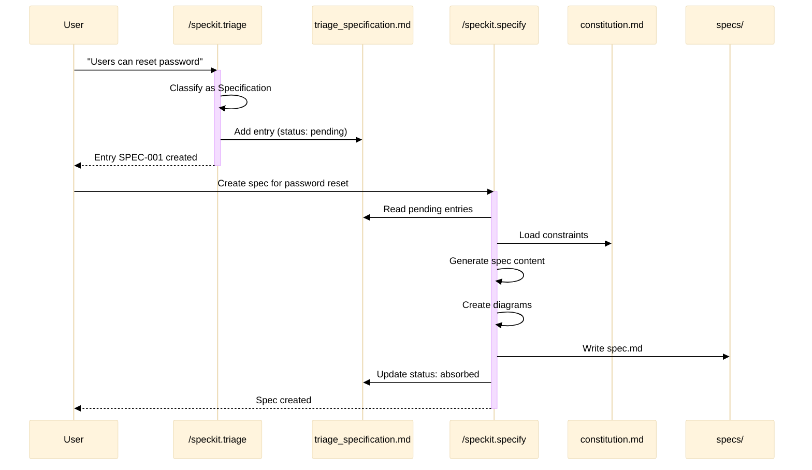
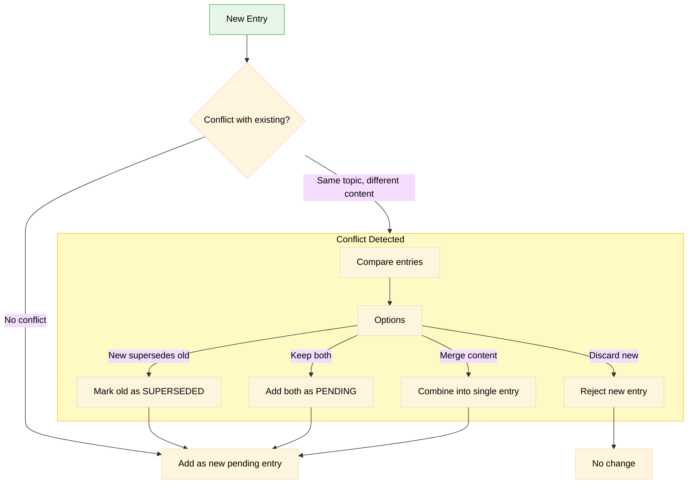
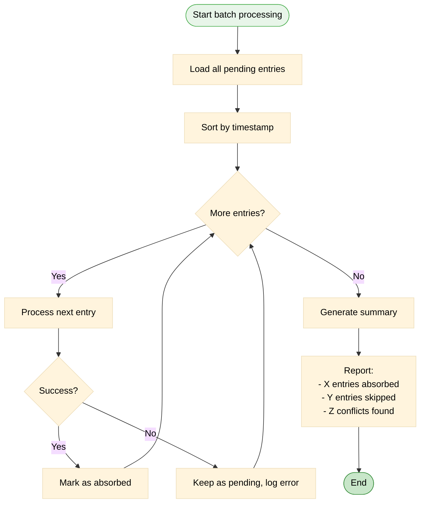

# Entry Lifecycle

> State machine for triage entries and artifacts

## Triage Entry States

## Detailed State Transitions

## Entry Metadata

## Artifact Lifecycle

## Constitution Entry Flow

## Specification Entry Flow

## Conflict Resolution

## Batch Processing

## Timeline View

```mermaid
%%{init: {'theme': 'base', 'themeVariables': { 'primaryTextColor': '#000', 'secondaryTextColor': '#000', 'tertiaryTextColor': '#000', 'lineColor': '#333'}}}%%
gantt
    title Entry Lifecycle Timeline
    dateFormat  HH:mm
    
    section Entry CONST-001
    Created (Triage)     :milestone, m1, 10:00, 0m
    Pending              :a1, 10:00, 30m
    Processing           :a2, after a1, 10m
    Absorbed             :milestone, m2, 10:40, 0m
    
    section Entry SPEC-001
    Created (Triage)     :milestone, m3, 10:05, 0m
    Pending              :b1, 10:05, 55m
    Processing           :b2, after b1, 15m
    Absorbed             :milestone, m4, 11:15, 0m
    
    section Entry SPEC-002
    Created (Triage)     :milestone, m5, 10:10, 0m
    Pending              :c1, 10:10, 20m
    Superseded           :milestone, m6, 10:30, 0m
```

