# Gap Notation in Mermaid Diagrams

> Standard notation for visualizing knowledge gaps, incomplete areas, and uncertainties in diagrams

## Overview

```mermaid
%%{init: {'theme': 'base', 'themeVariables': { 'primaryTextColor': '#000', 'secondaryTextColor': '#000', 'tertiaryTextColor': '#000', 'lineColor': '#333'}}}%%
flowchart TD
    subgraph Purpose["Why Visualize Gaps?"]
        P1["🔍 **Make uncertainty visible**<br/>Don't hide what you don't know"]
        P2["❓ **Drive clarification**<br/>Gaps become questions"]
        P3["⚠️ **Prevent assumptions**<br/>Avoid building on unknowns"]
        P4["📋 **Track progress**<br/>Gaps resolved = progress made"]
    end
    
    style Purpose fill:#fff3e0,stroke:#ff9800,color:#000
```



## Gap Notation Standards

### 1. Node Labels with `[?]` Suffix

Use `[?]` at the end of node labels for unclear steps:


**When to use**: When you know a step exists but don't know the details.

### 2. Gap Class Styling (`:::gap`)

Apply the `:::gap` class to nodes representing incomplete areas:


**Style definition to include**:
```
classDef gap fill:#ffcdd2,stroke:#c62828,stroke-width:2px,stroke-dasharray:5,color:#000
```

### 3. Dashed Lines for Uncertain Connections

Use dotted/dashed arrows when the relationship is unclear:


**When to use**: When you're not sure if or how components connect.

### 4. Comment Annotations

Add comments to explain gaps:


### 5. Gap Summary Box

Include a summary of all gaps in the diagram:

```mermaid
%%{init: {'theme': 'base', 'themeVariables': { 'primaryTextColor': '#000', 'secondaryTextColor': '#000', 'tertiaryTextColor': '#000', 'lineColor': '#333'}}}%%
flowchart TD
    subgraph Main["Main Flow"]
        A[Start] --> B[Process]
        B --> C[External Call ?]:::gap
        C --> D[Transform ?]:::gap
        D --> E[End]
    end
    
    subgraph Gaps["⚠️ GAPS TO RESOLVE"]
        G1["❓ C: Which API to call?"]
        G2["❓ D: Transform logic undefined"]
        G3["❓ Error handling not specified"]
    end
    
    classDef gap fill:#ffcdd2,stroke:#c62828,stroke-width:2px,stroke-dasharray:5,color:#000
    style Gaps fill:#fff9c4,stroke:#fbc02d,color:#000
```



## Color Coding Reference

| Color | Hex | Meaning | When to Use |
|-------|-----|---------|-------------|
| 🔴 Red | `#ffcdd2` | Critical gap | Blocks progress, must resolve |
| 🟡 Yellow | `#fff9c4` | Warning gap | Needs clarification, can proceed with assumptions |
| 🟠 Orange | `#ffe0b2` | Minor gap | Nice to clarify, not blocking |

## Complete Example

```mermaid
%%{init: {'theme': 'base', 'themeVariables': { 'primaryTextColor': '#000', 'secondaryTextColor': '#000', 'tertiaryTextColor': '#000', 'lineColor': '#333'}}}%%
flowchart TD
    subgraph UserFlow["User Authentication Flow"]
        U1[User opens app] --> U2[Login screen]
        U2 --> U3{Has account?}
        U3 -->|Yes| U4[Enter credentials]
        U3 -->|No| U5[Register ?]:::gap
        U4 --> U6[Validate ?]:::gap
        U5 -.-> U6
        U6 --> U7{Valid?}
        U7 -->|Yes| U8[Create session]
        U7 -->|No| U9[Show error ?]:::gap
        U9 --> U2
        U8 --> U10[Redirect to dashboard]
    end
    
    subgraph GapList["⚠️ GAPS IDENTIFIED"]
        direction LR
        G1["🔴 U5: Registration flow undefined"]
        G2["🔴 U6: Auth provider not chosen"]
        G3["🟡 U9: Error message format TBD"]
    end
    
    %% GAP DETAILS:
    %% U5 - Need to define: fields, validation, email verification?
    %% U6 - Options: OAuth2, username/password, SSO?
    %% U9 - Define error codes and user-friendly messages
    
    classDef gap fill:#ffcdd2,stroke:#c62828,stroke-width:2px,stroke-dasharray:5,color:#000
    style GapList fill:#fff9c4,stroke:#fbc02d,color:#000
```



## From Gaps to Clarifications

Each gap should become a clarification question:

| Gap in Diagram | Clarification Question | Priority |
|----------------|----------------------|----------|
| `U5: Register ?` | What fields are required for registration? | High |
| `U6: Validate ?` | Which authentication provider should we use? | High |
| `U9: Show error ?` | What error messages should users see? | Medium |

## Best Practices

### DO

- ✅ Make ALL uncertainties visible
- ✅ Use consistent notation throughout the project
- ✅ Include a gap summary in complex diagrams
- ✅ Convert gaps to clarification questions
- ✅ Update diagrams as gaps are resolved
- ✅ Prioritize gaps (critical vs. nice-to-have)

### DON'T

- ❌ Hide gaps to make diagrams look "cleaner"
- ❌ Assume gaps will be figured out later
- ❌ Use inconsistent notation
- ❌ Leave gaps unresolved before implementation
- ❌ Create diagrams without reviewing for gaps

## Template for Gap Documentation

When documenting gaps separately, use this format:

```markdown
## Gap: [Short Description]

**Location**: [Diagram name, Node ID]
**Severity**: Critical / Warning / Minor
**Context**: [Why this is unclear]

**Options**:
1. [Option A] - [Implications]
2. [Option B] - [Implications]
3. [Option C] - [Implications]

**Recommended**: [Which option and why]

**Resolved**: [ ] No / [x] Yes - [Date, Decision made]
```

