# Spec Kit Overview

> Visual guide to Spec-Driven Development methodology

## What is Spec-Driven Development?

Spec-Driven Development (SDD) is a methodology where **specifications are the primary artifacts**. Code is generated/assisted by AI agents that consume these specifications.


## The Three Layers

```mermaid
%%{init: {'theme': 'base', 'themeVariables': { 'primaryTextColor': '#000', 'secondaryTextColor': '#000', 'tertiaryTextColor': '#000', 'lineColor': '#333'}}}%%
flowchart TB
    subgraph Constitution["🏛️ CONSTITUTION - Project-Wide"]
        direction LR
        P1[Principles]
        P2[Rules]
        P3[Quality Gates]
        P1 --- P2 --- P3
    end
    
    subgraph Specification["📋 SPECIFICATION - Per Feature"]
        direction LR
        S1[What]
        S2[Why]
        S3[Business Flow]
        S1 --- S2 --- S3
    end
    
    subgraph Plan["🔧 PLAN - Per Feature"]
        direction LR
        PL1[How]
        PL2[Tech Stack]
        PL3[Architecture]
        PL1 --- PL2 --- PL3
    end
    
    Constitution ==>|Constrains| Specification
    Specification ==>|Drives| Plan
    Plan ==>|Generates| Tasks["📝 Tasks"]
    Tasks ==>|Implements| Code["💻 Code"]
    
    style Constitution fill:#e3f2fd,stroke:#1976d2,color:#000
    style Specification fill:#f3e5f5,stroke:#7b1fa2,color:#000
    style Plan fill:#fff8e1,stroke:#f57f17,color:#000
```



## Complete Workflow

```mermaid
%%{init: {'theme': 'base', 'themeVariables': { 'primaryTextColor': '#000', 'secondaryTextColor': '#000', 'tertiaryTextColor': '#000', 'lineColor': '#333'}}}%%
flowchart TD
    Start([User Input]) --> Triage{What type of content?}
    
    Triage -->|Principles, Rules| ConstBacklog[(Constitution Backlog)]
    Triage -->|Features, Behaviors| SpecBacklog[(Specification Backlog)]
    Triage -->|Technical Context| ContextCmd[/speckit.context]
    
    ContextCmd --> ContextFolder[project-context/]
    
    ConstBacklog --> Constitution[/speckit.constitution]
    SpecBacklog --> Specify[/speckit.specify]
    
    Constitution --> ConstitutionFile[constitution.md]
    ConstitutionFile -->|Constrains| Specify
    ContextFolder -->|Informs| Plan
    
    Specify --> SpecFile[spec.md]
    SpecFile --> Plan[/speckit.plan]
    
    Plan --> Research[Research Phase]
    Research --> PlanFile[plan.md]
    
    PlanFile --> Tasks[/speckit.tasks]
    Tasks --> TaskFile[tasks.md]
    
    TaskFile --> Implement[/speckit.implement]
    Implement --> Code[Source Code]
    
    Code -->|Feedback| SpecFile
    
    style Start fill:#c8e6c9,stroke:#388e3c,color:#000
    style ConstBacklog fill:#e3f2fd,stroke:#1976d2,color:#000
    style SpecBacklog fill:#f3e5f5,stroke:#7b1fa2,color:#000
    style ContextCmd fill:#d1c4e9,stroke:#512da8,color:#000
    style Code fill:#fff9c4,stroke:#fbc02d,color:#000
```

## Command Purpose Matrix

```mermaid
%%{init: {'theme': 'base', 'themeVariables': { 'primaryTextColor': '#000', 'secondaryTextColor': '#000', 'tertiaryTextColor': '#000', 'lineColor': '#333'}}}%%
flowchart LR
    subgraph Input["📥 INPUT"]
        Raw[Raw User Input]
    end
    
    subgraph Processing["⚙️ PROCESSING"]
        direction TB
        Triage["🔀 /speckit.triage<br/>Separates concerns"]
        Context["🗂️ /speckit.context<br/>Documents tech context"]
        Const["🏛️ /speckit.constitution<br/>Defines rules"]
        Spec["📋 /speckit.specify<br/>Defines WHAT and WHY"]
        Plan["🔧 /speckit.plan<br/>Defines HOW"]
        Task["📝 /speckit.tasks<br/>Breaks down work"]
    end
    
    subgraph Output["📤 OUTPUT"]
        Impl["💻 /speckit.implement<br/>Generates code"]
    end
    
    Raw --> Triage
    Triage --> Const
    Triage --> Spec
    Triage --> Context
    Context --> Plan
    Const --> Spec
    Spec --> Plan
    Plan --> Task
    Task --> Impl
    
    style Input fill:#e8f5e9,stroke:#4caf50,color:#000
    style Processing fill:#e3f2fd,stroke:#1976d2,color:#000
    style Output fill:#fff3e0,stroke:#ff9800,color:#000
```



## When to Use Each Command

```mermaid
%%{init: {'theme': 'base', 'themeVariables': { 'primaryTextColor': '#000', 'secondaryTextColor': '#000', 'tertiaryTextColor': '#000', 'lineColor': '#333'}}}%%
flowchart TD
    Q1{What do you have?}
    
    Q1 -->|Mixed/unclear input| T[Use /speckit.triage]
    Q1 -->|Technical context<br/>(env, db, tools)| CTX[Use /speckit.context]
    Q1 -->|Project rules/principles| C[Use /speckit.constitution]
    Q1 -->|Feature idea| S[Use /speckit.specify]
    Q1 -->|Existing spec| P[Use /speckit.plan]
    Q1 -->|Existing plan| K[Use /speckit.tasks]
    Q1 -->|Ready tasks| I[Use /speckit.implement]
    
    T -->|Sorted content| Q1
    
    style T fill:#ffecb3,stroke:#ff8f00,color:#000
    style CTX fill:#d1c4e9,stroke:#512da8,color:#000
    style C fill:#e3f2fd,stroke:#1976d2,color:#000
    style S fill:#f3e5f5,stroke:#7b1fa2,color:#000
    style P fill:#fff8e1,stroke:#f57f17,color:#000
    style K fill:#e8f5e9,stroke:#4caf50,color:#000
    style I fill:#fce4ec,stroke:#c2185b,color:#000
```

## Key Benefits

```mermaid
%%{init: {'theme': 'base', 'themeVariables': { 'primaryTextColor': '#000', 'secondaryTextColor': '#000', 'tertiaryTextColor': '#000', 'lineColor': '#333'}}}%%
flowchart TB
    subgraph Benefits["Benefits of Spec-Driven Development"]
        B1["🔍 Clarity<br/>Requirements are explicit<br/>and visualized"]
        B2["🤖 AI-Ready<br/>Specs serve as context<br/>for AI agents"]
        B3["📊 Traceability<br/>Every line of code<br/>links to a requirement"]
        B4["🔄 Iteration<br/>Specs evolve with<br/>the codebase"]
        B5["👥 Collaboration<br/>Non-devs can read<br/>and contribute"]
    end
    
    style Benefits fill:#f5f5f5,stroke:#9e9e9e,color:#000
```



## Principle VIII: Iterative Completeness

Every command ends with the mandatory question:

```mermaid
%%{init: {'theme': 'base', 'themeVariables': { 'primaryTextColor': '#000', 'secondaryTextColor': '#000', 'tertiaryTextColor': '#000', 'lineColor': '#333'}}}%%
flowchart LR
    Output[Command Output] --> Ask["🔄 Need another round?"]
    Ask --> User{User response}
    User -->|"Add/clarify"| Iterate[Continue iteration]
    User -->|"Complete"| Done[Close phase]
    Iterate --> Output
    
    style Ask fill:#fff3e0,stroke:#ff9800,color:#000
    style Done fill:#c8e6c9,stroke:#4caf50,color:#000
```



This ensures:
- No assumptions about completeness
- User validates every deliverable
- Gaps identified before moving forward
