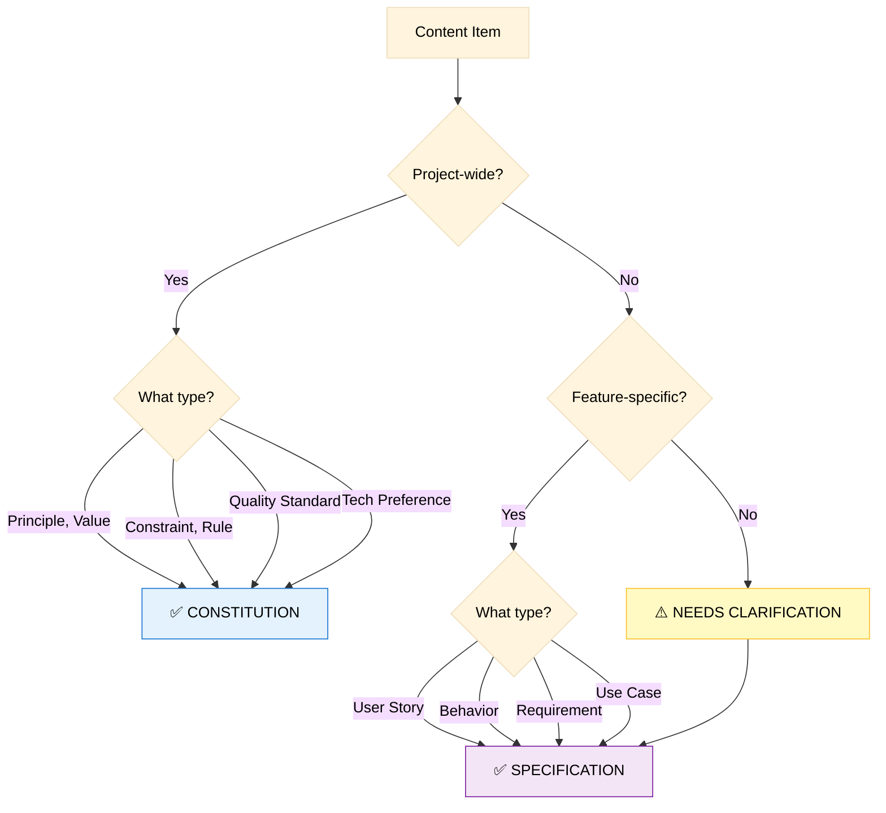
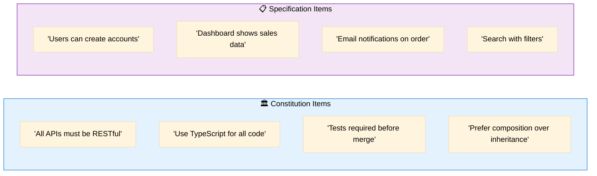
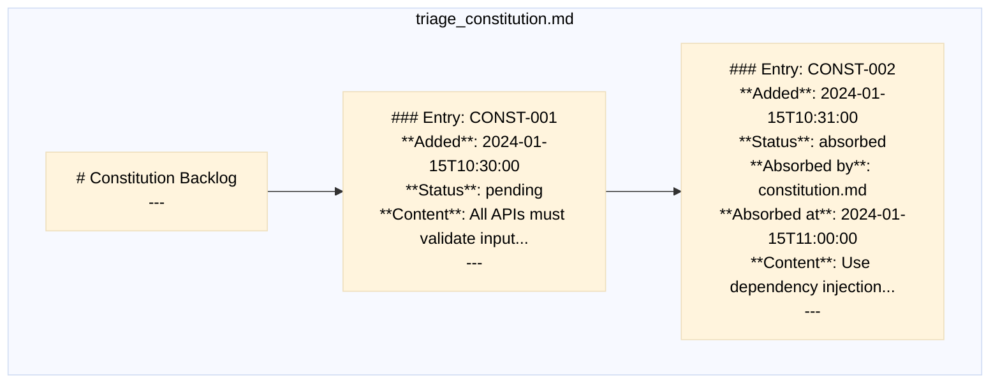
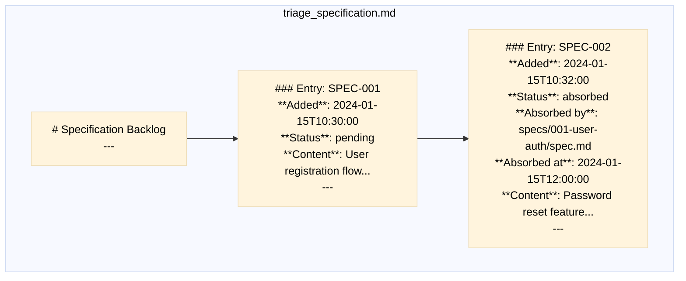
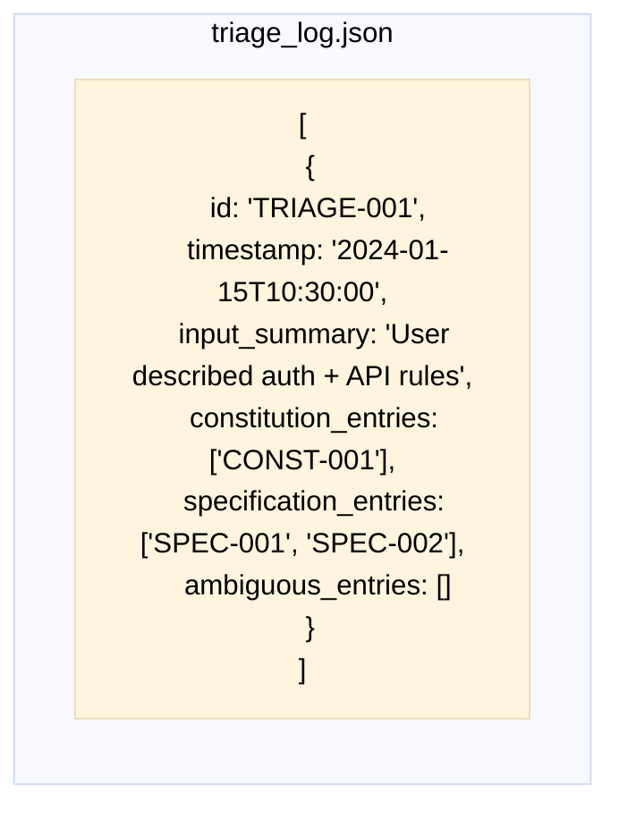
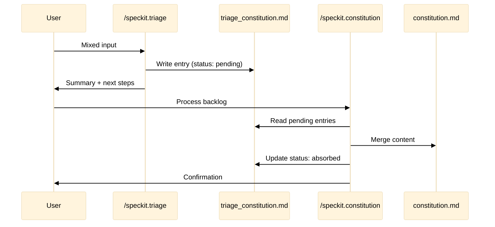
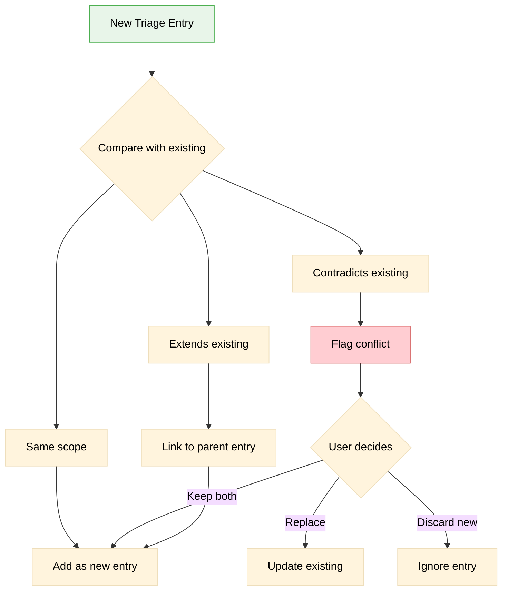

# Triage System

> How the backlog system separates and routes content

## System Overview

```mermaid
%%{init: {'theme': 'base', 'themeVariables': { 'primaryTextColor': '#000', 'secondaryTextColor': '#000', 'tertiaryTextColor': '#000', 'lineColor': '#333'}}}%%
flowchart TB
    subgraph Input["📥 User Input"]
        Raw["Mixed content:<br/>rules + features + ideas"]
    end
    
    subgraph Triage["🔀 /speckit.triage"]
        Analyze[Semantic Analysis]
        Classify[Classification Engine]
    end
    
    subgraph Backlogs["📋 Persistent Backlogs"]
        ConstQ[(triage_constitution.md)]
        SpecQ[(triage_specification.md)]
        Log[(triage_log.json)]
    end
    
    subgraph Consumers["⚙️ Consumer Commands"]
        ConstCmd[/speckit.constitution]
        SpecCmd[/speckit.specify]
    end
    
    Raw --> Analyze
    Analyze --> Classify
    
    Classify -->|"Principles, Rules,<br/>Constraints"| ConstQ
    Classify -->|"Features, Behaviors,<br/>Requirements"| SpecQ
    Classify --> Log
    
    ConstQ --> ConstCmd
    SpecQ --> SpecCmd
    
    ConstCmd -->|"Mark absorbed"| ConstQ
    SpecCmd -->|"Mark absorbed"| SpecQ
    
    style Input fill:#e8f5e9,stroke:#4caf50,color:#000
    style Triage fill:#fff3e0,stroke:#ff9800,color:#000
    style Backlogs fill:#e3f2fd,stroke:#1976d2,color:#000
    style Consumers fill:#f3e5f5,stroke:#7b1fa2,color:#000
```

## Classification Criteria



### Examples by Type



## Backlog File Structure

### triage_constitution.md



### triage_specification.md



### triage_log.json



## Consumer Behavior



## Scope Change Detection



## Integration with Other Commands

```mermaid
%%{init: {'theme': 'base', 'themeVariables': { 'primaryTextColor': '#000', 'secondaryTextColor': '#000', 'tertiaryTextColor': '#000', 'lineColor': '#333'}}}%%
flowchart TB
    subgraph TriageSystem["Triage System"]
        ConstQ[(Constitution<br/>Backlog)]
        SpecQ[(Specification<br/>Backlog)]
    end
    
    subgraph Commands["Commands"]
        Const[/speckit.constitution]
        Spec[/speckit.specify]
        Plan[/speckit.plan]
        Tasks[/speckit.tasks]
        Impl[/speckit.implement]
    end
    
    subgraph Artifacts["Generated Artifacts"]
        ConstFile[constitution.md]
        SpecFile[spec.md]
        PlanFile[plan.md]
        TaskFile[tasks.md]
        Code[Source Code]
    end
    
    ConstQ -->|Consumes| Const
    Const -->|Produces| ConstFile
    
    SpecQ -->|Consumes| Spec
    ConstFile -->|Constrains| Spec
    Spec -->|Produces| SpecFile
    
    SpecFile -->|Input| Plan
    Plan -->|Produces| PlanFile
    
    PlanFile -->|Input| Tasks
    Tasks -->|Produces| TaskFile
    
    TaskFile -->|Input| Impl
    Impl -->|Produces| Code
    
    style TriageSystem fill:#fff3e0,stroke:#ff9800,color:#000
    style Commands fill:#e3f2fd,stroke:#1976d2,color:#000
    style Artifacts fill:#e8f5e9,stroke:#4caf50,color:#000
```


