# Migration Guide

> How to adopt Spec Kit in existing projects

## Migration Overview

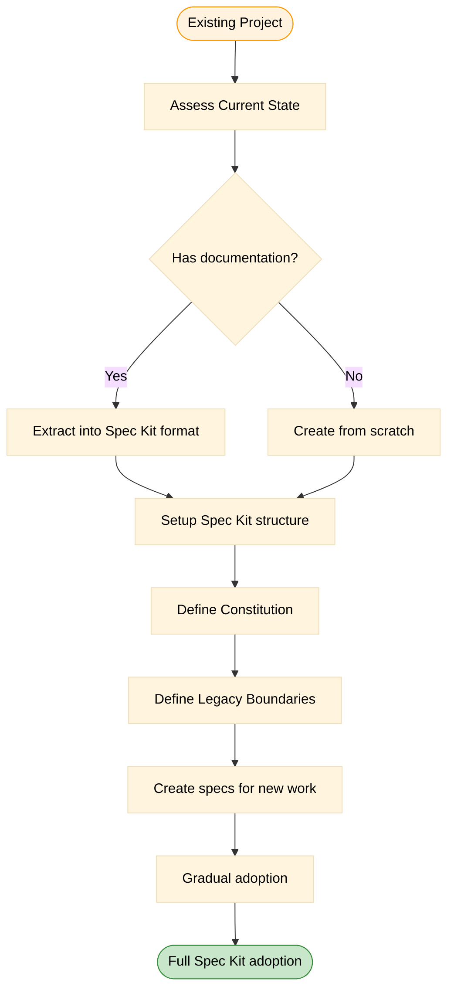

## Step 1: Assess Current State

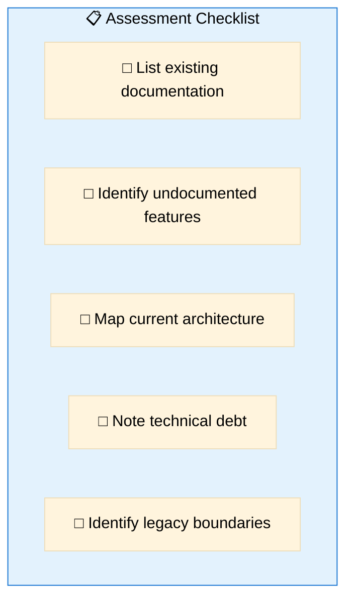

### Questions to Answer

| Question | Why It Matters |
|----------|----------------|
| What works well? | Keep it, document it |
| What's undocumented? | Needs specification |
| What's legacy? | Mark boundaries |
| What needs rewrite? | Plan from scratch |
| What are the implicit rules? | → Constitution |

---

## Step 2: Setup Spec Kit Structure

### Initialize in Existing Project

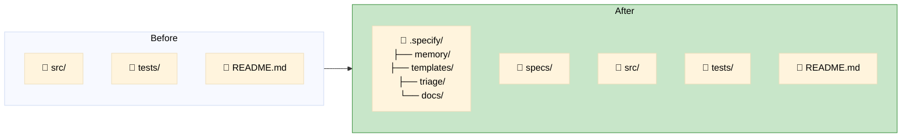

### Command to Initialize

```bash
# In project root
specify init --here --ai cursor-agent --script ps
```

---

## Step 3: Define Constitution

### Extract Implicit Rules

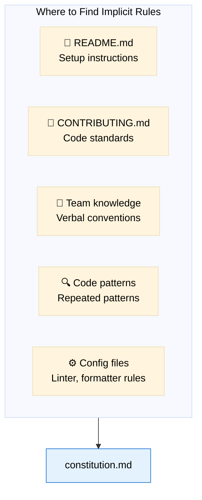

### Example Migration

**From scattered docs:**
```
README.md: "We use TypeScript"
CONTRIBUTING.md: "All PRs need tests"
.eslintrc: strict mode enabled
Team: "We prefer functional style"
```

**To Constitution:**
```markdown
## Core Principles

### I. Type Safety
All code must be written in TypeScript with strict mode.

### II. Test Coverage
Every feature must have tests before merge.

### III. Code Style
Prefer functional programming patterns over OOP.
```

---

## Step 4: Define Legacy Boundaries

### The "Legacy Box" Pattern

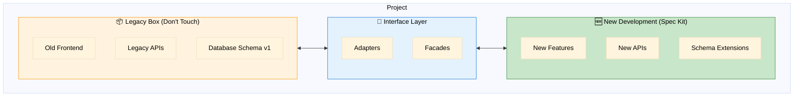

### Document in Constitution

```markdown
## Legacy Boundaries

### What is Legacy (DO NOT modify without spec)
- `src/legacy/` - Old frontend components
- `api/v1/` - Original API endpoints
- Database tables: users_old, orders_v1

### Interface Rules
- New code must NOT directly import from legacy
- Use adapters in `src/adapters/` for legacy integration
- New features must have their own specs before touching legacy
```

---

## Step 5: Create Specs for Existing Features

### Retrofitting Strategy

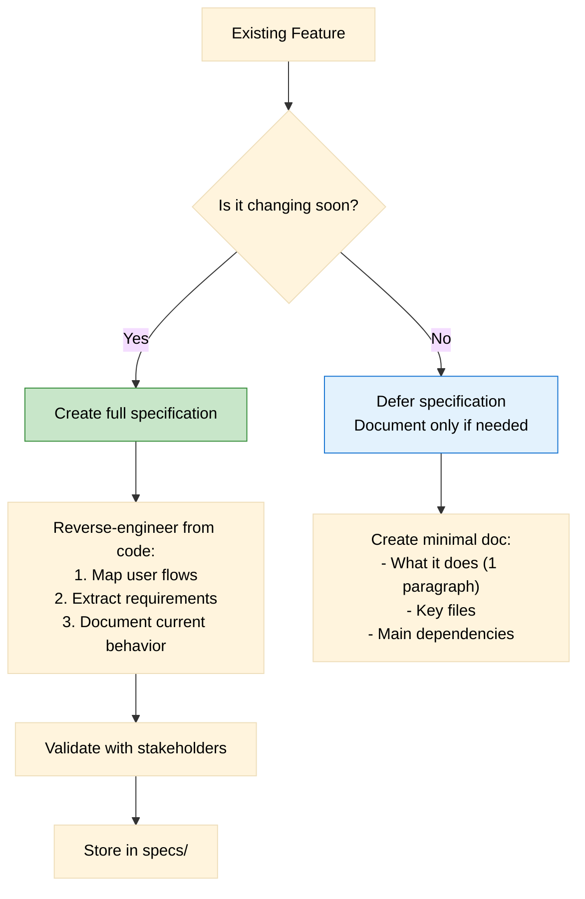

### Minimal Legacy Documentation

```markdown
# Legacy Feature: User Authentication

**Status**: Legacy (pre-Spec Kit)
**Key Files**: 
- src/auth/login.js
- src/auth/session.js

**What it does**: 
Handles user login via email/password, session management with JWT.

**Dependencies**:
- Database: users table
- External: None

**Note**: Full specification required before any modifications.
```

---

## Step 6: Gradual Adoption

### The Hybrid Approach

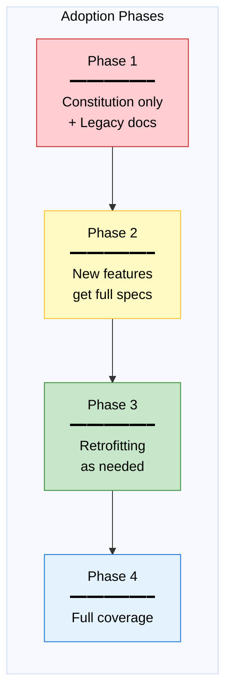

### Decision Matrix: When to Spec

| Scenario | Action |
|----------|--------|
| New feature | Full spec (required) |
| Bug fix in legacy | No spec (just fix) |
| Refactor legacy | Minimal spec (document current + target) |
| Major change to legacy | Full spec (required) |
| Documentation request | Create spec retrospectively |

---

## Common Migration Scenarios

### Scenario A: Frontend Legacy + New Backend

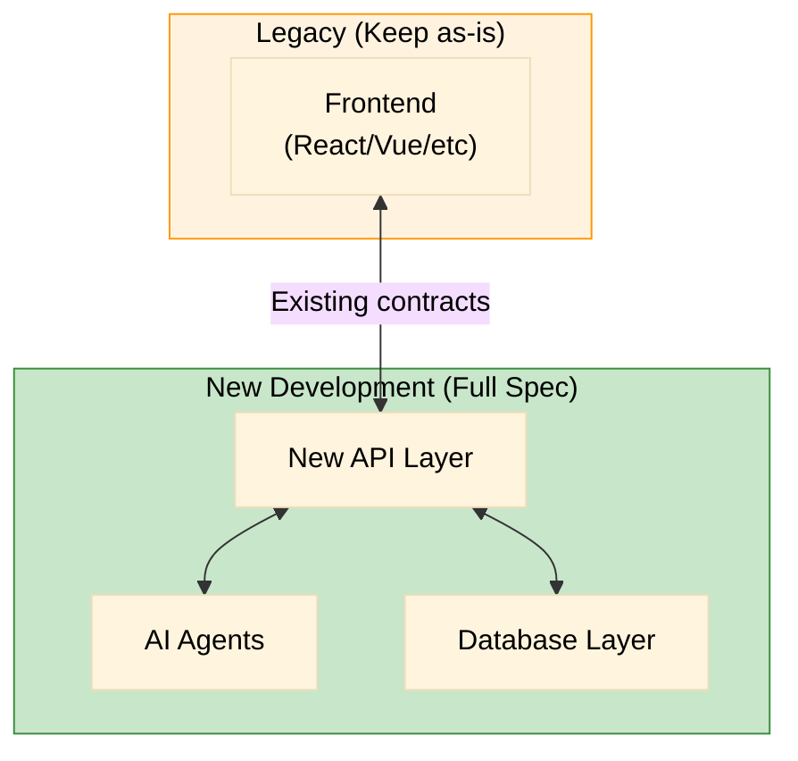

**Constitution should include:**
```markdown
### Legacy Integration
- Frontend at `frontend/` is legacy - DO NOT modify without spec
- New APIs must be backward compatible with existing frontend contracts
- All new backend work requires full Spec Kit workflow
```

### Scenario B: Monolith to Microservices

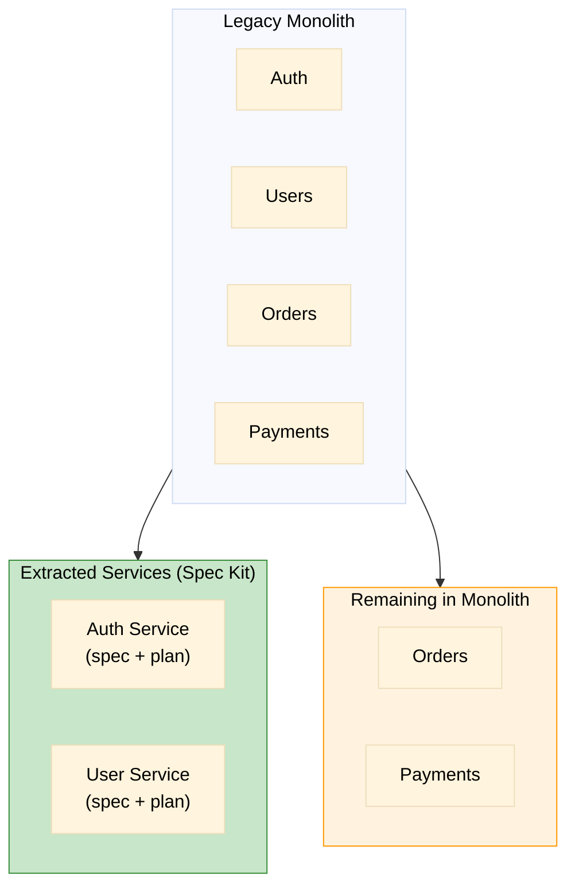

### Scenario C: Adding AI Agents to Existing System

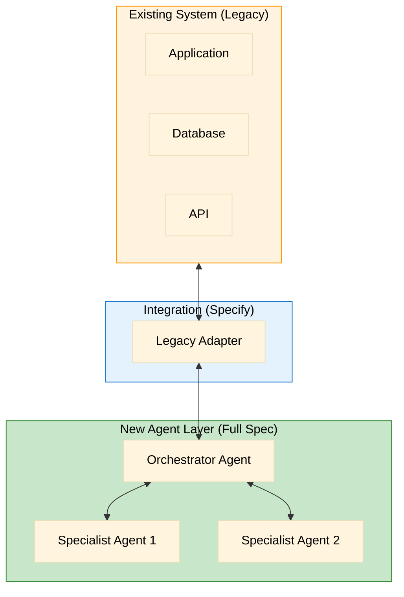

---

## Migration Checklist

```mermaid
%%{init: {'theme': 'base', 'themeVariables': { 'primaryTextColor': '#000', 'secondaryTextColor': '#000', 'tertiaryTextColor': '#000', 'lineColor': '#333'}}}%%
flowchart TD
    subgraph Checklist["✅ Migration Checklist"]
        C1["□ Initialize Spec Kit structure"]
        C2["□ Create constitution.md with implicit rules"]
        C3["□ Document legacy boundaries"]
        C4["□ Create minimal docs for legacy features"]
        C5["□ Setup triage workflow for new requests"]
        C6["□ Train team on Spec Kit commands"]
        C7["□ Create first full spec for a new feature"]
        C8["□ Iterate and refine process"]
    end
    
    C1 --> C2 --> C3 --> C4 --> C5 --> C6 --> C7 --> C8
    
    style Checklist fill:#e8f5e9,stroke:#4caf50,color:#000
```

---

## Troubleshooting Migration

### Common Issues

| Issue | Solution |
|-------|----------|
| "Too much legacy to document" | Use minimal docs, full spec only when changing |
| "Team resistance" | Start with new features only, show value |
| "Unclear boundaries" | Document in constitution, iterate |
| "Mixed old/new in same files" | Create adapters, gradually separate |
| "No time for specs" | Specs save time long-term, start small |

### Success Metrics

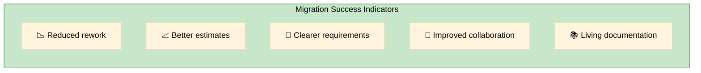

---

## 🔄 Need Another Round?

After reviewing this migration guide, consider:
- Does your specific scenario need more detail?
- Are there edge cases not covered?
- Would additional diagrams help?


