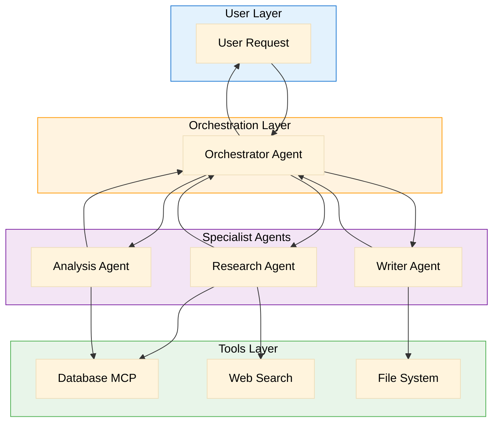
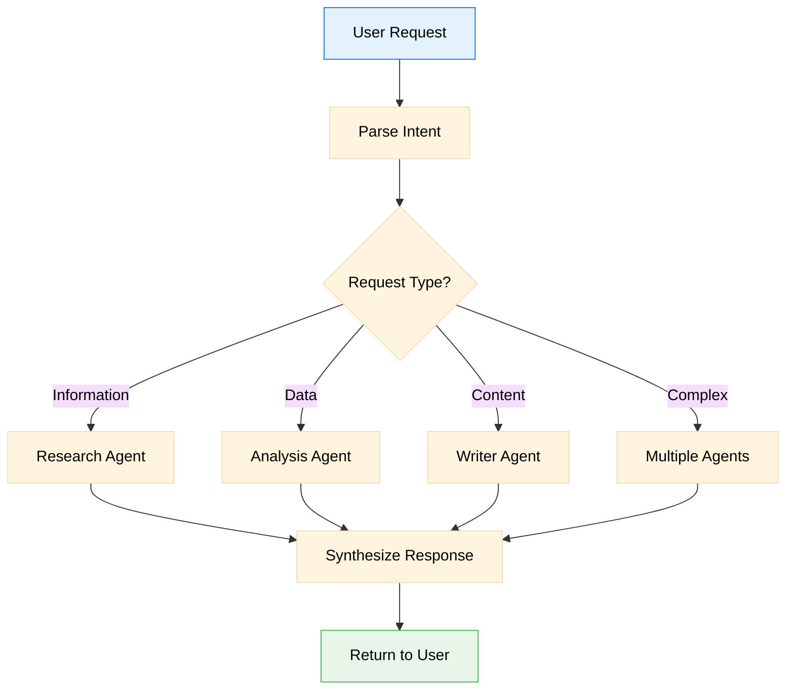
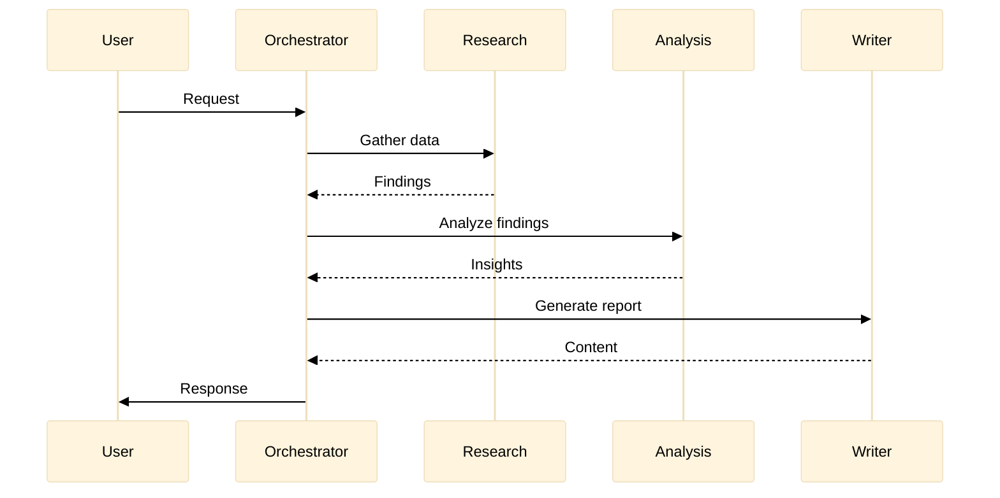

# Agent Framework

> Documentation of the agentic system architecture and agent definitions

**Last Updated**: [DATE]  
**Framework**: [Custom / LangChain / CrewAI / AutoGen / etc.]

## Architecture Overview



---

## Agent Definitions

### Orchestrator Agent

**Role**: Central coordinator that routes requests and synthesizes results

**Responsibilities**:
- Parse user intent
- Select appropriate specialist agents
- Coordinate multi-step workflows
- Synthesize final response

**Input Schema**:
```json
{
  "user_request": "string",
  "context": {
    "session_id": "string",
    "previous_messages": ["array of messages"]
  }
}
```

**Output Schema**:
```json
{
  "response": "string",
  "actions_taken": ["array of actions"],
  "agents_consulted": ["array of agent names"],
  "confidence": "number (0-1)"
}
```

**Decision Logic**:


---

### Research Agent

**Role**: Gather information from various sources

**Responsibilities**:
- Query databases for relevant data
- Search external sources when needed
- Validate and rank information quality
- Return structured findings

**Tools Available**:
- Database MCP (read-only)
- Web Search API
- Document retrieval

**Input Schema**:
```json
{
  "query": "string",
  "sources": ["database", "web", "documents"],
  "max_results": "number",
  "filters": {
    "date_range": "optional",
    "categories": ["optional array"]
  }
}
```

**Output Schema**:
```json
{
  "findings": [
    {
      "content": "string",
      "source": "string",
      "confidence": "number",
      "relevance": "number"
    }
  ],
  "summary": "string",
  "sources_consulted": ["array"]
}
```

**Constraints**:
- Maximum 10 database queries per request
- Web search limited to 5 results
- Response time target: < 10 seconds

---

### Analysis Agent

**Role**: Process and analyze data to extract insights

**Responsibilities**:
- Run analytical queries on data
- Identify patterns and trends
- Generate statistical summaries
- Flag anomalies

**Tools Available**:
- Database MCP (read-only)
- Calculation utilities

**Input Schema**:
```json
{
  "data_source": "string (collection name)",
  "analysis_type": "summary | trend | comparison | anomaly",
  "parameters": {
    "time_range": "optional",
    "group_by": "optional",
    "metrics": ["array of metrics"]
  }
}
```

**Output Schema**:
```json
{
  "analysis": {
    "type": "string",
    "results": "object (varies by type)",
    "visualizations": ["array of chart configs"]
  },
  "insights": ["array of insight strings"],
  "confidence": "number"
}
```

---

### Writer Agent

**Role**: Generate human-readable content

**Responsibilities**:
- Transform data into readable text
- Maintain consistent tone and style
- Format output appropriately
- Handle multiple content types

**Tools Available**:
- File System MCP (write)
- Template engine

**Input Schema**:
```json
{
  "content_type": "report | email | summary | documentation",
  "data": "object (content to transform)",
  "style": {
    "tone": "formal | casual | technical",
    "length": "short | medium | long",
    "format": "markdown | html | plain"
  }
}
```

**Output Schema**:
```json
{
  "content": "string",
  "format": "string",
  "word_count": "number",
  "file_path": "string (if saved)"
}
```

---

## Agent Communication

### Message Format

All inter-agent communication uses this format:

```json
{
  "from": "agent_name",
  "to": "agent_name",
  "type": "request | response | error",
  "correlation_id": "uuid",
  "timestamp": "ISO 8601",
  "payload": "object"
}
```

### Communication Flow



---

## Error Handling

| Error Type | Handler | Recovery Strategy |
|------------|---------|-------------------|
| Agent timeout | Orchestrator | Retry once, then fallback |
| Tool failure | Specialist | Log and continue without tool |
| Invalid input | Receiving agent | Return validation error |
| Rate limit | Tool layer | Queue and retry with backoff |

---

## Configuration

### Agent Settings

```yaml
orchestrator:
  timeout_ms: 30000
  max_agent_calls: 10
  
research:
  max_sources: 5
  timeout_ms: 10000
  
analysis:
  max_data_points: 10000
  timeout_ms: 15000
  
writer:
  max_length: 5000
  timeout_ms: 10000
```

### Feature Flags

| Flag | Default | Description |
|------|---------|-------------|
| `ENABLE_WEB_SEARCH` | false | Allow research agent to search web |
| `ENABLE_FILE_WRITE` | true | Allow writer agent to save files |
| `DEBUG_AGENT_LOGS` | false | Log all agent communications |

---

## Adding New Agents

1. Define agent role and responsibilities
2. Document input/output schemas
3. Specify tools available
4. Add to orchestrator's routing logic
5. Update this document
6. Add tests for agent behavior

