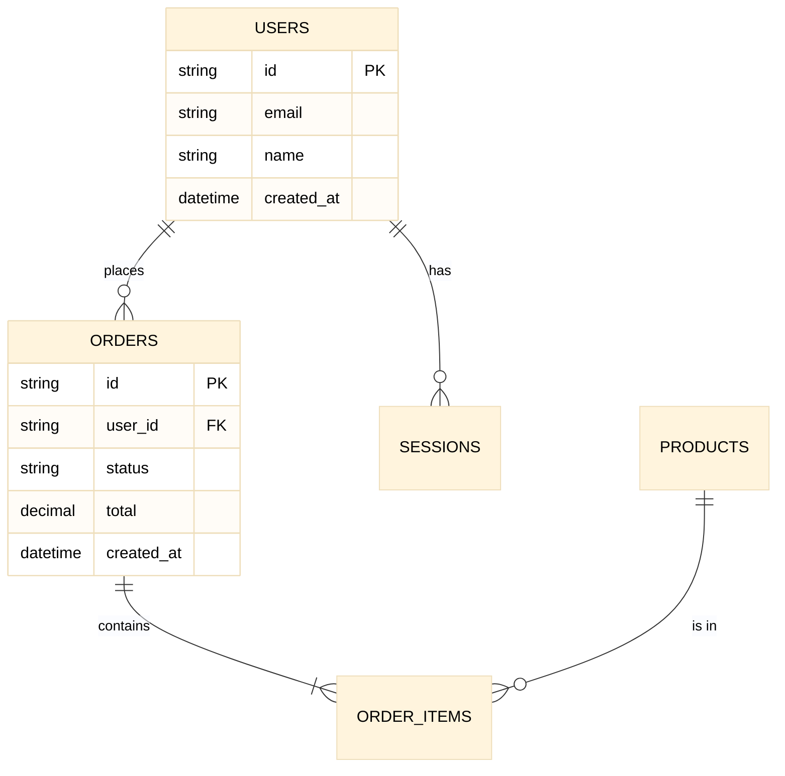
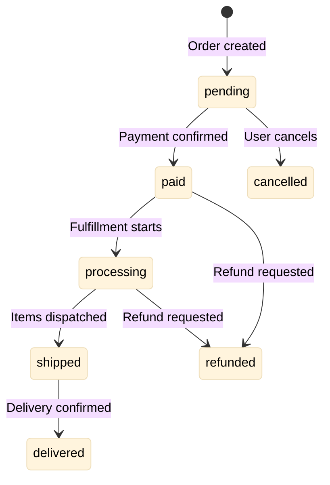

# Database Schema

> Semantic documentation of database structure and field meanings

**Last Updated**: [DATE]  
**Database Type**: [MongoDB / PostgreSQL / MySQL / etc.]  
**Database Name**: [Your database name]

## Overview



---

## Collections / Tables

### `users`

**Purpose**: Stores user account information and authentication data.

| Field | Type | Required | Description |
|-------|------|----------|-------------|
| `_id` / `id` | ObjectId / UUID | Yes | Unique identifier |
| `email` | String | Yes | User's email address (unique, indexed) |
| `name` | String | Yes | Display name |
| `password_hash` | String | Yes | Bcrypt hashed password (never expose) |
| `role` | String | Yes | User role: `user`, `admin`, `moderator` |
| `status` | String | Yes | Account status: `active`, `suspended`, `pending` |
| `created_at` | DateTime | Yes | Account creation timestamp |
| `updated_at` | DateTime | Yes | Last modification timestamp |
| `last_login` | DateTime | No | Most recent login timestamp |
| `preferences` | Object | No | User preferences (see nested schema) |

**Indexes**:
- `email` (unique)
- `status` (for filtering active users)
- `created_at` (for sorting)

**Semantic Notes**:
- `status: pending` means email not yet verified
- `role` determines access level throughout the application
- `preferences` is extensible for future user settings

---

### `orders`

**Purpose**: Tracks customer orders and their lifecycle.

| Field | Type | Required | Description |
|-------|------|----------|-------------|
| `_id` / `id` | ObjectId / UUID | Yes | Unique identifier |
| `user_id` | Reference | Yes | Reference to `users` collection |
| `status` | String | Yes | Order status (see state machine below) |
| `items` | Array | Yes | Array of order line items |
| `subtotal` | Decimal | Yes | Sum of item prices before tax/shipping |
| `tax` | Decimal | Yes | Calculated tax amount |
| `shipping` | Decimal | Yes | Shipping cost |
| `total` | Decimal | Yes | Final amount: subtotal + tax + shipping |
| `payment_id` | String | No | External payment processor reference |
| `shipping_address` | Object | No | Delivery address (see nested schema) |
| `created_at` | DateTime | Yes | Order creation timestamp |
| `updated_at` | DateTime | Yes | Last modification timestamp |

**Order Status State Machine**:



**Semantic Notes**:
- `pending` orders older than 24h are auto-cancelled
- `total` must always equal `subtotal + tax + shipping`
- `payment_id` links to external payment processor (Stripe, etc.)

---

### `products`

**Purpose**: Product catalog with inventory tracking.

| Field | Type | Required | Description |
|-------|------|----------|-------------|
| `_id` / `id` | ObjectId / UUID | Yes | Unique identifier |
| `sku` | String | Yes | Stock Keeping Unit (unique, indexed) |
| `name` | String | Yes | Product display name |
| `description` | String | No | Detailed product description |
| `price` | Decimal | Yes | Current selling price |
| `cost` | Decimal | No | Internal cost (for margin calculation) |
| `stock` | Integer | Yes | Available inventory count |
| `category` | String | Yes | Product category |
| `tags` | Array | No | Searchable tags |
| `active` | Boolean | Yes | Whether product is available for sale |
| `created_at` | DateTime | Yes | Product creation timestamp |

**Semantic Notes**:
- `stock` decrements on order, increments on cancellation/refund
- `active: false` hides product from catalog but preserves history
- `price` is in cents/minor currency unit to avoid float issues

---

## Nested Schemas

### `preferences` (in users)

```javascript
{
  theme: "light" | "dark",
  notifications: {
    email: boolean,
    push: boolean,
    sms: boolean
  },
  language: "en" | "es" | "pt",
  timezone: "America/New_York"
}
```

### `shipping_address` (in orders)

```javascript
{
  name: string,           // Recipient name
  street: string,         // Street address
  city: string,
  state: string,
  zip: string,
  country: string,        // ISO 3166-1 alpha-2 code
  phone: string           // For delivery contact
}
```

---

## Naming Conventions

| Convention | Example | Notes |
|------------|---------|-------|
| Collections | `snake_case` plural | `users`, `order_items` |
| Fields | `snake_case` | `created_at`, `user_id` |
| Foreign keys | `{entity}_id` | `user_id`, `product_id` |
| Timestamps | `*_at` suffix | `created_at`, `deleted_at` |
| Booleans | `is_*` or descriptive | `active`, `is_verified` |

---

## Query Patterns

### Common Queries

| Use Case | Query Pattern | Index Used |
|----------|---------------|------------|
| Get user by email | `{ email: "..." }` | `email` (unique) |
| Active products | `{ active: true }` | `active` |
| User's orders | `{ user_id: "..." }` | `user_id` |
| Recent orders | `{ created_at: { $gte: ... } }` | `created_at` |

### Performance Notes

- Always use indexed fields in queries
- Avoid `$regex` on non-indexed fields
- Use projection to limit returned fields
- Paginate large result sets

---

## Data Integrity Rules

1. **Referential Integrity**: Soft-delete users; never hard-delete if they have orders
2. **Price Consistency**: Order items snapshot product price at purchase time
3. **Stock Management**: Decrement stock atomically with order creation
4. **Audit Trail**: Never update historical data; append audit logs instead

