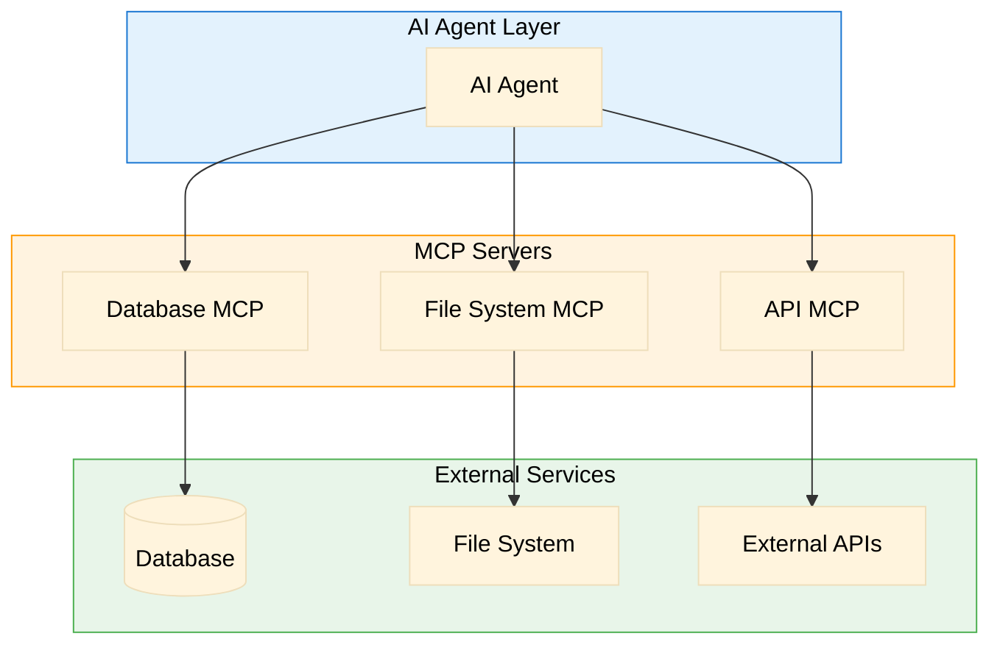
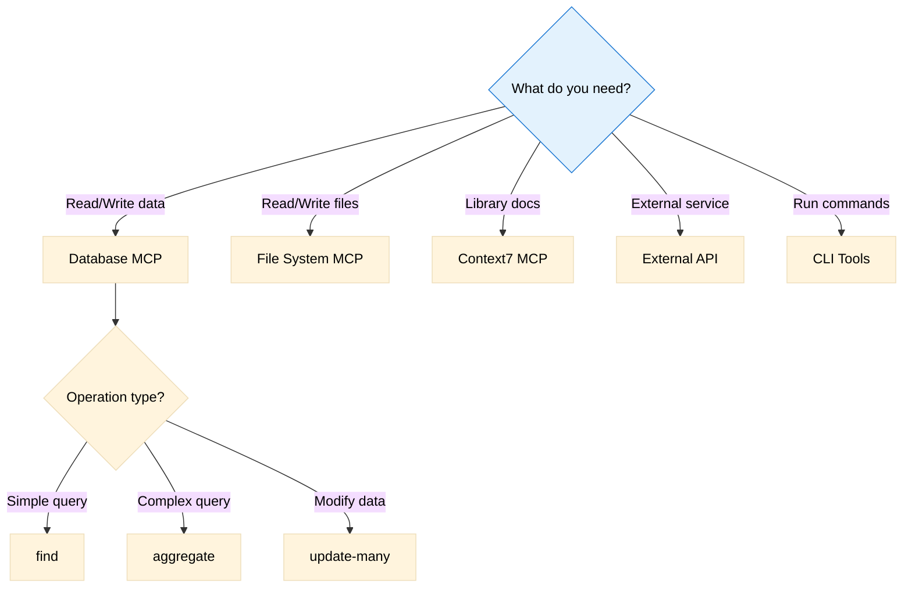

# Tools & MCPs Registry

> Inventory of all tools, MCPs, and integrations available in this project

**Last Updated**: [DATE]

## Overview



---

## MCP Servers

### Database MCP

**Purpose**: Direct database access for queries and operations

**Configuration**:
```json
{
  "mcpServers": {
    "mongodb": {
      "command": "npx",
      "args": ["-y", "mongodb-mcp"],
      "env": {
        "MONGODB_URI": "${DATABASE_URL}"
      }
    }
  }
}
```

**Available Operations**:
| Operation | Description | When to Use |
|-----------|-------------|-------------|
| `find` | Query documents | Read data |
| `aggregate` | Run aggregation pipeline | Complex queries, analytics |
| `insert-many` | Insert documents | Create records |
| `update-many` | Update documents | Modify records |
| `delete-many` | Delete documents | Remove records |
| `collection-schema` | Infer schema | Understand data structure |

**Permissions**: Read/Write access to all collections

**Notes**:
- Prefer aggregation for complex queries
- Always use filters to avoid full scans
- See `database-schema.md` for collection details

---

### File System MCP

**Purpose**: Read and write files in the project

**Configuration**:
```json
{
  "mcpServers": {
    "filesystem": {
      "command": "npx",
      "args": ["-y", "@anthropic/mcp-filesystem"],
      "env": {
        "ALLOWED_PATHS": "/project/src,/project/docs"
      }
    }
  }
}
```

**Available Operations**:
| Operation | Description | When to Use |
|-----------|-------------|-------------|
| `read_file` | Read file contents | Inspect code/docs |
| `write_file` | Write file contents | Create/update files |
| `list_directory` | List directory contents | Explore project structure |
| `search_files` | Search for files | Find specific files |

**Permissions**: Read/Write to allowed paths only

**Notes**:
- Cannot access files outside allowed paths
- Binary files not supported
- Large files may be truncated

---

### Context7 MCP

**Purpose**: Access up-to-date library documentation

**Configuration**:
```json
{
  "mcpServers": {
    "context7": {
      "command": "npx",
      "args": ["-y", "@context7/mcp"]
    }
  }
}
```

**Available Operations**:
| Operation | Description | When to Use |
|-----------|-------------|-------------|
| `resolve-library-id` | Find library ID | Before fetching docs |
| `get-library-docs` | Get documentation | Learn about libraries |

**Notes**:
- Use for current documentation, not training data
- Good for version-specific information

---

## External APIs

### Payment Processor

**Service**: [Stripe / PayPal / etc.]
**Base URL**: `https://api.example.com/v1`
**Authentication**: Bearer token via `PAYMENT_API_KEY`

**Available Endpoints**:
| Endpoint | Method | Purpose |
|----------|--------|---------|
| `/charges` | POST | Create a charge |
| `/charges/{id}` | GET | Get charge details |
| `/refunds` | POST | Create a refund |

**Rate Limits**: 100 requests/minute
**Sandbox Available**: Yes, use `sk_test_*` keys

---

### Email Service

**Service**: [SendGrid / Mailgun / etc.]
**Base URL**: `https://api.email.com/v3`
**Authentication**: API key in header

**Available Endpoints**:
| Endpoint | Method | Purpose |
|----------|--------|---------|
| `/send` | POST | Send transactional email |
| `/templates` | GET | List email templates |

**Rate Limits**: 1000 emails/day (free tier)

---

## Internal Tools

### CLI Tools

| Tool | Purpose | Usage |
|------|---------|-------|
| `npm run dev` | Start development server | Local development |
| `npm run test` | Run test suite | Testing |
| `npm run build` | Production build | Deployment |
| `npm run migrate` | Run database migrations | Schema updates |

### Custom Scripts

| Script | Location | Purpose |
|--------|----------|---------|
| `scripts/seed.js` | `/scripts/` | Seed database with test data |
| `scripts/backup.sh` | `/scripts/` | Backup database |

---

## Tool Selection Guide



---

## Adding New Tools

When adding a new MCP or tool:

1. Add configuration to `.cursor/mcp.json` or equivalent
2. Document in this file with:
   - Purpose
   - Configuration
   - Available operations
   - Permissions and limits
3. Update related agents/specs if capabilities change
4. Test the integration before documenting as available

