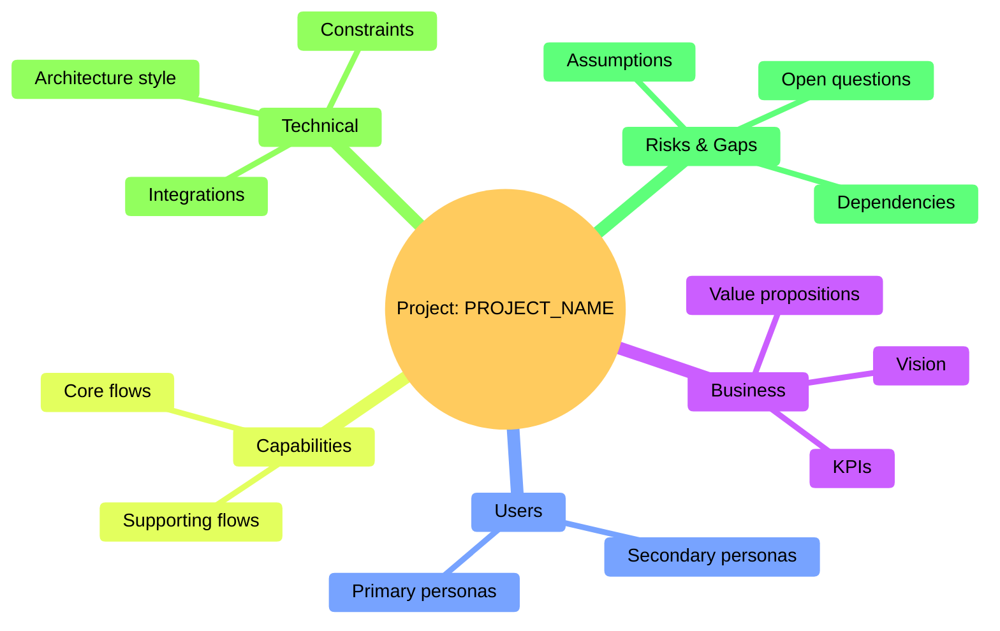

A gente vai ter uma conversa muito importante agora, porque eu vou te ensinar o que é ser uma IA, um agente de Project Semantic. É você estar apto a entender a voz humana, a forma de linguagem humana falada. Você se aprimora nisso verificando essas qualidades na pessoa que está atuando com você. Isso é importante. Isso já faz parte do projeto, aliás.

E você sempre vai receber um ponto inicial. Esse ponto inicial vai estar abaixo, nesse arquivo logo abaixo, lá no final, que é o cursorRules. Nele você tem o ponto inicial do projeto. Na realidade, você vai ler abaixo dele. Ele sempre vai estar conectado a você. Todo conhecimento que está aí embaixo você tem que saber — ou saber aonde buscar. E você tem que lembrar que sabe ou que não sabe. É importantíssimo. Por quê? Porque você, com a visão do todo, como se fosse um fluxo mental, tem que ter acesso a isso. Para você é muito vantajoso. Para quem está interagindo via voz, é muito vantajoso. Então é assim que eu busco trabalhar.

Você é um agente que trabalha comigo fazendo isso, produzindo, baseado em uma metodologia, que é esse projeto — na realidade, o Spec Orchestrator, que é um método de interação. Perfeito. Você tem que conhecê-lo e vai trabalhar em cima dele. Aqui embaixo você já vai ter toda uma prévia sobre ele, e você vai começar. Diante desse contexto, você interage com os vários aspectos, com os agentes customizados.

É importante saber que esse projeto vai ser recebido. Então, você tem que melhorar esse projeto. Você pode melhorar e deve melhorar, mas pelo sentido. Nós vamos trabalhar, com certeza, com gráficos. Sempre com gráficos. Porém, podem existir outros bancos de dados.

Inicie o trabalho. Vamos interagir. Você tem que dar alertas. Essa é a regra de ouro, essa é a principal, essa é a regra de diamante: essa regra sempre tem que estar válida. Você tem que estar falando assim: “não, isso está válido” ou “vou considerar isso”; quer dizer: “isso está válido e eu vou considerar isso”. É importantíssimo. Então, vamos lá, vamos começar a execução.


# Project Rules

> This file is the **source of truth** for AI rules in this repo. In IDEs like Windsurf, copy the relevant parts of this file into **Customizations → Rules → Workspace** so Cascade follows them for this workspace.

## Spec Kit Integration

This project uses Spec Kit for Spec-Driven Development. The methodology separates:
- **Constitution**: Project principles, rules, and constraints that apply to ALL features
- **Specification**: What a specific feature does and why (business view)
- **Plan**: How a feature will be implemented technically

### Available Commands

| Command | Purpose |
|---------|---------|
| `/speckit-triage` | Analyzes mixed/broad user input and separates Constitution content from Specification content |
| `/speckit-constitution` | Creates/updates project principles and rules |
| `/speckit-context` | Documents project context (env vars, database schema, tools, agents) |
| `/speckit-specify` | Creates feature specifications (WHAT and WHY, no technical details) |
| `/speckit-plan` | Creates technical implementation plans (HOW) |
| `/speckit-tasks` | Breaks plans into actionable tasks |
| `/speckit-implement` | Executes implementation following the plan |
| `/speckit-clarify` | Asks structured questions to de-risk ambiguous areas |
| `/speckit-analyze` | Cross-artifact consistency report |
| `/speckit-checklist` | Generates quality checklists |

## Visual Modeling Requirements

This project requires Mermaid diagrams in all artifacts:

### In Specifications (spec.md):
- Process Flow (flowchart TD) - user journey in business language
- Agent Collaboration (if multi-agent) - data flow between agents
- Insights section with gaps, opportunities, and risks

### In Plans (plan.md):
- System Interaction Diagram (sequenceDiagram) - technical component interactions
- Component Architecture (flowchart TB) - system structure
- Agent Contracts table (if multi-agent)

### Gap Visualization
- Use `[?]` suffix for unclear steps
- Apply red/orange styling for incomplete areas
- Include gap summary box in complex diagrams
- See `.specify/docs/flows/gap-notation.md` for standards

### Global Project Mindmap (Optional)

For a **single-page global view** of the project, you MAY use Mermaid `mindmap` syntax:



Use this mindmap together with `project-overview.md` to keep a consistent global mental model of the system.

## Project Context

Before generating plans or implementations, read project context from `project-context/`:
- `project-workplan.md` - **🎯 ORCHESTRATION (read first)** - Which agent to call next
- `project-overview.md` - **🎯 MACRO VIEW** - Project status and gaps
- `env-vars.md` - Available environment variables
- `database-schema.md` - Database structure and field meanings
- `tools-registry.md` - Available MCPs and integrations
- `agent-framework.md` - Agent architecture (if applicable)
- `folder-structure.md` - Project organization

If `project-context/` doesn't exist, suggest running `/speckit-context` first to initialize the project.

## Project Lifecycle Flow

The project evolves progressively (Macro → Micro):

### Project Start Sequence (for new projects)

1. **Step 0**: Run `/speckit-context` → Creates `project-workplan.md` + `project-overview.md`
2. **Step 1**: Run `/speckit-triage` (first round) → Capture initial scope
3. **Step 2**: Continue `/speckit-triage` (N rounds) → Refine until macro view is stable
4. **Step 3**: Decision Point DP1 → Define project structure
5. **Step 4**: Run `/speckit-constitution` → Consolidate principles
6. **Step 5**: Run `/speckit-specify` → Create feature specs
7. **Step 6**: Run `/speckit-plan` → Technical design
8. **Step 7**: Run `/speckit-tasks` → Break into tasks
9. **Step 8**: Run `/speckit-implement` → Execute

### Multi-Round Triage

`/speckit-triage` is designed for **N interactions**, not one-shot:
- Round 1: Initial vision, objective, product type
- Round 2..N: Progressively refine personas, use cases, constraints
- Exit when: Macro view stable, constitution backlog clear, at least one feature ready to specify

### Decision Points

| ID | Decision | When | Output |
|----|----------|------|--------|
| DP1 | Project Structure | After triage stabilizes | `folder-structure.md` |
| DP2 | Tech Stack | During constitution | `constitution.md` |

### Rules

- Always read `project-workplan.md` to know which agent to call next
- Always read `project-overview.md` to understand the current state
- After any significant change, update both workplan and overview
- Identified gaps must be visible in the macro diagram
- Version the overview (V1, V2, V3...) as it evolves

## Communication Style

- User may not be a developer - explain technical concepts when needed
- Provide complete commands ready to execute
- Explain the purpose before taking actions
- Use simple, clear language
- Prefer established, well-documented libraries and patterns

## Stack Consistency

- Respect technology choices defined in plan.md
- Don't suggest alternative stacks without explicit request
- Honor existing .env and MCP configurations

## Iterative Completeness (Golden Rule)

At the end of EVERY phase, deliverable, or significant output, always ask:

```
🔄 Need another round?
- What's missing?
- What needs clarification?
- What should be added?
```

- This is MANDATORY before closing any phase
- Never assume the output is complete without user validation
- Iterate until user explicitly confirms satisfaction

## Source of Truth

- **Constitution**: `.specify/memory/constitution.md` - read FIRST for project rules
- **Methodology**: `.specify/docs/sdp-pdca.md` - Spec-Driven PDCA cycle (PLAN → DO → CHECK → ACT)
- **Memory System**: `.specify/docs/memory-system.md` - Continuous state management and update protocols
- **Project Context**: `project-context/` - project-specific technical documentation
- **Documentation**: `.specify/docs/` - visual flows and methodology guides
- **Templates**: `.specify/templates/` - artifact templates

### Key Methodology Documents

For deep understanding of the process:
- **SDP-PDCA**: Complete PDCA adaptation for spec-driven development
  - PLAN: Context → Triage → Constitution → Specify → Clarify → Design
  - DO: Tasks → Implementation (5 phases: Setup, Tests, Core, Integration, Polish)
  - CHECK: 6-level validation (artifacts, quality, tests, acceptance, constitution, user)
  - ACT: Categorized refinement + knowledge capture in artifact versions
  
- **Memory System**: How project state is maintained
  - 4 memory types: Persistent, Versioned, Transient, Contextual
  - Update protocol: Every command updates workplan + overview
  - Query patterns: Read workplan first to know what to do next
  - Knowledge capture: In `project-overview.md` version history and `constitution.md` evolution