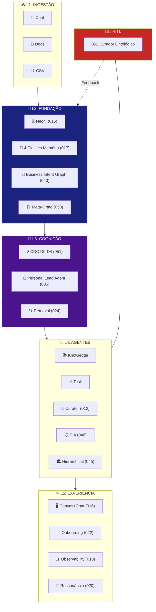
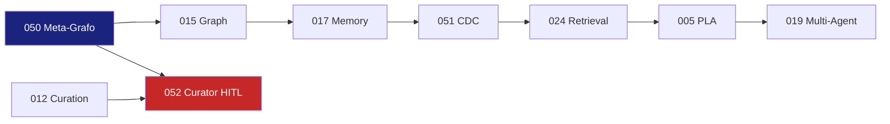

# EKS - Knowledge Summary (AI Reference)

> **Propósito**: Resumo estruturado para queries rápidas sobre o projeto  
> **Gerado**: 2025-02-01  
> **Fonte**: Análise de BRIEFING, specs/, project-context/, ROADMAP

---

## 🎯 O QUE É O EKS

**Enterprise Knowledge System** - Plataforma de inteligência organizacional que:

| Antes | Depois (com EKS) |
|-------|------------------|
| Conhecimento espalhado em emails, docs, chats | Estruturado em grafo semântico navegável |
| Decisões importantes se perdem | Rastreadas com owner/deadline/contexto |
| IA "esquece" entre conversas | Memória persistente cross-thread |
| RAG black-box | GraphRAG híbrido com trust scores explícitos |

---

## 🏗️ ARQUITETURA EM 5 CAMADAS



---

## 🧠 CONCEITOS-CHAVE

### 1. As 4 Classes de Memória (017)

| Classe | O que armazena | Exemplo |
|--------|---------------|---------|
| **Semântica** | Conceitos, definições, fatos estáveis | "O que é NPS?" |
| **Episódica** | Eventos, reuniões, timeline | "O que decidimos em Jan?" |
| **Procedural** | Processos, playbooks, how-tos | "Como fazer onboarding?" |
| **Avaliativa** | Lições, insights, sucessos/falhas | "Por que X falhou?" |

### 2. Context Depth Controller - CDC (051)

| Nível | Quando | Tokens | O que busca |
|-------|--------|--------|-------------|
| **D0** | Pergunta factual simples | 500 | Working Set apenas |
| **D1** | Continuidade ("ele", "isso") | 1500 | + Episodic |
| **D2** | "Explica", "por quê" | 3000 | + Semantic |
| **D3** | Discordância, correção | 4000 | + Claims contrários |
| **D4** | Mudança de tema | 2500 | Reset + Anchor |

### 3. Business Intent Graph - BIG (040)

```
Organization → Purpose/Missão
    └── Objetivos Estratégicos
        └── OKRs
            └── Métricas
                
Knowledge --[SUPPORTS]--> Objetivo
Process --[CONTRIBUTES_TO]--> Objetivo
```

### 4. Curador Ontológico - HITL (052)

**NÃO é** Admin nem Agente IA.  
**É** humano especialista que conhece o negócio e:
- Visualiza o grafo interativamente
- Valida sugestões da IA (Memory Steward)
- Cria/refina relacionamentos e schema
- Detecta antipadrões (ciclos, órfãos, centralizadores)

---

## 📊 SPECS CORE (23 specs)

### Por Camada

| Camada | Specs Principais |
|--------|-----------------|
| **Fundação** | 015 (Graph Model), 017 (Memory), 040 (BIG), 050 (Meta-Graph) |
| **Cognição** | 005 (PLA), 024 (Retrieval), 051 (CDC) |
| **Pipeline** | 001 (Knowledge Pipeline), 007 (Chat Capture), 012 (Curation), 013 (Ingestion) |
| **Agentes** | 004 (Agent Factory), 019 (Multi-Agent), 045 (Hierarchical), 046 (PIA) |
| **HITL** | **052 (Curador Ontológico)** - epicentro |
| **Experiência** | 016 (UI), 018 (Observability), 020 (Ressonância), 022 (PKP) |
| **Auth** | 003 (Admin Login), 009 (Corp/Pessoal) |

### Specs Mais Importantes

| # | Nome | Propósito Resumido |
|---|------|-------------------|
| **015** | neo4j-graph-model | Modelo de dados canônico do grafo |
| **017** | memory-ecosystem | 4 classes de memória + bitemporal |
| **005** | agent-router (PLA) | Personal Lead Agent - orquestrador |
| **051** | context-depth-controller | Controle de profundidade D0-D4 |
| **040** | business-intent-graph | Ancoragem a objetivos de negócio |
| **050** | meta-graph-schema | Schema-as-data + Query Profiles |
| **052** | ontological-curator-interface | Interface HITL para curador humano |

---

## 🛠️ STACK TECNOLÓGICO

| Camada | Tecnologia |
|--------|------------|
| **Frontend** | Next.js 14, React 18, Tailwind CSS, Radix UI, Zustand |
| **Backend** | Node.js 20, TypeScript, Express, Socket.io |
| **Agentes** | Python 3.11, **Pydantic AI**, FastAPI |
| **Database** | **Neo4j Aura (EXCLUSIVO)** - Graph + Vector Search |
| **AI** | Azure OpenAI GPT-4o, text-embedding-3-large |
| **Deploy** | Vercel (FE), Railway (BE), Docker |

---

## 📋 ROADMAP (4 Sprints = 8 semanas)

| Sprint | Foco | Specs Core |
|--------|------|------------|
| **1** | Foundation | 003, 005, 001, 007, 009 |
| **2** | Memory & Persistence | 050, 015, 017, 025, 008 |
| **3** | Agents & Cognition | 051, **052**, 004, 019, 024, 012 |
| **4** | Polish & Advanced | 018, 020, 021, 022 |

**Status Atual**: Sprint 1 pending

---

## 🔗 DEPENDÊNCIAS CRÍTICAS



---

## 💡 INOVAÇÕES PRINCIPAIS

1. **Knowledge as Graph** - Texto é projeção, grafo é verdade
2. **Memória Cognitiva 4 Classes** - Semântica/Episódica/Procedural/Avaliativa
3. **CDC com 5 Níveis** - Profundidade de contexto adaptativa
4. **Trust-Transparent RAG** - Todo chunk tem score de confiança explícito
5. **Curador Ontológico (HITL)** - Humano refina ontologia visualmente
6. **Multi-Level Agents** - Hierarquia Op/Ger/Tac/Est com cross-pollination

---

## 📁 ESTRUTURA DO PROJETO

```
EKS/
├── frontend/              # Next.js 14 UI
├── backend/               # Node.js API  
├── agents/                # Python agents (Pydantic AI)
├── specs/                 # 48 Feature specs
│   ├── 001-knowledge-pipeline/
│   ├── 005-agent-router/
│   ├── 015-neo4j-graph-model/
│   ├── 017-memory-ecosystem/
│   ├── 050-meta-graph-schema/
│   ├── 051-context-depth-controller/
│   ├── 052-ontological-curator-interface/
│   ├── _ROADMAP.md        # Sprint planning
│   └── _CONSOLIDATION_ANALYSIS.md
├── project-context/       # Docs técnicos
│   └── eks-architecture.md  # FONTE CANÔNICA
├── docs/                  
├── BRIEFING-EKS-V1.md     # Visão executiva
└── docker-compose.yml
```

---

## 🎯 MÉTRICAS DE SUCESSO

### MVP (3-4 meses)
- [ ] Extração de conhecimento de 10 conversas → grafo
- [ ] Ontologia básica com 20+ tipos de entidade
- [ ] 3 agentes funcionando (PLA, Knowledge, Task)
- [ ] RAG com trust scores
- [ ] Dashboard de demonstração

### Produção (9-12 meses)
- [ ] Sistema PIA completo com gamificação
- [ ] 6+ agentes especializados
- [ ] 10,000+ nós em produção

---

## 🔍 QUERIES RÁPIDAS

### Onde está X?

| Se procura... | Veja... |
|---------------|---------|
| Modelo de dados | `specs/015-neo4j-graph-model/spec.md` |
| Sistema de memória | `specs/017-memory-ecosystem/spec.md` |
| Profundidade de contexto | `specs/051-context-depth-controller/spec.md` |
| Orquestração de agentes | `specs/019-multi-agent-orchestration/spec.md` |
| Interface do curador | `specs/052-ontological-curator-interface/spec.md` |
| Arquitetura geral | `project-context/eks-architecture.md` |
| Roadmap | `specs/_ROADMAP.md` |
| Env vars | `project-context/env-vars.md` |

### Labels Canônicos do Grafo

| Label | Propósito |
|-------|-----------|
| `:User` | Usuários do sistema |
| `:Department` | Áreas organizacionais |
| `:Knowledge` | Conhecimento estruturado |
| `:Document` | Documentos fonte |
| `:Chunk` | Pedaços de documento |
| `:Process` | Processos de negócio |
| `:Objective` | Objetivos estratégicos |
| `:Organization` | Empresa/organização |

### Relacionamentos Principais

| Relacionamento | De → Para |
|----------------|-----------|
| `[:WORKS_AT]` | User → Department |
| `[:REPORTS_TO]` | User → User |
| `[:SUPPORTS]` | Knowledge → Objective |
| `[:HAS_CHUNK]` | Document → Chunk |
| `[:EXTRACTED_FROM]` | Knowledge → Document |

---

**Última Atualização**: 2025-02-01  
**Versão**: 1.0
