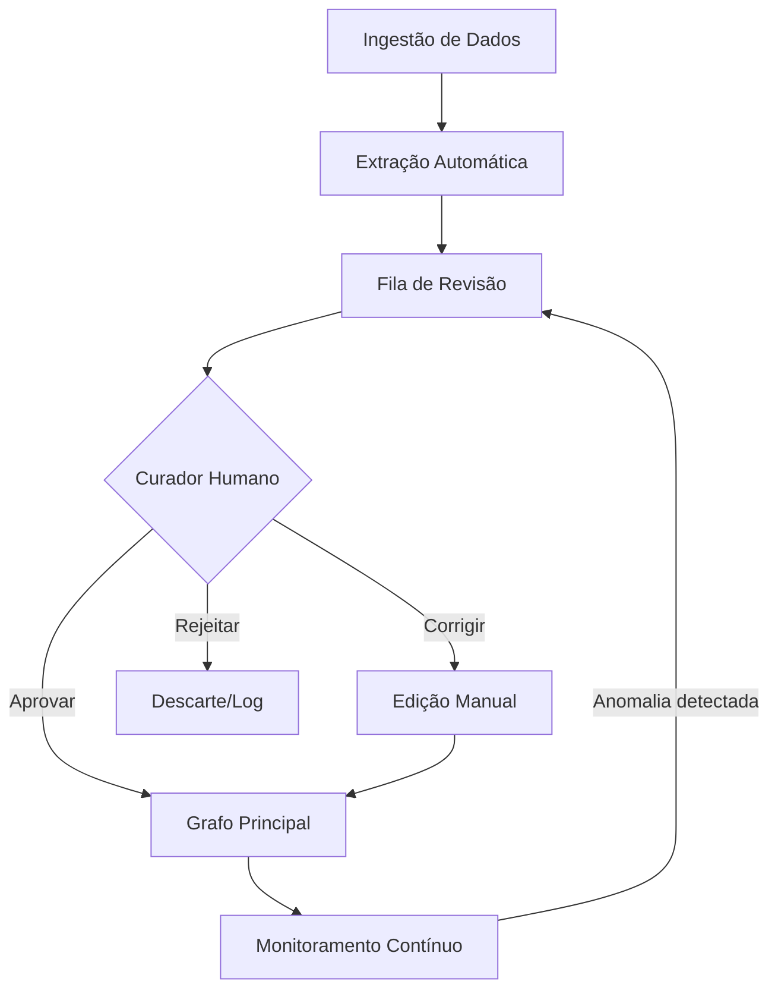

# Guia de Curadoria Ontológica

## O que é Curadoria Ontológica?

É o processo **ativo e contínuo** de manter a qualidade do grafo de conhecimento. Não é automação pura — exige **julgamento humano** para decisões semânticas.

> "A IA extrai, o humano refina."

---

## Os 4 Pilares da Curadoria

### 1. Limpeza de Aliases
**Problema**: Mesma entidade com nomes diferentes.
```
Exemplo no EKS:
- "AWS" (mencionado em reunião)
- "Amazon Web Services" (do documento)
- "aws" (erro de case)
→ Devem ser o mesmo nó
```

**Ação**:
```cypher
// Identificar possíveis duplicatas por similaridade
MATCH (n:Tool)
WITH n.name AS name, collect(n) AS nodes
WHERE size(nodes) > 1
RETURN name, size(nodes) AS count;

// Merge manual (após validação humana)
MATCH (keep:Tool {name: "AWS"}), (dup:Tool {name: "aws"})
CALL apoc.refactor.mergeNodes([keep, dup], {properties: "combine"})
YIELD node
RETURN node;
```

**Fluxo humano**:
1. Sistema sugere candidatos a merge
2. Curador valida (são a mesma entidade?)
3. Sistema executa merge
4. Log da decisão

### 2. Remoção de Ruído
**Problema**: Entidades extraídas incorretamente ou irrelevantes.

**Sinais de ruído**:
- Nós órfãos (sem relações)
- Entidades genéricas demais ("Sistema", "Processo", "Coisa")
- Extração de lixo (pedaços de frase como entidade)

**Query para identificar**:
```cypher
// Nós órfãos
MATCH (n)
WHERE NOT (n)--()
RETURN labels(n) AS tipo, n.name AS nome
LIMIT 20;

// Entidades suspeitas (nomes muito curtos ou muito longos)
MATCH (n)
WHERE size(n.name) < 3 OR size(n.name) > 100
RETURN labels(n) AS tipo, n.name AS nome;
```

**Ação**: Deletar (após validação) ou enriquecer com relações.

### 3. Enriquecimento de Relações
**Problema**: Nós existem mas faltam conexões semânticas.

**Exemplo**:
```
User "João" existe
Project "Sistema X" existe
Mas não há HAS_TEAM_MEMBER conectando
→ Conhecimento perdido
```

**Query para identificar**:
```cypher
// Usuários sem departamento
MATCH (u:User)
WHERE NOT (u)-[:MEMBER_OF]->(:Department)
RETURN u.name;

// Projetos sem owner
MATCH (p:Project)
WHERE NOT (p)-[:OWNED_BY]->(:User)
RETURN p.name;
```

**Ação**: Curador adiciona relações faltantes baseado em contexto.

### 4. Versionamento de Entidades
**Problema**: Entidades mudam ao longo do tempo.

**Cenários**:
- Pessoa muda de cargo → novo `PersonaVersion`
- Projeto evolui → `SUPERSEDES` entre versões
- Objetivo muda de prioridade → histórico de mudanças

**Padrão no EKS**:
```cypher
// PersonaVersion já implementado
(user:User)-[:HAS_PERSONA_VERSION]->(v:PersonaVersion)
(profile:AIProfile)-[:CURRENT_PERSONA]->(v:PersonaVersion)

// Projetos com versionamento
(new:Project)-[:SUPERSEDES]->(old:Project)
```

**Recomendação**: Manter histórico, nunca deletar sem versionar.

---

## Fluxo de Curadoria Recomendado



### Frequência sugerida

| Tarefa | Frequência | Tempo estimado |
|--------|------------|----------------|
| Revisar nós órfãos | Semanal | 15 min |
| Verificar supernós | Semanal | 10 min |
| Merge de aliases | Quinzenal | 30 min |
| Auditoria de relações | Mensal | 1 hora |
| Revisão de schema | Trimestral | 2 horas |

---

## Ferramentas de Apoio

### No EKS

1. **Endpoint `/ontology/stats`**: Métricas básicas
2. **Script `test-neo4j.js`**: Diagnóstico rápido
3. **Neo4j Browser**: Exploração visual
4. **Queries em `queries/health-metrics.cypher`**: Métricas avançadas

### Sugestões futuras

- [ ] Dashboard de curadoria no frontend
- [ ] Fila de revisão com sugestões da IA
- [ ] Log de decisões do curador
- [ ] Diff visual entre versões do grafo

---

## Decisões que SÓ o Humano pode tomar

| Decisão | Por que não automatizar |
|---------|-------------------------|
| Merge de entidades | Contexto semântico (são realmente a mesma coisa?) |
| Deletar nó órfão | Pode ser relevante para futuro |
| Criar nova relação | Exige conhecimento do domínio |
| Renomear label/relationship | Impacto em todo o sistema |
| Definir hierarquia | Decisão organizacional |

---

## Checklist do Curador

### Revisão Semanal
- [ ] Rodar `test-neo4j.js` e verificar métricas
- [ ] Verificar se R/N está estável
- [ ] Listar top 5 supernós (cresceram?)
- [ ] Checar nós órfãos (> 10% é alerta)

### Revisão Mensal
- [ ] Auditar labels menos usados (< 5 nós)
- [ ] Auditar relationships menos usadas
- [ ] Verificar consistência de propriedades
- [ ] Documentar decisões tomadas

### Revisão Trimestral
- [ ] Revisar schema completo
- [ ] Propor novos labels/relationships se necessário
- [ ] Atualizar documentação de ontologia
- [ ] Comparar com objetivos de negócio

---

## Referências

- Métricas de saúde: `./ontological-health.md`
- Queries Cypher: `../queries/health-metrics.cypher`
- Schema atual: `./schema-inventory.md`
