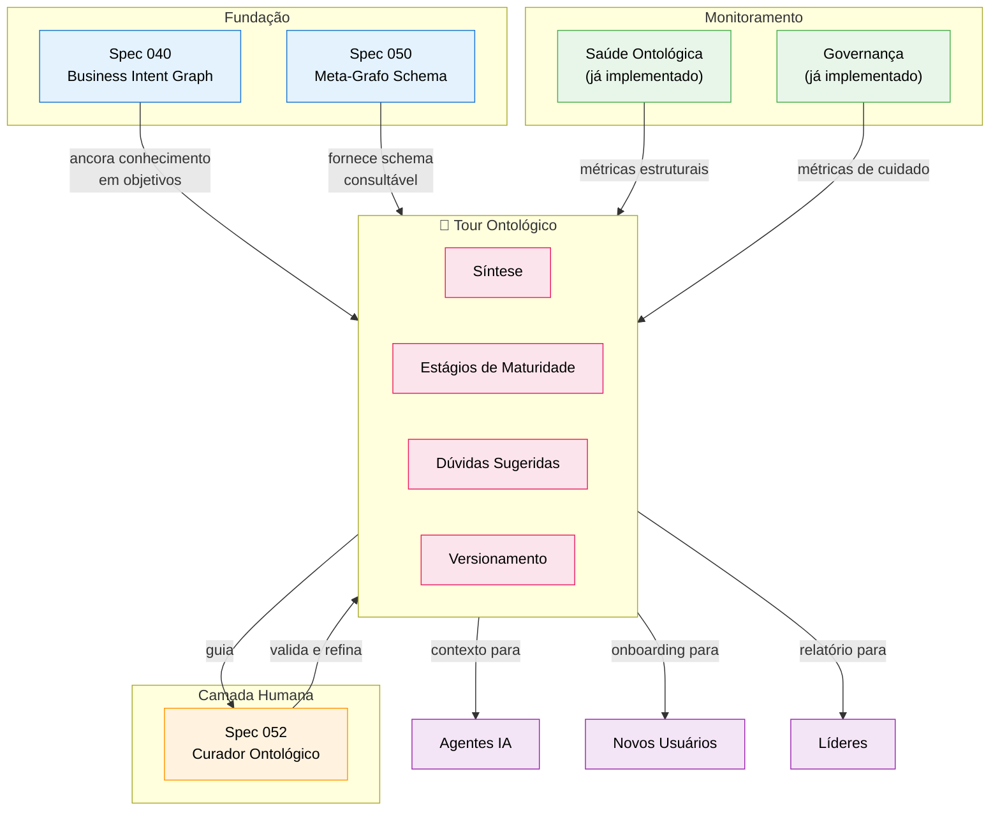

# Tour Ontológico — A Consciência do EKS

> "O EKS não é apenas um grafo. É um sistema que sabe o que sabe, sabe o que não sabe, e guia qualquer agente por esse conhecimento."

**Criado**: 2026-02-10  
**Status**: Conceito (V1)  
**Prioridade**: P0 (Coração do sistema)  
**Conexões**: Spec 040 (BIG), Spec 050 (Meta-Grafo), Spec 052 (Curador Ontológico)

---

## 1. O Que É o Tour Ontológico

O **Tour Ontológico** é uma experiência guiada e progressiva que revela o estado de consciência do EKS. Não é um dashboard estático — é uma **narrativa viva** sobre o que o sistema conhece, como conhece, e o que ainda falta.

### Analogia

Se o EKS é um cérebro organizacional:
- O **grafo** é a memória
- As **queries** são os neurônios
- O **BIG** é a intenção
- O **Tour** é a **autoconsciência** — o cérebro olhando para si mesmo

### Para Quem Serve

| Audiência | O que ganha com o Tour |
|-----------|----------------------|
| **Curador Ontológico** | Visão clara de onde atuar, o que curar, o que enriquecer |
| **Líder/Executivo** | Entende o que a organização "sabe" vs o que deveria saber |
| **Agente IA** | Contexto completo para gerar respostas mais precisas |
| **Novo colaborador** | Onboarding acelerado — o Tour é o mapa do conhecimento |
| **Auditor** | Rastreabilidade do que foi capturado, quando, por quem |

---

## 2. Princípios do Tour

### 2.1 Progressivo (Etapas de Maturidade)

O Tour reflete o estágio de evolução do EKS. Não exige que tudo esteja pronto — ele mostra **onde o sistema está** e **para onde vai**.

```
Estágio 0: Schema Definido
    → Labels e relationships nomeados
    → Meta-Grafo criado (Spec 050)
    → "Sabemos que tipos de coisas existem"

Estágio 1: Dados Base Ingeridos
    → Nós populados via ingestão (chat, docs, CSV)
    → Relações básicas criadas
    → "Temos as peças no tabuleiro"

Estágio 2: Propriedades Enriquecidas
    → Propriedades preenchidas (>80% completude)
    → Relações semânticas conectadas
    → "As peças têm identidade"

Estágio 3: Temporalidade Ativa
    → createdAt/updatedAt populados
    → Versionamento de entidades funcionando
    → "Sabemos quando as coisas aconteceram"

Estágio 4: Curadoria Validada
    → Curador ontológico revisou e validou
    → Aliases limpos, duplicatas resolvidas
    → Governança ativa
    → "Um humano confirmou que faz sentido"

Estágio 5: Consciência Plena
    → BIG ancorado (todo conhecimento ligado a objetivos)
    → 4 classes de memória classificadas
    → Auto-monitoramento ativo
    → O Tour se atualiza sozinho
    → "O sistema sabe o que sabe"
```

### 2.2 Versionado

Cada "snapshot" do Tour é uma versão datada:

```
Tour V1 (2026-02-10) — Estágio 1.5
  "69 nós, 114 relações, 14 labels. Schema definido.
   Dados base ingeridos. Propriedades 62% completas.
   Temporalidade: pendente. Curadoria: inicial."

Tour V2 (2026-02-20) — Estágio 2.0
  "112 nós, 198 relações, 14 labels.
   Propriedades 81% completas. Primeiros aliases limpos.
   3 supernós identificados e documentados."
```

Isso permite:
- Ver a evolução ao longo do tempo
- Comparar versões ("o que mudou?")
- Medir progresso ("estamos amadurecendo?")

### 2.3 Acessível a Qualquer Agente

O Tour não é só uma tela no frontend. É um **artefato consultável**:

- **Frontend**: Experiência visual guiada para humanos
- **API**: Endpoint que retorna o Tour como JSON estruturado
- **Agente**: Prompt context que qualquer agente pode consumir antes de responder
- **Markdown**: Documento exportável para documentação

### 2.4 Autoconsciente

O Tour gera **Síntese** e **Dúvidas**:

**Síntese** = O que o EKS sabe:
```
"O EKS conhece 1 empresa (Alocc), 5 departamentos, 18 usuários,
6 objetivos estratégicos, 12 OKRs, 8 projetos, 42 Knowledge nodes
extraídos de 35 documentos. As áreas mais documentadas são
Operações (85%) e Compliance (72%). A área menos documentada
é Comercial (23%)."
```

**Dúvidas sugeridas** = O que o EKS deveria perguntar:
```
- "Quem é o responsável pelo Departamento de Marketing?"
  (Department 'Marketing' existe mas não tem REPORTS_TO)

- "Qual é o OKR principal para o Objetivo 'Expansão Regional'?"
  (Objective existe sem MEASURED_BY → OKR)

- "O Projeto 'CRM Integrado' ainda está ativo?"
  (Último updatedAt há 90 dias)

- "Existem processos documentados para Atendimento ao Cliente?"
  (Department existe, mas 0 Knowledge nodes com memory_class: procedural)
```

---

## 3. Modelo de Dados do Tour

### 3.1 Node: TourSnapshot

```cypher
(:TourSnapshot {
  version: string,          // "V1", "V2", "V3"
  created_at: datetime,     // Quando foi gerado
  maturity_stage: float,    // 0.0 a 5.0
  total_nodes: integer,
  total_relationships: integer,
  total_labels: integer,
  property_completeness: float,    // 0-100%
  governance_score: float,         // 0-100
  temporal_coverage: float,        // 0-100%
  curation_coverage: float,        // 0-100%
  big_anchoring: float,            // 0-100% knowledge linked to objectives
  synthesis_text: string,          // Síntese em linguagem natural
  suggested_questions: [string],   // Dúvidas sugeridas
  generated_by: string             // "system" | "curator"
})
```

### 3.2 Relacionamentos do Tour

```cypher
// Versionamento linear
(:TourSnapshot)-[:SUPERSEDES]->(:TourSnapshot)

// Ligação com o grafo real
(:TourSnapshot)-[:COVERS_LABEL]->(:SchemaLabel)
(:TourSnapshot)-[:COVERS_DOMAIN]->(:StrategicArea)

// Ligação com ações de curadoria
(:TourSnapshot)-[:TRIGGERED]->(:CurationAction)
```

### 3.3 Node: TourStage (Estágio de Maturidade)

```cypher
(:TourStage {
  id: integer,              // 0-5
  name: string,             // "Schema Definido", "Dados Base", etc.
  description: string,
  criteria: [string],       // O que precisa ser verdade para estar nesse estágio
  current: boolean,         // Se é o estágio atual
  achieved_at: datetime     // Quando foi atingido (null se não atingido)
})

(:TourSnapshot)-[:AT_STAGE]->(:TourStage)
(:TourStage)-[:NEXT_STAGE]->(:TourStage)
```

---

## 4. Propriedades do Tour (O "Detalhamento" que o Tour Revela)

Para cada **label** no grafo, o Tour calcula:

| Propriedade | O que mede | Exemplo |
|------------|-----------|---------|
| **Cobertura** | Quantos nós existem vs esperado | User: 18/25 (72%) |
| **Completude** | Propriedades preenchidas | User.email: 100%, User.role: 44% |
| **Conectividade** | Relações por nó | Avg: 3.2 rels/User |
| **Frescor** | Última atualização | Média: 15 dias |
| **Ancoragem BIG** | Ligado a objetivo? | 8/18 Users ligados a Objectives |
| **Validação** | Curador revisou? | 5/18 Users validados |
| **Classe de Memória** | Distribuição das 4 classes | Semântica: 60%, Episódica: 25%, ... |

Para cada **relationship type**:

| Propriedade | O que mede | Exemplo |
|------------|-----------|---------|
| **Densidade** | Existente vs potencial | MEMBER_OF: 15/18 Users (83%) |
| **Bidirecionalidade** | Tem relação inversa? | REPORTS_TO: 12/15 (80%) |
| **Confiança média** | Se tem score de confiança | SUPPORTS: avg 0.78 |
| **Temporal** | Relações com timestamp | 30% com created_at |

---

## 5. A Síntese do EKS

A Síntese é o coração do Tour. É um texto em linguagem natural que responde:

### "O que o EKS sabe hoje?"

```markdown
## Síntese Ontológica — V3 (2026-02-10)

### Identidade
O EKS está configurado para a empresa **Alocc Gestão Patrimonial**.
O sistema possui 14 tipos de entidade (labels) e 16 tipos de relação.

### O que sabemos bem (>70% cobertura)
- **Estrutura organizacional**: 5 departamentos, 18 usuários, hierarquia mapeada
- **Objetivos estratégicos**: 6 objetivos, 12 OKRs, todos com métricas
- **Base documental**: 35 documentos ingeridos, 210 chunks extraídos

### O que sabemos parcialmente (30-70%)
- **Projetos**: 8 projetos, mas 3 sem owner definido
- **Conhecimento**: 42 Knowledge nodes, 60% classificados por memória

### O que quase não sabemos (<30%)
- **Processos operacionais**: Apenas 4 processos documentados
- **Relações entre conhecimento**: 15% do Knowledge tem SUPPORTS → Objective

### Números-chave
| Métrica | Valor | Tendência |
|---------|-------|-----------|
| Nós totais | 69 | ↑ +12 (7d) |
| Relações totais | 114 | ↑ +8 (7d) |
| R/N | 1.65 | → estável |
| Completude propriedades | 62% | ↑ +5% (30d) |
| Governance Score | 52/100 | ⚠ precisa atenção |

### Estágio de Maturidade: 1.5 / 5.0
Schema definido, dados base ingeridos, propriedades parcialmente completas.
Próximo marco: completar propriedades (>80%) para atingir Estágio 2.

### Perguntas que o EKS sugere
1. "Quem é o responsável por Marketing?" (Department sem REPORTS_TO)
2. "O Projeto 'Portal do Investidor' tem progresso?" (Sem atualização há 38d)
3. "Que processos existem na área Financeira?" (0 knowledge procedural)
```

---

## 6. Tour como Experiência no Frontend

### 6.1 Localização

O Tour pode viver como:
- **Aba dedicada** no menu principal (ao lado do Cockpit Executivo)
- **Sub-aba** dentro de Saúde Ontológica
- **Modal/Drawer** acessível de qualquer lugar via ícone de "?" ou "🧭"

### 6.2 Seções da Tela

```
┌─────────────────────────────────────────────────┐
│  🧭 Tour Ontológico — V3 (10/02/2026)          │
│  Estágio: ██████░░░░ 1.5/5.0                    │
│                                                   │
│  [Síntese] [Maturidade] [Por Label] [Dúvidas]   │
├─────────────────────────────────────────────────┤
│                                                   │
│  Aba Síntese:                                    │
│  ┌─────────────────────────────────────┐         │
│  │ Texto em linguagem natural          │         │
│  │ gerado automaticamente              │         │
│  │ (como descrito na seção 5)          │         │
│  └─────────────────────────────────────┘         │
│                                                   │
│  Aba Maturidade:                                 │
│  ┌─────────────────────────────────────┐         │
│  │ Estágio 0 ✅ Schema Definido        │         │
│  │ Estágio 1 ✅ Dados Base Ingeridos   │         │
│  │ Estágio 2 🔄 Propriedades (62%)    │         │
│  │ Estágio 3 ⬜ Temporalidade          │         │
│  │ Estágio 4 ⬜ Curadoria Validada     │         │
│  │ Estágio 5 ⬜ Consciência Plena      │         │
│  └─────────────────────────────────────┘         │
│                                                   │
│  Aba Por Label:                                  │
│  ┌──────────┬────────┬───────┬────────┐         │
│  │ Label    │Cobert. │Compl. │Frescor │         │
│  ├──────────┼────────┼───────┼────────┤         │
│  │ User     │ 72%    │ 88%   │ 15d    │         │
│  │ Document │ 90%    │ 95%   │ 5d     │         │
│  │ Project  │ 50%    │ 60%   │ 38d    │         │
│  └──────────┴────────┴───────┴────────┘         │
│                                                   │
│  Aba Dúvidas:                                    │
│  ┌─────────────────────────────────────┐         │
│  │ ❓ Quem é o responsável por Mkt?   │         │
│  │ ❓ Projeto Portal ativo?            │         │
│  │ ❓ Processos de Financeiro?         │         │
│  │ 💡 Sugestão: Ingerir atas de...    │         │
│  └─────────────────────────────────────┘         │
│                                                   │
│  ┌─────────────────────────────────────┐         │
│  │ 📚 Histórico de Versões             │         │
│  │ V3 (hoje) │ V2 (01/02) │ V1 (25/01)│         │
│  └─────────────────────────────────────┘         │
└─────────────────────────────────────────────────┘
```

### 6.3 Tour como Agente-Consumível

Endpoint: `GET /api/ontology/tour/current`

```json
{
  "version": "V3",
  "created_at": "2026-02-10T22:00:00Z",
  "maturity_stage": 1.5,
  "synthesis": "O EKS está configurado para Alocc Gestão Patrimonial...",
  "stages": [
    { "id": 0, "name": "Schema Definido", "achieved": true, "achieved_at": "2026-01-20" },
    { "id": 1, "name": "Dados Base", "achieved": true, "achieved_at": "2026-02-01" },
    { "id": 2, "name": "Propriedades", "achieved": false, "progress": 0.62 },
    { "id": 3, "name": "Temporalidade", "achieved": false, "progress": 0.0 },
    { "id": 4, "name": "Curadoria", "achieved": false, "progress": 0.15 },
    { "id": 5, "name": "Consciência", "achieved": false, "progress": 0.0 }
  ],
  "metrics": {
    "total_nodes": 69,
    "total_relationships": 114,
    "labels": 14,
    "r_per_n": 1.65,
    "property_completeness": 62,
    "governance_score": 52,
    "big_anchoring": 15
  },
  "coverage_by_label": [ ... ],
  "suggested_questions": [ ... ],
  "previous_version": "V2"
}
```

Qualquer agente pode fazer:
```
"Antes de responder ao usuário, consulte GET /ontology/tour/current
 para entender o estado atual do conhecimento organizacional."
```

---

## 7. Conexão com Specs Existentes



---

## 8. Roadmap de Implementação

### Fase 1: Tour Estático (MVP)
- [ ] Gerar síntese a partir dos dados existentes (queries Cypher)
- [ ] Calcular estágio de maturidade automaticamente
- [ ] Listar dúvidas sugeridas baseado em gaps detectáveis
- [ ] Frontend: nova aba/seção no Settings ou menu principal
- [ ] Mock data para etapas ainda não implementadas

### Fase 2: Tour Versionado
- [ ] Criar node `TourSnapshot` no Neo4j
- [ ] Salvar versão a cada geração
- [ ] Comparação entre versões (diff visual)
- [ ] Histórico navegável no frontend

### Fase 3: Tour como Serviço
- [ ] Endpoint API retornando Tour como JSON
- [ ] Contexto injetável para agentes IA
- [ ] Geração periódica automática (weekly snapshot)
- [ ] Alertas quando estágio regride ou estagna

### Fase 4: Tour Inteligente
- [ ] Síntese gerada por LLM a partir dos dados
- [ ] Dúvidas sugeridas com priorização por impacto
- [ ] Recomendações de próximas ações para o curador
- [ ] Tour personalizado por papel (executivo vs técnico vs novo)

---

## 9. Por Que Isso É o Coração

Sem o Tour, o EKS é um grafo que precisa de alguém que saiba Cypher para entendê-lo. **Com o Tour**, o EKS se torna um sistema que:

1. **Se apresenta** — "Eu sou o conhecimento da Alocc. Conheço 18 pessoas, 6 objetivos..."
2. **Se avalia** — "Estou no estágio 1.5. Faltam propriedades temporais."
3. **Pede ajuda** — "Não sei quem lidera o Marketing. Pode me dizer?"
4. **Registra evolução** — "Há 30 dias eu tinha 45 nós. Hoje tenho 69. Cresci 53%."
5. **Guia ação** — "Para chegar ao estágio 2, complete as propriedades de User e Project."

> "O Tour é a diferença entre um banco de dados e um sistema cognitivo."

---

## Referências

- **Spec 040**: Business Intent Graph — `specs/040-business-intent-graph/spec.md`
- **Spec 050**: Meta-Grafo Schema — `specs/050-meta-graph-schema/spec.md`
- **Spec 052**: Curador Ontológico — `specs/052-ontological-curator-interface/spec.md`
- **Saúde Ontológica**: `Ontology/docs/ontological-health.md`
- **Curadoria**: `Ontology/docs/curation-guide.md`
- **Schema Inventory**: `Ontology/docs/schema-inventory.md`
- **Frontend Health**: `frontend/src/components/settings/OntologyHealth.tsx`
