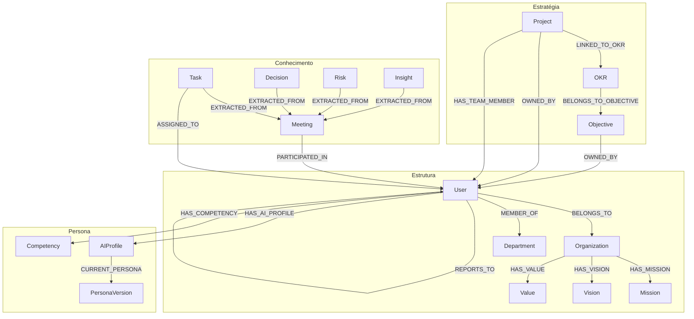

# Inventário de Schema - EKS

> Snapshot: 2026-02-09
> Fonte: Neo4j Aura (produção)

## Métricas Gerais

| Métrica | Valor |
|---------|-------|
| **Total Nodes** | 69 |
| **Total Relationships** | 114 |
| **R/N (rels/nó)** | 1.6522 |
| **Avg Total Degree** | 3.3043 |
| **Labels únicos** | 19 |
| **Relationship Types únicos** | 27 |

---

## Node Labels (19 tipos)

### Core - Estrutura Organizacional
| Label | Descrição | Exemplo |
|-------|-----------|---------|
| `User` | Pessoa na organização | Rodrigo Trindade |
| `Organization` | Empresa/organização | CoCreateAI |
| `Department` | Departamento/área | Diretoria de Tecnologia |
| `ExternalParticipant` | Participante externo (cliente, fornecedor) | - |

### Core - Estratégia
| Label | Descrição | Relacionamentos típicos |
|-------|-----------|------------------------|
| `Objective` | Objetivo estratégico | OKR pertence a ele |
| `OKR` | Key Result mensurável | Ligado a Project |
| `Project` | Projeto/iniciativa | Owned by User, linked to OKR |

### Core - Conhecimento
| Label | Descrição | Relacionamentos típicos |
|-------|-----------|------------------------|
| `Meeting` | Reunião (com transcrição) | Extrai Tasks, Decisions, Insights |
| `Task` | Tarefa extraída | Assigned to User |
| `Decision` | Decisão tomada | Decided by User |
| `Risk` | Risco identificado | Raised by User |
| `Insight` | Insight/aprendizado | Contributed by User |

### Company Profile
| Label | Descrição |
|-------|-----------|
| `Mission` | Missão da organização |
| `Vision` | Visão da organização |
| `Value` | Valor/princípio |

### Onboarding & Persona
| Label | Descrição |
|-------|-----------|
| `FirstRunOnboarding` | Registro do primeiro onboarding |
| `AIProfile` | Perfil de IA do usuário |
| `PersonaVersion` | Versão da persona (histórico) |
| `Competency` | Competência mapeada |

---

## Relationship Types (27 tipos)

### Estrutura Organizacional
| Relationship | Origem → Destino | Descrição |
|--------------|------------------|-----------|
| `BELONGS_TO` | User/Project → Org/Dept | Pertencimento |
| `MEMBER_OF` | User → Department | Membro de departamento |
| `HAS_ACCESS_TO` | User → Department | Acesso a área |
| `REPORTS_TO` | User → User | Hierarquia |
| `HAS_MISSION` | Organization → Mission | - |
| `HAS_VISION` | Organization → Vision | - |
| `HAS_VALUE` | Organization → Value | - |

### Estratégia & Projetos
| Relationship | Origem → Destino | Descrição |
|--------------|------------------|-----------|
| `OWNED_BY` | Project/OKR/Objective → User | Responsável |
| `BELONGS_TO_OBJECTIVE` | OKR → Objective | Hierarquia OKR |
| `LINKED_TO_OKR` | Project → OKR | Projeto apoia OKR |
| `HAS_TEAM_MEMBER` | Project → User | Equipe do projeto |
| `HAS_EXTERNAL_PARTICIPANT` | Project → ExternalParticipant | Participante externo |

### Reuniões & Extração
| Relationship | Origem → Destino | Descrição |
|--------------|------------------|-----------|
| `PARTICIPATED_IN` | User/External → Meeting | Participou da reunião |
| `EXTRACTED_FROM` | Task/Decision/Risk/Insight → Meeting | Extraído da reunião |
| `ASSIGNED_TO` | Task → User | Tarefa atribuída |
| `DECIDED_BY` | Decision → User | Decisão por |
| `RAISED_BY` | Risk → User | Risco levantado por |
| `CONTRIBUTED_BY` | Insight → User | Insight de |
| `MENTIONS` | Meeting → * | Entidade mencionada |

### Onboarding & Persona
| Relationship | Origem → Destino | Descrição |
|--------------|------------------|-----------|
| `COMPLETED_FIRST_RUN_ONBOARDING` | User → FirstRunOnboarding | - |
| `CONFIRMS_POSITION` | FirstRunOnboarding → User | - |
| `HAS_AI_PROFILE` | User → AIProfile | - |
| `INITIATES` | FirstRunOnboarding → AIProfile | - |
| `GENERATES` | * → * | Geração de artefato |
| `CURRENT_PERSONA` | AIProfile → PersonaVersion | Persona atual |
| `HAS_PERSONA_VERSION` | User → PersonaVersion | Histórico |
| `HAS_COMPETENCY` | User → Competency | - |

---

## Diagrama de Schema (simplificado)

---

## Labels por quantidade (estimativa)

> Para números exatos, rodar query de contagem

| Label | Quantidade esperada |
|-------|---------------------|
| User | Alta (base) |
| Department | Média |
| Organization | Baixa (1-2) |
| Project | Média |
| Meeting | Crescente |
| Task | Alta (extraídos) |
| PersonaVersion | Por usuário |

---

## Convenções de Nomenclatura

| Elemento | Convenção | Exemplo |
|----------|-----------|---------|
| Labels | `PascalCase` | `ExternalParticipant` |
| Relationships | `UPPER_SNAKE_CASE` | `BELONGS_TO_OBJECTIVE` |
| Propriedades | `snake_case` | `created_at`, `is_active` |

---

## Próximos Labels (roadmap)

Baseado nas specs do EKS, podem ser adicionados:

- `Document`, `Chunk` (ingestão de documentos)
- `Knowledge` (conhecimento consolidado)
- `Process`, `Activity` (PIA - Process Intelligence)
- `Conversation`, `Message` (histórico de chat)

---

## Referências

- Endpoint: `GET /ontology/stats`
- Endpoint: `GET /ontology/schema`
- Script: `backend/test-neo4j.js`
- Docs: `project-context/database-schema.md`
