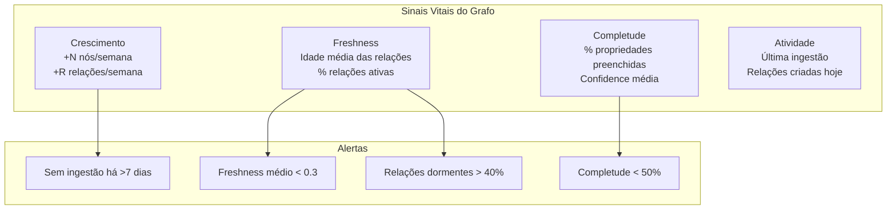

# Monitoramento Temporal e de Propriedades — Teoria

> **Tese central**: Nós representam **estado** (o que existe). Relações representam **momento** (o que está acontecendo agora). Propriedades temporais são o **pulso** do grafo.

---

## 1. A Dualidade Estado vs Momento

### Nós = Estado
Um nó `User "Rodrigo Trindade"` é relativamente estável. Ele existe, tem propriedades fixas (nome, email), e muda raramente. A criação de um nó é um **evento discreto**.

### Relações = Momento
Uma relação `PARTICIPATED_IN` entre User e Meeting é temporal — aconteceu em um momento, tem força variável, e pode perder relevância. A **frequência de criação/modificação** de relações é o verdadeiro indicador de atividade do sistema.

### Propriedades = Pulso
As propriedades temporais (tanto em nós quanto em relações) são o pulso contínuo:
- `created_at` → quando nasceu
- `updated_at` → quando mudou
- `last_accessed_at` → quando foi relevante pela última vez
- `last_interaction_at` (nas relações) → quando a conexão estava viva

**Analogia**: Se o grafo é um corpo, os nós são órgãos, as relações são veias, e as propriedades temporais são os sinais vitais.

---

## 2. O Ouro Escondido nas Propriedades

O EKS define metadados universais extraordinariamente ricos (ver `database-schema.md`):

### 2.1 Metadados de Freshness nos Nós

| Propriedade | O que revela | Monitorar para |
|-------------|-------------|----------------|
| `created_at` | Nascimento | Velocidade de crescimento do grafo |
| `updated_at` | Última mudança | Quais nós estão vivos vs estagnados |
| `last_accessed_at` | Última consulta | Relevância real (alguém usa isso?) |
| `access_count` | Popularidade | Nós mais e menos consultados |
| `relevance_score` | Relevância calculada | Score decaindo = conhecimento ficando velho |
| `freshness_decay_rate` | Velocidade de envelhecimento | Nós com decaimento rápido precisam de refresh |
| `last_validated_at` | Última validação humana | Quanto tempo sem curadoria? |
| `expires_at` | Data de validade | Conhecimento que vai expirar |
| `confidence` | Confiança da extração | Baixa confiança = necessita validação |

### 2.2 Metadados Temporais nas Relações

| Propriedade | O que revela | Monitorar para |
|-------------|-------------|----------------|
| `relationship_strength` | Força da conexão (0-1) | Conexões enfraquecendo vs fortalecendo |
| `interaction_count` | Volume de interações | Relações ativas vs dormentes |
| `last_interaction_at` | Última interação real | Conexões "mortas" (sem interação recente) |
| `relationship_freshness` | Atualidade (0-1) | Quanto a relação ainda é válida? |
| `priority_score` | Importância (0-1) | Priorização de atenção do curador |
| `context` | Contexto da conexão | O "porquê" da relação |

---

## 3. Por que Relações Mudam Mais que Nós

### Ciclo de vida típico

```
Nó (User): Criado → [anos de existência estável] → Raramente deletado
Relação:   Criada → Fortalecida → Enfraquecida → Pode se tornar irrelevante
```

### Razões

1. **Volume**: Cada nó gera N relações. Para 69 nós, temos 114 relações — e esse número cresce mais rápido
2. **Volatilidade**: Pessoas mudam de projeto, participam de novas reuniões, assumem novas tarefas
3. **Temporalidade**: Relações refletem o **presente** (quem está fazendo o quê agora)
4. **Acúmulo**: Relações antigas não desaparecem, mas perdem relevância
5. **Extração contínua**: Cada reunião ingerida gera múltiplas relações novas

### Implicações para monitoramento

| O que monitorar | Por quê | Frequência |
|-----------------|---------|------------|
| Taxa de criação de relações/semana | Velocidade de enriquecimento | Semanal |
| Idade média das relações | Grafo ficando "velho"? | Semanal |
| % relações com `last_interaction_at` > 30 dias | Conexões dormentes | Mensal |
| `relationship_freshness` médio | Saúde temporal global | Semanal |
| Distribuição de `relationship_strength` | Muitas relações fracas = ruído | Mensal |

---

## 4. Ontologia Comparativa de Propriedades

### 4.1 Propriedade x Label (Node)

Cada label tem um perfil de propriedades esperado:

| Label | Propriedades críticas | Indicador de saúde |
|-------|----------------------|---------------------|
| `User` | `current_role`, `expertise_areas`, `current_focus` | Perfil completo? |
| `Meeting` | `date`, `summary`, `processedAt` | Foi processada pela IA? |
| `Task` | `status`, `due_date`, `completed_at` | Concluída no prazo? |
| `Decision` | `rationale`, `impact` | Tem justificativa documentada? |
| `Project` | `status`, `start_date`, `end_date` | Tem datas definidas? |
| `Risk` | `probability`, `mitigation` | Tem plano de mitigação? |

**Monitoramento**: Calcular "completude de propriedades" por label — % de nós que tem todas as propriedades esperadas preenchidas.

### 4.2 Propriedade x Relationship Type

| Relationship | Propriedades temporais esperadas | O que indica |
|--------------|----------------------------------|--------------|
| `PARTICIPATED_IN` | `last_interaction_at`, `interaction_count` | Frequência de participação |
| `MEMBER_OF` | `relationship_strength`, `relationship_freshness` | Está ativo no departamento? |
| `ASSIGNED_TO` | `priority_score`, `context` | Prioridade da tarefa |
| `REPORTS_TO` | `relationship_freshness` | Hierarquia ainda válida? |
| `EXTRACTED_FROM` | `confidence` | Qualidade da extração |
| `MENTIONS` | `interaction_count` | Frequência de menção |

---

## 5. Framework de Monitoramento Temporal

### 5.1 Métricas de "Pulso" (Vitals)



### 5.2 Três Camadas de Monitoramento

#### Camada 1: Estrutural (já temos no OntologyViewer)
- Contagem de nós e relações
- Labels e relationship types
- Taxonomia e tesauro
- Schema patterns

#### Camada 2: Saúde (criado em health-metrics.cypher)
- Distribuição de grau (p50/p90)
- Supernós
- Nós órfãos
- Concentração

#### Camada 3: Temporal (NOVO — este documento)
- Freshness score global
- Velocidade de mudança
- Relações envelhecendo
- Propriedades faltantes
- Confiança média

### 5.3 Fórmulas Propostas

#### Freshness Score Global
```
FreshnessScore = avg(relationship_freshness) * 0.6 + 
                 avg(node_freshness) * 0.4
                 
onde node_freshness = 1 - (dias_desde_updated_at / janela_dias)
```

#### Taxa de Enriquecimento
```
EnrichmentRate = (novos_nós_semana + novas_relações_semana) / total_grafo
```
- `EnrichmentRate < 0.01` → Grafo estagnado
- `EnrichmentRate 0.01-0.05` → Crescimento saudável
- `EnrichmentRate > 0.1` → Crescimento acelerado (verificar qualidade)

#### Índice de Completude
```
CompletenessIndex = avg(propriedades_preenchidas / propriedades_esperadas) por label
```

#### Índice de Confiança
```
ConfidenceIndex = avg(confidence) de todos os nós extraídos por IA
```
- `< 0.5` → Muitas extrações duvidosas, curadoria urgente
- `0.5-0.8` → Normal para domínio dinâmico
- `> 0.8` → Alta confiança (ou pouca diversidade)

---

## 6. A Relação como Indicador de Momento

### O insight fundamental

> **Nós dizem "o que existe". Relações dizem "o que está acontecendo".**

Quando um `User` recebe um novo `ASSIGNED_TO` para um `Task`, isso não muda o User nem o Task. Mas **cria um fato temporal**: "neste momento, esta pessoa assumiu esta responsabilidade".

### Timeline de relações por entidade

Para qualquer nó, você pode construir uma **timeline** baseada nas relações:

```
User "Rodrigo Trindade" — Timeline:
├── 2025-11-15: MEMBER_OF → "Diretoria" (strength: 1.0)
├── 2025-12-01: PARTICIPATED_IN → "Reunião Kickoff" 
├── 2025-12-10: ASSIGNED_TO → "Task: Definir arquitetura"
├── 2026-01-05: PARTICIPATED_IN → "Reunião Status"
├── 2026-01-20: HAS_AI_PROFILE → "Perfil IA criado"
├── 2026-02-01: PARTICIPATED_IN → "Reunião Review"
└── 2026-02-09: Agora → 37 conexões ativas
```

Essa timeline é o **histórico vivo** da entidade no grafo.

### Padrões temporais detectáveis

| Padrão | Detecção | Significado |
|--------|----------|-------------|
| **Burst de relações** | N relações criadas em curto período | Ingestão nova (reunião, projeto) |
| **Silêncio prolongado** | Nenhuma relação nova em >30 dias | Entidade dormente |
| **Decay contínuo** | `relationship_freshness` caindo | Relações perdendo relevância |
| **Hub crescente** | Grau aumentando consistentemente | Supernó em formação |
| **Relação estável** | `strength` constante por meses | Conexão estrutural (ex: MEMBER_OF) |

---

## 7. Propriedades Temporais que Ainda Não Existem (Oportunidades)

O schema define propriedades riquíssimas, mas nem todas estão implementadas no backend atual. Oportunidades:

### Implementar no curto prazo

| Propriedade | Onde | Impacto |
|-------------|------|---------|
| `last_accessed_at` | Todos os nós | Saber o que é realmente usado |
| `access_count` | Todos os nós | Ranking de relevância real |
| `relationship_freshness` | Todas as relações | Score temporal |
| `relationship_strength` | Relações-chave | Força da conexão |

### Implementar no médio prazo

| Propriedade | Onde | Impacto |
|-------------|------|---------|
| `freshness_decay_rate` | Nós dinâmicos | Envelhecimento adaptativo |
| `relevance_score` | Todos os nós | Score composto |
| `expires_at` | Tasks, Decisions, Risks | Validade temporal |
| `last_validated_at` | Nós extraídos por IA | Controle de curadoria |

---

## 8. Proposta de Organização no Frontend

### Aba existente: "Ontologia do Projeto"
Foco: **O QUE existe** (estrutural)
- Visão Geral (totais)
- Taxonomia
- Tesauro
- Fontes de Ingestão
- Schema do Grafo

### Nova aba proposta: "Saúde Ontológica"
Foco: **COMO está** (temporal + qualidade)
- **Dashboard de Vitais**: p50/p90, R/N, freshness, completude
- **Supernós**: Top N mais conectados + tendência
- **Timeline Temporal**: Evolução do grafo ao longo do tempo
- **Propriedades**: Completude por label, confiança média
- **Curadoria**: Fila de itens para revisão humana

### Justificativa para separação

| Critério | Ontologia do Projeto | Saúde Ontológica |
|----------|---------------------|-------------------|
| Pergunta | "O que temos?" | "Como está?" |
| Frequência | Consulta pontual | Monitoramento contínuo |
| Ação | Navegar, entender | Agir, curar, refinar |
| Dados | Estáticos (schema) | Dinâmicos (temporais) |
| Usuário | Qualquer admin | Curador ontológico |

---

## 9. Queries Cypher para Monitoramento Temporal

### Ver arquivo completo: `../queries/temporal-metrics.cypher`

Exemplos de queries que serão necessárias:

```cypher
// Nós criados nos últimos 7 dias
MATCH (n)
WHERE n.createdAt > datetime() - duration('P7D')
   OR n.created_at > datetime() - duration('P7D')
RETURN labels(n)[0] AS tipo, count(*) AS novos
ORDER BY novos DESC;

// Relações mais antigas (candidatas a revisão)
MATCH ()-[r]->()
WHERE r.created_at IS NOT NULL
RETURN type(r) AS tipo, r.created_at AS criado, 
       duration.between(r.created_at, datetime()).days AS dias
ORDER BY dias DESC
LIMIT 20;
```

---

## 10. Conclusão: O Grafo Vivo

O EKS não é um banco de dados estático. É um **organismo vivo** que:
- **Nasce** (ingestão)
- **Cresce** (novas relações)
- **Envelhece** (freshness decai)
- **Precisa de cuidado** (curadoria)
- **Tem sinais vitais** (propriedades temporais)

O monitoramento de propriedades temporais — especialmente nas relações — é o equivalente a colocar um **monitor cardíaco** no grafo. Sem isso, você só sabe que o paciente existe. Com isso, você sabe se ele está saudável.

> "O humano cura. A IA extrai. As propriedades temporais dizem quando curar."

---

## Referências

- Schema completo: `project-context/database-schema.md`
- Métricas de saúde: `./ontological-health.md`
- Guia de curadoria: `./curation-guide.md`
- Queries temporais: `../queries/temporal-metrics.cypher`
- OntologyViewer atual: `frontend/src/components/settings/OntologyViewer.tsx`
