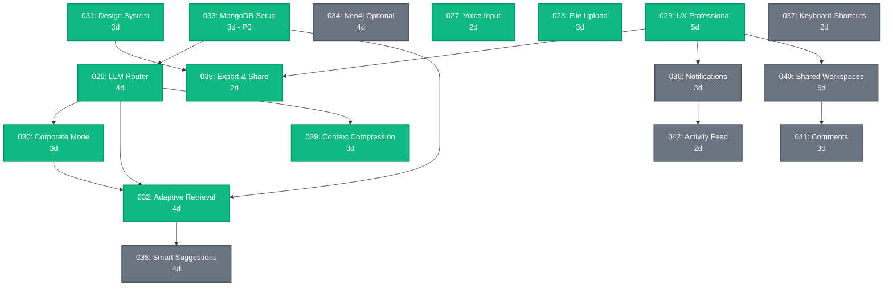

# 📋 Roadmap de Specs - Desdobramento e Refinamento

**Objetivo**: Mapear specs existentes, identificar gaps e priorizar próximas

---

## ✅ Specs Criadas (10 specs - ~48 dias)

| # | Spec | Status | Esforço | Sprint | Dependências |
|---|------|--------|---------|--------|--------------|
| 026 | Intelligent Router | ✅ Spec pronta | 4d | 1 | - |
| 027 | Voice Input | ✅ Spec pronta | 2d | 1 | Azure Speech |
| 028 | File Upload | ✅ Spec pronta | 3d | 1 | Azure Blob + Docling |
| 029 | UX Professional | ✅ Spec pronta | 5d | 2 | - |
| 030 | Corporate Mode | ✅ Spec pronta | 3d | 2 | Spec 026 |
| 031 | Design System | ✅ Spec pronta | 3d | 1 | - |
| 032 | Adaptive Retrieval | ✅ Spec pronta | 4d | 2 | Spec 026, 030 |
| 033 | MongoDB Setup | ✅ Spec pronta | 3d | 1 | - |
| 035 | Export & Share | ✅ Spec pronta | 2d | 2 | Spec 029, 031 |
| 039 | Context Compression | ✅ Spec pronta | 3d | 2 | Spec 026 |

**Total**: 32 dias de implementação

---

## 🎯 Specs por Categoria

### Foundation (Infra + Setup)
- ✅ **Spec 026**: LLM Router (3 níveis potência)
- ✅ **Spec 031**: Design System (identidade adaptável)
- ✅ **Spec 033**: MongoDB + Vector Search (P0 - blocker)
- ⏳ **Spec 034**: Neo4j Integration (planejada)

### Input/Output
- ✅ **Spec 027**: Voice Input (Azure Speech)
- ✅ **Spec 028**: File Upload (Docling + Azure)
- ✅ **Spec 035**: Export/Share (PDF, MD, JSON, links públicos)

### UX/Interface
- ✅ **Spec 029**: UX Professional (layout + adaptação)
- ✅ **Spec 030**: Corporate Mode (toggle + potência)
- ⏳ **Spec 036**: Notification System (planejada)
- ⏳ **Spec 037**: Keyboard Shortcuts (planejada)

### Intelligence
- ✅ **Spec 032**: Adaptive Retrieval (IA decide profundidade)
- ✅ **Spec 039**: Context Compression (rolling summary)
- ⏳ **Spec 038**: Smart Suggestions (planejada)

### Collaboration
- ⏳ **Spec 040**: Shared Workspaces (planejada)
- ⏳ **Spec 041**: Comments & Annotations (planejada)
- ⏳ **Spec 042**: Activity Feed (planejada)

---

## 🔍 Gaps Identificados (7 novas specs propostas)

### Gap 1: Neo4j Interchangeable ⏳
**Spec 034 - Neo4j Integration (Optional)**
- Quando usar Neo4j vs MongoDB
- Cypher queries para navegação de grafo
- Sync strategy (MongoDB ↔ Neo4j)
- Feature flags (enable/disable Neo4j)

**Esforço**: 4 dias | **Priority**: P2 (Sprint 3-4)

---

### Gap 2: Notificações ⏳
**Spec 036 - Notification System**
- In-app notifications (toast/sidebar)
- Email notifications (opcional)
- Filtros (só importante, só tasks, etc)
- Preferências por usuário

**Esforço**: 3 dias | **Priority**: P1 (Sprint 2-3)

---

### Gap 3: Navegação por Teclado ⏳
**Spec 037 - Keyboard Shortcuts**
- Cmd/Ctrl+K: Command palette
- Cmd+N: Nova conversa
- Cmd+/: Toggle chat
- Cmd+B: Toggle sidebar
- Vim-like navigation (h/j/k/l no Canvas)

**Esforço**: 2 dias | **Priority**: P2 (Sprint 3)

---

### Gap 4: Sugestões Inteligentes ⏳
**Spec 038 - Smart Suggestions**
- "Você pode perguntar..." (baseado em contexto)
- "Insights relacionados" (sidebar)
- "Tarefas sugeridas" (baseado em conversa)
- Auto-complete de queries

**Esforço**: 4 dias | **Priority**: P2 (Sprint 3)

---

### Gap 5: Workspaces Compartilhados ⏳
**Spec 040 - Shared Workspaces**
- Workspace = conjunto de conversas/canvas/tasks
- Permissões (owner, editor, viewer)
- Real-time sync (Socket.io)
- Activity log (quem fez o quê)

**Esforço**: 5 dias | **Priority**: P2 (Sprint 3-4)

---

### Gap 6: Comentários e Anotações ⏳
**Spec 041 - Comments & Annotations**
- Comentar em nodes do Canvas
- Destacar texto (highlight)
- Tags/labels customizados
- Threading (replies)

**Esforço**: 3 dias | **Priority**: P2 (Sprint 3)

---

### Gap 7: Activity Feed ⏳
**Spec 042 - Activity Feed**
- Timeline de eventos (msgs, tasks, uploads)
- Filtros (por tipo, por usuário, por data)
- Agrupamento inteligente ("5 msgs na conversa X")
- Unread count

**Esforço**: 2 dias | **Priority**: P1 (Sprint 2)

---

## 🎯 Priorização: Sprints 1-4

### Sprint 1 (2 semanas - Foundation)
**Foco**: Setup infra + features básicas

**Implementar**:
1. ✅ Design System (Spec 031) - 3d
2. ⭐ MongoDB Setup (Spec 033) - 3d **[P0 - BLOCKER]**
3. ✅ Voice Input (Spec 027) - 2d
4. ✅ File Upload (Spec 028) - 3d
5. ✅ LLM Router (Spec 026) - 4d

**Total**: 15 dias (2 semanas com 2 devs)

**Critério de sucesso**:
- MongoDB Atlas configurado com vector search
- Azure services integrados (Speech, Blob)
- Design System aplicado em todos os componentes
- LLM Router funcionando com 3 níveis

---

### Sprint 2 (2 semanas - UX + Intelligence)
**Foco**: UX profissional + features inteligentes

**Implementar**:
1. ✅ UX Professional (Spec 029) - 5d
2. ✅ Corporate Mode (Spec 030) - 3d
3. ✅ Adaptive Retrieval (Spec 032) - 4d
4. ✅ Context Compression (Spec 039) - 3d **[NOVA]**
5. ✅ Export & Share (Spec 035) - 2d **[NOVA]**

**Total**: 17 dias

**Critério de sucesso**:
- Canvas profissional e navegável
- Toggle corporativo/pessoal funcionando
- IA decide profundidade automaticamente
- Conversas longas não estouram token limit
- Export PDF/MD funcionando

---

### Sprint 3 (2 semanas - Collaboration)
**Foco**: Features colaborativas + polish

**Implementar**:
1. ⏳ Notification System (Spec 036) - 3d
2. ⏳ Activity Feed (Spec 042) - 2d
3. ⏳ Keyboard Shortcuts (Spec 037) - 2d
4. ⏳ Smart Suggestions (Spec 038) - 4d
5. ⏳ Comments & Annotations (Spec 041) - 3d

**Total**: 14 dias

**Critério de sucesso**:
- Notificações in-app funcionando
- Activity feed com timeline
- Atalhos de teclado implementados
- IA sugere próximas ações proativamente

---

### Sprint 4 (2 semanas - Advanced + Neo4j)
**Foco**: Features avançadas + opcional Neo4j

**Implementar**:
1. ⏳ Shared Workspaces (Spec 040) - 5d
2. ⏳ Neo4j Integration (Spec 034) - 4d **[OPCIONAL]**
3. Testing + Fixes - 3d
4. Documentation - 2d

**Total**: 14 dias

**Critério de sucesso**:
- Workspaces compartilhados funcionando
- Neo4j integrado (se escolhido)
- Cobertura de testes >80%
- Docs completas

---

## 📊 Resumo Quantitativo

### Specs por Status

- ✅ **Criadas e prontas**: 10 specs (32 dias)
- ⏳ **Propostas para criar**: 7 specs (23 dias)
- **Total roadmap**: 17 specs (~55 dias)

### Distribuição por Categoria

| Categoria | Specs | Dias |
|-----------|-------|------|
| Foundation | 4 | 13d |
| Input/Output | 3 | 7d |
| UX/Interface | 5 | 15d |
| Intelligence | 3 | 11d |
| Collaboration | 3 | 10d |
| **TOTAL** | **18** | **56d** |

### Por Prioridade

- **P0 (Blocker)**: 1 spec (MongoDB - 3d)
- **P1 (MVP crítico)**: 9 specs (27d)
- **P2 (Melhoria)**: 8 specs (26d)

---

## 🎨 Mapa Visual de Specs



**Legenda**:
- 🟢 Verde: Spec criada (pronta para implementar)
- ⚪ Cinza: Spec proposta (precisa ser criada)

---

## 🔄 Ciclo Spec-Driven Development

```
┌─────────────────────────────────────────┐
│ 1. IDENTIFY GAP                        │
│    Usuário/Dev descobre necessidade    │
└─────────────┬───────────────────────────┘
              ↓
┌─────────────────────────────────────────┐
│ 2. CREATE SPEC                         │
│    Documentar O QUE e POR QUE          │
│    (não COMO ainda)                    │
└─────────────┬───────────────────────────┘
              ↓
┌─────────────────────────────────────────┐
│ 3. REVIEW & REFINE                     │
│    Stakeholders validam                │
│    Identificar dependências            │
└─────────────┬───────────────────────────┘
              ↓
┌─────────────────────────────────────────┐
│ 4. PRIORITIZE                          │
│    Encaixar em sprint                  │
│    Baseado em valor/esforço            │
└─────────────┬───────────────────────────┘
              ↓
┌─────────────────────────────────────────┐
│ 5. SIMULATE (opcional)                 │
│    Mock implementation                 │
│    Validar UX antes de implementar     │
└─────────────┬───────────────────────────┘
              ↓
┌─────────────────────────────────────────┐
│ 6. IMPLEMENT                           │
│    Dev implementa baseado na spec      │
└─────────────┬───────────────────────────┘
              ↓
┌─────────────────────────────────────────┐
│ 7. VALIDATE                            │
│    Spec foi suficiente?                │
│    Atualizar spec com learnings        │
└─────────────┬───────────────────────────┘
              ↓
┌─────────────────────────────────────────┐
│ 8. ITERATE                             │
│    Próxima spec ou refinamento         │
└─────────────────────────────────────────┘
```

---

## 🎯 Próximas Ações

### Imediato (esta semana)
- [ ] **Simular frontend** com mock data (guia: `SIMULACAO-MOCK.md`)
- [ ] **Review specs 026-033** com time técnico
- [ ] **Configurar MongoDB Atlas** cluster (Spec 033)

### Sprint 1 (próximas 2 semanas)
- [ ] Implementar Spec 033 (MongoDB) - P0 blocker
- [ ] Implementar Spec 031 (Design System)
- [ ] Implementar Spec 026 (LLM Router)
- [ ] Implementar Spec 027 (Voice Input)
- [ ] Implementar Spec 028 (File Upload)

### Backlog (Sprint 2-4)
- [ ] Criar specs faltantes (036, 037, 038, 040, 041, 042)
- [ ] Implementar Sprint 2 (UX + Intelligence)
- [ ] Implementar Sprint 3 (Collaboration)
- [ ] Implementar Sprint 4 (Advanced + Neo4j opcional)

---

## 📐 Decisões Arquiteturais (Constitution)

### Persistência
- ✅ **MongoDB Atlas** como banco principal (Spec 033)
- ⏳ **Neo4j** opcional/interchangeable (Spec 034)
- ✅ **Redis** para cache (summaries, embeddings)

### AI/LLM
- ✅ **Azure OpenAI** (GPT-4o + embeddings)
- ✅ **LLM Router** com 3 níveis de potência (Spec 026)
- ✅ **Adaptive Retrieval** (IA decide profundidade - Spec 032)
- ✅ **Context Compression** (rolling summary - Spec 039)

### Frontend
- ✅ **Next.js 14** + React 18
- ✅ **Design System adaptável** por empresa (Spec 031)
- ✅ **UX Professional** (Spec 029)
- ✅ **Mock data** para simulação (`SIMULACAO-MOCK.md`)

### Collaboration
- ⏳ **Socket.io** para real-time (Spec 040)
- ⏳ **Notification System** (Spec 036)
- ⏳ **Activity Feed** (Spec 042)

---

## 📊 Métricas de Progresso

### Spec Coverage

```
Foundation:    ███████░░░  75% (3/4 specs)
Input/Output:  ██████████ 100% (3/3 specs)
UX/Interface:  ████░░░░░░  40% (2/5 specs)
Intelligence:  ██████░░░░  67% (2/3 specs)
Collaboration: ░░░░░░░░░░   0% (0/3 specs)

OVERALL:       ██████░░░░  59% (10/17 specs)
```

### Sprint Readiness

**Sprint 1**: ✅ 100% specs prontas (5/5)  
**Sprint 2**: ✅ 100% specs prontas (5/5)  
**Sprint 3**: ⏳ 0% specs prontas (0/5 - precisam ser criadas)  
**Sprint 4**: ⏳ 0% specs prontas (0/2 - precisam ser criadas)

---

## 🎓 Learnings & Best Practices

### O Que Funcionou Bem

1. **Spec-Driven**: Especificar ANTES de implementar evita retrabalho
2. **Mock Data**: Permite validar UX sem depender de infra
3. **Modularidade**: Specs independentes podem ser implementadas em paralelo
4. **Dependencies claras**: Saber o que bloqueia o quê ajuda priorização

### Próximas Melhorias

1. **Templates de Spec**: Padronizar formato (já temos padrão emergente)
2. **Diagramas obrigatórios**: Toda spec deve ter flow Mermaid
3. **Critérios de aceitação**: Mais explícitos (done = quando?)
4. **Testing strategy**: Expandir exemplos de testes em cada spec

---

**Status**: 📋 Roadmap completo com 10 specs prontas + 7 propostas  
**Próxima ação**: Simular frontend com mock data ou iniciar Sprint 1
