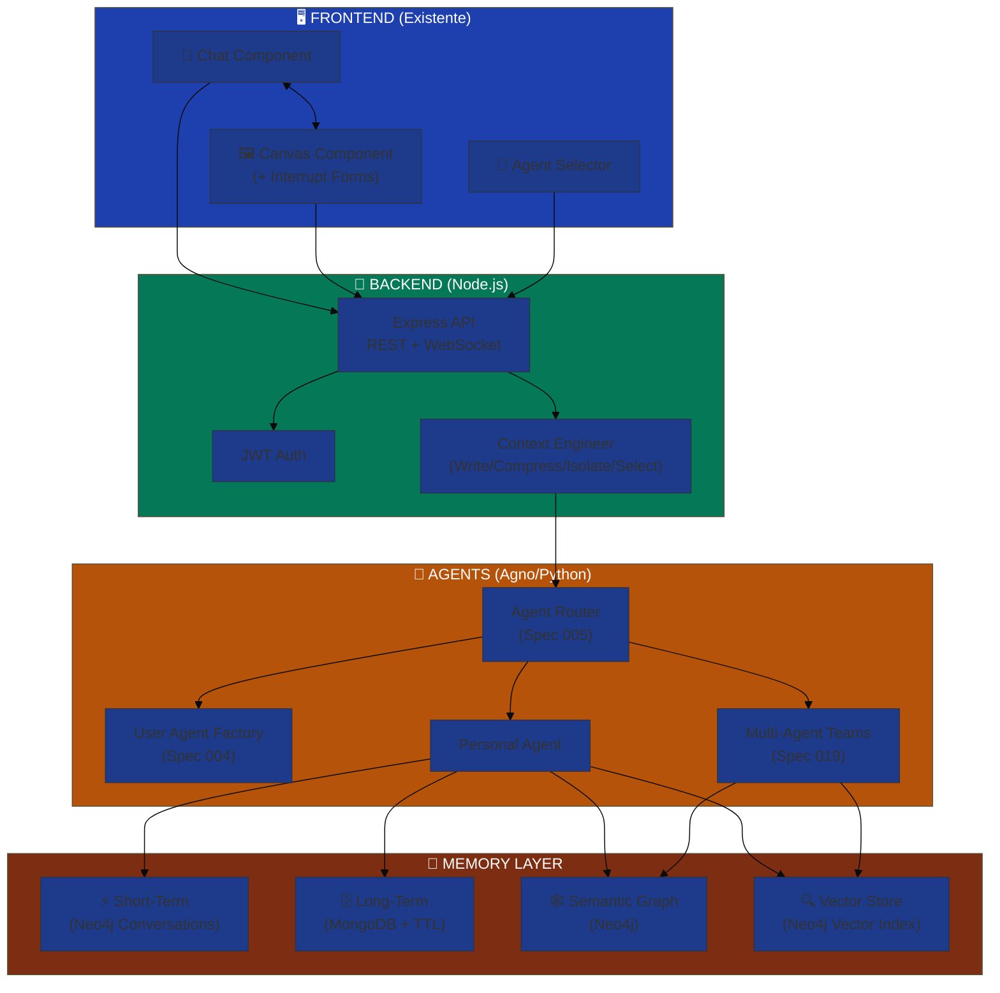

# 📊 EKS - Análise Consolidada: Estado Atual vs Pesquisas

**Data**: 13/12/2024  
**Objetivo**: Consolidar projeto EKS existente com pesquisas sobre Canvas, GraphRAG, Context Engineering e Memory Systems

---

## 1. Estado Atual do Projeto EKS

### ✅ O Que Já Existe

#### **Frontend** (Next.js 14 + React 18)
```
✅ Estrutura completa criada
✅ Components: Chat, Canvas, Agent Selector, Mobile Nav
✅ Store (Zustand) para state management
✅ Radix UI + Tailwind CSS
✅ Package.json configurado
```

#### **Backend** (Node.js 20 + TypeScript)
```
⚙️ Estrutura inicial criada
⚙️ Express + Socket.io configurado
⚙️ Neo4j driver instalado
⚙️ JWT + bcrypt setup
⚙️ Estrutura de pastas definida
❌ Endpoints ainda não implementados
❌ Agent communication não conectado
```

#### **Especificações** (25 specs criadas)
```
001 - Knowledge Pipeline
002 - Admin Node Manager
003 - Admin Login Config
004 - User Agent Factory
005 - Agent Router
007 - Chat Knowledge Capture
009 - User Memory Decision
015 - Neo4j Graph Model
016 - Main Interface Layout
017 - Memory Ecosystem
018 - Observability Dashboard
019 - Multi-Agent Orchestration
022 - Onboarding AI Profile
024 - Retrieval Orchestration
025 - Conversation Persistence System
... e 10 outras
```

#### **Plano MVP** (9-10 semanas)
```
✅ Phase 1: Backend Foundation (semanas 1-2)
✅ Phase 2: Agent System (semanas 3-4)
✅ Phase 3: Core Features (semanas 5-7)
✅ Phase 4: Advanced Features (semanas 8-9)
✅ Phase 5: Polish & Testing (semana 10)
```

---

## 2. Comparação: EKS vs Pesquisas (Melhores Práticas)

### 🎨 Canvas Pattern

| Aspecto | EKS Atual | Pesquisa (Vercel/LangGraph) | Recomendação |
|---------|-----------|------------------------------|--------------|
| **Canvas UI** | ✅ Já existe no frontend | ✅ Persistent workspace | **MANTER** estrutura atual |
| **Human-in-Loop** | ❌ Não implementado | ✅ Interrupt mechanism (LangGraph) | **ADICIONAR** interrupts para input estruturado |
| **State Management** | ✅ Zustand | ✅ Canvas state independente | **VALIDAR** se Zustand suporta canvas + chat sync |
| **Interatividade** | 🤔 A definir | ✅ Canvas pode solicitar input | **IMPLEMENTAR** forms dinâmicos no canvas |

**Ação**: Integrar LangGraph Interrupt pattern no Agent Router (spec 005)

---

### 🧠 Memory System

| Aspecto | EKS Atual | Pesquisa (MongoDB+LangGraph) | Recomendação |
|---------|-----------|------------------------------|--------------|
| **Short-Term** | ⚙️ Planejado (Conversation nodes) | ✅ Thread-scoped checkpoints | **IMPLEMENTAR** checkpoints no Neo4j ou Redis |
| **Long-Term** | ⚙️ Planejado (Memory Ecosystem - spec 017) | ✅ MongoDB Store (cross-thread) | **CONSIDERAR** MongoDB para long-term memory + Neo4j para graph |
| **Memory Decay** | ✅ Planejado (`memory_level`) | ✅ TTL indexes | **IMPLEMENTAR** TTL no Neo4j ou job periódico |
| **Namespace** | ❌ Não especificado | ✅ Namespace + key-value | **ADICIONAR** `namespace` property nos nodes |

**Ação**: Híbrido Neo4j (graph) + MongoDB (long-term memory com TTL)

---

### 🕸️ Semantic Graph como Camada ANTES do RAG

| Aspecto | EKS Atual | Pesquisa (Context Engineering) | Recomendação |
|---------|-----------|--------------------------------|--------------|
| **Grafo semântico** | ✅ Neo4j como core | ✅ Semantic Layer | **PERFEITO ALINHAMENTO** |
| **Vector Search** | ⚙️ Planejado (spec 024) | ✅ Híbrido graph + vector | **IMPLEMENTAR** Neo4j Vector Index |
| **Context Engineering** | ❌ Não formalizado | ✅ Write/Compress/Isolate/Select | **FORMALIZAR** no Agent Router |
| **Retrieval Strategy** | ⚙️ Planejado (spec 024) | ✅ Multi-tool (graph/vector/grep/relational) | **EXPANDIR** Retrieval Orchestration |

**Ação**: Agent Router deve implementar os 4 pilares de Context Engineering

---

### 🤖 Agent Architecture

| Aspecto | EKS Atual | Pesquisa (LangGraph + Multi-Agent) | Recomendação |
|---------|-----------|-----------------------------------|--------------|
| **Framework** | ✅ Agno (Python) | 🤔 LangGraph é mais maduro | **AVALIAR** migração Agno → LangGraph |
| **Orchestration** | ✅ Agent Router (spec 005) | ✅ State Machine (LangGraph) | **CONSIDERAR** LangGraph para orchestration |
| **Multi-Agent** | ✅ Teams planejado (spec 019) | ✅ Hierarchical agents | **IMPLEMENTAR** hierarquia Operational→Strategic |
| **Human-in-Loop** | ❌ Não especificado | ✅ Interrupts + Canvas | **ADICIONAR** interrupt handling |

**Ação**: Prototipar com Agno primeiro, avaliar LangGraph depois

---

### 🔐 Multi-Tenancy / Namespace

| Aspecto | EKS Atual | Pesquisa (Neo4j Composite DB) | Recomendação |
|---------|-----------|-------------------------------|--------------|
| **Isolamento** | ✅ `organizationType` (user level) | ✅ Single Graph + Label/Property | **MANTER** single graph |
| **Namespace** | ❌ Não formalizado | ✅ `namespace` property | **ADICIONAR** namespace nos nodes |
| **Hierarquia** | ✅ Planejado (validade hierárquica) | ✅ Role-based filtering | **IMPLEMENTAR** role filtering em queries |

**Ação**: Adicionar `namespace` property em todos os nodes principais

---

## 3. Gaps Identificados (EKS vs Melhores Práticas)

### 🔴 Gaps Críticos

1. **Human-in-Loop Mechanism** (P0)
   - **Gap**: Não há interrupt handling para solicitar input estruturado
   - **Impacto**: Canvas não pode solicitar formulários/decisões ao usuário
   - **Solução**: Implementar LangGraph Interrupt pattern ou equivalente Agno

2. **Context Engineering Formalizado** (P0)
   - **Gap**: Não há estratégia clara de Write/Compress/Isolate/Select
   - **Impacto**: Memória e contexto podem crescer sem controle
   - **Solução**: Formalizar no Agent Router (spec 005)

3. **Memory Namespace** (P0)
   - **Gap**: Falta namespace para isolar memórias (user/team/company)
   - **Impacto**: Risco de vazamento de contexto entre usuários
   - **Solução**: Adicionar `namespace` property

### 🟡 Gaps Importantes

4. **Long-Term Memory Storage** (P1)
   - **Gap**: Neo4j pode não ser ideal para cross-thread memory com TTL
   - **Impacto**: Performance e gestão de memória
   - **Solução**: Adicionar MongoDB para long-term memory

5. **WebSocket Real-Time** (P1)
   - **Gap**: Socket.io está instalado mas não integrado
   - **Impacto**: Latência em chat real-time
   - **Solução**: Implementar streaming na Phase 1

6. **Vector Search** (P1)
   - **Gap**: Spec 024 planeja, mas não especifica Neo4j Vector Index
   - **Impacto**: RAG menos eficiente
   - **Solução**: Usar Neo4j 5.x Vector Index

### 🟢 Gaps Desejáveis

7. **Agno vs LangGraph** (P2)
   - **Gap**: Agno é menos maduro que LangGraph
   - **Impacto**: Menos community support, docs
   - **Solução**: Prototipar Agno, avaliar LangGraph depois

8. **Observability** (P2)
   - **Gap**: Spec 018 existe, mas métricas não estão conectadas
   - **Impacto**: Difícil debugar agents
   - **Solução**: Implementar logging estruturado desde Phase 1

---

## 4. Arquitetura Consolidada (EKS + Pesquisas)



---

## 5. Recomendações Priorizadas

### 🎯 Sprint 1 Revisado (2 semanas)

**Objetivo**: MVP funcional com Canvas + Chat + Neo4j + Context Engineering

#### Semana 1: Backend + Memory Foundation
```
✅ 1.1 Setup Backend completo
✅ 1.2 Neo4j integration + namespace property
✅ 1.3 Auth endpoints (spec 003)
✅ 1.4 WebSocket setup
🆕 1.5 Adicionar MongoDB long-term memory (opcional)
```

#### Semana 2: Agents + Canvas Interaction
```
✅ 2.1 Agent Server setup (Agno)
✅ 2.2 Personal Agent MVP
✅ 2.3 Agent Router com Context Engineering
🆕 2.4 Human-in-Loop interrupts
✅ 2.5 Frontend-backend integration
```

### 📋 Refinamentos Necessários

#### Spec 005 (Agent Router) - ADICIONAR:
```yaml
context_engineering:
  write:
    - Persistir informação entre tasks (MongoDB long-term)
  compress:
    - Sumarizar contexto quando > 8k tokens
    - Podar mensagens antigas (keep insights)
  isolate:
    - Dividir contexto entre agents (multi-agent teams)
  select:
    - Escolher strategy: graph, vector, grep, relational
    - Re-ranking antes de enviar ao LLM
```

#### Spec 017 (Memory Ecosystem) - ADICIONAR:
```yaml
namespace_strategy:
  levels:
    - global: System-wide knowledge
    - company: Organization-specific
    - team: Team-scoped
    - user: Personal memory
  
  storage:
    short_term: Neo4j Conversations (session)
    medium_term: Neo4j Knowledge nodes (decay)
    long_term: MongoDB Store (cross-thread, TTL)
```

#### Spec 025 (Conversation Persistence) - ADICIONAR:
```yaml
checkpoints:
  provider: redis  # ou Neo4j
  frequency: every_message
  retention: 7_days
  
interrupts:
  enabled: true
  types:
    - form_input: Canvas renders form
    - confirmation: User confirms action
    - clarification: Agent asks question
```

---

## 6. Tech Stack Ajustado

### Stack Atual (Mantém)
```yaml
Frontend:
  framework: Next.js 14
  ui: React 18 + Radix UI + Tailwind
  state: Zustand
  
Backend:
  runtime: Node.js 20
  framework: Express
  auth: JWT + bcrypt
  websocket: Socket.io
  
Agents:
  language: Python 3.11
  framework: Agno
  llm: Azure OpenAI
  
Database:
  primary: Neo4j Aura
```

### Adições Recomendadas
```yaml
Memory:
  short_term: Neo4j + Redis (checkpoints)
  long_term: MongoDB Atlas (cross-thread, TTL)
  
Vector:
  provider: Neo4j Vector Index (5.x)
  embeddings: Azure OpenAI text-embedding-3
  
Observability:
  logging: Winston (structured)
  metrics: Prometheus + Grafana (future)
  tracing: OpenTelemetry (future)
```

---

## 7. Modelo de Dados Expandido

### Adicionar Namespace Property

```cypher
// User (existente + namespace)
(:User {
  id: uuid,
  email: string,
  organizationType: "cocreate" | "cvc" | "startup",
  namespace: string  // 🆕 "global" | "company:ABC" | "team:XYZ" | "user:123"
})

// Knowledge (existente + namespace)
(:Knowledge {
  id: uuid,
  content: text,
  visibility: "personal" | "team" | "company",
  namespace: string,  // 🆕 Isola por contexto
  memory_level: "short" | "medium" | "long",
  expires_at: datetime?
})

// Conversation (adicionar checkpoint_id)
(:Conversation {
  id: uuid,
  userId: uuid,
  checkpoint_id: string?,  // 🆕 Redis checkpoint reference
  persistence_policy: "full" | "insights_only" | "ephemeral"
})
```

---

## 8. Próximos Passos Imediatos

### 🚀 Ações Para HOJE

1. **Refinar Spec 005 (Agent Router)**
   ```bash
   # Adicionar Context Engineering (4 pilares)
   # Adicionar Interrupt Handling
   ```

2. **Refinar Spec 017 (Memory Ecosystem)**
   ```bash
   # Adicionar Namespace strategy
   # Adicionar MongoDB long-term
   ```

3. **Refinar Spec 025 (Conversation Persistence)**
   ```bash
   # Adicionar Checkpoint mechanism
   # Adicionar Interrupt types
   ```

4. **Atualizar MVP Plan**
   ```bash
   # Incluir MongoDB setup (Phase 1)
   # Incluir Interrupt implementation (Phase 2)
   # Incluir Neo4j Vector Index (Phase 3)
   ```

### 📊 Atualizar Diagramas

- [ ] Diagrama de Memory Layers (Neo4j + MongoDB + Redis)
- [ ] Fluxo de Context Engineering
- [ ] Interrupt Handling Sequence
- [ ] Namespace Isolation Strategy

---

## 9. Comparação Final: Gap Analysis

| Feature | EKS Planejado | Pesquisas | Status | Ação |
|---------|---------------|-----------|--------|------|
| **Canvas Pattern** | ✅ UI exists | ✅ Best practices | 🟡 Falta interrupts | Adicionar |
| **Memory Short-Term** | ✅ Neo4j | ✅ Checkpoints | 🟡 Falta Redis | Adicionar |
| **Memory Long-Term** | ✅ Neo4j | ✅ MongoDB+TTL | 🔴 Não planejado | Adicionar |
| **Context Engineering** | ❌ Não formalizado | ✅ 4 pilares | 🔴 Crítico | Criar |
| **Namespace** | ❌ Não existe | ✅ Essencial | 🔴 Crítico | Adicionar |
| **Vector Search** | ✅ Planejado | ✅ Neo4j native | 🟡 Especificar | Detalhar |
| **Human-in-Loop** | ❌ Não especificado | ✅ Interrupts | 🔴 Crítico | Criar |
| **Multi-Agent** | ✅ Spec 019 | ✅ Hierarchical | 🟢 Alinhado | OK |
| **Agno Framework** | ✅ Escolhido | 🤔 LangGraph melhor? | 🟡 Avaliar | Prototipar |

**Legenda**:
- 🟢 Alinhado e OK
- 🟡 Precisa refinamento
- 🔴 Gap crítico a resolver

---

## 10. Conclusão

### ✅ Pontos Fortes do EKS
1. Estrutura completa e bem pensada (25 specs!)
2. Frontend já implementado
3. Neo4j como semantic layer (perfeito alinhamento com pesquisas)
4. Plano MVP claro e executável

### 🔧 Ajustes Necessários (Baseado em Pesquisas)
1. **Adicionar Human-in-Loop** (interrupts para Canvas)
2. **Formalizar Context Engineering** (4 pilares no Agent Router)
3. **Implementar Namespace** (isolamento de memória)
4. **Híbrido Memory** (Neo4j + MongoDB + Redis)
5. **Neo4j Vector Index** (GraphRAG híbrido)

### 🎯 Recomendação Final

**MANTER** a estrutura EKS atual e **ADICIONAR** os refinamentos identificados nas pesquisas.

O projeto está **85% alinhado** com as melhores práticas. Os 15% faltantes são:
- Context Engineering formalizado
- Human-in-Loop mechanism
- Namespace isolation
- Long-term memory (MongoDB)

---

**Próximo Comando**: `/speckit-specify` para refinar specs 005, 017, 025 com os novos aprendizados
