# EKS - API Design & Router Strategies

**Created**: 2024-12-13  
**Purpose**: Definir estratégias de routing (Agent, LLM, Context Depth)

---

## I. Context Depth Control

### Conceito

Permitir ao usuário (ou sistema aprender) a **profundidade de contexto** necessária para responder uma query.

### Níveis de Profundidade

```yaml
Level 1 - Surface (Rápido):
  latency: ~500ms
  tokens: ~500
  scope: Resposta direta sem contexto profundo
  use_case: Perguntas factuais simples
  example: "Qual o status da startup X?"

Level 2 - Contextual (Balanceado):
  latency: ~2s
  tokens: ~2000
  scope: + Histórico recente + Relacionamentos diretos
  use_case: Decisões com contexto imediato
  example: "Por que rejeitamos a startup X?"

Level 3 - Deep Corporate (Profundo):
  latency: ~5s
  tokens: ~8000
  scope: + Todo histórico + Decisões similares + Estratégia
  use_case: Decisões estratégicas, auditorias
  example: "Como nossa tese de HealthTech evoluiu nos últimos 2 anos?"
```

### API Endpoint

```typescript
POST /chat/query
{
  "message": "Por que rejeitamos a startup X?",
  "depth_level": 1 | 2 | 3 | "auto",
  "max_tokens": number,
  "user_id": string
}

Response:
{
  "answer": string,
  "depth_used": number,
  "tokens_used": number,
  "latency_ms": number,
  "context_sources": [
    {
      "type": "conversation" | "document" | "knowledge",
      "id": string,
      "relevance_score": float
    }
  ]
}
```

### Auto Learning

```typescript
// Sistema aprende preferências do usuário
POST /user/preferences/depth-learning
{
  "user_id": string,
  "query_type": "factual" | "decision" | "strategic",
  "preferred_depth": number,
  "feedback": "too_shallow" | "too_deep" | "just_right"
}

// Neo4j armazena
(:User)-[:PREFERS_DEPTH {
  query_type: "decision",
  depth: 2,
  confidence: 0.85,
  learned_from_interactions: 15
}]->(:ContextStrategy)
```

---

## II. LLM Router (Model Selection)

### Estratégia de Seleção


### Query Classification

```typescript
interface QueryClassification {
  type: "factual" | "reasoning" | "code" | "creative" | "strategic";
  complexity: 1 | 2 | 3 | 4 | 5;
  estimated_tokens: number;
  requires_tools: boolean;
  requires_multi_agent: boolean;
}

// Classificador rápido (GPT-4o-mini)
const classifyQuery = async (query: string): Promise<QueryClassification> => {
  const prompt = `Classify this query:
Query: "${query}"

Return JSON:
{
  "type": "factual" | "reasoning" | "code" | "creative" | "strategic",
  "complexity": 1-5,
  "estimated_tokens": number,
  "requires_tools": boolean,
  "requires_multi_agent": boolean
}`;
  
  // GPT-4o-mini ($0.15/1M tokens)
  const result = await openai.chat.completions.create({
    model: "gpt-4o-mini",
    messages: [{role: "system", content: prompt}]
  });
  
  return JSON.parse(result.choices[0].message.content);
};
```

### Model Selection Logic

```typescript
const selectModel = (classification: QueryClassification): string => {
  // Reasoning profundo
  if (classification.complexity >= 4 && classification.type === "reasoning") {
    return "o1-preview"; // $15/1M input
  }
  
  // Código
  if (classification.type === "code") {
    return "claude-3-sonnet"; // $3/1M input
  }
  
  // Estratégico + multi-agent
  if (classification.type === "strategic" && classification.requires_multi_agent) {
    return "gpt-4o"; // $5/1M input
  }
  
  // Simples/Factual
  if (classification.complexity <= 2) {
    return "gpt-4o-mini"; // $0.15/1M input
  }
  
  // Default balanceado
  return "gpt-4o";
};
```

### API Endpoint

```typescript
POST /llm/route
{
  "query": string,
  "context": string[],
  "user_preferences": {
    "prefer_cost": boolean,
    "prefer_speed": boolean,
    "prefer_quality": boolean
  }
}

Response:
{
  "selected_model": "gpt-4o-mini" | "gpt-4o" | "o1-preview" | "claude-3-sonnet",
  "classification": QueryClassification,
  "estimated_cost_usd": number,
  "estimated_latency_ms": number,
  "reasoning": string
}
```

---

## III. Agent Router (Existing Spec 005)

### Atualização da Spec 005

Adicionar **LLM Router** como sub-componente:

```mermaid
graph TD
    UserQuery["📝 User Query"] --> AgentRouter["🔀 Agent Router<br/>(Spec 005)"]
    
    AgentRouter --> LLMRouter["🤖 LLM Router<br/>(NEW)"]
    AgentRouter --> AgentSelector["👤 Agent Selector"]
    
    LLMRouter --> ModelA["Model A"]
    LLMRouter --> ModelB["Model B"]
    
    AgentSelector --> PersonalAgent["Personal Agent"]
    AgentSelector --> TaskAgent["Task Agent"]
    
    style AgentRouter fill:#dc2626,color:#fff
    style LLMRouter fill:#f59e0b,color:#fff
```



### Integration Flow

```typescript
// Agent Router (Spec 005) + LLM Router
const handleQuery = async (query: string, userId: string) => {
  // 1. Classify query
  const classification = await classifyQuery(query);
  
  // 2. Get user depth preference (auto or manual)
  const depthPreference = await getUserDepthPreference(userId, classification.type);
  
  // 3. Retrieve context based on depth
  const context = await retrieveContext(query, depthPreference.depth);
  
  // 4. Select LLM model
  const model = selectModel(classification);
  
  // 5. Select agent (if multi-agent needed)
  const agent = classification.requires_multi_agent
    ? await selectAgent(query, classification)
    : null;
  
  // 6. Execute
  const response = await executeQuery({
    query,
    context,
    model,
    agent,
    depth: depthPreference.depth
  });
  
  // 7. Learn from interaction
  await recordInteraction(userId, {
    query,
    depth_used: depthPreference.depth,
    model_used: model,
    latency: response.latency,
    tokens: response.tokens,
    user_satisfaction: response.feedback
  });
  
  return response;
};
```

---

## IV. API Gateway Structure

### Core Endpoints

```yaml
# Chat & Query
POST   /chat/query                    # Main chat endpoint (with depth + model routing)
POST   /chat/stream                   # Streaming chat
GET    /chat/history/:conversationId

# Agent Management
POST   /agents/invoke                 # Invoke specific agent
GET    /agents/available              # List available agents
POST   /agents/route                  # Route to best agent

# LLM Routing
POST   /llm/route                     # Select best model
POST   /llm/classify                  # Classify query
GET    /llm/models                    # List available models

# Context & Memory
POST   /context/retrieve              # Retrieve context by depth
GET    /context/depth-preference/:userId
PUT    /context/depth-preference/:userId
POST   /memory/save                   # Save to long-term memory

# Knowledge
POST   /knowledge/ingest              # Ingest document/data
GET    /knowledge/search              # Semantic search
POST   /knowledge/curate              # Trigger curation

# User Preferences
GET    /user/:userId/preferences
PUT    /user/:userId/preferences
POST   /user/:userId/learn-depth      # Depth learning feedback

# Admin
POST   /admin/users                   # Create user
GET    /admin/analytics               # System analytics
GET    /admin/costs                   # LLM cost tracking
```

### OpenAPI Spec Structure

```yaml
openapi: 3.1.0
info:
  title: EKS API
  version: 1.0.0
  description: Enterprise Knowledge System API

servers:
  - url: http://localhost:3001
    description: Development
  - url: https://api.eks.cocreateai.com.br
    description: Production

paths:
  /chat/query:
    post:
      summary: Send query with depth and model routing
      tags: [Chat]
      requestBody:
        required: true
        content:
          application/json:
            schema:
              $ref: '#/components/schemas/ChatQueryRequest'
      responses:
        '200':
          description: Successful response
          content:
            application/json:
              schema:
                $ref: '#/components/schemas/ChatQueryResponse'

components:
  schemas:
    ChatQueryRequest:
      type: object
      required: [message, user_id]
      properties:
        message:
          type: string
        user_id:
          type: string
        depth_level:
          type: integer
          enum: [1, 2, 3]
          default: 2
        model_preference:
          type: string
          enum: [auto, gpt-4o-mini, gpt-4o, o1-preview, claude-3-sonnet]
          default: auto
        max_tokens:
          type: integer
          default: 4000
```

---

## V. Implementation Roadmap

### Phase 1: Context Depth (Sprint 2)
- [ ] Implement depth retrieval logic
- [ ] Store user preferences in Neo4j
- [ ] Learning algorithm for auto depth

### Phase 2: LLM Router (Sprint 3)
- [ ] Query classifier (GPT-4o-mini)
- [ ] Model selection logic
- [ ] Cost tracking

### Phase 3: Integration (Sprint 4)
- [ ] Integrate Agent Router + LLM Router
- [ ] Unified API Gateway
- [ ] Analytics dashboard

---

## VI. Metrics to Track

```typescript
interface RouterMetrics {
  // Context Depth
  avg_depth_used: number;
  depth_satisfaction_rate: number;
  depth_learning_accuracy: number;
  
  // LLM Router
  model_distribution: {
    [model: string]: number; // percentage
  };
  avg_cost_per_query: number;
  cost_savings_vs_always_gpt4o: number;
  
  // Performance
  avg_latency_by_depth: {
    [depth: number]: number; // ms
  };
  avg_latency_by_model: {
    [model: string]: number; // ms
  };
}
```

---

## VII. Nova Spec Sugerida

### Spec 026: Intelligent Router System

**Título**: Sistema de Roteamento Inteligente (LLM + Context Depth)

**Objetivo**: Otimizar custo, latência e qualidade de resposta através de:
1. Seleção automática de modelo LLM
2. Profundidade de contexto ajustável
3. Aprendizado de preferências do usuário

**Prioridade**: Sprint 3 (após Agent Router básico)

**Dependencies**:
- Spec 005 (Agent Router) - MUST
- Spec 017 (Memory Ecosystem) - MUST
- Spec 024 (Retrieval Orchestration) - SHOULD

---

**Insights do usuário capturados** ✅
