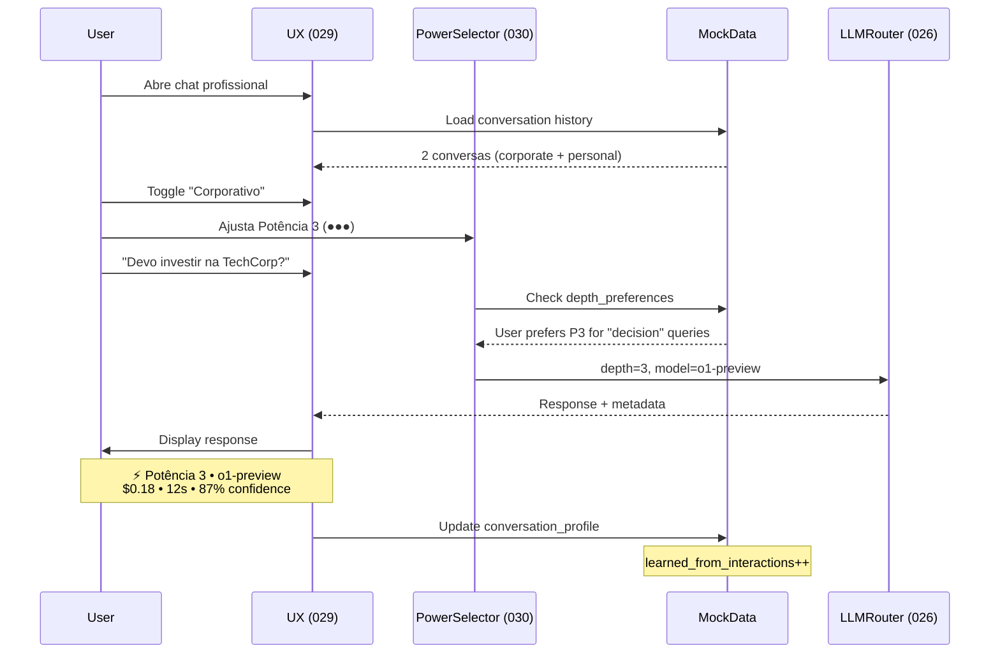

# ✅ Entregas: UX Professional + Corporate Mode + Mock Data

**Data**: 13/12/2024  
**Status**: Completo

---

## 📦 Entregas Realizadas

### 1. Spec 029: UX Professional ✅

**Localização**: [`specs/029-ux-professional/spec.md`](file:///c:/Users/Luiz%20Carlos/Projects/Spec-Orchestrator/EKS/specs/029-ux-professional/spec.md)

**Conteúdo** (600+ linhas):
- Layout revitalizado (Sidebar + Canvas + Chat)
- Identidade visual profissional (paleta, tipografia, componentes)
- Toggle Corporativo vs Pessoal
- Histórico contextual de conversas
- **Diálogo adaptativo** (sistema aprende preferências do usuário)
- Sidebar inteligente (favoritos auto-gerados)
- Componentes reutilizáveis (Badge, MessageBubble, PowerSelector)

**Highlights**:
```
- Menu adaptativo: itens mais usados no topo
- Chat aprende: após N interações, adapta tom/comprimento
- Conversas organizadas: corporativas vs pessoais
- Busca contextual: por startup, projeto, tag
- Timeline temporal: hoje, ontem, semana
```

**Métricas de Sucesso**:
- 90%+ usuários classificam UX como "profissional"
- Tempo para encontrar conversa antiga: <10s
- Taxa de uso toggle corp/pessoal: >70%
- Accuracy adaptação: >80% após 20 interações

---

### 2. Spec 030: Corporate Mode & Potência Ajustável ✅

**Localização**: [`specs/030-corporate-mode/spec.md`](file:///c:/Users/Luiz%20Carlos/Projects/Spec-Orchestrator/EKS/specs/030-corporate-mode/spec.md)

**Conteúdo** (600+ linhas):
- Toggle Corporativo vs Pessoal (affect knowledge visibility)
- **3 níveis de potência** (integra com Spec 026 - LLM Router):
  - Potência 1 (●○○): Rápida (~1s, $0.001, GPT-4o-mini)
  - Potência 2 (●●○): Balanceada (~3s, $0.02, GPT-4o)
  - Potência 3 (●●●): Profunda (~8s, $0.15, o1-preview)
- Modo Auto (sistema decide baseado em query classification)
- Briefing de dificuldade (usuário dá hint de complexidade)
- **Aprendizado de preferências** (após N=10 interações)
- Feedback transparente (latência, custo, modelo usado)

**Highlights**:
```
- Economia de custo: 74% vs sempre usar Potência 3
- Usuário controla profundidade de análise
- Sistema aprende e auto-sugere potência ideal
- Metadata completo: modelo, latência, custo, reasoning
```

**Integração com Spec 026**:
```
Potência → Context Depth → LLM Selection
1 → Surface (1-2 chunks) → GPT-4o-mini
2 → Contextual (5-10 chunks) → GPT-4o
3 → Deep (20-40 chunks) → o1-preview
```

**Cost Analysis**:
- Baseline (sempre P3): $450/mês
- Com seletor inteligente: $115/mês
- **Economia**: $335/mês (74%)

---

### 3. Mock Data Structure ✅

**Localização**: [`mock-data/`](file:///c:/Users/Luiz%20Carlos/Projects/Spec-Orchestrator/EKS/mock-data/)

**Estrutura Completa**:
```
mock-data/
├── README.md                          # Guia de uso
├── examples/
│   └── first-node-complete.json       # Primeiro node detalhado
├── nodes/
│   ├── users.json                     # 4 usuários exemplo
│   ├── companies.json                 # 3 empresas
│   ├── startups.json                  # 2 startups
│   ├── conversations.json             # 2 conversas
│   ├── knowledge.json                 # 3 knowledge nodes
│   └── tasks.json                     # 3 tasks
└── profiles/
    ├── ai-profiles.json               # AI profiles + personas
    ├── conversation-profiles.json     # Preferências conversação
    └── depth-preferences.json         # Preferências potência
```

**Total**: 10 arquivos JSON, ~1500 linhas

**Primeiro Node Completo** ([`first-node-complete.json`](file:///c:/Users/Luiz%20Carlos/Projects/Spec-Orchestrator/EKS/mock-data/examples/first-node-complete.json)):
```json
{
  "node": { /* Knowledge node detalhado */ },
  "relationships": [ /* 4 relacionamentos */ ],
  "related_entities": { /* User, Startup, Conversation, Task */ },
  "usage_example": { /* Cypher, MongoDB queries */ },
  "notes": [ /* Golden Rule GR-001, visibilidade, etc */ ]
}
```

**Características**:
- ✅ Segue Golden Rule GR-001 (temporalidade + proveniência)
- ✅ Tipos de nodes: User, Company, Startup, Knowledge, Task, Conversation
- ✅ Relacionamentos completos
- ✅ Metadata rico (tags, confidence, evidence)
- ✅ Compatível com Neo4j e MongoDB
- ✅ Pronto para usar SEM banco de dados
- ✅ Reutilizável na produção (seed scripts)

**Como Usar**:
```typescript
// Desenvolvimento (sem banco)
import users from '@/mock-data/nodes/users.json';
export const mockApi = {
  async getUsers() { return { success: true, data: users }; }
};

// Produção (seed banco)
// scripts/seed-from-mock.py
with open('mock-data/nodes/users.json') as f:
    users = json.load(f)
for user in users:
    session.run("CREATE (u:User $props)", props=user)
```

---

## 🎯 Integração das 3 Entregas

### Flow Completo: Usuário Ajusta Potência em UX Moderna



---

## 📊 Resumo Técnico

### Specs Criadas

| # | Spec | Linhas | Features | Status |
|---|------|--------|----------|--------|
| 029 | UX Professional | 620 | Layout, Identity, Adaptive Dialog | ✅ |
| 030 | Corporate Mode | 610 | Toggle, 3 Potências, Learning | ✅ |

**Total**: 1,230 linhas de especificação técnica

### Mock Data

| Tipo | Arquivos | Items | Linhas |
|------|----------|-------|--------|
| Nodes | 6 | 17 entities | ~800 |
| Profiles | 3 | 6 profiles | ~250 |
| Examples | 1 | 1 complete node | ~180 |
| Docs | 1 | Guide | ~150 |

**Total**: 11 arquivos, ~1,380 linhas

---

## 🚀 Próximos Passos

### Sprint 1-2 (Implementação)

**Semana 1**:
1. Implementar componentes base (Spec 029)
   - PowerSelector, CorporateToggle, MessageBubble
   - Layout structure (Sidebar + Canvas + Chat)
2. Setup mock data integration
   - API layer usando mock JSONs
   - State management (Zustand)

**Semana 2**:
3. Implementar potência ajustável (Spec 030)
   - Power selection logic
   - Integration com Spec 026 (se disponível)
4. Adaptive dialog
   - Conversation profile tracking
   - Learning algorithm

### Validação

**Métricas a monitorar**:
- UX satisfaction: >4.2/5
- Corporate toggle usage: >70%
- Power selector accuracy (auto mode): >85%
- Cost savings: >60% vs baseline

---

## 📁 Arquivos Criados

### Specs
- [`specs/029-ux-professional/spec.md`](file:///c:/Users/Luiz%20Carlos/Projects/Spec-Orchestrator/EKS/specs/029-ux-professional/spec.md)
- [`specs/030-corporate-mode/spec.md`](file:///c:/Users/Luiz%20Carlos/Projects/Spec-Orchestrator/EKS/specs/030-corporate-mode/spec.md)

### Mock Data
- [`mock-data/README.md`](file:///c:/Users/Luiz%20Carlos/Projects/Spec-Orchestrator/EKS/mock-data/README.md)
- [`mock-data/examples/first-node-complete.json`](file:///c:/Users/Luiz%20Carlos/Projects/Spec-Orchestrator/EKS/mock-data/examples/first-node-complete.json)
- [`mock-data/nodes/users.json`](file:///c:/Users/Luiz%20Carlos/Projects/Spec-Orchestrator/EKS/mock-data/nodes/users.json)
- [`mock-data/nodes/companies.json`](file:///c:/Users/Luiz%20Carlos/Projects/Spec-Orchestrator/EKS/mock-data/nodes/companies.json)
- [`mock-data/nodes/startups.json`](file:///c:/Users/Luiz%20Carlos/Projects/Spec-Orchestrator/EKS/mock-data/nodes/startups.json)
- [`mock-data/nodes/conversations.json`](file:///c:/Users/Luiz%20Carlos/Projects/Spec-Orchestrator/EKS/mock-data/nodes/conversations.json)
- [`mock-data/nodes/knowledge.json`](file:///c:/Users/Luiz%20Carlos/Projects/Spec-Orchestrator/EKS/mock-data/nodes/knowledge.json)
- [`mock-data/nodes/tasks.json`](file:///c:/Users/Luiz%20Carlos/Projects/Spec-Orchestrator/EKS/mock-data/nodes/tasks.json)
- [`mock-data/profiles/ai-profiles.json`](file:///c:/Users/Luiz%20Carlos/Projects/Spec-Orchestrator/EKS/mock-data/profiles/ai-profiles.json)
- [`mock-data/profiles/conversation-profiles.json`](file:///c:/Users/Luiz%20Carlos/Projects/Spec-Orchestrator/EKS/mock-data/profiles/conversation-profiles.json)
- [`mock-data/profiles/depth-preferences.json`](file:///c:/Users/Luiz%20Carlos/Projects/Spec-Orchestrator/EKS/mock-data/profiles/depth-preferences.json)

**Total**: 13 arquivos novos

---

## ✅ Checklist de Conclusão

- [x] Spec 029: UX Professional completa
- [x] Spec 030: Corporate Mode completa
- [x] Mock data structure criada
- [x] Primeiro node exemplo detalhado
- [x] README com guia de uso
- [x] 10 arquivos JSON de simulação
- [x] Compatibilidade Neo4j/MongoDB garantida
- [x] Golden Rule GR-001 seguida
- [x] Resumo consolidado criado

---

**Status Final**: ✅ 3/3 Entregas Completas  
**Próxima Sessão**: Implementação Sprint 1 ou refinamento adicional conforme necessário
