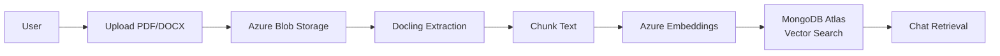
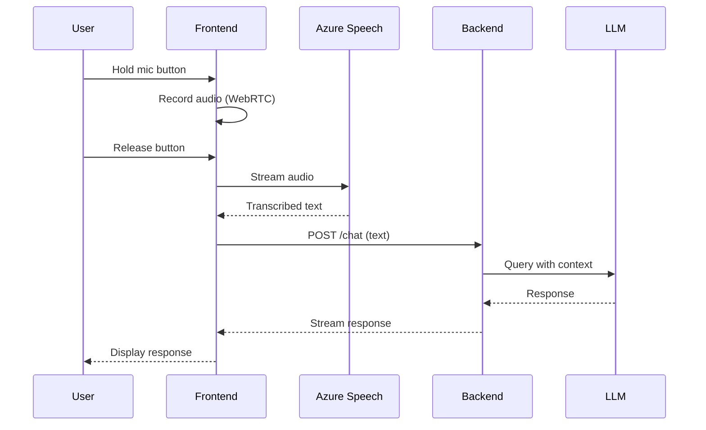

# MVP v1 - Escopo Mínimo

**Objetivo**: Chat funcionando em PRODUÇÃO com mínimo possível.

**Data alvo**: Sprint 1-2 (4 semanas)

---

## I. Core Features (Must Have)

### 1. Chat Interface ✅
```
✅ Interface web (Next.js já existe)
✅ Mensagem texto
✅ Histórico de conversa
✅ Streaming de resposta
```

### 2. Voice Input 🆕
```
🆕 Gravação de voz no navegador
🆕 Speech-to-Text (Azure Speech API)
🆕 Transcrição automática → Chat
```

### 3. File Attachments 🆕
```
🆕 Upload de arquivos (PDF, DOCX, TXT)
🆕 Extração de conteúdo (Docling)
🆕 Indexação em knowledge base
```

### 4. Agent Backend
```
✅ FastAPI server (já criado)
✅ Azure OpenAI integration
✅ Context retrieval básico
```

### 5. Knowledge Storage
```
🔄 MongoDB Atlas (Priority 1)
⏳ Neo4j (Future - intercambiável)
```

---

## II. Azure Stack

### APIs Necessárias

```yaml
Azure OpenAI:
  - gpt-4o (chat)
  - text-embedding-3-small (embeddings)

Azure AI Document Intelligence:
  - Document analysis
  - OCR
  - Table extraction

Azure Speech:
  - Speech-to-Text (voz → texto)
  - Text-to-Speech (opcional v2)

Azure Blob Storage:
  - Armazenamento de arquivos anexados
  - Arquivos processados
```

### Configuração

```python
# agents/.env
AZURE_OPENAI_ENDPOINT=https://xxx.openai.azure.com
AZURE_OPENAI_API_KEY=xxx
AZURE_OPENAI_DEPLOYMENT_NAME=gpt-4o

AZURE_SPEECH_KEY=xxx
AZURE_SPEECH_REGION=eastus

AZURE_DOCUMENT_INTELLIGENCE_ENDPOINT=https://xxx.cognitiveservices.azure.com
AZURE_DOCUMENT_INTELLIGENCE_KEY=xxx

AZURE_STORAGE_CONNECTION_STRING=xxx
AZURE_STORAGE_CONTAINER=eks-uploads
```

---

## III. Document Processing Pipeline

### Docling Integration

**Docling**: Open-source para extração de documentos (IBM Research)

```bash
# agents/pyproject.toml
[tool.poetry.dependencies]
docling = "^1.0.0"
```

```python
# src/services/document_processor.py
from docling.document_converter import DocumentConverter

class DocumentProcessor:
    def __init__(self):
        self.converter = DocumentConverter()
    
    async def extract_content(self, file_path: str) -> dict:
        """Extract text, tables, images from document"""
        result = self.converter.convert(file_path)
        
        return {
            "text": result.document.export_to_markdown(),
            "tables": result.document.tables,
            "images": result.document.images,
            "metadata": result.document.metadata
        }
```

### Flow



---

## IV. Voice Input Flow



---

## V. Simplified Architecture

```
┌─────────────────────────────────────────┐
│         Frontend (Next.js)              │
│  - Chat UI                              │
│  - Voice recording (WebRTC)             │
│  - File upload                          │
└─────────────────┬───────────────────────┘
                  │
                  │ REST API
                  │
┌─────────────────▼───────────────────────┐
│      Backend API (Node.js)              │
│  - Auth (JWT)                           │
│  - File handling                        │
│  - Proxy to agents                      │
└─────────────────┬───────────────────────┘
                  │
                  │ HTTP
                  │
┌─────────────────▼───────────────────────┐
│      Agents (Python FastAPI)            │
│  - Azure OpenAI                         │
│  - Azure Speech                         │
│  - Docling processing                   │
│  - MongoDB Atlas                        │
└─────────────────────────────────────────┘
```

---

## VI. Specs Prioritárias

### Sprint 1 (Semana 1-2)

| # | Spec | Feature | Effort |
|---|------|---------|--------|
| 003 | Admin Login | Auth básico | 2d |
| 007 | Chat Knowledge Capture | Chat + context | 3d |
| **NEW** | Voice Input | Azure Speech | 2d |
| **NEW** | File Upload | Docling + Azure | 3d |

**Total**: ~10 dias (2 semanas)

### Sprint 2 (Semana 3-4)

| # | Spec | Feature | Effort |
|---|------|---------|--------|
| 001 | Knowledge Pipeline | Indexação | 3d |
| 009 | User Memory | Persistência | 2d |
| 005 | Agent Router | Roteamento básico | 3d |
| **NEW** | MongoDB Repository | Storage | 2d |

**Total**: ~10 dias (2 semanas)

---

## VII. Out of Scope (Pós-MVP)

❌ Multi-agent orchestration  
❌ Canvas interface  
❌ Neo4j (apenas MongoDB v1)  
❌ Advanced prompt management  
❌ Memory decay  
❌ Admin dashboard  
❌ Observability  

---

## VIII. Success Criteria

### Funcional
- ✅ Usuário faz login
- ✅ Usuário envia mensagem de texto → recebe resposta
- ✅ Usuário grava voz → transcreve → recebe resposta
- ✅ Usuário anexa PDF → sistema extrai conteúdo → responde baseado no documento
- ✅ Sistema busca contexto em MongoDB Atlas

### Técnico
- ✅ Deploy em produção (Railway/Vercel)
- ✅ Latência < 3s (chat)
- ✅ Latência < 5s (voz)
- ✅ Suporta PDFs até 10MB
- ✅ Vector search funcionando

---

## IX. Endpoints Mínimos

### Backend (Node.js)

```typescript
POST   /auth/login          // JWT token
POST   /upload              // Upload file → Azure Blob
GET    /files/:id           // Get file metadata
```

### Agents (Python)

```python
POST   /chat/message        // Chat with context retrieval
POST   /voice/transcribe    // Voice → text (Azure Speech)
POST   /documents/process   // Process uploaded file (Docling)
POST   /search/semantic     // Search knowledge base
GET    /health              // Health check
```

---

## X. Database Schema (MongoDB)

### Collections

```javascript
// users
{
  _id: ObjectId,
  email: string,
  name: string,
  password_hash: string,
  created_at: Date
}

// conversations
{
  _id: ObjectId,
  user_id: ObjectId,
  title: string,
  created_at: Date,
  updated_at: Date
}

// messages
{
  _id: ObjectId,
  conversation_id: ObjectId,
  role: "user" | "assistant",
  content: string,
  metadata: {
    voice: boolean,
    file_id: ObjectId?
  },
  created_at: Date
}

// knowledge_nodes (com vector search)
{
  _id: ObjectId,
  type: "document" | "chunk",
  content: string,
  embedding: [768 floats],  // Vector
  metadata: {
    source: string,
    user_id: ObjectId,
    file_id: ObjectId?,
    page: number?
  },
  created_at: Date
}

// files
{
  _id: ObjectId,
  user_id: ObjectId,
  filename: string,
  blob_url: string,  // Azure Blob
  processed: boolean,
  created_at: Date
}
```

### Vector Index

```javascript
db.knowledge_nodes.createIndex(
  { embedding: "vector" },
  {
    name: "vector_index",
    vectorDimension: 768,
    vectorSimilarity: "cosine"
  }
)
```

---

## XI. Environment Variables Completo

```bash
# Backend (.env)
NODE_ENV=production
PORT=3001
JWT_SECRET=xxx
MONGODB_URI=mongodb+srv://xxx
AGENT_SERVER_URL=https://agents.railway.app

# Agents (.env)
DATABASE_TYPE=mongodb
MONGODB_URI=mongodb+srv://xxx

AZURE_OPENAI_ENDPOINT=https://xxx.openai.azure.com
AZURE_OPENAI_API_KEY=xxx
AZURE_OPENAI_DEPLOYMENT_NAME=gpt-4o
AZURE_EMBEDDING_DEPLOYMENT_NAME=text-embedding-3-small

AZURE_SPEECH_KEY=xxx
AZURE_SPEECH_REGION=eastus

AZURE_DOCUMENT_INTELLIGENCE_ENDPOINT=xxx
AZURE_DOCUMENT_INTELLIGENCE_KEY=xxx

AZURE_STORAGE_CONNECTION_STRING=xxx
AZURE_STORAGE_CONTAINER=eks-uploads
```

---

## XII. Timeline

```
Week 1-2 (Sprint 1):
  Day 1-2:   Auth + Chat básico
  Day 3-4:   Voice input (Azure Speech)
  Day 5-7:   File upload + Docling
  Day 8-10:  MongoDB vector search

Week 3-4 (Sprint 2):
  Day 11-13: Knowledge pipeline
  Day 14-15: User memory
  Day 16-18: Agent router
  Day 19-20: Deploy + testes

TOTAL: 4 semanas = MVP v1 em produção
```

---

**Status**: 📋 Ready to Start  
**Next**: Iniciar Sprint 1, criar Spec Voice Input e Spec File Upload
