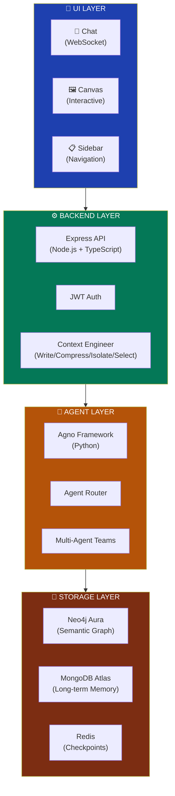
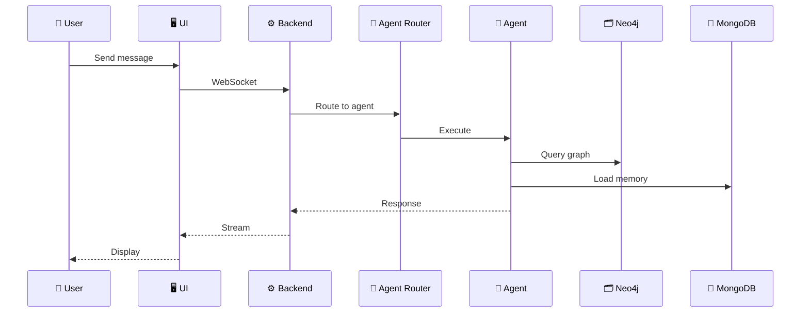

# EKS - Architecture Diagrams

## High-Level Architecture

```mermaid
graph TB
    subgraph UI["🎨 UI LAYER"]
        Chat["💬 Chat<br/>(WebSocket)"]
        Canvas["🖼️ Canvas<br/>(Interactive)"]
        Sidebar["📋 Sidebar<br/>(Navigation)"]
    end
    
    subgraph Backend["⚙️ BACKEND LAYER"]
        Express["Express API<br/>(Node.js + TypeScript)"]
        Auth["JWT Auth"]
        ContextEng["Context Engineer<br/>(Write/Compress/Isolate/Select)"]
    end
    
    subgraph Agents["🤖 AGENT LAYER"]
        Agno["Agno Framework<br/>(Python)"]
        Router["Agent Router"]
        Teams["Multi-Agent Teams"]
    end
    
    subgraph Storage["💾 STORAGE LAYER"]
        Neo4j["Neo4j Aura<br/>(Semantic Graph)"]
        MongoDB["MongoDB Atlas<br/>(Long-term Memory)"]
        Redis["Redis<br/>(Checkpoints)"]
    end
    
    UI --> Backend
    Backend --> Agents
    Agents --> Storage
    
    style UI fill:#1e40af,color:#fff
    style Backend fill:#047857,color:#fff
    style Agents fill:#b45309,color:#fff
    style Storage fill:#7c2d12,color:#fff
```

## Data Flow

```mermaid
sequenceDiagram
    participant User as 👤 User
    participant UI as 🖥️ UI
    participant API as ⚙️ Backend
    participant Router as 🔀 Agent Router
    participant Agent as 🤖 Agent
    participant Neo4j as 🗂️ Neo4j
    participant Mongo as 💾 MongoDB
    
    User->>UI: Send message
    UI->>API: WebSocket
    API->>Router: Route to agent
    Router->>Agent: Execute
    Agent->>Neo4j: Query graph
    Agent->>Mongo: Load memory
    Agent-->>API: Response
    API-->>UI: Stream
    UI-->>User: Display
```

**Created**: 2024-12-13
