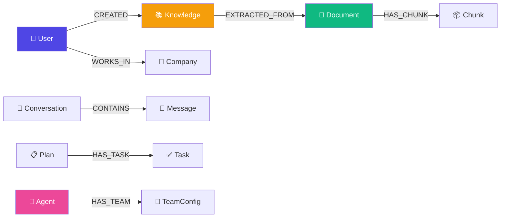
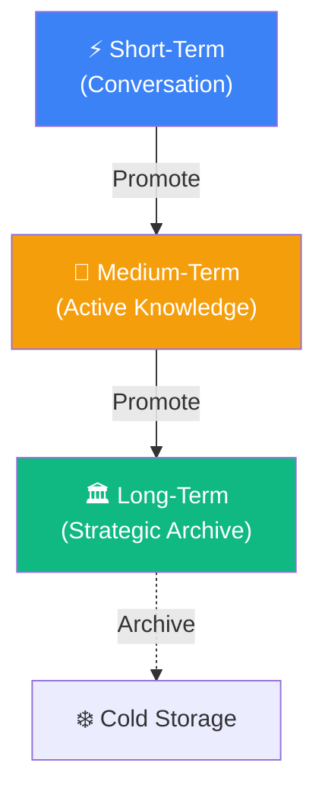

# EKS - Data Model

## Neo4j Core Nodes

```mermaid
graph LR
    User["👤 User"] -->|CREATED| Knowledge["📚 Knowledge"]
    User -->|WORKS_IN| Company["🏢 Company"]
    Knowledge -->|EXTRACTED_FROM| Document["📄 Document"]
    Document -->|HAS_CHUNK| Chunk["📦 Chunk"]
    Conversation["💬 Conversation"] -->|CONTAINS| Message["💭 Message"]
    Plan["📋 Plan"] -->|HAS_TASK| Task["✅ Task"]
    Agent["🤖 Agent"] -->|HAS_TEAM| TeamConfig["👥 TeamConfig"]
    
    style User fill:#4f46e5,color:#fff
    style Knowledge fill:#f59e0b,color:#fff
    style Document fill:#10b981,color:#fff
    style Agent fill:#ec4899,color:#fff
```

## Memory Levels

```mermaid
graph TD
    Short["⚡ Short-Term<br/>(Conversation)"] -->|Promote| Medium["📗 Medium-Term<br/>(Active Knowledge)"]
    Medium -->|Promote| Long["🏛️ Long-Term<br/>(Strategic Archive)"]
    Long -.->|Archive| Cold["❄️ Cold Storage"]
    
    style Short fill:#3b82f6,color:#fff
    style Medium fill:#f59e0b,color:#fff
    style Long fill:#10b981,color:#fff
```

**See**: `project-context/database-schema.md` for complete schema
