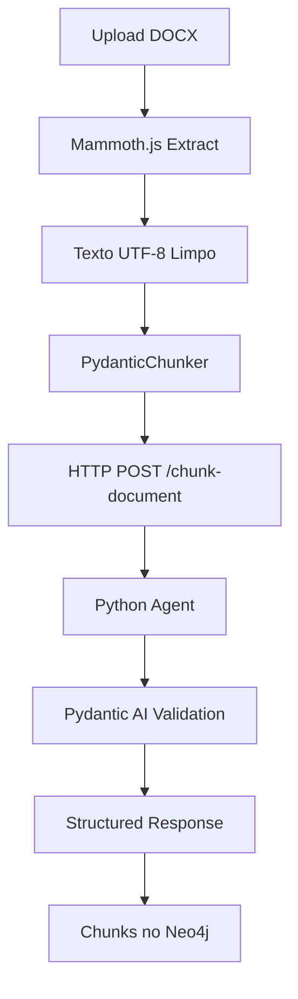

# Pydantic AI Intelligent Chunker

## 🤖 O que é?

Implementação do **Intelligent Chunker usando Pydantic AI** para validação estruturada robusta e melhor tratamento de erros.

## ✨ Vantagens vs LLM Direto

| Aspecto | LLM Direto | Pydantic AI |
|---------|------------|-------------|
| Validação | Manual | ✅ Automática com Pydantic |
| Erros | Runtime | ✅ Type-safe |
| Estrutura | JSON parsing | ✅ Modelos validados |
| Debugging | Difícil | ✅ Estruturado |
| Retry | Manual | ✅ Built-in |
| Logging | Básico | ✅ Detalhado |

## 🏗️ Arquitetura

### 1. **Python Agent** (`intelligent_chunker_agent.py`)
```python
# Pydantic models para validação estruturada
class DocumentChunk(BaseModel):
    sequence_index: int
    text: str
    metadata: ChunkMetadata

# Agente com Pydantic AI
intelligent_chunker_agent = Agent(
    'openai:gpt-4o-mini',
    result_type=ChunkingResponse,
    system_prompt="..."
)
```

### 2. **FastAPI Server** (`main.py`)
```python
@app.post("/chunk-document")
async def chunk_document(request: ChunkingRequest) -> ChunkingResponse:
    result = await chunk_document_intelligently(...)
    return result
```

### 3. **TypeScript Client** (`pydantic-chunker.ts`)
```typescript
// Chama o agente Python via HTTP
const response = await axios.post(`${agentsUrl}/chunk-document`, {
    title, doc_type, content, author
});
```

## 🚀 Como Usar

### 1. **Instalar Dependências**
```bash
cd agents
pip install -r requirements.txt
```

### 2. **Configurar OpenAI**
```bash
export OPENAI_API_KEY="sua-chave-aqui"
```

### 3. **Iniciar Serviço de Agentes**
```bash
python main.py
# Server rodando em http://localhost:8000
```

### 4. **Testar**
```bash
curl -X POST http://localhost:8000/chunk-document \
  -H "Content-Type: application/json" \
  -d '{
    "title": "Teste",
    "doc_type": "proposal",
    "content": "Conteúdo do documento..."
  }'
```

## 📊 Estrutura de Saída

```json
{
  "chunks": [
    {
      "sequence_index": 0,
      "text": "Texto completo do chunk",
      "metadata": {
        "chunk_type": "title",
        "section_title": "Nome da seção",
        "section_number": "1.1",
        "hierarchy_level": 1,
        "contains_table": false,
        "table_data": null,
        "key_topics": ["tópico1", "tópico2"],
        "estimated_importance": "high",
        "reasoning": "Justificativa da divisão"
      }
    }
  ],
  "total_chunks": 5,
  "document_summary": "Resumo da estrutura",
  "processing_notes": "Notas sobre o processamento"
}
```

## 🔧 Validações Automáticas

### Pydantic Models garantem:
- ✅ **Tipos corretos** (strings, numbers, arrays)
- ✅ **Campos obrigatórios** presentes
- ✅ **Valores válidos** (enum strings)
- ✅ **Estrutura aninhada** correta
- ✅ **Tamanhos mínimos** (text >= 50 chars)
- ✅ **Níveis hierárquicos** (1-5)

### Exemplo de validação:
```python
class ChunkMetadata(BaseModel):
    chunk_type: str = Field(description="Type: title, section, paragraph, table, list, summary, other")
    hierarchy_level: int = Field(ge=1, le=5, description="Level 1-5")
    estimated_importance: str = Field(regex="^(high|medium|low)$")
```

## 📋 Logs e Debugging

### Nível de Detalhe:
```bash
✅ Intelligent chunking completed:
   - Total chunks: 8
   - Document summary: "Proposal with 3 main sections"
   - Processing notes: "Tables detected and structured"

📊 Chunk Analysis:
   - Chunk types: {'title': 1, 'section': 3, 'paragraph': 4}
   - Importance levels: {'high': 2, 'medium': 5, 'low': 1}
   - Tables detected: 2

✅ All chunks have optimal size (50-2000 chars)
```

## 🔄 Fluxo Completo



## 🛠️ Configuração

### Backend (.env):
```env
AGENTS_SERVICE_URL=http://localhost:8000
```

### Agents (.env):
```env
OPENAI_API_KEY=sk-...
```

## 📈 Performance

### Métricas:
- **Latency**: ~30-60s (depende do tamanho)
- **Tokens**: ~1K-5K por documento
- **Accuracy**: Alta (validação estruturada)
- **Retry**: Automático em falhas

### Otimizações:
- Cache de documentos similares
- Streaming para documentos grandes
- Batch processing para múltiplos docs

## 🚨 Tratamento de Erros

### Tipos de erro:
1. **Conexão**: Serviço não rodando
2. **Validação**: Schema inválido
3. **Timeout**: Documento muito grande
4. **API**: OpenAI rate limits

### Exemplos:
```typescript
// Conexão recusada
throw new Error('Pydantic AI agents service not running. Start the agents service first.');

// Schema inválido
throw new Error(`Pydantic AI error: 422 - ${error.response.data}`);

// Timeout
throw new Error('Request timeout after 120 seconds');
```

## 🎯 Próximos Passos

1. **Cache inteligente** para documentos similares
2. **Streaming** para documentos muito grandes
3. **Batch processing** para múltiplos documentos
4. **Custom prompts** por tipo de documento
5. **Evaluation metrics** automáticas

## 💡 Por que Pydantic AI?

1. **Type Safety**: Validação em compile-time
2. **Structured Output**: Garante formato correto
3. **Better Errors**: Mensagens claras de validação
4. **Retry Logic**: Built-in retry com exponential backoff
5. **Tool Integration**: Fácil adicionar ferramentas
6. **Monitoring**: Logs estruturados automáticos

---

**Resultado**: Chunking mais robusto, validado e fácil de debugar! 🚀
