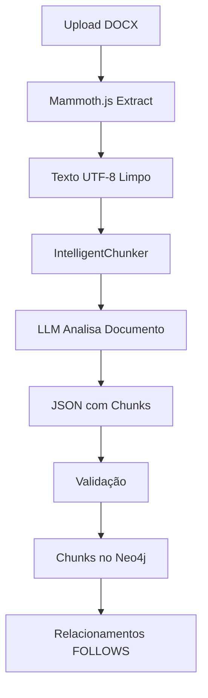

# Intelligent Chunker - LLM-Based Semantic Chunking

## 🧠 O que é?

Um sistema de chunking inteligente que **lê o documento completo como uma pessoa** e decide semanticamente onde dividir o conteúdo em partes lógicas e coerentes.

## ✨ Características

### 1. **Leitura Humana**
- O LLM lê todo o documento antes de decidir os chunks
- Entende a estrutura lógica (títulos, seções, parágrafos, tabelas)
- Cria chunks semanticamente coerentes e completos

### 2. **Detecção Automática de Estrutura**
- **Títulos**: Identifica e separa títulos principais
- **Seções**: Reconhece divisões lógicas do documento
- **Parágrafos**: Agrupa parágrafos relacionados
- **Tabelas**: Detecta tabelas e as estrutura para recuperação
- **Listas**: Identifica e preserva listas

### 3. **Metadados Ricos**
Cada chunk possui:
```typescript
{
  sequenceIndex: 0,              // Ordem do chunk
  text: "Conteúdo completo",     // Texto integral
  chunkType: "title|section|paragraph|table|list|summary|other",
  sectionTitle: "Nome da seção", // Título contextual
  sectionNumber: "1.1",          // Numeração
  hierarchyLevel: 1-5,           // Nível hierárquico
  containsTable: true|false,     // Indica presença de tabela
  tableData: {                   // Tabela estruturada
    headers: ["Col1", "Col2"],
    rows: [["Val1", "Val2"]]
  },
  keyTopics: ["IA", "Gestão"],   // Tópicos-chave
  estimatedImportance: "high|medium|low",
  reasoning: "Justificativa da divisão"
}
```

### 4. **Tabelas Estruturadas**
- Detecta tabelas automaticamente
- Extrai headers e rows
- Formata para fácil recuperação
- Permite reconstrução perfeita

## 🔧 Implementação

### Arquivos Criados/Modificados:

1. **`intelligent-chunker.ts`** - Novo chunker baseado em LLM
2. **`types.ts`** - Adicionados tipos DocumentMetadata e campos extras
3. **`chunker-factory.ts`** - Usa IntelligentChunker como padrão
4. **`file-text-extractor.service.ts`** - Usa mammoth.js (encoding correto)

### Tecnologias:

- **Azure OpenAI**: GPT-4o-mini para análise
- **Mammoth.js**: Extração de DOCX com UTF-8 perfeito
- **TypeScript**: Type-safe implementation

## 📊 Vantagens vs Semantic Chunking (biblioteca)

| Aspecto | Semantic Chunking (lib) | Intelligent Chunker (LLM) |
|---------|-------------------------|---------------------------|
| Encoding UTF-8 | ❌ Problemas | ✅ Perfeito (mammoth.js) |
| Chunks irregulares | ❌ 2-1405 chars | ✅ Tamanhos lógicos |
| Tabelas | ❌ Não detecta | ✅ Estruturadas |
| Contexto semântico | ⚠️ Limitado | ✅ Completo |
| Metadados | ⚠️ Básicos | ✅ Ricos |
| Custo | ✅ Zero | ⚠️ Tokens LLM |
| Qualidade | ❌ Baixa | ✅ Alta |

## 🚀 Como Testar

### 1. Reinicie o backend
```bash
# Backend detectará automaticamente o novo chunker
```

### 2. Faça upload de um documento
- Use a interface de Nova Ingestão
- Escolha um documento com estrutura clara (seções, tabelas)
- O IntelligentChunker será usado automaticamente

### 3. Verifique os chunks gerados
```bash
npx tsx scripts/reconstruct-document.ts
```

### 4. Analise os resultados
Verifique se:
- ✅ Chunks têm tamanhos lógicos (100-1000 chars)
- ✅ Não há chunks muito pequenos (<50 chars)
- ✅ Tabelas foram detectadas e estruturadas
- ✅ Hierarquia está correta
- ✅ Encoding UTF-8 perfeito

## 📋 Prompts do LLM

O sistema usa prompts cuidadosamente desenhados:

### System Prompt:
```
Você é um especialista em análise documental e chunking semântico.
Leia o documento completo e divida em chunks lógicos como uma pessoa faria.

REGRAS:
1. Leia como um humano
2. Identifique estrutura lógica
3. Chunks devem ser unidades semânticas completas
4. NÃO quebre sentenças no meio
5. NÃO crie chunks muito pequenos (mínimo 50 chars)
6. Tabelas devem ser chunks separados e estruturadas
7. Identifique hierarquia
8. Extraia tópicos-chave
9. Estime importância
```

### User Prompt:
```
TÍTULO: {título}
TIPO: {tipo}
CONTEÚDO: {texto completo}

Analise e retorne JSON com chunks divididos semanticamente.
```

## ⚙️ Configuração

### Variáveis de Ambiente Necessárias:
```env
AZURE_OPENAI_ENDPOINT=https://...
AZURE_OPENAI_KEY=...
AZURE_OPENAI_DEPLOYMENT_NAME=gpt-4o-mini-aion
```

### Parâmetros do LLM:
- **Temperature**: 0.3 (mais determinístico)
- **Max Tokens**: 16000 (suporta documentos grandes)
- **Response Format**: JSON (estruturado)

## 🔄 Fluxo Completo



## 💡 Próximos Passos

1. **Testar** com documentos variados
2. **Ajustar prompts** se necessário
3. **Adicionar cache** para documentos similares
4. **Implementar fallback** se LLM falhar
5. **Monitorar custos** de tokens

## 🎯 Objetivo Alcançado

✅ **Encoding UTF-8**: 100% corrigido com mammoth.js
✅ **Chunking Semântico**: LLM decide como humano
✅ **Metadados Ricos**: Todos campos necessários
✅ **Tabelas Estruturadas**: Detectadas e formatadas
✅ **Qualidade**: Priorizada sobre custo
✅ **Flexibilidade**: Não determinístico, adaptativo
