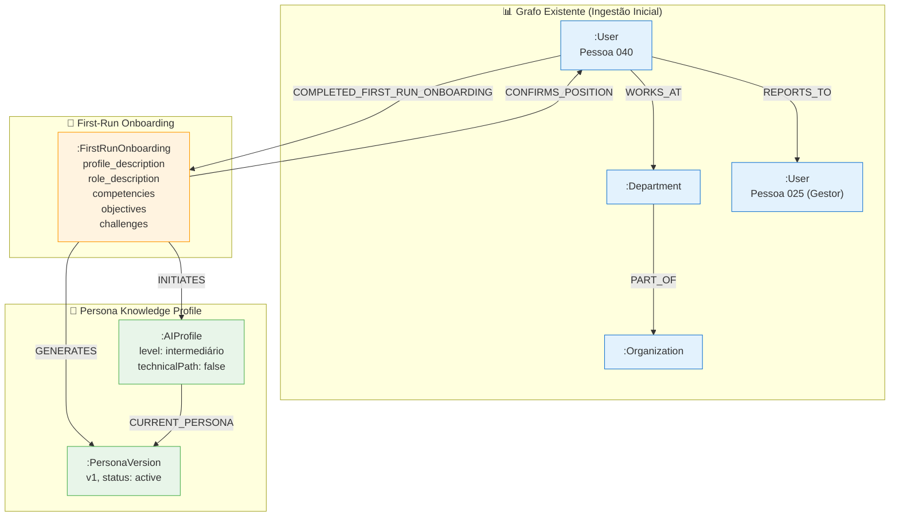
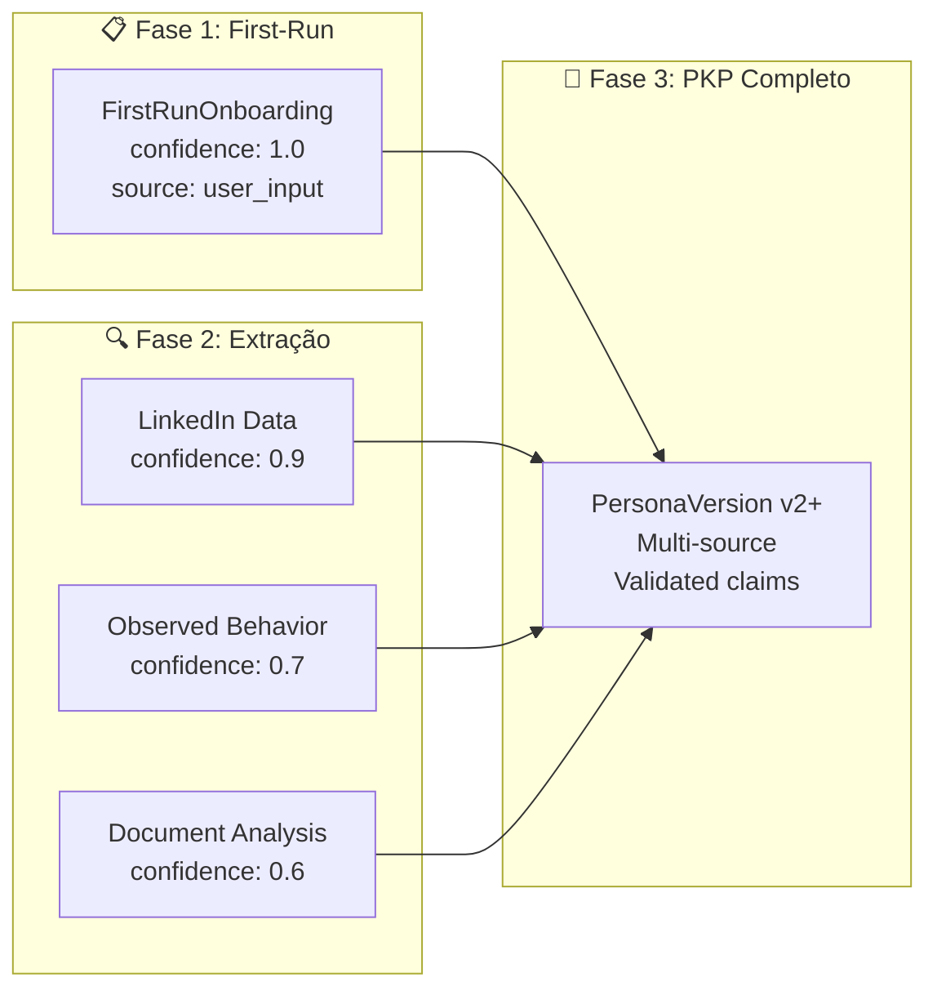

# 🧠 First-Run Onboarding - Schema Refinado para Neo4j

## Contexto

O **First-Run Onboarding** é a **primeira fotografia** do usuário no sistema. É o dado mínimo que:
1. **Cria a persona inicial** do usuário
2. **Conecta à estrutura organizacional** já ingerida
3. **Serve de âncora** para dados futuros (PKP progressivo)
4. **É consultável pelo modelo de IA** para personalizar interações

---

## 🎯 Propósito do First-Run Onboarding

> "O First-Run Onboarding captura a auto-percepção inicial do usuário sobre seu papel, competências e objetivos. É a semente do Persona Knowledge Profile (PKP)."

### O que o modelo de IA precisa saber:
- **Quem é o usuário** (contexto profissional)
- **O que ele faz** (função, responsabilidades)
- **O que ele quer** (objetivos, necessidades)
- **O que ele enfrenta** (desafios, dificuldades)
- **De onde veio essa informação** (proveniência: o próprio usuário)
- **Quando foi capturado** (timestamp para versionamento)

---

## 📊 Estrutura Proposta no Neo4j

### 1. Novo Label: `:FirstRunOnboarding`

```cypher
(:FirstRunOnboarding {
  // === Identificação ===
  id: string,                    // UUID único
  user_id: string,               // Referência ao :User
  
  // === Conteúdo do Onboarding ===
  profile_description: text,     // "Sobre você" - auto-descrição do perfil
  role_description: text,        // Descrição da função na instituição
  department_description: text,  // Descrição do papel da área na organização
  competencies: [string],        // Lista de competências autodeclaradas
  primary_objective: text,       // Objetivo principal ao usar o sistema
  top_challenges: text,          // Maiores desafios do dia a dia
  
  // === Validações ===
  org_chart_validated: boolean,  // Usuário confirmou posição no organograma
  
  // === Metadados de Proveniência ===
  source_type: 'user_input',     // Sempre 'user_input' para First-Run
  confidence: 1.0,               // Máxima confiança (usuário declarou)
  
  // === Metadados Temporais ===
  created_at: datetime,          // Quando o onboarding foi iniciado
  completed_at: datetime,        // Quando o onboarding foi concluído
  updated_at: datetime,          // Última modificação
  
  // === Versionamento ===
  version: 'v1',                 // Versão inicial
  status: 'active',              // 'active' | 'superseded'
  
  // === Contexto de Captura ===
  session_id: string,            // ID da sessão de onboarding
  duration_seconds: integer      // Tempo gasto no onboarding
})
```

### 2. Relacionamentos

```cypher
// === Relacionamento Principal ===
// O usuário COMPLETA o First-Run Onboarding (cria sua persona inicial)
(:User)-[:COMPLETED_FIRST_RUN_ONBOARDING {
  completed_at: datetime,
  duration_seconds: integer
}]->(:FirstRunOnboarding)

// === Conexão com Estrutura Organizacional ===
// O onboarding CONFIRMA a posição no organograma
(:FirstRunOnboarding)-[:CONFIRMS_POSITION {
  validated: boolean,
  validated_at: datetime
}]->(:User)  // Referência ao próprio usuário no organograma

// === Conexão com AIProfile (spec 022) ===
// O onboarding INICIA o perfil de IA
(:FirstRunOnboarding)-[:INITIATES]->(:AIProfile)

// === Conexão com PersonaVersion (spec 022) ===
// O onboarding GERA a primeira versão da persona
(:FirstRunOnboarding)-[:GENERATES]->(:PersonaVersion {version: 'v1'})

// === Versionamento Futuro ===
// Se houver re-onboarding, a nova versão SUPERSEDE a anterior
(:FirstRunOnboarding {version: 'v2'})-[:SUPERSEDES]->(:FirstRunOnboarding {version: 'v1'})
```

---

## 🔗 Como isso se conecta com o Grafo Existente



---

## 🤖 Como o Modelo de IA Usa essa Informação

### Query 1: Obter contexto completo do usuário
```cypher
// Quando o modelo precisa entender o usuário
MATCH (u:User {email: $userEmail})
OPTIONAL MATCH (u)-[:COMPLETED_FIRST_RUN_ONBOARDING]->(fro:FirstRunOnboarding)
OPTIONAL MATCH (u)-[:WORKS_AT]->(d:Department)
OPTIONAL MATCH (u)-[:REPORTS_TO]->(manager:User)
OPTIONAL MATCH (fro)-[:GENERATES]->(pv:PersonaVersion {status: 'active'})
RETURN u, fro, d, manager, pv
```

### Query 2: Personalizar resposta baseado em desafios
```cypher
// Quando o modelo quer ajudar com desafios do usuário
MATCH (u:User {email: $userEmail})-[:COMPLETED_FIRST_RUN_ONBOARDING]->(fro:FirstRunOnboarding)
RETURN fro.top_challenges AS challenges, 
       fro.primary_objective AS objective,
       fro.competencies AS skills
```

### Query 3: Verificar se usuário completou onboarding
```cypher
// Verificar status de onboarding
MATCH (u:User {email: $userEmail})
OPTIONAL MATCH (u)-[r:COMPLETED_FIRST_RUN_ONBOARDING]->(fro:FirstRunOnboarding)
RETURN u.name AS user,
       CASE WHEN fro IS NOT NULL THEN true ELSE false END AS has_completed_onboarding,
       fro.completed_at AS completed_at
```

---

## 📝 Exemplo: Inserção do Usuário 040

```cypher
// Criar o nó FirstRunOnboarding
CREATE (fro:FirstRunOnboarding {
  id: randomUUID(),
  user_id: 'usuario040@aurora.example',
  
  // Conteúdo do Onboarding
  profile_description: 'Sou Coordenador de Projetos na área de Plataforma. Tenho um perfil pragmático e orientado a execução, com foco em alinhamento entre áreas e entrega de valor. Gosto de trabalhar com clareza de escopo, priorização e comunicação direta com stakeholders.',
  
  role_description: 'Atuo como Coordenador de Projetos no time de Plataforma. Minha responsabilidade é planejar, coordenar e acompanhar projetos que envolvem múltiplas áreas, garantindo alinhamento de escopo, prazos e expectativas. Faço gestão de stakeholders, organizo rituais de acompanhamento e priorizo demandas com base em impacto e capacidade.',
  
  department_description: 'A área de Plataforma dá sustentação para a operação e evolução dos sistemas e capacidades internas, garantindo que as demais áreas consigam executar com eficiência. Nosso papel é manter uma base confiável e viabilizar melhorias que aumentem produtividade e qualidade.',
  
  competencies: ['Gestão de Projetos', 'Priorização e Planejamento', 'Gestão de Stakeholders', 'Comunicação entre Áreas', 'Análise de Problemas', 'Facilitação de Reuniões'],
  
  primary_objective: 'Ganhar visibilidade e controle do trabalho (demandas, decisões, dependências e entregas) e transformar isso em um mapa vivo que me ajude a planejar melhor, reduzir retrabalho e acelerar a execução.',
  
  top_challenges: 'Falta de visibilidade ponta a ponta quando várias áreas participam; mudança frequente de prioridades e demandas urgentes; dependências e bloqueios que atrasam entregas; alinhamento de expectativas com stakeholders; documentação dispersa que gera retrabalho.',
  
  // Validações
  org_chart_validated: true,
  
  // Metadados de Proveniência
  source_type: 'user_input',
  confidence: 1.0,
  
  // Metadados Temporais
  created_at: datetime(),
  completed_at: datetime(),
  updated_at: datetime(),
  
  // Versionamento
  version: 'v1',
  status: 'active',
  
  // Contexto de Captura
  session_id: 'onboarding-session-001',
  duration_seconds: 480  // ~8 minutos
})

// Conectar ao usuário existente
WITH fro
MATCH (u:User {email: 'usuario040@aurora.example'})
CREATE (u)-[:COMPLETED_FIRST_RUN_ONBOARDING {
  completed_at: datetime(),
  duration_seconds: 480
}]->(fro)

// Confirmar posição no organograma
CREATE (fro)-[:CONFIRMS_POSITION {
  validated: true,
  validated_at: datetime()
}]->(u)

RETURN fro, u
```

---

## 🔄 Evolução Futura: Do First-Run ao PKP Progressivo

O First-Run Onboarding é apenas o **ponto de partida**. Conforme o usuário interage com o sistema:



---

## ✅ Checklist de Metadados

| Metadado | Propósito | Valor |
|----------|-----------|-------|
| `source_type` | Rastreabilidade | 'user_input' |
| `confidence` | Qualidade do dado | 1.0 (máxima) |
| `created_at` | Auditoria temporal | datetime() |
| `completed_at` | Duração do processo | datetime() |
| `version` | Versionamento | 'v1', 'v2', ... |
| `status` | Estado atual | 'active', 'superseded' |
| `session_id` | Rastreabilidade de sessão | UUID |
| `org_chart_validated` | Confirmação organizacional | boolean |

---

## 🎯 Próximos Passos

1. **Criar script de ingestão** que usa essa estrutura
2. **Testar queries** do modelo de IA
3. **Conectar com aba de Processos** (PIA) - extrair processos do `role_description`
4. **Conectar com AIProfile/PersonaVersion** conforme spec 022
5. **Documentar no Meta-Grafo** (spec 050) - adicionar SchemaLabel para FirstRunOnboarding

---

## 📚 Referências das Specs

- **spec 022**: PKP & Onboarding - estrutura de AIProfile e PersonaVersion
- **spec 046**: PIA - mapeamento de processos (usa dados do onboarding)
- **spec 050**: Meta-Grafo - schema operacional para o agente
