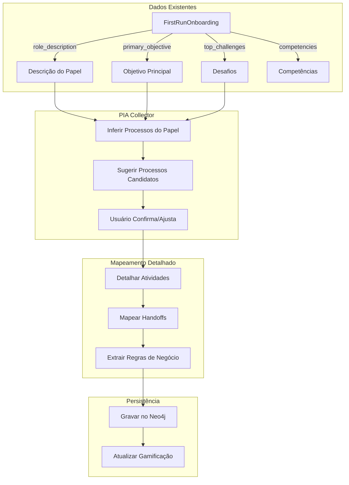

# PIA (Process Intelligence & Analysis) - Estrutura de Implementação

## Contexto Disponível

### Organização: Aurora Corretora
- **Tipo**: Corretora de investimentos
- **Descrição**: Corretora independente focada em distribuição e execução de investimentos para clientes PF e PJ

### Departamentos (8)
| Departamento | Membros |
|--------------|---------|
| Backoffice   | 2       |
| Compliance   | 2       |
| Diretoria    | 1       |
| Financeiro   | 2       |
| Operações    | 1       |
| Risco        | 1       |
| TI           | 1       |
| Trading      | 3       |

### Usuário com Onboarding Completo: Carlos Silva (CEO)
- **Competências**: Liderança Executiva, Estratégia, Tomada de Decisão, Governança, Gestão de Riscos
- **Objetivo**: Visão consolidada da organização para tomar decisões
- **Desafios**: Alinhamento entre áreas, foco, riscos

---

## Fluxo PIA - Início pelo Onboarding

O PIA deve **aproveitar os dados já coletados** no First-Run Onboarding para iniciar o mapeamento:



---

## Entidades Neo4j para PIA

### Nodes Novos

```cypher
// :Process - Processo organizacional
(:Process {
  id: UUID,
  name: STRING,                    // Ex: "Qualificação de Leads"
  description: TEXT,
  owner_id: UUID,                  // Dono do processo
  department_id: UUID,             // Departamento principal
  status: "draft" | "active" | "validated" | "deprecated",
  quality_score: FLOAT,            // 0.0 - 1.0
  source: "user_mapping" | "llm_inference" | "system",
  created_at: DATETIME,
  updated_at: DATETIME
})

// :Activity - Atividade dentro de um processo
(:Activity {
  id: UUID,
  name: STRING,                    // Ex: "Analisar perfil do cliente"
  description: TEXT,
  sequence_order: INTEGER,         // Ordem na sequência
  duration_estimate: INTEGER,      // Minutos
  inputs: [STRING],                // O que recebe
  outputs: [STRING],               // O que entrega
  tools_used: [STRING],            // Sistemas utilizados
  is_decision_point: BOOLEAN,      // Ponto de decisão?
  created_at: DATETIME
})

// :BusinessRule - Regra de negócio extraída
(:BusinessRule {
  id: UUID,
  name: STRING,                    // Nome legível
  condition: STRING,               // IF clause
  action: STRING,                  // THEN clause
  confidence: FLOAT,               // 0.0 - 1.0
  source_user_id: UUID,            // Quem declarou
  validated_by: [UUID],            // Quem validou
  status: "draft" | "validated" | "golden",
  created_at: DATETIME
})

// :ProcessMapping - Registro de sessão de mapeamento
(:ProcessMapping {
  id: UUID,
  user_id: UUID,                   // Quem mapeou
  session_start: DATETIME,
  session_end: DATETIME,
  processes_mapped: INTEGER,
  activities_mapped: INTEGER,
  handoffs_mapped: INTEGER,
  quality_score: FLOAT
})

// :GamificationScore - Pontuação do usuário
(:GamificationScore {
  id: UUID,
  user_id: UUID,
  total_points: INTEGER,
  processes_mapped: INTEGER,
  handoffs_validated: INTEGER,
  rules_contributed: INTEGER,
  badges: [STRING],
  level: "bronze" | "silver" | "gold" | "platinum",
  updated_at: DATETIME
})
```

### Relacionamentos Novos

```cypher
// Processo pertence a departamento
(:Department)-[:HAS_PROCESS]->(:Process)

// Processo tem atividades
(:Process)-[:HAS_ACTIVITY]->(:Activity)

// Atividade governada por regra
(:Activity)-[:GOVERNED_BY]->(:BusinessRule)

// Handoff: Usuário entrega para atividade
(:User)-[:HANDS_OFF {
  what: STRING,          // O que entrega
  when: STRING,          // Quando/gatilho
  how: STRING,           // Como (email, sistema, reunião)
  status: "pending" | "validated" | "broken",
  average_duration: INTEGER
}]->(:Activity)

// Atividade vai para usuário (receptor)
(:Activity)-[:TO]->(:User)

// Usuário mapeou processo
(:User)-[:MAPPED]->(:Process)

// Versionamento de processos
(:Process)-[:SUPERSEDES]->(:Process)

// Usuário tem pontuação
(:User)-[:HAS_GAMIFICATION]->(:GamificationScore)
```

---

## Pipeline de Mapeamento (PIA Collector)

### Fase 1: Inferência Inicial (do Onboarding)

O sistema analisa os dados do `FirstRunOnboarding` e `PersonaVersion` para sugerir processos:

```typescript
interface ProcessSuggestion {
  name: string;
  description: string;
  confidence: number;        // Confiança da inferência
  source: 'role_description' | 'objective' | 'challenge';
  department: string;
}
```

**Exemplo para Carlos Silva (CEO)**:
- Da `role_description`: "Defino direcionamento, metas e prioridades"
  - Processo sugerido: "Planejamento Estratégico"
  - Processo sugerido: "Definição de Metas"
  
- Do `primary_objective`: "Visão consolidada da organização"
  - Processo sugerido: "Consolidação de Relatórios"
  - Processo sugerido: "Reunião de Alinhamento"

- Dos `top_challenges`: "Alinhamento entre áreas"
  - Processo sugerido: "Comunicação Cross-Funcional"

### Fase 2: Confirmação e Ajuste

O usuário:
1. Confirma processos sugeridos
2. Adiciona processos não detectados
3. Remove sugestões incorretas
4. Prioriza quais mapear primeiro

### Fase 3: Detalhamento de Atividades

Para cada processo confirmado:
1. Listar atividades (passos)
2. Definir ordem/sequência
3. Identificar pontos de decisão
4. Estimar duração

### Fase 4: Mapeamento de Handoffs

Para cada atividade:
1. "Quem te entrega informação para iniciar esta atividade?"
2. "Para quem você entrega o resultado?"
3. "O que exatamente é entregue?"
4. "Como é entregue? (sistema, email, reunião)"

### Fase 5: Extração de Regras

O LLM analisa as descrições e extrai regras:
- "Se cliente tem perfil agressivo, sugiro renda variável"
- "Se valor >R$1M, precisa aprovação do Compliance"

---

## Modelo de Ressonância (Substitui Gamificação)

> **Importante**: O PIA NÃO usa gamificação clássica (pontos, badges, rankings).  
> Usa o modelo de **Incentivo por Ressonância** (spec 020).

### O que é Ressonância?

Em vez de "você ganhou 10 pontos", o usuário recebe **notificações semânticas**:

| ❌ Gamificação Clássica | ✅ Ressonância |
|------------------------|----------------|
| "Você ganhou 30 pontos" | "Seu mapeamento foi citado por 3 colegas" |
| "Badge: Process Champion" | "O conceito que você criou conecta 5 departamentos" |
| "Ranking: 3º lugar" | "Maria mapeou algo relacionado ao seu fluxo" |

### Eventos de Ressonância

```yaml
connection_events:
  - type: "area_citation"
    message: "Um novo mapeamento citou sua área"
    
  - type: "flow_refinement"
    message: "Um fluxo relacionado ao seu papel foi refinado"
    
  - type: "pattern_reuse"
    message: "Uma decisão que você descreveu apareceu em outro contexto"
    
  - type: "concept_propagation"
    message: "Um conceito que você usa foi reutilizado"
```

### Por que Ressonância?

> *"O EKS não gamifica contribuição. Ele revela conexão."*

- **Senso de pertencimento estrutural** - não social
- **Validação epistemológica** - seu conhecimento tem impacto real
- **Motivação intrínseca** - ver conexões emergindo naturalmente

---

## Endpoints Implementados

| Endpoint | Método | Descrição |
|----------|--------|-----------|
| `/pia/context` | GET | Contexto do usuário (onboarding + org) |
| `/pia/organizational-structure` | GET | Estrutura organizacional completa |
| `/pia/onboarding-summary` | GET | Resumo de todos os onboardings |
| `/pia/department-details/:name` | GET | Detalhes de um departamento |
| `/pia/suggest-processes` | POST | Inferir processos do onboarding via LLM |
| `/pia/map-process` | POST | Criar mapeamento de processo |
| `/pia/detail-activities` | POST | Detalhar atividades de um processo |
| `/pia/map-handoff` | POST | Mapear handoff entre usuários |
| `/pia/extract-rules` | POST | Extrair regras de negócio |
| `/pia/processes` | GET | Listar processos mapeados |

## Próximos Passos

1. ✅ Endpoints de estrutura organizacional implementados
2. ✅ Serviço LLM para inferência de processos
3. **Criar componente frontend PIA** - Interface de mapeamento
4. **Implementar Ressonância** - Notificações semânticas quando mapeamentos se conectam

---

## Integração com Dados Existentes

O PIA deve usar:

1. **FirstRunOnboarding.role_description** → Inferir processos do papel
2. **FirstRunOnboarding.primary_objective** → Identificar processos-chave
3. **FirstRunOnboarding.top_challenges** → Detectar gaps/oportunidades
4. **PersonaVersion.core_competencies** → Validar expertise
5. **User.department** → Contextualizar processos
6. **Organization.description** → Entender contexto geral

Isso cria um **ciclo virtuoso**:
- Onboarding alimenta PIA
- PIA enriquece o grafo
- Grafo enriquece futuras conversas
- Conversas geram mais mapeamentos
