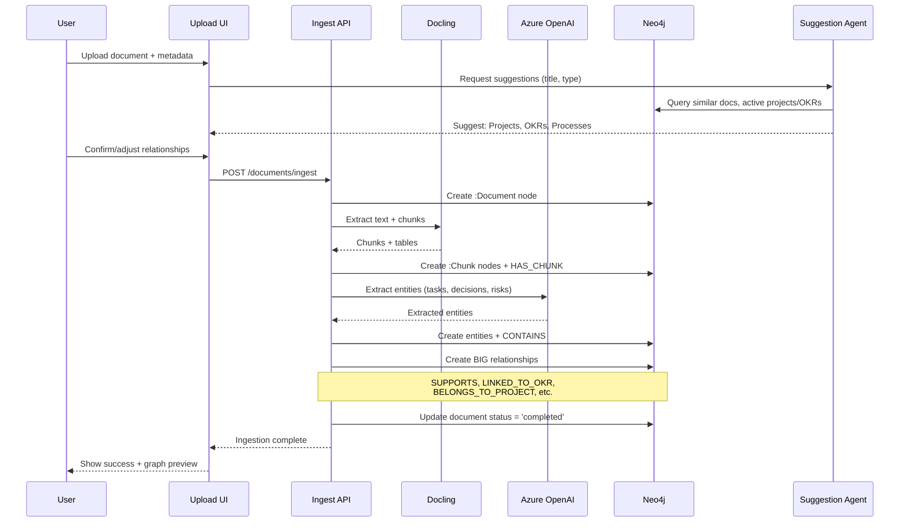

# Document Ingestion Schema - Relacionamentos com BIG

**Created**: 2026-02-27  
**Purpose**: Define schema completo de ingestão de documentos com relacionamentos OKR/Projeto/Processo

---

## Diagrama de Relacionamentos

```mermaid
graph TB
    subgraph Upload["📤 Upload & Metadata"]
        User[":User"]
        Upload["Upload Interface"]
    end
    
    subgraph Document["📄 Document Node"]
        Doc[":Document
        - id
        - title
        - type
        - format
        - sourceFile
        - confidentiality
        - memoryClass
        - createdAt"]
    end
    
    subgraph Processing["⚙️ Processing"]
        Chunk[":Chunk"]
        Knowledge[":Knowledge"]
    end
    
    subgraph BIG["🎯 Business Intent Graph"]
        Objective[":Objective"]
        OKR[":OKR"]
        Project[":Project"]
        Process[":Process"]
        Department[":Department"]
    end
    
    subgraph Extraction["🤖 Extracted Entities"]
        Task[":Task"]
        ActionItem[":ActionItem"]
        Decision[":Decision"]
        Risk[":Risk"]
        Insight[":Insight"]
    end
    
    %% Upload relationships
    User -->|UPLOADED| Doc
    
    %% Processing relationships
    Doc -->|HAS_CHUNK| Chunk
    Chunk -->|RELATES_TO| Knowledge
    
    %% BIG relationships (CORE)
    Doc -->|SUPPORTS| Objective
    Doc -->|LINKED_TO_OKR| OKR
    Doc -->|BELONGS_TO_PROJECT| Project
    Doc -->|DESCRIBES_PROCESS| Process
    Doc -->|BELONGS_TO| Department
    Knowledge -->|SUPPORTS| Objective
    
    %% Extraction relationships
    Doc -->|GENERATES| Task
    Doc -->|CONTAINS| ActionItem
    Doc -->|CONTAINS| Decision
    Doc -->|CONTAINS| Risk
    Doc -->|CONTAINS| Insight
    
    %% Indirect relationships
    Project -->|LINKED_TO_OKR| OKR
    OKR -->|BELONGS_TO_OBJECTIVE| Objective
    Process -->|SUPPORTS| Objective
    
    classDef upload fill:#e3f2fd,stroke:#1976d2,color:#000
    classDef doc fill:#fff3e0,stroke:#ff9800,color:#000
    classDef proc fill:#e8f5e9,stroke:#4caf50,color:#000
    classDef big fill:#fce4ec,stroke:#e91e63,color:#000
    classDef extract fill:#f3e5f5,stroke:#9c27b0,color:#000
    
    class User,Upload upload
    class Doc doc
    class Chunk,Knowledge proc
    class Objective,OKR,Project,Process,Department big
    class Task,ActionItem,Decision,Risk,Insight extract
```

---

## Node: :Document (Extended)

### Properties Base

| Property | Type | Required | Description |
|----------|------|----------|-------------|
| `id` | UUID | Yes | Identificador único |
| `title` | String | Yes | Título do documento |
| `type` | Enum | Yes | Tipo do documento (ver tipos abaixo) |
| `format` | String | Yes | Formato: `pdf`, `docx`, `txt`, `md`, `xlsx` |
| `sourceFile` | String | Yes | Nome do arquivo original |
| `fileSize` | Integer | Yes | Tamanho em bytes |
| `uploadedBy` | UUID | Yes | ID do usuário que fez upload |
| `createdAt` | DateTime | Yes | Data de criação |
| `processedAt` | DateTime | No | Data de processamento |

### Properties de Classificação

| Property | Type | Required | Description |
|----------|------|----------|-------------|
| `confidentiality` | Enum | Yes | `public`, `internal`, `confidential`, `restricted` |
| `memoryClass` | Enum | Yes | `semantic`, `episodic`, `procedural`, `evaluative` |
| `visibility` | Enum | Yes | `personal`, `project`, `corporate`, `public` |
| `status` | Enum | Yes | `pending`, `processing`, `completed`, `failed` |

### Properties de Conteúdo

| Property | Type | Required | Description |
|----------|------|----------|-------------|
| `summary` | String | No | Resumo executivo (gerado por LLM) |
| `keyTopics` | Array[String] | No | Tópicos principais |
| `language` | String | No | Idioma: `pt-BR`, `en-US` |
| `pageCount` | Integer | No | Número de páginas |
| `wordCount` | Integer | No | Contagem de palavras |

### Properties de Relacionamento (Metadata)

| Property | Type | Required | Description |
|----------|------|----------|-------------|
| `linkedProjectIds` | Array[UUID] | No | Projetos vinculados |
| `linkedOkrIds` | Array[UUID] | No | OKRs vinculados |
| `linkedObjectiveIds` | Array[UUID] | No | Objetivos vinculados |
| `linkedProcessId` | UUID | No | Processo descrito |
| `departmentId` | UUID | No | Departamento dono |
| `tags` | Array[String] | No | Tags para categorização |

### Properties de Processamento

| Property | Type | Required | Description |
|----------|------|----------|-------------|
| `chunkCount` | Integer | No | Quantidade de chunks gerados |
| `extractedEntitiesCount` | Integer | No | Entidades extraídas (tasks, decisions, etc.) |
| `processingError` | String | No | Erro de processamento (se houver) |
| `confidence` | Float | No | Confiança da extração (0.0-1.0) |

---

## Document Types (Enum)

| Type | Description | Memory Class Sugerida | Relacionamentos Típicos |
|------|-------------|------------------------|-------------------------|
| `contract` | Contrato | Procedural | Project, Department |
| `report` | Relatório | Evaluative | Objective, OKR, Project |
| `meeting` | Ata de reunião | Episodic | Project, OKR |
| `process_doc` | Documentação de processo | Procedural | Process, Objective |
| `strategic_plan` | Plano estratégico | Semantic | Objective, OKR |
| `technical_spec` | Especificação técnica | Semantic | Project |
| `presentation` | Apresentação | Episodic | Objective, Project |
| `email` | Email | Episodic | Project |
| `note` | Nota/Anotação | Episodic | - |
| `policy` | Política/Norma | Semantic | Department, Process |
| `analysis` | Análise/Estudo | Evaluative | Objective, OKR |
| `other` | Outro | - | - |

---

## Relationships

### Direct BIG Relationships

| Relationship | From | To | Properties | When to Use |
|-------------|------|-----|------------|-------------|
| `SUPPORTS` | Document | Objective | `relevance_score`, `assigned_by`, `assigned_at` | Documento suporta objetivo estratégico |
| `LINKED_TO_OKR` | Document | OKR | `relevance_score` | Documento vinculado a OKR específico |
| `BELONGS_TO_PROJECT` | Document | Project | - | Documento é artefato do projeto |
| `DESCRIBES_PROCESS` | Document | Process | `section` | Documento descreve processo |
| `BELONGS_TO` | Document | Department | - | Documento pertence ao departamento |

### Processing Relationships

| Relationship | From | To | Properties | Description |
|-------------|------|-----|------------|-------------|
| `HAS_CHUNK` | Document | Chunk | `chunk_index` | Documento dividido em chunks |
| `UPLOADED_BY` | Document | User | - | Quem fez upload |
| `RELATES_TO` | Chunk | Knowledge | `confidence` | Chunk gera conhecimento |

### Extraction Relationships

| Relationship | From | To | Properties | Description |
|-------------|------|-----|------------|-------------|
| `GENERATES` | Document | Task | - | Documento gera tarefa |
| `CONTAINS` | Document | ActionItem | - | Documento contém ação |
| `CONTAINS` | Document | Decision | - | Documento contém decisão |
| `CONTAINS` | Document | Risk | - | Documento contém risco |
| `CONTAINS` | Document | Insight | - | Documento contém insight |

---

## Ingestão Flow



---

## Validation Rules

### Required Relationships by Document Type

| Document Type | Required Relationships | Optional Relationships |
|---------------|------------------------|------------------------|
| `contract` | `BELONGS_TO_PROJECT` | `LINKED_TO_OKR`, `BELONGS_TO` |
| `report` | `SUPPORTS` OR `LINKED_TO_OKR` | `BELONGS_TO_PROJECT` |
| `meeting` | `BELONGS_TO_PROJECT` | `LINKED_TO_OKR` |
| `process_doc` | `DESCRIBES_PROCESS` | `SUPPORTS` |
| `strategic_plan` | `SUPPORTS` | `LINKED_TO_OKR` |
| `technical_spec` | `BELONGS_TO_PROJECT` | - |
| `policy` | `BELONGS_TO` | `DESCRIBES_PROCESS` |
| `analysis` | `SUPPORTS` OR `LINKED_TO_OKR` | `BELONGS_TO_PROJECT` |

### Confidentiality Rules

| Confidentiality | Allowed Visibility | Access Control |
|-----------------|-------------------|----------------|
| `public` | All | Anyone |
| `internal` | `corporate`, `project` | Company members |
| `confidential` | `project` | Project team + management |
| `restricted` | `personal` | Owner + C-level |

---

## API Endpoints

### Document Ingestion

```typescript
POST /documents/ingest
Content-Type: multipart/form-data

{
  file: File,
  metadata: {
    title: string,
    type: DocumentType,
    confidentiality: ConfidentialityLevel,
    memoryClass?: MemoryClass,
    linkedProjectIds?: UUID[],
    linkedOkrIds?: UUID[],
    linkedObjectiveIds?: UUID[],
    linkedProcessId?: UUID,
    departmentId?: UUID,
    tags?: string[]
  }
}

Response: {
  success: boolean,
  documentId: UUID,
  chunkCount: number,
  extractedEntities: {
    tasks: number,
    decisions: number,
    risks: number,
    insights: number
  },
  relationships: {
    projects: UUID[],
    okrs: UUID[],
    objectives: UUID[]
  }
}
```

### Suggestion Endpoint

```typescript
POST /documents/suggest-relationships
{
  title: string,
  type: DocumentType,
  summary?: string
}

Response: {
  suggestedProjects: Array<{id: UUID, name: string, confidence: float}>,
  suggestedOkrs: Array<{id: UUID, title: string, confidence: float}>,
  suggestedObjectives: Array<{id: UUID, title: string, confidence: float}>,
  suggestedProcesses: Array<{id: UUID, name: string, confidence: float}>
}
```

### List Entities for Linking

```typescript
GET /documents/linkable-entities
Query params: ?type=project|okr|objective|process

Response: {
  entities: Array<{
    id: UUID,
    name: string,
    type: string,
    status: string,
    department?: string
  }>
}
```

---

## Success Criteria

- ✅ 95%+ dos documentos ingeridos têm pelo menos 1 relacionamento BIG
- ✅ Sugestões automáticas têm precisão ≥ 70%
- ✅ Tempo de ingestão < 30s para documentos < 10MB
- ✅ Validação de relacionamentos obrigatórios por tipo
- ✅ UI intuitiva para seleção de relacionamentos

---

## Related Specs

- **Spec 013**: Ingestion Ecosystem
- **Spec 040**: Business Intent Graph (BIG)
- **Spec 015**: Neo4j Graph Model
- **Spec 024**: Retrieval Orchestration

---

*Schema criado para implementação completa de ingestão de documentos no EKS.*
