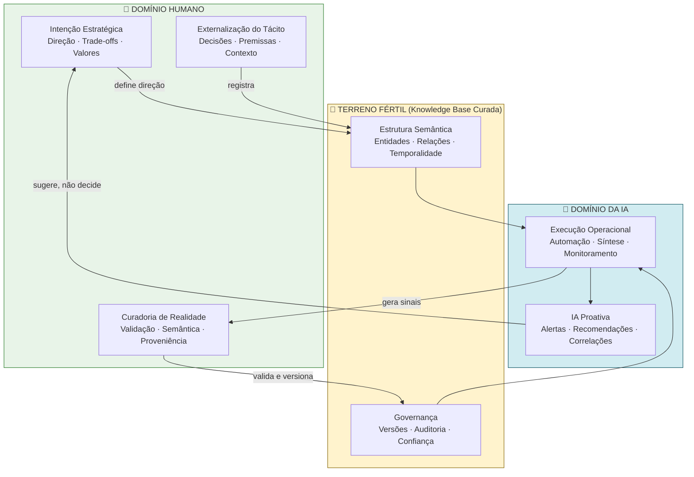

# Knowledge Engineering de Negócio: O Novo Paradigma da Interação Humano–IA Corporativa

> **Autor:** Rodrigo Trindade  
> **Data:** Fevereiro 2026  
> **Versão:** 1.1  
> **Perspectiva:** Sociotécnica e epistemológica de gestão do conhecimento aplicada à IA corporativa  

---

## Sumário Executivo

> **O diferencial competitivo não é saber perguntar para a IA (prompt engineering), mas construir e manter o substrato de realidade — curado, semântico e governado — sobre o qual a IA opera.**

A IA substitui progressivamente o trabalho operacional (inclusive cognitivo). O que ela **não pode fazer** é legitimar intenção estratégica, decidir direção ou assumir responsabilidade. Isso redefine o papel humano como **governador de intenção e curador de realidade corporativa**.

Essa mudança representa a transição do "trabalho" tradicional para o **trabalho de contexto** (*context work*): transformar a realidade operacional e estratégica da empresa em **artefatos informacionais confiáveis**, com semântica e governança, que permitam uma IA proativa e útil.

---

## 1. Fundamentos: "Terreno Fértil" para a IA

### 1.1 O Problema Real

A narrativa dominante foca em **como perguntar** (prompt engineering). A tese aqui inverte a lógica:

> O gargalo real não é "promptar" — é **produzir, validar e manter o substrato de realidade** que a IA usa para raciocinar e agir.

### 1.2 O Pipeline de Construção de Evidência

| Etapa | Descrição |
|-------|-----------|
| **1. Captura do Real** | O que aconteceu, o que foi decidido, por quê, com quais premissas e trade-offs. Fontes: reuniões, e-mails, alinhamentos, exceções. |
| **2. Externalização do Tácito** | Converter "o que está na cabeça" em artefato explícito: racional, premissas, hipóteses, contexto político-operacional. |
| **3. Curadoria e Validação** | O humano valida o mundo que a IA vai usar como base, filtrando ruído, desatualização, **vaidade corporativa** e fragmentos contraditórios. |
| **4. Estruturação Semântica** | Conceitos estáveis, relações explícitas e metadados de proveniência (quem afirmou, quando, com qual confiança). |
| **5. Ciclo de Vida** | Memória viva: versões, cadência de atualização, obsolescência, resolução de conflitos. |

### 1.3 A Cadeia de Transformação

"Extrair informação" não é scraping. É **instituir um processo de externalização + validação** que transforma:

- **Conversa** → decisão rastreável
- **Decisão** → vínculo com objetivo / risco / ação
- **Ação** → evidência de execução e aprendizado

### 1.4 Princípio Central

> **IA boa em empresa é uma função da qualidade do "mundo" que você constrói para ela**, não da "pergunta bonita".

---

## 2. O Novo Human-in-the-Loop: Governança de Intenção

### 2.1 HITL Técnico vs HITL de Negócio

| Dimensão | HITL Técnico | HITL de Negócio (proposto) |
|----------|-------------|---------------------------|
| **Foco** | Aprovar/corrigir respostas | Produzir inputs confiáveis e acionáveis |
| **Papel** | Revisor | Governador de sentido (sensemaking) |
| **Escopo** | Output individual | Modelo de realidade corporativa |
| **Resultado** | Resposta melhorada | Base curada para IA proativa |

### 2.2 Três Facetas do Business HITL

1. **Governança de sentido:** O humano decide o que é relevante, verdade operacional, exceção, política, hipótese ou decisão.
2. **Curadoria como controle de risco:** Reduz alucinação por falta de ancoragem e permite auditoria.
3. **Mantenedor do modelo de realidade:** A IA amplia, mas precisa de base curada para ampliar na direção certa.

### 2.3 Human-in-the-Loop de Intenção

A IA pode **inferir** para onde a empresa *parece* ir, mas não pode **decidir** para onde *deve* ir:

- **Intenção é normativa, não descritiva** — envolve valores, trade-offs e "o que a empresa quer ser"
- **Empresa não tem mente única** — intenção é acordo institucional negociado
- **Accountability** — decisões exigem autoria e responsabilidade; previsão não substitui decision rights

---

## 3. Vantagem Comparativa e Futuro do Trabalho

| Humanos são superiores em | IA é superior em |
|--------------------------|-----------------|
| Atribuir significado | Escala e síntese |
| Validar contexto | Recuperação e correlação |
| Julgar relevância | Monitoramento |
| Negociar conflitos | Ação proativa |
| Externalizar racional | Execução repetível |
| Legitimar decisão | Velocidade |

O trabalho migra para **funções de stewardship**: gerar evidência, registrar decisão, manter coerência semântica, reduzir ambiguidade e alinhar o "mapa" ao território.

### 3.1 Dois Tipos de Trabalho Operacional Substituído

A substituição do operacional pela IA inclui duas classes distintas:

| Classe | Exemplos |
|--------|----------|
| **Operacional-execução** | Coletar info, atualizar sistemas, gerar relatórios, abrir tickets, compor e-mails padrão, consolidar backlog, monitorar indicadores |
| **Operacional-cognitivo** | Síntese, proposta de alternativas, drafts de decisão, "reflexão assistida", criação de conteúdo utilitário, disparar automações |

Ambas são viáveis para IA porque são **otimização local sob regras e histórico**: existe objetivo definido, "como fazer" esperado, e critério de "bom o suficiente".

### 3.2 O Limite Estrutural: Otimizar vs Reorientar

Sem externalização e curadoria humana, a IA fica ótima em **otimizar o que já existe**, mas fraca em **reorientar o sistema** — porque reorientar requer intenção explícita, não apenas correlação histórica.

> **Risco de cristalização:** Modelos podem "adivinhar" probabilisticamente o que você tende a decidir se tiverem histórico suficiente. Mas isso continua sendo previsão, não direção — e pode inclusive **cristalizar vieses e inércia organizacional** ("a empresa sempre fez assim").

### Síntese da Tese

> IA substitui execução e parte da cognição operacional; humanos viram a **camada soberana de intenção, sentido e decisão** — e o trabalho crítico é construir a realidade curada onde a IA opera.

---

## 4. As 10 Competências do Profissional de Alto Impacto na Era da IA

**Prompt engineering é interface.** O profissional de alto impacto é uma combinação de: *arquiteto de intenção + curador de realidade + designer de workflows + avaliador de qualidade + líder de governança.*

### 4.1 Engenharia de Intenção e Decisão

Capacidade de formular direção: objetivos, trade-offs, restrições, apetite a risco, critérios de sucesso e decision rights. A IA propõe opções; o humano **define o que é "certo" para a empresa** e assume a decisão.

### 4.2 Externalização do Tácito (Sensemaking)

Transformar "o que está na cabeça" em artefato explícito: racional, premissas, hipóteses, exceções e contexto político-operacional. Impede a IA de operar só por padrão histórico e inércia.

### 4.3 Curadoria de Evidência e Relevância (Reality Stewardship)

Selecionar, validar e versionar fontes; distinguir fato, interpretação, hipótese e decisão. Sem isso, a IA fica "produtiva" mas frágil — respostas convincentes sobre base podre.

### 4.4 Estruturação Semântica Aplicada (Knowledge Engineering de Negócio)

Criar e manter **modelos de entidades e relacionamentos** (decisões ↔ projetos ↔ riscos ↔ KPIs ↔ pessoas), com proveniência e temporalidade. Não é "conectar dados" — é **dar forma ao significado**.

### 4.5 Design de Workflows Agênticos (Orquestração)

Quebrar processos em etapas delegáveis, definir checkpoints humanos, handoffs, gatilhos e ferramentas. Desenhar loops: "IA faz → humano decide → IA executa".

### 4.6 Alfabetização de Avaliação (Evaluation Literacy)

Construir critérios objetivos de qualidade: acurácia factual, utilidade, completude, risco, custo, tempo, aderência a políticas. Sem isso, a empresa cai em "demo-driven adoption" — parece bom, mas não sustenta produção.

### 4.7 Governança, Risco e Compliance

Entender privacidade, segurança, vazamento de contexto, controle de acesso, rastreabilidade, auditoria e responsabilidade. Equivalente moderno de "controle interno", aplicado a agentes de IA.

### 4.8 Liderança Sociotécnica (Mudança de Comportamento)

Coordenar pessoas para **produzir contexto e decisão rastreável**: rituais, cadência, padrões de registro, acordos sobre "o que entra na memória corporativa". Sem esta camada, não existe IA proativa — existe automação sem rumo.

### 4.9 Comunicação de Alta Densidade (especialmente por Voz)

A voz é vantagem real quando se domina **fala estruturada**. A habilidade não é "falar com a IA", é **narrar intenção + evidência + decisão em blocos claros**, para virar registro acionável (transcrição, sumarização, extração de entidades/decisões). Acelera brutalmente a criação de "terreno fértil".

### 4.10 Pensamento de Produto e de Sistemas

Ligar conhecimento → decisão → execução → métrica → aprendizado. IA boa em empresa é um **sistema de feedback**; quem entende loops e métricas evita "IA ornamental".

---

## 5. Desdobramento por Nível Hierárquico

Cada nível hierárquico representa um **loop de interação humano–IA** com natureza distinta:

- **Estratégico:** governa *intenção* (para onde vamos) + legitimidade da decisão
- **Tático:** traduz intenção em *sistema executável* (prioridades, cadência, critérios, workflows)
- **Operacional:** produz *evidência e realidade curada* (o que aconteceu) + execução assistida

### 5.1 Nível Estratégico (C-level, diretoria, liderança de unidade)

**Função humana irredutível:** Definir e sustentar intenção — direção, trade-offs, apetite a risco, critérios de sucesso e decision rights. A IA pode sugerir cenários; não pode legitimar "o que a empresa quer ser".

#### Skills Centrais

| Skill | Descrição |
|-------|-----------|
| **Engenharia de intenção** | Converter ambiguidade em objetivo, restrições, princípios, trade-offs aceitáveis e decisões tomadas. Distinguir "previsão" de "mandato". |
| **Governança de conhecimento** | Definir o que entra no "sistema de verdade" corporativo. Patrocinar política de evidência: fato vs hipótese vs opinião vs decisão. |
| **Avaliação executiva** | Julgar utilidade e risco: impacto estratégico, risco reputacional, custo de erro. Aprovar padrões de auditoria. |
| **Narrativa estratégica** | Transformar sinais e fatos em narrativa acionável. Alinhar múltiplos stakeholders. |

#### Interação Típica com IA

- "Mostre opções, consequências e riscos com base em evidências curadas."
- "Monitore o ambiente e me alerte sobre desvios relevantes *segundo meus critérios*."
- "Mantenha coerência entre decisões e objetivos, sinalizando contradições."

#### Protocolo de Voz Estratégico (2–4 min)

A voz estratégica não é "conversa" — é **ato executivo estruturado** para virar registro, decisão e governança.

| Bloco | Conteúdo |
|-------|----------|
| **1. Direção** | O que queremos mover e por quê agora |
| **2. Critério** | Como vamos julgar certo vs errado (trade-offs, risco, qualidade) |
| **3. Sinais/Evidências** | 3–5 fatos com fonte/âncora |
| **4. Decisão / não-decisão** | O que foi decidido, o que está aberto |
| **5. Mandatos** | Guardrails + o que agentes podem executar sem nova aprovação |

**Artefatos derivados:** Registro de decisão (com racional e premissas), atualização de OKRs, alterações em guardrails, critérios de alerta.

---

### 5.2 Nível Tático (gestores, PMs, líderes de área, arquitetos, coordenadores)

**Função humana irredutível:** Transformar intenção em execução consistente — desenhar o sistema de trabalho (cadência, priorização, critérios, checkpoints) e manter alinhamento entre áreas.

#### Skills Centrais

| Skill | Descrição |
|-------|-----------|
| **Tradução estratégia → execução** | Converter direção em iniciativas, dependências, hipóteses testáveis, métricas e Definition of Done. Evitar "execução sem tese". |
| **Design de workflows agênticos** | Quebrar processos em etapas delegáveis com inputs obrigatórios, checkpoints humanos, critérios de aceitação e escalonamento. |
| **Evaluation literacy tática** | Criar baterias de teste: exemplos, casos de borda, thresholds, política de erro aceitável. Medir qualidade operacionalmente. |
| **Curadoria e gestão de conhecimento** | Definir padrões de registro: reuniões → decisões → tarefas → riscos → vínculo com objetivos. Resolver conflitos de versão. |

#### Interação Típica com IA

- "Desenhe o fluxo e gere artefatos; eu valido critérios e dono."
- "Crie variações e simule impactos; eu escolho e priorizo."
- "Monitore execução e faça triagem de riscos; escale quando cruzar guardrails."

#### Protocolo de Voz Tático (60–120s)

Voz tática é **briefing operacional de alta qualidade** para delegar a agentes e humanos com mínimo ruído.

| Bloco | Conteúdo |
|-------|----------|
| **1. Contexto mínimo** | Projeto / área / por que agora |
| **2. Escopo** | O que entra e o que não entra |
| **3. Critério de pronto** | DoD + qualidade + risco |
| **4. Restrições e dependências** | Tempo, compliance, sistemas, pessoas |
| **5. Plano de execução** | Etapas + checkpoints humanos + gatilhos de escalonamento |

**Artefatos derivados:** Plano de execução, histórias/tarefas com critérios, runbooks, playbooks, conjunto de avaliação, políticas de exceção.

---

### 5.3 Nível Operacional (ICs, analistas, especialistas, suporte)

**Função humana irredutível:** Produzir realidade confiável (captura + validação + contexto) e conduzir execução diária com agentes, tratando exceções.

#### Skills Centrais

| Skill | Descrição |
|-------|-----------|
| **Externalização do tácito no detalhe certo** | Registrar "o que aconteceu" com contexto e consequência, sem virar romance. Diferenciar fato vs interpretação vs hipótese vs decisão. |
| **Higiene de informação e proveniência** | Ancorar evidência: onde está, qual versão, data, quem validou. Marcar confiança e sinalizar lacunas. |
| **Execução assistida por agentes** | Delegar micro-tarefas para IA (rascunhos, sínteses, checagens, automações). Validar outputs com critérios claros. |
| **Gestão de exceções** | Detectar quando "saiu do script" e escalar com contexto suficiente para decisão. |

#### Interação Típica com IA

- "Transforme este evento em registro estruturado + próximos passos."
- "Consolide e compare versões; destaque inconsistências."
- "Sugira opções; eu valido com evidência e contexto local."

#### Protocolo de Voz Operacional (30–60s)

Voz operacional é **log estruturado**: rápido, objetivo, auditável.

| Bloco | Conteúdo |
|-------|----------|
| **1. Evento** | O que ocorreu |
| **2. Impacto** | Por que importa (risco, custo, cliente, prazo) |
| **3. Evidência** | Onde está / qual fonte / data |
| **4. Hipótese** | O que você acha que explica (marcando como hipótese) |
| **5. Ação e dono** | O que foi feito / próximo passo / quem assume |

**Artefatos derivados:** Registro de evento/decisão local, atualização de tarefa, nota de risco, lição aprendida, evidência anexada.

---

## 6. Visão Unificadora: O Que Muda por Nível

```
┌─────────────────────────────────────────────────────────────────────┐
│                    MODELO DE INTERAÇÃO HUMANO–IA                    │
├──────────────┬──────────────────────┬───────────────────────────────┤
│    NÍVEL     │   DOMÍNIO HUMANO     │    O QUE PRODUZ (VOZ)        │
├──────────────┼──────────────────────┼───────────────────────────────┤
│ ESTRATÉGICO  │ Intenção (normativo) │ Mandato + guardrails          │
│              │ Critérios + direção  │ Decisões + racional           │
├──────────────┼──────────────────────┼───────────────────────────────┤
│ TÁTICO       │ Tradução + sistema   │ Workflow + critérios          │
│              │ Orquestração         │ Planos + DoD                  │
├──────────────┼──────────────────────┼───────────────────────────────┤
│ OPERACIONAL  │ Evidência + realidade│ Sinal + registro estruturado  │
│              │ Captura + validação  │ Exceções + lições aprendidas  │
└──────────────┴──────────────────────┴───────────────────────────────┘
```

A **voz** é acelerador em todos os níveis — mas cada nível tem formato distinto porque cada um produz um tipo diferente de "contexto fértil":

- **Estratégico** produz **mandato**
- **Tático** produz **workflow e critérios**
- **Operacional** produz **evidência e sinal**

---

## 7. Diagrama Conceitual



---

## 8. Glossário

| Termo | Definição |
|-------|-----------|
| **Terreno Fértil** | Substrato de dados curados, semanticamente estruturados e governados que permite à IA operar com precisão e relevância. |
| **Business HITL** | Human-in-the-loop de negócio: humano que valida a realidade (não apenas outputs) que a IA utiliza. |
| **HITL de Intenção** | Papel humano de definir direção estratégica e assumir compromissos — função que a IA não pode substituir. |
| **Knowledge Engineering de Negócio** | Disciplina de captura, validação e estruturação semântica do conhecimento corporativo para consumo por IA. |
| **Reality Stewardship** | Curadoria ativa e contínua da base de conhecimento: seleção, validação, versionamento, resolução de conflitos. |
| **Externalização do Tácito** | Processo de converter conhecimento implícito (na cabeça das pessoas) em artefatos explícitos e acionáveis. |
| **Estruturação Semântica** | Organização de dados por significado (entidades, relações, proveniência), não apenas por estrutura técnica. |
| **Decision Rights** | Autoridade formal para tomar e assumir responsabilidade por decisões — não delegável à IA. |
| **Evaluation Literacy** | Capacidade de construir critérios objetivos para avaliar qualidade de outputs de IA. |
| **Protocolo de Voz** | Formato estruturado de comunicação oral, otimizado por nível hierárquico, para gerar registros acionáveis. |
| **Context Work** | Trabalho de contexto: transformar a realidade operacional e estratégica em artefatos informacionais confiáveis para consumo por IA. |
| **Demo-Driven Adoption** | Antipadrão em que a empresa adota IA porque "parece bom" em demonstração, sem critérios de avaliação que sustentem produção. |
| **IA Ornamental** | IA sem conexão com loops de feedback e métricas reais — presente no discurso, ausente no impacto. |
| **Execução sem Tese** | Antipadrão tático em que a IA entrega muito, mas sem coerência com hipótese de negócio ou objetivo estratégico. |
| **Vaidade Corporativa** | Viés informacional onde dados refletem narrativa desejada, não realidade operacional — risco para base curada. |

---

## 9. Conexão com o EKS (Enterprise Knowledge System)

Este documento fundamenta conceitualmente o **por quê** do EKS existir:

- O EKS é a **infraestrutura técnica e semântica** que materializa o "terreno fértil"
- A ontologia do EKS mapeia exatamente as entidades descritas aqui: decisões, projetos, riscos, KPIs, pessoas, premissas
- O grafo de conhecimento é o mecanismo de **estruturação semântica com proveniência e temporalidade**
- Os agentes do EKS implementam os **workflows agênticos** com checkpoints humanos
- A memória corporativa do EKS operacionaliza o **ciclo de vida** (versões, atualização, obsolescência)

> O EKS é a resposta de engenharia para a tese descrita neste documento: se o diferencial é a qualidade do "mundo" construído para a IA, então precisamos de um sistema que capture, estruture, governe e evolua esse mundo.

---

## 10. Rubricas de Avaliação por Nível (Referência para Currículo)

As competências descritas podem ser mensuradas por rubricas objetivas, permitindo transformar este framework em programa de desenvolvimento profissional:

| Rubrica | Estratégico | Tático | Operacional |
|---------|------------|--------|-------------|
| **Clareza de intenção** | Direção formulada com trade-offs e critérios explícitos | Hipóteses testáveis vinculadas a objetivos | Registro com distinção fato/hipótese/decisão |
| **Densidade informacional** | Narrativa com sinais ancorados e racional | Briefing completo em 60–120s | Log estruturado em 30–60s |
| **Rastreabilidade** | Decisões com proveniência e premissas | DoD com critérios e dependências mapeadas | Evidência com fonte, versão e data |
| **Qualidade de DoD** | Critérios de sucesso estratégico definidos | Baterias de teste e thresholds configurados | Validação de outputs com critérios claros |
| **Taxa de retrabalho por output de IA** | Baixa (guardrails bem definidos) | Controlada (workflows com checkpoints) | Mínima (delegação com critérios objetivos) |

---

*Documento gerado a partir de reflexão estruturada sobre o futuro do trabalho com IA corporativa. Fevereiro 2026.*
