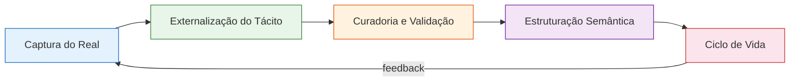
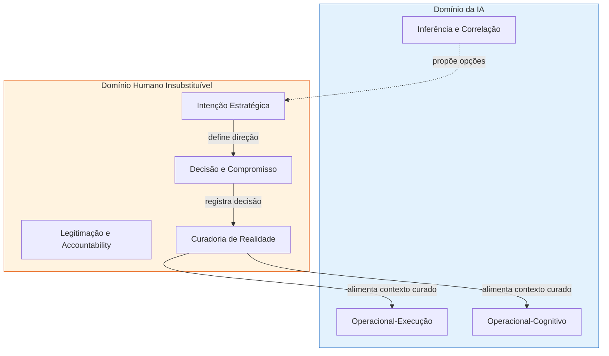
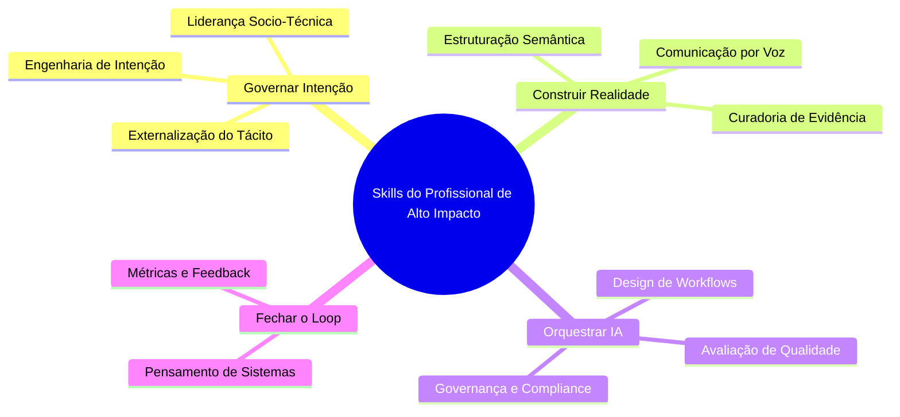
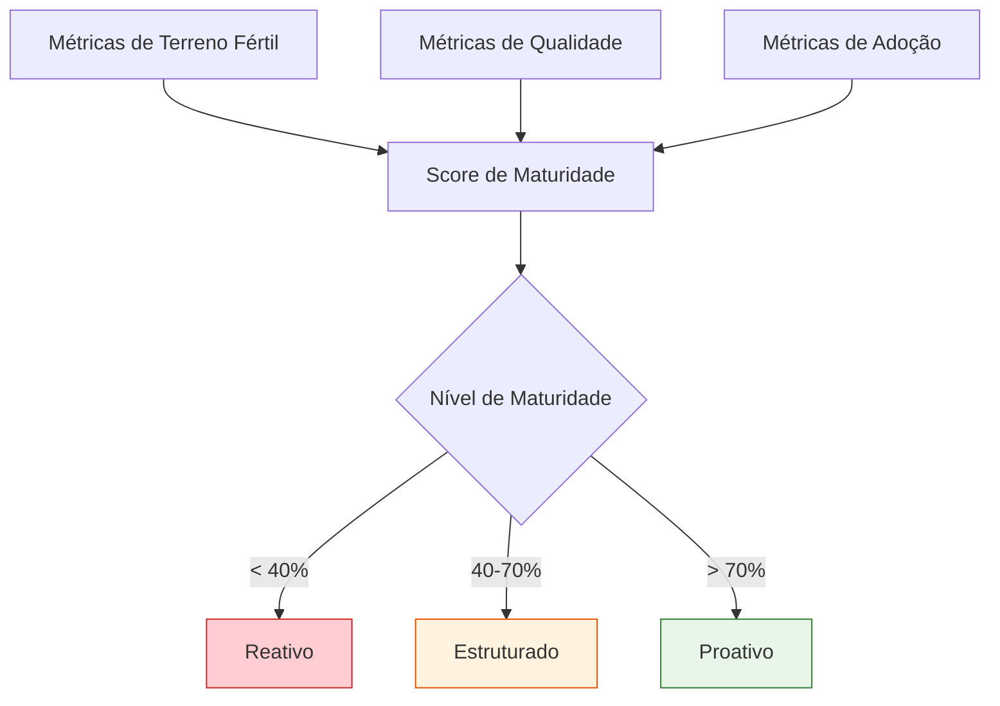
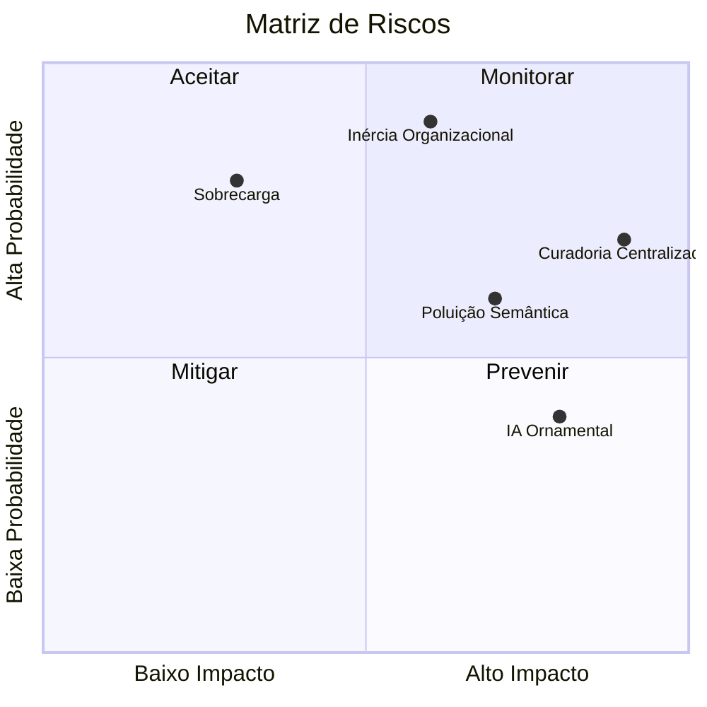

# Knowledge Engineering de Negócio

> **Documento conceitual** — Formalização da tese de que o diferencial competitivo na era da IA corporativa não é *prompt engineering*, mas a capacidade humana de capturar, validar e estruturar semanticamente o conhecimento que a organização produz e decide.

**Projeto**: EKS — Enterprise Knowledge System  
**Autor**: Rodrigo Trindade  
**Versão**: 1.0  
**Data**: 2025-02-19  
**Origem**: Conversa exploratória (chat01.txt)

---

## 1. Tese Central

> **"O gargalo real não é promptar. É construir o mundo onde a IA opera."**

Mais do que aprender a formular perguntas para a IA, profissionais e organizações precisam aprender a **gerar terreno fértil** — produzir, validar e direcionar conteúdo relevante que reflita o que acontece no mundo real da empresa.

Isso desloca o eixo de valor:

| Visão convencional | Visão Knowledge Engineering de Negócio |
|----|-----|
| Saber perguntar (prompt engineering) | Saber construir a realidade curada onde a IA opera |
| IA reativa a comandos | IA proativa baseada em dados curados |
| Dados técnicos conectados | Dados **semanticamente** estruturados |
| Human-in-the-loop técnico | **Business Human-in-the-Loop** |

---

## 2. O Conceito: Terreno Fértil

"Terreno fértil" é a metáfora para o **substrato informacional confiável** que permite à IA raciocinar e agir com precisão no contexto corporativo. Construí-lo exige um pipeline humano de cinco estágios:

### 2.1 Captura do Real

Registrar o que aconteceu, o que foi decidido, por quê, com quais premissas, riscos e trade-offs. Fontes primárias: reuniões, e-mails, mensagens, alinhamentos, exceções operacionais.

### 2.2 Externalização do Tácito

A estratégia real — o "por que fazemos isso" — raramente está em bancos estruturados. Está na **cabeça das pessoas** e em rastros narrativos. O trabalho crítico é **converter conhecimento tácito em explícito** sem destruir nuance.

### 2.3 Curadoria e Validação Orientada a Negócio

Não é o human-in-the-loop técnico (aprovar resposta do modelo). É o **human-in-the-loop de realidade**: o humano valida o mundo que a IA vai usar como base, garantindo que ela não opere sobre ruído, desatualização, vaidade corporativa ou fragmentos contraditórios.

### 2.4 Estruturação Semântica (não apenas técnica)

Não basta "conectar dados". É preciso dar forma ao significado:

- **Conceitos estáveis**: entidades, papéis, iniciativas, decisões, políticas, métricas
- **Relações explícitas**: dependências, ownership, impacto estratégico, exceções
- **Metadados de proveniência**: quem afirmou, quando, em que contexto, com qual confiança

### 2.5 Ciclo de Vida e Atualização

Terreno fértil não é acervo estático. É **memória viva**: versões, cadência de atualização, obsolescência, divergências e resolução de conflitos.

```mermaid
flowchart LR
    A[Captura do Real] --> B[Externalização do Tácito]
    B --> C[Curadoria e Validação]
    C --> D[Estruturação Semântica]
    D --> E[Ciclo de Vida]
    E -->|feedback| A
    
    style A fill:#e3f2fd,stroke:#1565c0
    style B fill:#e8f5e9,stroke:#2e7d32
    style C fill:#fff3e0,stroke:#e65100
    style D fill:#f3e5f5,stroke:#6a1b9a
    style E fill:#fce4ec,stroke:#c62828
```

---

## 3. Business Human-in-the-Loop (BHITL)

O conceito proposto vai além do HITL tradicional (aprovar outputs de modelo). Trata-se de três funções distintas:

### 3.1 Governança de Sentido (Sensemaking)

O humano decide o que é relevante, o que é verdade operacionalmente, o que é exceção, o que é política, o que é hipótese e o que virou decisão.

### 3.2 Curadoria como Controle de Risco

Reduz alucinação por falta de ancoragem, reduz decisão baseada em informação vencida e permite auditoria ("por que a IA recomendou isso?").

### 3.3 Humano como Mantenedor do Modelo de Realidade

A IA não substitui — ela amplia. Mas precisa de uma base curada. O humano é o **mantenedor do modelo de realidade corporativa**.

> **Síntese**: BHITL desloca a ideia de "aprovar outputs" para **"produzir inputs confiáveis e semanticamente acionáveis"**.

---

## 4. O Limite da IA: Inferência ≠ Mandato

Agentes de IA tendem a substituir trabalhos operacionais — inclusive operacional-cognitivo (síntese, propostas, drafts de decisão, criação de conteúdo). Porém, existe um limite fundamental:

> **A IA pode inferir para onde a empresa *parece* estar indo. Não pode decidir para onde ela *deve* ir.**

Três razões estruturais:

1. **Intenção estratégica é normativa**, não descritiva — envolve valores, trade-offs, apetite a risco
2. **Empresa não tem mente única** — intenção é acordo institucional negociado; sem ato de decisão explícito, a IA só extrapola padrões
3. **Accountability** — decisões estratégicas exigem autoria e responsabilidade; previsão não substitui direito de decisão (*decision rights*)

Isso define o conceito de **Human-in-the-Loop de Intenção**: o humano não está ali para corrigir resposta, está para **definir direção e assumir compromissos**.

```mermaid
flowchart TD
    subgraph IA["Domínio da IA"]
        O1[Operacional-Execução]
        O2[Operacional-Cognitivo]
        O3[Inferência e Correlação]
    end
    
    subgraph HUMANO["Domínio Humano Insubstituível"]
        H1[Intenção Estratégica]
        H2[Decisão e Compromisso]
        H3[Legitimação e Accountability]
        H4[Curadoria de Realidade]
    end
    
    O3 -.->|propõe opções| H1
    H1 -->|define direção| H2
    H2 -->|registra decisão| H4
    H4 -->|alimenta contexto curado| O1
    H4 -->|alimenta contexto curado| O2
    
    style IA fill:#e3f2fd,stroke:#1565c0
    style HUMANO fill:#fff3e0,stroke:#e65100
```

---

## 5. Onde Mora a Estratégia (e por que a IA não captura sozinha)

Os ativos estratégicos são majoritariamente **narrativos e tácitos**. Bancos estruturados guardam transações; **não guardam intenção, premissa, decisão, contexto político-operacional e racionalidade**.

| Fonte | O que contém | Estado atual |
|-------|-------------|-------------|
| E-mails e threads | Negociação e alinhamento | Disperso, não rastreável |
| Reuniões | Decisão e racional | Perdido após encerramento |
| Cabeça das pessoas | Estratégia, premissas, exceções | Tácito, vulnerável a turnover |

"Extrair informação" aqui não é scraping. É **instituir um processo de externalização + validação** que transforma:

- **Conversa** → decisão rastreável
- **Decisão** → vínculo com objetivo / risco / ação
- **Ação** → evidência de execução e aprendizado

---

## 6. Os 10 Skills do Profissional de Alto Impacto

Se agentes assumem o operacional (inclusive cognitivo), a habilidade humana diferencial migra para **governar intenção + construir realidade curada**.

### 6.1 Engenharia de Intenção e Decisão
Formular direção: objetivos, trade-offs, restrições, apetite a risco, critérios de sucesso e *decision rights*. A IA propõe opções; o humano define o que é "certo" para a empresa.

### 6.2 Externalização do Tácito (Sensemaking)
Transformar "o que está na cabeça" em artefato explícito: racional, premissas, hipóteses, exceções e contexto político-operacional.

### 6.3 Curadoria de Evidência e Relevância (Reality Stewardship)
Selecionar, validar e versionar fontes; distinguir fato, interpretação, hipótese e decisão.

### 6.4 Estruturação Semântica Aplicada (Knowledge Engineering de Negócio)
Criar e manter modelos de entidades/relacionamentos (decisões ↔ projetos ↔ riscos ↔ KPIs ↔ pessoas), com proveniência e temporalidade.

### 6.5 Design de Workflows Agênticos (Orquestração)
Quebrar processos em etapas delegáveis, definir checkpoints humanos, handoffs, gatilhos e ferramentas. Desenhar loops: "IA faz → humano decide → IA executa".

### 6.6 Alfabetização de Avaliação (Evaluation Literacy)
Construir critérios objetivos de qualidade: acurácia factual, utilidade, completude, risco, custo, tempo, aderência a políticas. Sem isso, a empresa cai em *demo-driven adoption*.

### 6.7 Governança, Risco e Compliance
Entender privacidade, segurança, vazamento de contexto, controle de acesso, rastreabilidade, auditoria e responsabilidade — o equivalente moderno de "controle interno" aplicado a agentes.

### 6.8 Liderança Socio-Técnica
Coordenar pessoas para produzir contexto e decisão rastreável: rituais, cadência, padrões de registro, acordos de "o que entra na memória corporativa".

### 6.9 Comunicação de Alta Densidade (especialmente por Voz)
Voz é vantagem real quando se domina **fala estruturada**. A habilidade não é "falar com a IA", é narrar intenção + evidência + decisão em blocos claros, para virar registro acionável (transcrição, sumarização, extração de entidades/decisões).

### 6.10 Pensamento de Produto e de Sistemas
Ligar conhecimento → decisão → execução → métrica → aprendizado. IA boa em empresa é um **sistema de feedback**; quem entende loops e métricas evita "IA ornamental".

```mermaid
mindmap
  root((Skills do Profissional de Alto Impacto))
    Governar Intenção
      Engenharia de Intenção
      Externalização do Tácito
      Liderança Socio-Técnica
    Construir Realidade
      Curadoria de Evidência
      Estruturação Semântica
      Comunicação por Voz
    Orquestrar IA
      Design de Workflows
      Avaliação de Qualidade
      Governança e Compliance
    Fechar o Loop
      Pensamento de Sistemas
      Métricas e Feedback
```

---

## 7. Vantagem Comparativa: Humano vs IA

| Humano é superior em | IA é superior em |
|---|---|
| Atribuir significado | Escala de processamento |
| Validar contexto | Síntese e recuperação |
| Julgar relevância | Correlação e monitoramento |
| Negociar conflitos | Ação proativa automatizada |
| Externalizar racional | Consistência e velocidade |

O trabalho migra para **funções de stewardship** (curadoria/guarda) do conhecimento corporativo: gerar evidência, registrar decisão, manter coerência semântica, reduzir ambiguidade e manter o "mapa" alinhado ao território.

---

## 8. Síntese Final

**Prompt engineering** é interface.

O novo profissional de alto impacto é uma combinação de:

> **Arquiteto de Intenção + Curador de Realidade + Designer de Workflows + Avaliador de Qualidade + Líder de Governança**

A IA corporativa é um **sistema socio-técnico dependente de curadoria humana de realidade**. O diferencial não é prompt engineering, mas **Knowledge Engineering de Negócio**: captura, validação e estruturação semântica do que a empresa sabe e decide.

---

## 9. Conexão com o EKS

O EKS (Enterprise Knowledge System) é a **materialização tecnológica** desta tese:

| Conceito deste documento | Implementação no EKS |
|---|---|
| Terreno Fértil | Grafo semântico Neo4j como substrato curado |
| Externalização do Tácito | Knowledge Pipeline (captura via chat, voz, documentos) |
| Curadoria BHITL | Graph Curation + User Memory Decision |
| Estruturação Semântica | Ontologia EKS (BIG + IDG + entidades de negócio) |
| Ciclo de Vida | Memória Multi-Nível (Short/Medium/Long term) |
| IA Proativa | Agentes multi-especializados (PLA, PIA, Router) |
| Governança | Observability Dashboard + rastreabilidade de decisões |

---

## 10. Métricas de Maturidade

Para que o Knowledge Engineering de Negócio não se torne apenas conceito, é preciso medir sua efetividade através de KPIs concretos.

### 10.1 KPIs de Terreno Fértil

| Métrica | O que mede | Meta inicial | Como medir |
|---------|------------|--------------|------------|
| **Taxa de Externalização do Tácito** | % de decisões estratégicas registradas | 60% | Contagem de decisões rastreáveis vs total de decisões críticas |
| **Tempo de Captura → Estruturação** | Velocidade do pipeline de conhecimento | < 48h | Timestamp desde captura até estruturação semântica |
| **Cobertura de Fontes** | % de fontes estratégicas mapeadas | 80% | E-mails, reuniões, documentos vs universo total |
| **Frequência de Atualização** | Cadência de refresh do substrato | Diária/Semanal | Logs de atualização do grafo de conhecimento |

### 10.2 KPIs de Qualidade

| Métrica | O que mede | Meta inicial | Como medir |
|---------|------------|--------------|------------|
| **Acurácia Factual** | % de informações verificáveis | 95% | Verificação cruzada com fontes primárias |
| **Relevância Contextual** | % de respostas úteis ao negócio | 85% | Avaliação humana por amostragem |
| **Consistência Semântica** | % de conceitos sem contradição | 90% | Análise de inconsistências no grafo |
| **Proveniência Completa** | % de informações com metadados | 80% | Verificação de quem/onde/quando/confiança |

### 10.3 KPIs de Adoção e Impacto

| Métrica | O que mede | Meta inicial | Como medir |
|---------|------------|--------------|------------|
| **Taxa de Curadoria Ativa** | % de usuários curando conteúdo | 40% | Logs de interações de curadoria |
| **Redução de Retrabalho** | Tempo economizado em buscas | 30% | Comparação tempo antes/depois |
| **Velocidade de Decisão** | Tempo da decisão → execução | 25% | Métricas de processo organizacional |
| **Satisfação do Usuário** | Percepção de valor | 4.0/5.0 | Pesquisas NPS/CSAT |

### 10.4 Dashboard de Maturidade

```mermaid
flowchart TD
    A[Métricas de Terreno Fértil] --> D[Score de Maturidade]
    B[Métricas de Qualidade] --> D
    C[Métricas de Adoção] --> D
    
    D --> E{Nível de Maturidade}
    E -->|< 40%| F[Reativo]
    E -->|40-70%| G[Estruturado]
    E -->|> 70%| H[Proativo]
    
    style F fill:#ffcdd2,stroke:#c62828
    style G fill:#fff3e0,stroke:#e65100
    style H fill:#e8f5e9,stroke:#2e7d32
```

---

## 11. Riscos e Armadilhas

Implementar Knowledge Engineering de Negócio sem atenção aos riscos pode criar mais problemas que soluções.

### 11.1 Risco de "Curadoria Centralizada"

**Descrição**: Concentrar poder de curadoria em poucas pessoas cria bottleneck e ponto único de falha.

**Sintomas**:
- Decisões paralisadas esperando validação do "curador-chefe"
- Conhecimento filtrado por viés individual
- Turnover do curador = perda de memória organizacional

**Mitigação**:
- Modelo distribuído de curadoria (múltiplos curadores por domínio)
- Sistema de reputação e confiança entre curadores
- Protocolos de handoff e backup

### 11.2 Risco de "IA Ornamental"

**Descrição**: Sistema existe tecnicamente mas não agrega valor real ao negócio.

**Sintomas**:
- Baixa taxa de uso após implementação
- Respostas genéricas ou irrelevantes
- Processos paralelos (pessoais vs sistema)

**Mitigação**:
- KPIs de impacto direto (redução de retrabalho, velocidade de decisão)
- Integração com workflows existentes
- Feedback loop contínuo com usuários

### 11.3 Risco de "Poluição Semântica"

**Descrição**: Conceitos mal definidos ou inconsistentes geram ruído e desconfiança no sistema.

**Sintomas**:
- Contradições no grafo de conhecimento
- Decisões baseadas em informação desatualizada
- Perda de confiança nas recomendações da IA

**Mitigação**:
- Ontologia rigorosa com definições claras
- Versionamento de conceitos e depreciação controlada
- Auditorias periódicas de consistência semântica

### 11.4 Risco de "Inércia Organizacional"

**Descrição**: Resistência cultural a externalizar conhecimento tácito.

**Sintomas**:
- Pessoas continuam usando canais informais
- Falta de incentivos para registrar conhecimento
- Medo de "perder poder" ao compartilhar informação

**Mitigação**:
- Incentivos alinhados à curadoria (bonificação, reconhecimento)
- Demonstração clara de valor pessoal e organizacional
- Processos graduais de adoção com quick wins

### 11.5 Risco de "Sobrecarga de Informação"

**Descrição**: Capturar tudo sem filtro gera ruído que dificulta encontrar o relevante.

**Sintomas**:
- Buscas retornam milhares de resultados irrelevantes
- Tempo crescente para encontrar informação correta
- Abandono do sistema por complexidade

**Mitigação**:
- Filtros de relevância por contexto e perfil
- Sistema de priorização e importância
- Mecanismos de sumarização automática

### 11.6 Matriz de Risco vs Impacto

```mermaid
quadrantChart
    title Matriz de Riscos
    x-axis Baixo Impacto --> Alto Impacto
    y-axis Baixa Probabilidade --> Alta Probabilidade
    
    quadrant-1 Monitorar
    quadrant-2 Aceitar
    quadrant-3 Mitigar
    quadrant-4 Prevenir
    
    Sobrecarga: [0.3, 0.8]
    Poluição Semântica: [0.7, 0.6]
    IA Ornamental: [0.8, 0.4]
    Curadoria Centralizada: [0.9, 0.7]
    Inércia Organizacional: [0.6, 0.9]
```

---

## Referências

- **Origem**: Conversa exploratória registrada em `chat01.txt`
- **Projeto**: [EKS — Enterprise Knowledge System](../README.md)
- **Conceitos relacionados**: Context Engineering, GraphRAG, Ontologia Corporativa