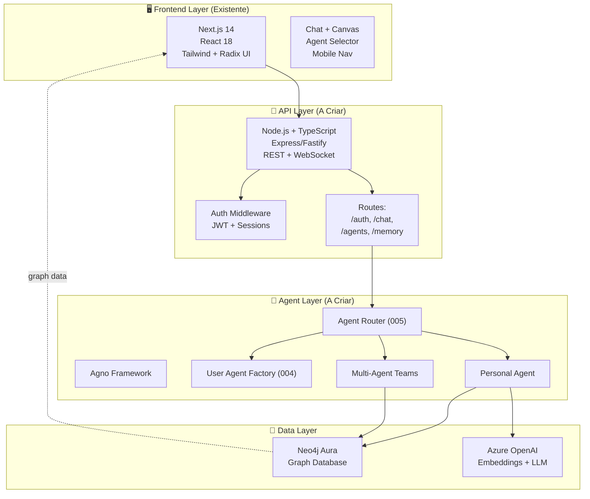
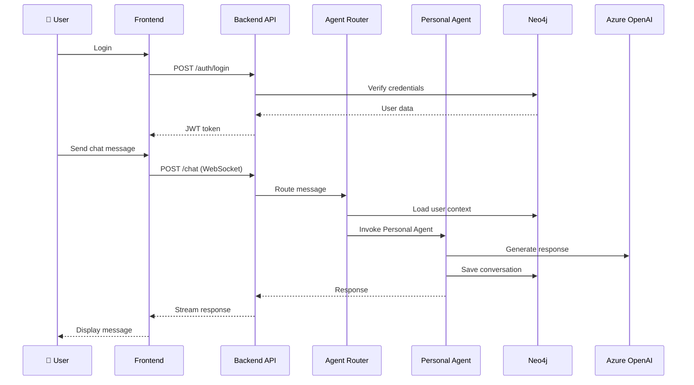

# MVP Core - Implementation Plan

**Created**: 2025-12-07  
**Status**: Draft  
**Scope**: Backend + Agents + Frontend Integration for CVC Hub MVP

---

## Executive Summary

Plano de implementação do MVP Core do CVC Hub, integrando o frontend Next.js já existente com backend Node.js/TypeScript e sistema de agentes Python/Agno, utilizando Neo4j como database central.

### Objetivos

- Criar backend API que sustente o frontend existente
- Implementar sistema de autenticação e administração
- Desenvolver orquestração de agentes multi-tier
- Integrar memória, chat e conhecimento com Neo4j
- Preparar base para features avançadas (retrieval, observability)

### Timeline Estimado

**Total: 9-10 semanas** (assumindo 1 dev full-time)

---

## System Architecture

### High-Level Architecture



### Component Interaction



---

## Technology Stack

### Frontend (Existente)
- **Framework**: Next.js 14 (App Router)
- **UI**: React 18, TypeScript, Tailwind CSS, Radix UI
- **State**: Zustand
- **Components**: Chat, Canvas, Agent Selector, Mobile Nav

### Backend (A Criar)
- **Runtime**: Node.js 20+ LTS
- **Language**: TypeScript
- **Framework**: Express ou Fastify (decisão: Express para MVP, mais maduro)
- **Auth**: JWT (jsonwebtoken) + bcrypt
- **WebSocket**: Socket.io para chat real-time
- **Validation**: Zod
- **Neo4j**: neo4j-driver oficial

### Agents (A Criar)
- **Language**: Python 3.11+
- **Framework**: Agno (https://agno.dev)
- **Communication**: HTTP/REST entre backend e agents
- **LLM**: Azure OpenAI (via SDK oficial)

### Database
- **Primary**: Neo4j Aura (cloud managed)
- **Schema**: Conforme `project-context/database-schema.md`

### DevOps & Tools
- **Package Manager**: npm/pnpm (frontend), pip/poetry (agents)
- **Linting**: ESLint (frontend), Pylint/Ruff (agents)
- **Testing**: Jest (frontend/backend), pytest (agents)
- **API Docs**: OpenAPI 3.0 (Swagger)

---

## Project Structure

```
CVCStartups/
├── frontend/                    # ✅ Existente
│   ├── src/
│   │   ├── app/
│   │   ├── components/
│   │   ├── store/
│   │   └── lib/
│   └── package.json
│
├── backend/                     # 🆕 A Criar
│   ├── src/
│   │   ├── index.ts            # Entry point
│   │   ├── config/
│   │   │   ├── env.ts          # Env vars com Zod
│   │   │   └── neo4j.ts        # Neo4j connection
│   │   ├── middleware/
│   │   │   ├── auth.ts         # JWT verification
│   │   │   └── errorHandler.ts
│   │   ├── routes/
│   │   │   ├── auth.routes.ts  # Login, logout
│   │   │   ├── chat.routes.ts  # Chat messages
│   │   │   ├── agents.routes.ts # Agent management
│   │   │   └── admin.routes.ts # Admin CRUD
│   │   ├── services/
│   │   │   ├── AuthService.ts
│   │   │   ├── ChatService.ts
│   │   │   ├── AgentService.ts
│   │   │   └── Neo4jService.ts # Abstração Neo4j
│   │   ├── models/             # TypeScript interfaces
│   │   │   ├── User.ts
│   │   │   ├── Conversation.ts
│   │   │   └── Agent.ts
│   │   └── utils/
│   │       └── logger.ts       # Winston ou Pino
│   ├── tests/
│   │   ├── integration/
│   │   └── unit/
│   ├── package.json
│   └── tsconfig.json
│
├── agents/                      # 🆕 A Criar
│   ├── pyproject.toml          # Poetry config
│   ├── src/
│   │   ├── main.py             # Agent HTTP server (FastAPI)
│   │   ├── config.py
│   │   ├── router/
│   │   │   └── agent_router.py # Spec 005
│   │   ├── factory/
│   │   │   └── user_agent_factory.py # Spec 004
│   │   ├── agents/
│   │   │   ├── personal_agent.py
│   │   │   ├── knowledge_agent.py
│   │   │   └── task_agent.py
│   │   ├── teams/              # Multi-agent (spec 019)
│   │   │   └── task_team.py
│   │   └── utils/
│   │       ├── neo4j_client.py
│   │       └── openai_client.py
│   └── tests/
│
├── shared/                      # 🆕 A Criar (opcional mas recomendado)
│   └── types/
│       └── api-types.ts        # Types compartilhados front/back
│
└── docker-compose.yml           # 🆕 Local dev setup
```

---

## Implementation Phases

### Phase 1: Backend Foundation (Semanas 1-2)

**Goal**: Backend API básica funcionando com auth e Neo4j

#### Tasks

1. **Setup Backend Project**
   - Inicializar Node.js + TypeScript
   - Configurar Express + middleware básico
   - Setup ESLint + Prettier
   - Criar estrutura de pastas

2. **Neo4j Integration**
   - Conectar a Neo4j Aura (usar env vars)
   - Criar `Neo4jService` abstrato
   - Implementar queries básicas (User CRUD)
   - Testes de conexão

3. **Authentication System (Spec 003)**
   - Implementar login/logout
   - JWT generation/validation
   - Bcrypt para senhas
   - Middleware de auth
   - Seed admin (via script)

4. **Admin Endpoints (Spec 003)**
   - GET /admin/users (listar)
   - POST /admin/users (criar usuário)
   - PATCH /admin/users/:id (editar)
   - POST /admin/users/:id/reset-password

5. **Frontend Integration - Auth**
   - Atualizar frontend para chamar `/auth/login`
   - Salvar JWT em localStorage
   - Implementar logout
   - Protected routes

**Deliverables**:
- Backend rodando em `localhost:3001`
- Login funcional frontend ↔ backend
- Admin pode criar usuários via UI

---

### Phase 2: Agent System (Semanas 3-4)

**Goal**: Primeiro agente funcionando end-to-end

#### Tasks

1. **Python Agent Server Setup**
   - Setup FastAPI server em Python
   - Agno framework integration
   - Conexão Neo4j (py2neo ou driver oficial)
   - Azure OpenAI SDK setup

2. **Agent Router (Spec 005)**
   - Implementar lógica de roteamento básico
   - Intent classification (LLM-based ou rule-based MVP)
   - Logging de decisões

3. **User Agent Factory (Spec 004)**
   - Criar Personal Agent por usuário
   - Carregar prompt do Neo4j (`:Agent` nodes)
   - Cache de agentes

4. **Personal Agent MVP**
   - Responder mensagens de chat
   - Salvar conversa no Neo4j (`:Conversation`, `:Message`)
   - Integração com Memory Decision (spec 009 - MVP simplificado)

5. **Backend ↔ Agent Communication**
   - POST `/agents/invoke` no backend → chama agent server
   - WebSocket para streaming de respostas
   - Error handling

6. **Frontend Integration - Chat**
   - Conectar chat UI ao backend WebSocket
   - Exibir respostas do agente
   - Indicador de "typing"

**Deliverables**:
- Agent server rodando em `localhost:8000`
- Chat funcional: user → frontend → backend → agent → LLM → response

---

### Phase 3: Core Features (Semanas 5-7)

**Goal**: Onboarding, Memory, Conversation Persistence

#### 3.1 Onboarding & AI Profile (Spec 022)

**Tasks**:
- Criar fluxo de onboarding adaptativo
- Formulário dinâmico no Canvas (JSON-driven)
- Salvar `:AIProfile` e `:PersonaVersion` no Neo4j
- Chat guiado pelo Onboarding Agent

**Deliverable**: Novo usuário faz onboarding completo

---

#### 3.2 Chat & Knowledge Capture (Spec 007)

**Tasks**:
- Knowledge Agent extrai insights de conversas
- Botão "Corp/Personal" no frontend
- Salvar `:Knowledge` nodes com visibilidade
- Expandir histórico de chat (UI já existe, integrar backend)

**Deliverable**: Conhecimento salvo e recuperável

---

#### 3.3 Memory Ecosystem (Specs 017 + 025)

**Tasks**:
- Implementar `memory_level` (short/medium/long) nos nodes
- Memory Decay Agent (job periódico em Python)
- Conversation Persistence: política por conversa
- Resumos progressivos (MVP: 2 níveis)

**Deliverable**: Memória gerenciada automaticamente

---

### Phase 4: Advanced Features (Semanas 8-9)

**Goal**: Retrieval, Multi-Agent, Observability

#### 4.1 Retrieval Orchestration (Spec 024)

**Tasks**:
- Search Agent com queries Cypher
- Embeddings para busca semântica
- Strategy selection (semantic vs graph vs hybrid)
- Context bundling para LLM

**Deliverable**: Busca inteligente funcionando

---

#### 4.2 Multi-Agent Teams (Spec 019)

**Tasks**:
- Team Leader + members (PersonaAgent, TaskAgent, SearchAgent)
- Orquestração Agno Teams
- Logs de execução (`:RoutingLog`)

**Deliverable**: Personal Agent usa team interno

---

#### 4.3 Observability Dashboard (Spec 018)

**Tasks**:
- Endpoints de métricas agregadas
- Dashboard admin com cards (Ingestão, Curadoria, Memória, Agents)
- Gráficos básicos (Chart.js ou similar)

**Deliverable**: Admin monitora sistema

---

### Phase 5: Polish & Testing (Semana 10)

**Tasks**:
- Testes de integração
- Refinamento de UX
- Performance tuning (Neo4j indexes)
- Documentação API (Swagger)
- Deploy preparado (Docker Compose)

**Deliverable**: MVP pronto para demo/alpha

---

## API Endpoints (MVP)

### Auth
- `POST /auth/login` - Login com email/senha
- `POST /auth/logout` - Logout
- `POST /auth/refresh` - Refresh JWT

### Admin
- `GET /admin/users` - Listar usuários
- `POST /admin/users` - Criar usuário
- `PATCH /admin/users/:id` - Editar usuário
- `POST /admin/users/:id/reset-password` - Reset senha

### Chat
- `WS /chat` - WebSocket para mensagens
- `GET /chat/conversations` - Listar conversas do user
- `GET /chat/conversations/:id/messages` - Histórico

### Agents
- `GET /agents` - Listar agentes disponíveis
- `POST /agents/:id/invoke` - Invocar agente (interno)

### Memory
- `GET /memory/knowledge` - Buscar conhecimento
- `POST /memory/knowledge` - Salvar conhecimento manual

### Observability (Admin only)
- `GET /metrics/agents` - Métricas de agents
- `GET /metrics/memory` - Métricas de memória
- `GET /metrics/conversations` - Métricas de conversas

---

## Environment Variables

### Backend (`backend/.env`)

```bash
# Server
NODE_ENV=development
PORT=3001
CORS_ORIGIN=http://localhost:3000

# Neo4j
NEO4J_URI=neo4j+s://xxxxx.databases.neo4j.io
NEO4J_USER=neo4j
NEO4J_PASSWORD=your_password

# JWT
JWT_SECRET=your_jwt_secret_min_32_chars
JWT_EXPIRES_IN=7d

# Agent Server
AGENT_SERVER_URL=http://localhost:8000

# Admin Seed (desenvolvimento)
SEED_ADMIN_EMAIL=admin@cocreateai.com.br
SEED_ADMIN_PASSWORD_HASH=<bcrypt hash>
```

### Agents (`agents/.env`)

```bash
# Azure OpenAI
AZURE_OPENAI_ENDPOINT=https://your-resource.openai.azure.com
AZURE_OPENAI_API_KEY=your_api_key
AZURE_OPENAI_DEPLOYMENT_NAME=gpt-4o
AZURE_EMBEDDING_DEPLOYMENT_NAME=text-embedding-3-small

# Neo4j
NEO4J_URI=neo4j+s://xxxxx.databases.neo4j.io
NEO4J_USER=neo4j
NEO4J_PASSWORD=your_password

# Agno Config
AGNO_LOG_LEVEL=INFO
```

---

## Data Model Highlights

### Core Nodes (Neo4j)

```cypher
// User
(:User {
  id: uuid,
  name: string,
  email: string,
  passwordHash: string,
  role: "admin" | "user",
  organizationType: "cocreate" | "cvc" | "startup",
  company: string,
  createdAt: datetime
})

// AIProfile & PersonaVersion
(:AIProfile {
  id: uuid,
  userId: uuid,
  level: "iniciante" | "intermediário" | "técnico",
  createdAt: datetime
})

(:PersonaVersion {
  id: uuid,
  profileId: uuid,
  version: string,
  abilities: json,
  preferences: json,
  isActive: boolean
})

// Conversation & Message
(:Conversation {
  id: uuid,
  userId: uuid,
  taskId: uuid?,
  persistence_policy: "full" | "insights_only" | "ephemeral",
  memory_scope: "corporate" | "personal",
  createdAt: datetime
})

(:Message {
  id: uuid,
  conversationId: uuid,
  role: "user" | "assistant",
  content: text,
  timestamp: datetime
})

// Knowledge
(:Knowledge {
  id: uuid,
  content: text,
  source_type: string,
  visibility: "personal" | "team" | "company" | "public",
  memory_level: "short" | "medium" | "long",
  expires_at: datetime?,
  createdAt: datetime
})
```

### Relationships

```cypher
(:User)-[:HAS_AI_PROFILE]->(:AIProfile)
(:AIProfile)-[:HAS_PERSONA]->(:PersonaVersion)
(:User)-[:HAS_CONVERSATION]->(:Conversation)
(:Conversation)-[:HAS_MESSAGE]->(:Message)
(:User)-[:CREATED_KNOWLEDGE]->(:Knowledge)
(:Conversation)-[:GENERATED_KNOWLEDGE]->(:Knowledge)
```

---

## Testing Strategy

### Backend
- **Unit**: Services isolados (mocked Neo4j)
- **Integration**: Endpoints + Neo4j real (test DB)
- **Coverage Target**: 70%+

### Agents
- **Unit**: Agentes individuais (mocked LLM)
- **Integration**: Router + Factory + Neo4j
- **Coverage Target**: 60%+

### Frontend
- **Component Tests**: Jest + React Testing Library
- **E2E**: Playwright (login → chat → knowledge)

---

## Development Workflow

1. **Local Setup**
   ```bash
   # Neo4j via Docker
   docker-compose up -d neo4j

   # Backend
   cd backend && npm install && npm run dev

   # Agents
   cd agents && poetry install && poetry run python src/main.py

   # Frontend
   cd frontend && npm install && npm run dev
   ```

2. **Branch Strategy**
   - `main` - stable
   - `develop` - integration
   - Feature branches: `feature/003-admin-login`, etc.

3. **PR Process**
   - Testes passando
   - Code review
   - Merge para `develop`

---

## Risks & Mitigations

| Risk | Impact | Mitigation |
|------|--------|------------|
| **Neo4j performance com grafos grandes** | Alto | Índices adequados, queries otimizadas, benchmark early |
| **Agno learning curve** | Médio | Prototipar primeiro agente, docs via Context7 |
| **Real-time chat latency** | Médio | WebSocket + streaming, timeout handling |
| **Azure OpenAI rate limits** | Médio | Retry logic, usage monitoring |
| **Frontend-backend type mismatch** | Baixo | Shared types package |

---

## Success Criteria

### MVP Complete When:
- ✅ Admin pode fazer login
- ✅ Admin pode cadastrar usuários
- ✅ Usuário faz onboarding adaptativo
- ✅ Chat funciona end-to-end (user → agent → LLM → response)
- ✅ Conhecimento é salvo e recuperado
- ✅ Memória é gerenciada (níveis + decay)
- ✅ Dashboard de observability funcional
- ✅ Multi-agent team responde queries complexas
- ✅ Testes principais passando
- ✅ Deploy local via Docker Compose

---

## Next Steps

1. **Iniciar Phase 1**: Setup backend + Neo4j + Auth
2. **Criar `/speckit-tasks`** para quebrar este plano em tarefas granulares
3. **Setup CI/CD** básico (GitHub Actions)
4. **Documentar API** (Swagger)

---

## References

- **Specs**: `specs/003`, `specs/004`, `specs/005`, `specs/007`, `specs/009`, `specs/017`, `specs/018`, `specs/019`, `specs/022`, `specs/024`, `specs/025`
- **Constitution**: `.specify/memory/constitution.md`
- **Database Schema**: `project-context/database-schema.md`
- **Frontend Code**: `frontend/src`
