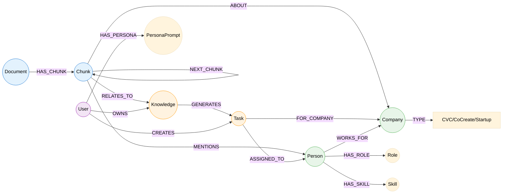

# Database Schema

> Semantic documentation of database structure and field meanings

**Last Updated**: 2025-12-06  
**Database Type**: **Neo4j Graph Database (Aura)**  
**Database Name**: Conforme `NEO4J_DATABASE` env var

---

## Sistema de Metadados Universais

> Todos os nodes DEVEM conter estes metadados base para suportar o sistema adaptativo

### Metadados Base (Obrigatórios)

| Campo | Tipo | Descrição |
|-------|------|-----------|
| `id` | UUID | Identificador único |
| `created_at` | DateTime | Data de criação |
| `updated_at` | DateTime | Última atualização |
| `source_type` | Enum | `document`, `chat`, `form`, `api`, `inference` |
| `source_ref` | String | Referência específica da fonte |
| `owner_id` | UUID | Quem criou/ingeriu |
| `visibility` | Enum | `personal`, `project`, `corporate`, `public` |
| `confidence` | Float | Confiabilidade (0.0-1.0) |
| `memory_level` | Enum | `short`, `medium`, `long` |
| `expires_at` | DateTime? | Data de caducidade (null = nunca expira) |

### Metadados de Freshness (Atualidade)

| Campo | Tipo | Descrição |
|-------|------|-----------|
| `last_accessed_at` | DateTime | Última vez que foi acessado |
| `access_count` | Integer | Quantidade de acessos |
| `relevance_score` | Float | Score de relevância atual (0.0-1.0) |
| `freshness_decay_rate` | Float | Taxa de decaimento de relevância |
| `last_validated_at` | DateTime? | Última validação humana |

### Metadados Profissionais (Para Person/User)

| Campo | Tipo | Descrição |
|-------|------|-----------|
| `current_role` | String | Função atual do profissional |
| `current_focus` | String | Foco de trabalho atual |
| `current_project_id` | UUID? | Projeto em que está trabalhando |
| `current_needs` | JSON | Necessidades do momento |
| `expertise_areas` | Array[String] | Áreas de expertise |
| `learning_goals` | Array[String] | O que está querendo aprender |
| `availability` | Enum | `available`, `busy`, `away` |
| `preferred_communication` | Enum | `chat`, `email`, `call` |
| `context_summary` | String | Resumo do contexto atual (gerado por IA) |

### Metadados de Relacionamento (Para Edges)

| Campo | Tipo | Descrição |
|-------|------|-----------|
| `relationship_strength` | Float | Força da conexão (0.0-1.0) |
| `interaction_count` | Integer | Quantidade de interações |
| `last_interaction_at` | DateTime | Última interação |
| `relationship_freshness` | Float | Atualidade do relacionamento (0.0-1.0) |
| `is_bidirectional` | Boolean | Se é bidirecional |
| `context` | String | Contexto do relacionamento |
| `priority_score` | Float | Prioridade deste relacionamento (0.0-1.0) |

---

## Overview

Este projeto utiliza **Neo4j** como banco de dados de grafos para representar relacionamentos complexos entre documentos, conhecimento, pessoas, empresas e tarefas. A estrutura em grafos permite navegação semântica e análise de relações.

---

## Node Types

### `Meeting`

**Purpose**: Representa reuniões ingeridas via transcrição VTT (spec 013)

**Properties Base**:
| Property | Type | Required | Description |
|----------|------|----------|-------------|
| `id` | String (UUID) | Yes | Identificador único |
| `title` | String | Yes | Título da reunião |
| `date` | String | Yes | Data da reunião (YYYY-MM-DD) |
| `time` | String | No | Hora de início (HH:MM) |
| `duration` | String | No | Duração (HH:MM:SS) |
| `organizer` | String | No | Nome do organizador |
| `topic` | String | No | Tópico/Assunto principal |
| `createdAt` | DateTime | Yes | Data de criação do node |
| `createdBy` | UUID | Yes | Usuário que ingeriu |

**Properties de Classificação**:
| Property | Type | Required | Description |
|----------|------|----------|-------------|
| `meetingType` | Enum | Yes | `kickoff`, `status`, `planning`, `review`, `retrospective`, `brainstorm`, `alignment`, `decision`, `other` |
| `confidentiality` | Enum | Yes | `normal`, `restricted`, `confidential` |
| `recurrence` | Enum | No | `single`, `recurring` |

**Properties de Conteúdo (LLM)**:
| Property | Type | Required | Description |
|----------|------|----------|-------------|
| `summary` | String | No | Resumo executivo gerado por LLM (200-500 palavras) |
| `keyTopics` | Array[String] | No | Tópicos principais discutidos |
| `sourceFile` | String | No | Nome do arquivo VTT original |
| `processedAt` | DateTime | No | Data de processamento |

**Properties de Ingestão**:
| Property | Type | Required | Description |
|----------|------|----------|-------------|
| `ingestionStatus` | Enum | No | `pending`, `approved`, `rejected` |
| `entityCount` | Integer | No | Quantidade de entidades extraídas |
| `ingestedAt` | DateTime | No | Data de ingestão no grafo |

**Indexes**:
- `id` (unique)
- `date`
- `meetingType`

---

### `ActionItem`

**Purpose**: Itens de ação extraídos de reuniões (spec 013)

**Properties**:
| Property | Type | Required | Description |
|----------|------|----------|-------------|
| `id` | String (UUID) | Yes | Identificador único |
| `value` | String | Yes | Descrição da ação |
| `description` | String | No | Detalhamento da ação |
| `assignee` | String | No | Responsável |
| `deadline` | String | No | Prazo |
| `priority` | Enum | No | `low`, `medium`, `high` |
| `status` | Enum | Yes | `pending`, `in_progress`, `completed` |
| `confidence` | Float | No | Confiança da extração (0.0-1.0) |
| `sourceRef` | String | No | Referência da fonte (meeting ID) |
| `createdAt` | DateTime | Yes | Data de criação |

---

### `Decision`

**Purpose**: Decisões registradas em reuniões (spec 013)

**Properties**:
| Property | Type | Required | Description |
|----------|------|----------|-------------|
| `id` | String (UUID) | Yes | Identificador único |
| `value` | String | Yes | Título da decisão |
| `description` | String | No | Descrição detalhada |
| `rationale` | String | No | Justificativa |
| `impact` | String | No | Impacto esperado |
| `relatedPerson` | String | No | Pessoa que tomou a decisão |
| `relatedArea` | String | No | Área afetada |
| `confidence` | Float | No | Confiança da extração |
| `createdAt` | DateTime | Yes | Data de criação |

---

### `Risk`

**Purpose**: Riscos identificados em reuniões (spec 013)

**Properties**:
| Property | Type | Required | Description |
|----------|------|----------|-------------|
| `id` | String (UUID) | Yes | Identificador único |
| `value` | String | Yes | Título do risco |
| `description` | String | No | Descrição detalhada |
| `impact` | String | No | Impacto potencial |
| `probability` | Enum | No | `low`, `medium`, `high` |
| `mitigation` | String | No | Ações de mitigação |
| `relatedPerson` | String | No | Pessoa que levantou |
| `relatedArea` | String | No | Área em risco |
| `priority` | Enum | No | `low`, `medium`, `high` |
| `confidence` | Float | No | Confiança da extração |
| `createdAt` | DateTime | Yes | Data de criação |

---

### `Insight`

**Purpose**: Insights e aprendizados de reuniões (spec 013)

**Properties**:
| Property | Type | Required | Description |
|----------|------|----------|-------------|
| `id` | String (UUID) | Yes | Identificador único |
| `value` | String | Yes | Título do insight |
| `description` | String | No | Explicação detalhada |
| `impact` | String | No | Potencial de impacto |
| `relatedPerson` | String | No | Quem contribuiu |
| `relatedArea` | String | No | Área que pode se beneficiar |
| `confidence` | Float | No | Confiança da extração |
| `createdAt` | DateTime | Yes | Data de criação |

---

### `ExternalParticipant`

**Purpose**: Participantes externos (não colaboradores) identificados em reuniões

**Properties**:
| Property | Type | Required | Description |
|----------|------|----------|-------------|
| `id` | String (UUID) | Yes | Identificador único |
| `name` | String | Yes | Nome completo |
| `email` | String | No | Email (único se presente) |
| `organization` | String | No | Organização de origem |
| `role` | String | No | Função/Cargo |
| `partnerType` | Enum | No | `operational`, `strategic`, `external`, `vendor` |
| `notes` | String | No | Observações |
| `createdAt` | DateTime | Yes | Data de cadastro |

**Indexes**:
- `id` (unique)
- `email` (unique, se presente)
- `organization`

---

### `Document`

**Purpose**: Representa documentos ingeridos no sistema (reuniões, relatórios, etc.)

**Properties**:
| Property | Type | Required | Description |
|----------|------|----------|-------------|
| `id` | String (UUID) | Yes | Identificador único |
| `title` | String | Yes | Título do documento |
| `source` | String | Yes | Origem (upload, email, reunião gravada) |
| `type` | String | Yes | Tipo: `meeting`, `report`, `email`, `note` |
| `format` | String | No | Formato original: `pdf`, `docx`, `txt`, `audio` |
| `created_at` | DateTime | Yes | Data de criação |
| `processed_at` | DateTime | No | Data de processamento pelo pipeline |
| `metadata` | Map | No | Metadados adicionais (autor, tags, etc.) |
| `embedding` | Vector | No | Embedding do documento completo |

**Indexes**:
- `id` (unique)
- `created_at`
- `type`
- Vector index on `embedding`

---

### `Chunk`

**Purpose**: Segmentos (chunks) de documentos para processamento semântico

**Properties**:
| Property | Type | Required | Description |
|----------|------|----------|-------------|
| `id` | String (UUID) | Yes | Identificador único |
| `content` | String | Yes | Conteúdo textual do chunk |
| `chunk_index` | Integer | Yes | Índice sequencial no documento |
| `char_start` | Integer | No | Posição inicial no documento original |
| `char_end` | Integer | No | Posição final no documento original |
| `embedding` | Vector | Yes | Embedding vetorial para busca semântica |
| `tokens` | Integer | No | Contagem de tokens |
| `created_at` | DateTime | Yes | Data de criação |

**Indexes**:
- `id` (unique)
- Vector index on `embedding` (para semantic search)

**Semantic Notes**:
- Chunks sequenciais conectados por `NEXT_CHUNK` para preservar ordem
- Tabelas extraídas são convertidas para JSON e armazenadas como propriedade do chunk

---

### `Knowledge`

**Purpose**: Conhecimento extraído e classificado (pessoal ou corporativo)

**Properties**:
| Property | Type | Required | Description |
|----------|------|----------|-------------|
| `id` | String (UUID) | Yes | Identificador único |
| `content` | String | Yes | Conteúdo do conhecimento |
| `type` | String | Yes | `personal` ou `corporate` |
| `category` | String | No | Categoria (técnico, negócio, processo) |
| `confidence` | Float | No | Confiança da extração (0.0-1.0) |
| `created_at` | DateTime | Yes | Data de extração |
| `validated` | Boolean | No | Se foi validado por humano |
| `embedding` | Vector | Yes | Embedding para busca |

**Indexes**:
- `id` (unique)
- `type`
- Vector index on `embedding`

---

### `Task`

**Purpose**: Tarefas geradas a partir de conhecimento ou conversações

**Properties**:
| Property | Type | Required | Description |
|----------|------|----------|-------------|
| `id` | String (UUID) | Yes | Identificador único |
| `title` | String | Yes | Título da tarefa |
| `description` | String | Yes | Descrição detalhada |
| `status` | String | Yes | `pending`, `in_progress`, `completed`, `cancelled` |
| `priority` | String | No | `low`, `medium`, `high`, `critical` |
| `due_date` | DateTime | No | Data de vencimento |
| `created_at` | DateTime | Yes | Data de criação |
| `completed_at` | DateTime | No | Data de conclusão |
| `action_plan` | JSON | No | Plano de ação estruturado para Canvas |

**Indexes**:
- `id` (unique)
- `status`
- `due_date`

---

### `Person`

**Purpose**: Pessoas envolvidas no ecossistema (mentores, founders, colaboradores)

**Properties Base**:
| Property | Type | Required | Description |
|----------|------|----------|-------------|
| `id` | String (UUID) | Yes | Identificador único |
| `name` | String | Yes | Nome completo |
| `email` | String | No | Email (único se presente) |
| `created_at` | DateTime | Yes | Data de cadastro |

**Propriedades Profissionais**:
| Property | Type | Required | Description |
|----------|------|----------|-------------|
| `role` | String | Yes | Papel principal (CEO, CTO, Mentor, Dev) |
| `function` | String | No | Função específica |
| `seniority` | Enum | No | `junior`, `mid`, `senior`, `lead`, `c-level` |
| `expertise_areas` | Array[String] | No | Áreas de expertise |
| `skills` | Array[String] | No | Habilidades técnicas |
| `availability` | Enum | No | `full-time`, `part-time`, `consultant` |

**Propriedades de Contexto**:
| Property | Type | Required | Description |
|----------|------|----------|-------------|
| `current_focus` | String | No | Foco de trabalho atual |
| `current_projects` | Array[UUID] | No | Projetos em que está envolvido |
| `current_needs` | JSON | No | Necessidades do momento |
| `bio` | String | No | Bio/descrição |
| `context_summary` | String | No | Resumo de contexto (IA) |

**Propriedades Relacionais**:
| Property | Type | Required | Description |
|----------|------|----------|-------------|
| `relationship_count` | Integer | No | Quantidade de relacionamentos |
| `top_relationships` | Array[UUID] | No | IDs dos top relacionamentos |
| `hierarchy_level` | Integer | No | Nível na hierarquia organizacional |
| `visibility_scope` | Enum | Yes | `self`, `team`, `company`, `ecosystem` |

**Indexes**:
- `id` (unique)
- `email` (unique, se presente)
- `role`
- `hierarchy_level`

---

### `Company`

**Purpose**: Empresas no ecossistema (CVC, CoCreateAI, Startups)

**Properties**:
| Property | Type | Required | Description |
|----------|------|----------|-------------|
| `id` | String (UUID) | Yes | Identificador único |
| `name` | String | Yes | Nome da empresa |
| `type` | String | Yes | `cvc`, `cocreate`, `startup` |
| `focus_area` | String | No | Área de foco (IA, Fintech, etc.) |
| `stage` | String | No | Estágio (seed, series A, etc.) para startups |
| `created_at` | DateTime | Yes | Data de cadastro |
| `metadata` | Map | No | Dados adicionais |

**Indexes**:
- `id` (unique)
- `type`
- `name`

---

### `User`

**Purpose**: Usuários da plataforma - o centro do sistema adaptativo

**Properties**:
| Property | Type | Required | Description |
|----------|------|----------|-------------|
| `id` | String (UUID) | Yes | Identificador único |
| `email` | String | Yes | Email (login) |
| `name` | String | Yes | Nome |
| `created_at` | DateTime | Yes | Data de cadastro |
| `last_active` | DateTime | No | Último acesso |

**Propriedades Profissionais**:
| Property | Type | Required | Description |
|----------|------|----------|-------------|
| `role` | String | Yes | Função (CEO, CTO, Mentor, etc.) |
| `company_type` | Enum | Yes | `cvc`, `cocreate`, `startup` |
| `expertise` | Array[String] | No | Áreas de expertise |
| `goals` | Array[String] | No | Objetivos atuais |
| `challenges` | Array[String] | No | Desafios enfrentados |

**Propriedades de Contexto Atual**:
| Property | Type | Required | Description |
|----------|------|----------|-------------|
| `current_focus` | String | No | O que está trabalhando agora |
| `current_project_id` | UUID | No | Projeto atual |
| `current_needs` | JSON | No | Necessidades do momento |
| `daily_summary` | String | No | Resumo do dia (gerado por IA) |
| `weekly_summary` | String | No | Resumo da semana |
| `priority_relationships` | Array[UUID] | No | IDs dos relacionamentos prioritários |

**Propriedades de Aprendizado**:
| Property | Type | Required | Description |
|----------|------|----------|-------------|
| `knowledge_contributed` | Integer | No | Score de conhecimento contribuído |
| `knowledge_consumed` | Integer | No | Score de conhecimento consumido |
| `engagement_score` | Float | No | Score de engajamento (gamificação) |
| `learning_path` | JSON | No | Caminho de aprendizado recomendado |

---

### `PersonaPrompt`

**Purpose**: Prompts personalizados por usuário

**Properties**:
| Property | Type | Required | Description |
|----------|------|----------|-------------|
| `id` | String (UUID) | Yes | Identificador único |
| `prompt_text` | String | Yes | Conteúdo do prompt |
| `version` | Integer | Yes | Versão do prompt (incrementa com feedback) |
| `created_at` | DateTime | Yes | Data de criação |
| `performance_score` | Float | No | Score de performance (feedback) |

---

## Relationship Types

### Meeting Relationships

| Relationship | From | To | Description |
|-------------|------|-----|-------------|
| `RELATED_TO_PROJECT` | Meeting | Project | Reunião pertence a um projeto |
| `PARTICIPATED_IN` | Person/User/ExternalParticipant | Meeting | Pessoa participou da reunião |
| `EXTRACTED_FROM` | Task/Decision/Risk/Insight/ActionItem | Meeting | Entidade extraída da reunião |
| `ORGANIZED_BY` | Meeting | Person/User | Quem organizou a reunião |

### Document Relationships

| Relationship | From | To | Description |
|-------------|------|-----|-------------|
| `HAS_CHUNK` | Document | Chunk | Documento contém chunks |
| `NEXT_CHUNK` | Chunk | Chunk | Ordem sequencial de chunks |

### Knowledge Relationships

| Relationship | From | To | Description |
|-------------|------|-----|-------------|
| `RELATES_TO` | Chunk | Knowledge | Chunk gerou conhecimento |
| `GENERATES` | Knowledge | Task | Conhecimento gerou tarefa |
| `OWNS` | User | Knowledge | Usuário possui conhecimento |

### Task Relationships

| Relationship | From | To | Description |
|-------------|------|-----|-------------|
| `ASSIGNED_TO` | Task | Person | Tarefa atribuída a pessoa |
| `FOR_COMPANY` | Task | Company | Tarefa relacionada a empresa |
| `CREATES` | User | Task | Usuário criou tarefa |

### People & Company Relationships

| Relationship | From | To | Description |
|-------------|------|-----|-------------|
| `WORKS_FOR` | Person | Company | Pessoa trabalha para empresa |
| `HAS_ROLE` | Person | Role | Pessoa tem papel |
| `HAS_SKILL` | Person | Skill | Pessoa tem habilidade |
| `MENTIONS` | Chunk | Person | Chunk menciona pessoa |
| `ABOUT` | Chunk | Company | Chunk é sobre empresa |

### User & Persona Relationships

| Relationship | From | To | Description |
|-------------|------|-----|-------------|
| `HAS_PERSONA` | User | PersonaPrompt | Usuário tem prompt personalizado |

---

## Naming Conventions

| Convention | Example | Notes |
|------------|---------|-------|
| Node labels | PascalCase | `Document`, `PersonaPrompt` |
| Properties | snake_case | `created_at`, `chunk_index` |
| Relationships | UPPER_SNAKE_CASE | `HAS_CHUNK`, `RELATES_TO` |
| UUIDs | UUID v4 | Para todos os `id` |

---

## Query Patterns

### Common Queries

| Use Case | Cypher Pattern | Index Used |
|----------|---------------|------------|
| Get document chunks | `MATCH (d:Document {id: $id})-[:HAS_CHUNK]->(c:Chunk) RETURN c ORDER BY c.chunk_index` | `id` |
| Semantic search | `CALL db.index.vector.queryNodes('chunk_embedding', $k, $embedding)` | Vector index |
| User knowledge | `MATCH (u:User {id: $id})-[:OWNS]->(k:Knowledge) RETURN k` | `id` |
| Company tasks | `MATCH (c:Company {id: $id})<-[:FOR_COMPANY]-(t:Task) RETURN t` | `id` |
| Chunk navigation | `MATCH (c:Chunk {id: $id})-[:NEXT_CHUNK*]->(next) RETURN next LIMIT 5` | `id` |

### Performance Notes

- **Vector search**: Use `db.index.vector.queryNodes` para busca semântica
- **Graph traversal**: Limite profundidade com `*1..3` em paths
- **Aggregations**: Use `apoc` procedures quando disponível
- **Batch inserts**: Use `UNWIND` para inserção em lote

---

## Data Integrity Rules

1. **Referential Integrity**: Soft-delete nodes; nunca deletar se tiver relationships ativos
2. **Chunk Order**: `chunk_index` deve ser sequencial e único por documento
3. **Embeddings**: Todos os chunks e knowledge devem ter embeddings antes de queries semânticas
4. **Audit Trail**: Properties `created_at` e `updated_at` são obrigatórias
5. **JSON Tables**: Tabelas extraídas de documentos devem ser armazenadas como JSON em propriedade `table_data` do chunk

---

## Naming Conventions

| Convention | Example | Notes |
|------------|---------|-------|
| Collections | `snake_case` plural | `users`, `order_items` |
| Fields | `snake_case` | `created_at`, `user_id` |
| Foreign keys | `{entity}_id` | `user_id`, `product_id` |
| Timestamps | `*_at` suffix | `created_at`, `deleted_at` |
| Booleans | `is_*` or descriptive | `active`, `is_verified` |

---

## Query Patterns

(A definir conforme o uso)

---

## Data Integrity Rules

(A definir durante a fase de planejamento)
