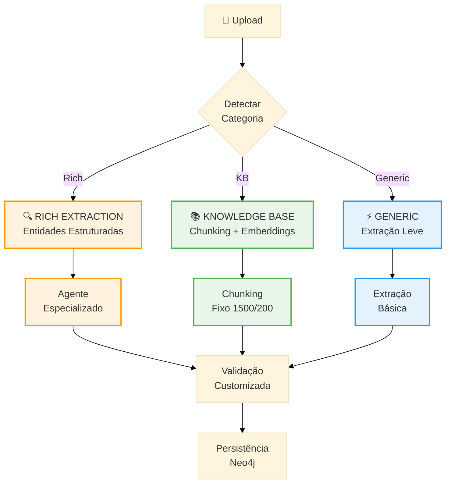
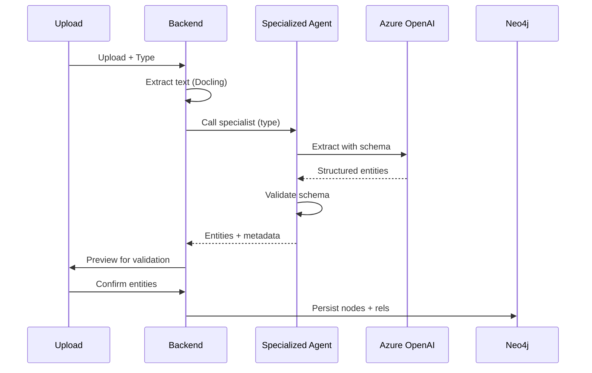
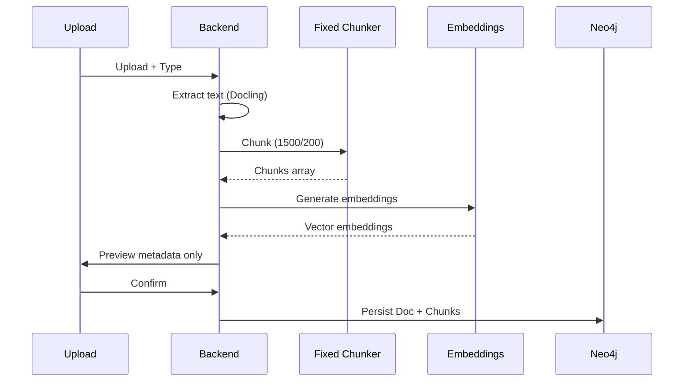
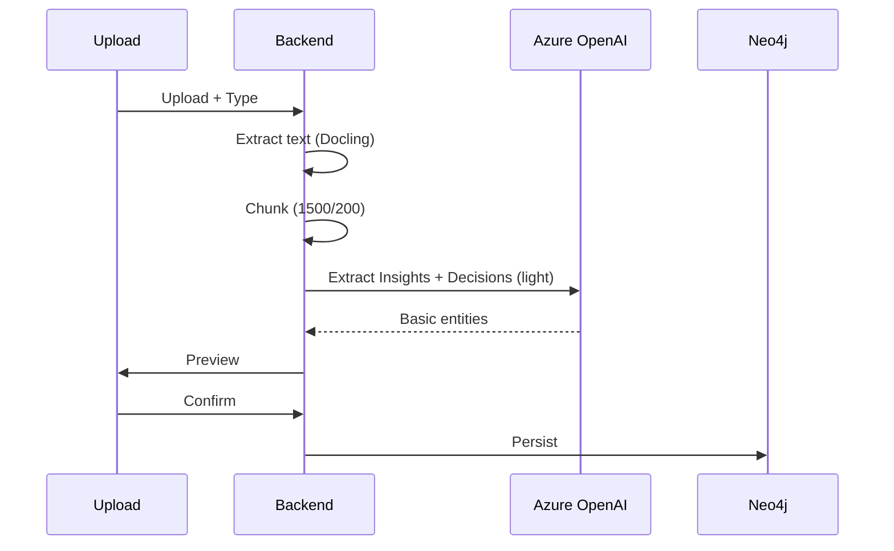

# Document Types Architecture

> Arquitetura de processamento especializado por tipo de documento

**Version**: 1.0 | **Created**: 2026-03-01

---

## 🎯 Visão Geral

Cada tipo de documento tem características específicas que exigem processamento diferenciado. A arquitetura separa documentos em **3 categorias de processamento**:



---

## 📋 Categoria 1: RICH EXTRACTION

**Objetivo**: Extrair máximo valor de documentos estruturados de alto impacto de negócio.

### Document Types

| Tipo | Agente | Entidades Principais | Justificativa |
|------|--------|---------------------|---------------|
| **Contrato** | `ContractExtractionAgent` | Partes, Cláusulas, Valores, Prazos, Obrigações, Multas, Renovações | Alto impacto legal/financeiro; estrutura previsível |
| **Proposta** | `ProposalExtractionAgent` | Cliente, Projeto, Valor, Timeline, Entregas, Escopo, Premissas | Ciclo de vendas; tracking de pipeline |
| **Ata de Reunião** | `MeetingExtractionAgent` | Participantes, Decisões, Tarefas, Tópicos, Data, Próximos passos | Já implementado; padrão de referência |
| **Relatório** | `ReportExtractionAgent` | Métricas, Insights, Decisões, Recomendações, KPIs, Tendências | Inteligência estratégica; tracking de performance |

### Processing Flow



### Example: Contract Extraction

**Input**: PDF de contrato  
**Output**:
```json
{
  "parties": [
    {"name": "CoCreateAI", "role": "contractor", "cnpj": "..."},
    {"name": "Move Studio", "role": "client", "cnpj": "..."}
  ],
  "value": {"amount": 150000, "currency": "BRL"},
  "clauses": [
    {"id": "3.1", "type": "payment", "summary": "Pagamento em 3 parcelas"},
    {"id": "5.2", "type": "termination", "summary": "Rescisão com 30 dias"}
  ],
  "deadlines": [
    {"type": "delivery", "date": "2026-06-30", "description": "MVP"},
    {"type": "renewal", "date": "2027-03-01", "description": "Renovação automática"}
  ],
  "obligations": [...],
  "penalties": [...]
}
```

**Neo4j**:
```cypher
(:Document:Contract)-[:HAS_PARTY]->(:LegalEntity)
(:Document:Contract)-[:HAS_CLAUSE]->(:ContractClause)
(:Document:Contract)-[:HAS_DEADLINE]->(:Deadline)
(:Document:Contract)-[:LINKED_TO]->(:Project)
```

---

## 📚 Categoria 2: KNOWLEDGE BASE

**Objetivo**: Documentos de referência sem entidades de negócio — similar a web sources.

### Document Types

| Tipo | Chunking | Embeddings | Extração | Justificativa |
|------|----------|------------|----------|---------------|
| **Especificação Técnica** | Fixo 1500/200 | ✅ | ❌ | Documentação técnica; consulta por similaridade |
| **Políticas e Normas** | Fixo 1500/200 | ✅ | ❌ | Compliance; referência organizacional |
| **Manual** | Fixo 1500/200 | ✅ | ❌ | How-to; guias operacionais |

### Processing Flow



### Neo4j Model

```cypher
(:Document:TechnicalSpec {title, version, updatedAt})
  -[:HAS_CHUNK]->(:Chunk {text, embedding, position})
  -[:LINKED_TO]->(:Project)
```

**Diferença de WebSource**:
- WebSource: múltiplas páginas, hierarquia de URLs
- Document KB: single source, hierarquia de seções/capítulos

---

## ⚡ Categoria 3: GENERIC

**Objetivo**: Documentos genéricos com extração básica de insights/decisões.

### Document Types

| Tipo | Extração | Chunking | Justificativa |
|------|----------|----------|---------------|
| **Análise/Estudo** | Insights + Decisions | Fixo 1500/200 | Conteúdo variável; foco em achados |
| **Outro** | Insights + Decisions | Fixo 1500/200 | Fallback genérico |

### Processing Flow



### Extraction Schema (Light)

```json
{
  "insights": [
    {"summary": "...", "confidence": "high|medium|low"}
  ],
  "decisions": [
    {"summary": "...", "context": "...", "impact": "..."}
  ]
}
```

---

## 🔧 Implementation Strategy

### Backend Architecture

```typescript
// backend/src/services/document-processor.service.ts

export class DocumentProcessorService {
  async processDocument(file: File, type: DocumentType, userId: string) {
    const category = this.getCategory(type);
    
    switch (category) {
      case 'rich':
        return this.processRichExtraction(file, type, userId);
      case 'knowledge_base':
        return this.processKnowledgeBase(file, type, userId);
      case 'generic':
        return this.processGeneric(file, type, userId);
    }
  }
  
  private getCategory(type: DocumentType): ProcessingCategory {
    const categoryMap = {
      'contract': 'rich',
      'proposal': 'rich',
      'meeting': 'rich',
      'report': 'rich',
      'technical_spec': 'knowledge_base',
      'policy': 'knowledge_base',
      'manual': 'knowledge_base',
      'analysis': 'generic',
      'other': 'generic'
    };
    return categoryMap[type];
  }
}
```

### Agent Factory (Python)

```python
# agents/document_agents.py

class DocumentAgentFactory:
    """Factory for specialized document extraction agents"""
    
    @staticmethod
    def get_agent(doc_type: str):
        agents = {
            'contract': ContractExtractionAgent(),
            'proposal': ProposalExtractionAgent(),
            'meeting': MeetingExtractionAgent(),
            'report': ReportExtractionAgent()
        }
        return agents.get(doc_type)

class ContractExtractionAgent(Agent):
    """Specialized agent for contract analysis"""
    
    system_prompt = """You are a legal contract analysis expert.
    Extract structured information from contracts including:
    - Parties (names, roles, identifiers)
    - Financial terms (values, payment schedules)
    - Clauses (obligations, termination, warranties)
    - Deadlines (delivery, renewal, expiration)
    - Penalties and liabilities
    
    Return strictly valid JSON matching the ContractSchema."""
    
    result_type = ContractSchema
```

### Frontend Validation

```typescript
// frontend/src/components/knowledge/DocumentValidation.tsx

const getValidationComponent = (type: DocumentType) => {
  const components = {
    'contract': ContractValidation,
    'proposal': ProposalValidation,
    'meeting': MeetingValidation,
    'report': ReportValidation,
    'technical_spec': KnowledgeBaseValidation,
    'policy': KnowledgeBaseValidation,
    'manual': KnowledgeBaseValidation,
    'analysis': GenericValidation,
    'other': GenericValidation
  };
  
  return components[type] || GenericValidation;
};
```

---

## 📊 Comparison Matrix

| Aspecto | Rich Extraction | Knowledge Base | Generic |
|---------|----------------|----------------|---------|
| **LLM Calls** | High (specialized) | None | Low (basic) |
| **Processing Time** | 30-60s | 5-10s | 10-20s |
| **Validation UX** | Complex (entities by type) | Simple (metadata only) | Medium (insights/decisions) |
| **Neo4j Complexity** | High (multiple node types) | Low (Doc + Chunks) | Medium (Doc + basic entities) |
| **Cost per Doc** | $$$ | $ | $$ |
| **Business Value** | Very High | Medium | Medium |

---

## 🎯 Migration Plan

1. ✅ Define architecture (this document)
2. ⬜ Implement category detection in backend
3. ⬜ Create specialized Python agents
4. ⬜ Update Neo4j schema for rich types
5. ⬜ Implement validation components by category
6. ⬜ Test end-to-end for each type
7. ⬜ Document API endpoints

---

## 🔗 References

- **Meeting Transcription**: Reference implementation for Rich Extraction pattern
- **Web Ingestion**: Reference implementation for Knowledge Base pattern (fixed chunking)
- **Document Ingestion**: Base pipeline to be refactored

---

> **Next**: Implement backend category detection and routing
