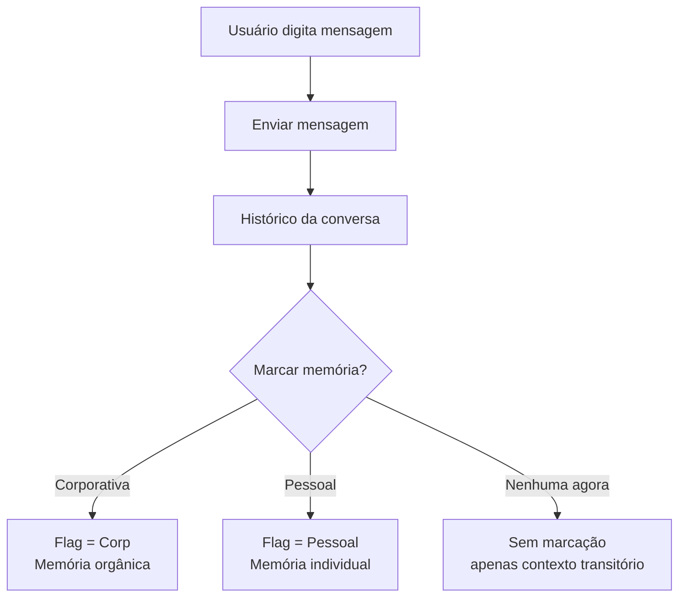
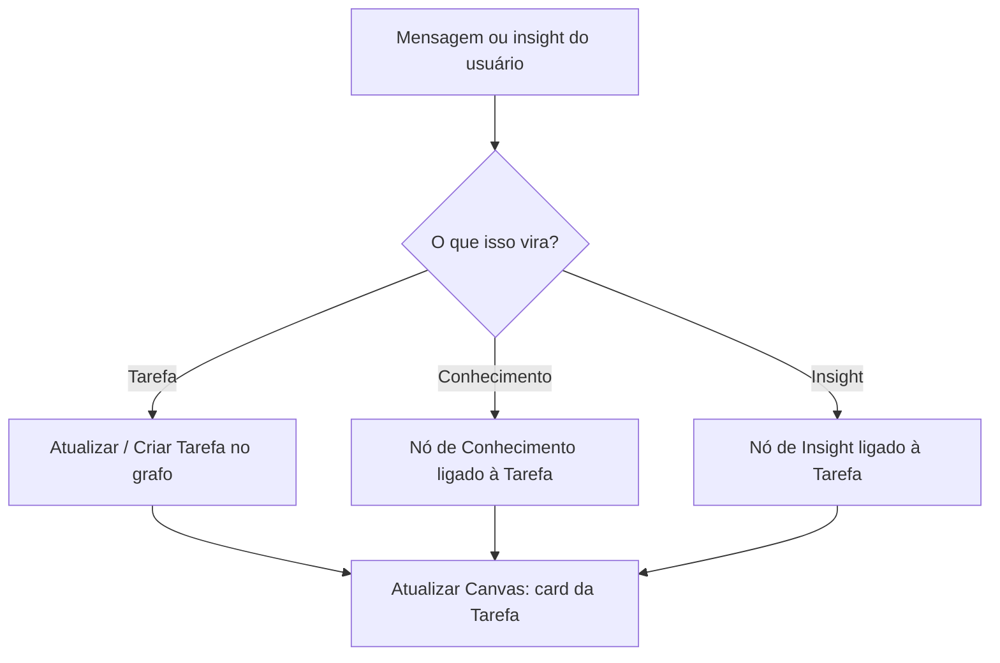
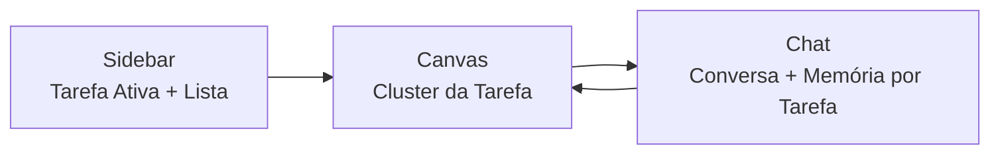

# Frontend – Fluxo de Interação do Usuário (V1)

> Especificação de fluxo para a primeira versão da interface (onboarding, tarefa ativa, chat, canvas e memória).

## 1. Objetivo do Fluxo

- **Centralizar a experiência em TAREFA** (não em cliente abstrato).
- Garantir que o usuário não caia em um canvas vazio/aleatório.
- Amarrar **conversa ↔ memória (corp/pessoal) ↔ canvas/tarefas**.
- Deixar explícitos os **papéis de Usuário Operacional e Admin de Gestão de Nodes**.
- Preparar terreno para os blocos:
  - TRG-SPC-034 – User Memory Decision System
  - TRG-SPC-035 – Data Filtration (Real vs Transient)[?]
  - TRG-SPC-036 – Conversation Persistence System
  - TRG-SPC-037 – Active Area Knowledge System

### 1.1 Personas e Papéis

- **Usuário Operacional (mentor / fundador de startup)**
  - Entra pelo onboarding.
  - Define sua primeira **Tarefa Ativa**.
  - Usa chat + canvas para trabalhar em cima dessa tarefa.

- **Admin de Gestão de Nodes (CVC / Procure.AI / CoCreateAI)**
  - Não passa pelo onboarding padrão.
  - Acessa uma área administrativa para **cadastrar nodes**:
    - Organizações (CVC, CoCreateAI, startups, parceiros como Procure.AI).
    - Áreas, programas, trilhas de atuação.
  - Esses cadastros alimentam:
    - As opções de startup/contexto vistas pelo Usuário Operacional no onboarding.
    - Os nós base do grafo de organizações/áreas.

---

## 2. Fluxo 1 – Onboarding Inicial

### 2.1 Narrativa

1. Primeiro acesso → o usuário **não vê o canvas direto**.
2. Abre um **wizard de 3 passos**:
   - Quem é você? (perfil básico)
   - Qual é sua startup / contexto principal? *(lista vinda dos nodes cadastrados pelo Admin)*
   - Qual é a **sua principal tarefa agora?** (Tarefa Ativa inicial).
3. Ao concluir, o sistema:
   - Cria uma **Tarefa Ativa** (ex.: "Preparar pitch para investidor X").
   - Entra na tela principal com **essa tarefa já selecionada**.

### 2.2 Diagrama de Fluxo (Onboarding)

```mermaid
flowchart TD
  A[Primeiro acesso] --> B[Onboarding Step 1<br/>Quem é você?]
  B --> C[Onboarding Step 2<br/>Startup / contexto]
  C --> D[Onboarding Step 3<br/>Definir primeira Tarefa]
  D --> E[Criar Tarefa Ativa inicial]
  E --> F[Entrar na Tela Principal<br/>(Sidebar + Canvas + Chat)]
```

---

## 3. Fluxo 2 – Tarefa Ativa + Chat

### 3.1 Conceito de Tarefa Ativa

- Sempre existe **no máximo 1 Tarefa Ativa** por sessão.
- A Tarefa Ativa:
  - Aparece em destaque na **sidebar**.
  - Filtra o que é mostrado no **canvas**.
  - É o contexto padrão para novas notas / insights / conhecimentos.

### 3.2 Marcador de Memória por Conversa

- A **decisão de memória (Corp/Pessoal)** não é global.
- Cada **conversa** (thread) possui um **badge** de memória:
  - 🏢 Corp (visível para organização).
  - 👤 Pessoal (apenas usuário).
- O mesmo status de memória é refletido também na **Tarefa Ativa** (ex.: ícone 🏢/👤 ao lado do título na sidebar).
- Na V1, temos **1 conversa por Tarefa Ativa**, mas a UI já trata como "thread".

### 3.3 Fluxo Mensagem → Memória



- Regra V1:
  - A marcação é feita **na conversa inteira**, não por mensagem individual.[?]
  - Backend futuro pode granularizar por mensagem.

---

## 4. Fluxo 3 – Da Conversa para o Canvas (Tarefa-Centrada)

### 4.1 Problema Atual

- Nós (conhecimento/tarefa/pessoa/insight) surgem "soltos" no canvas.
- Não está claro **por que** cada nó existe nem a que **tarefa** pertence.

### 4.2 Solução V1

- Canvas sempre mostra o **cluster** da **Tarefa Ativa**.
- Cada novo elemento criado via UI é **amarrado** à Tarefa Ativa.

### 4.3 Fluxo



- UI V1:
  - Botões "Novo conhecimento / tarefa / pessoa / insight" aparecem **próximos ao Chat** (não soltos no topo do canvas).[?]
  - Quando usuário clica em um desses botões:
    - Target padrão = **Tarefa Ativa**.
    - Em versões futuras, poderá escolher outra tarefa.

---

## 5. Fluxo 4 – Estados de Tela

### 5.1 Estado A – Onboarding

- Tela cheia, sem sidebar/canvas/chat.
- Componentes:
  - Header simples com logo CVC Hub.
  - Card central com passos:
    1. Perfil básico.
    2. Startup.
    3. Primeira tarefa.

### 5.2 Estado B – Tela Principal

- **Layout 3 colunas** (como já implementado):
  - Esquerda: Sidebar.
  - Centro: Canvas.
  - Direita: Chat.

- Ajustes conceituais:
  - Sidebar:
    - Seção "Tarefa Ativa" em destaque.
    - Lista "Minhas Tarefas" (versão simples V1: apenas a ativa + botão "+ Nova tarefa").
  - Chat:
    - Header mostra o título da Tarefa Ativa.
    - Badge de memória: 🏢 Corp / 👤 Pessoal.
  - Canvas:
    - Mostra **apenas** o cluster da Tarefa Ativa.

### 5.3 Estado C – Admin (Gestão de Nodes)

- Acesso reservado para o perfil de **Admin**.
- Funções principais:
  - Cadastrar organizações (CVC, CoCreateAI, startups, parceiros como Procure.AI).
  - Cadastrar áreas / programas / trilhas de atuação.
- Esses cadastros alimentam diretamente:
  - As opções de startup/contexto no onboarding do Usuário Operacional.
  - Os nós base do grafo de organizações/áreas usados pelos agentes.



---

## 6. Integração com Especificações Futuras

- **TRG-SPC-034 – User Memory Decision System**
  - Este fluxo define **onde** a decisão acontece (nível de conversa) e **como** o usuário a vê (badge no chat).

- **TRG-SPC-036 – Conversation Persistence System**
  - O histórico é ancorado em **Tarefa Ativa** + **Memória Corp/Pessoal**.

- **TRG-SPC-037 – Active Area Knowledge System**
  - A "área ativa" do conhecimento é o **cluster da Tarefa Ativa** no canvas.

- **TRG-SPC-035 – Data Filtration (Real vs Transient)**
  - Não definido em detalhe aqui.[?]
  - Pressuposto: parte dos dados da conversa/canvas será marcada como transitória.

---

## 7. Pontos em Aberto (Gaps Visuais)

- [ ] Onde exatamente aparecem os botões de criação (UI final): próximos ao chat ou flutuantes no canvas?[?]
- [ ] Nível de granularidade da memória: conversa inteira vs. mensagem individual?[?]
- [ ] Quantas tarefas ativas podem existir em paralelo na UI (tabs de contexto?)?[?]

Esses pontos devem ser fechados quando formos escrever as especificações detalhadas de **TRG-SPC-034/035/036/037** e antes da implementação final do backend/agents.
