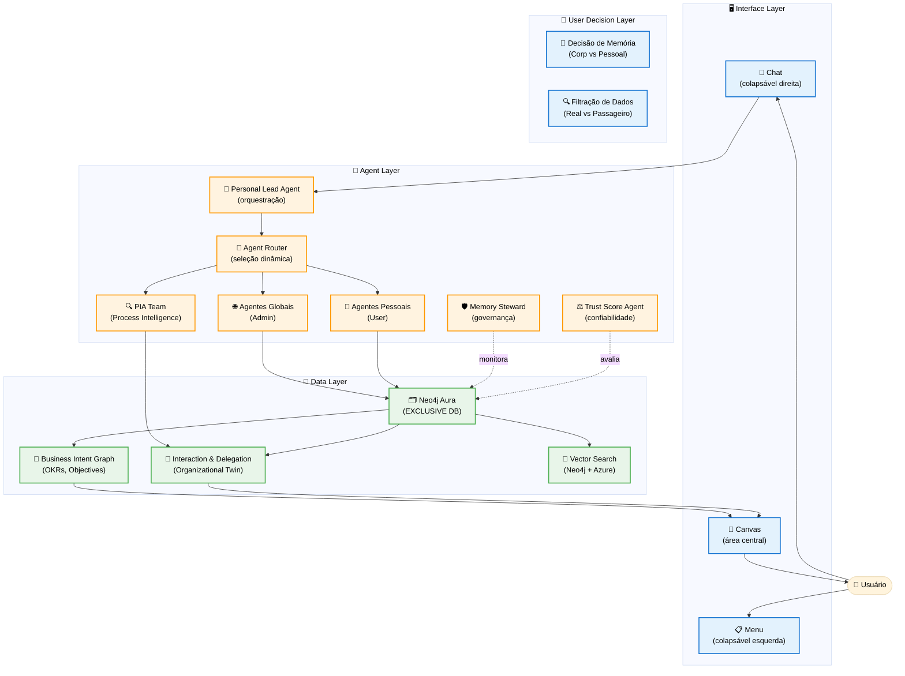
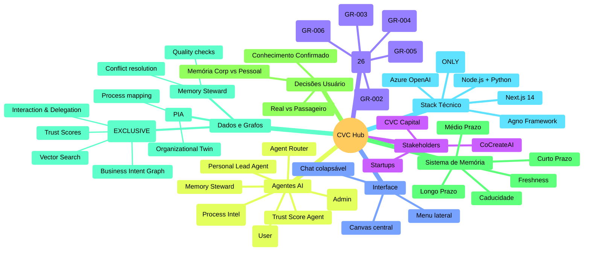
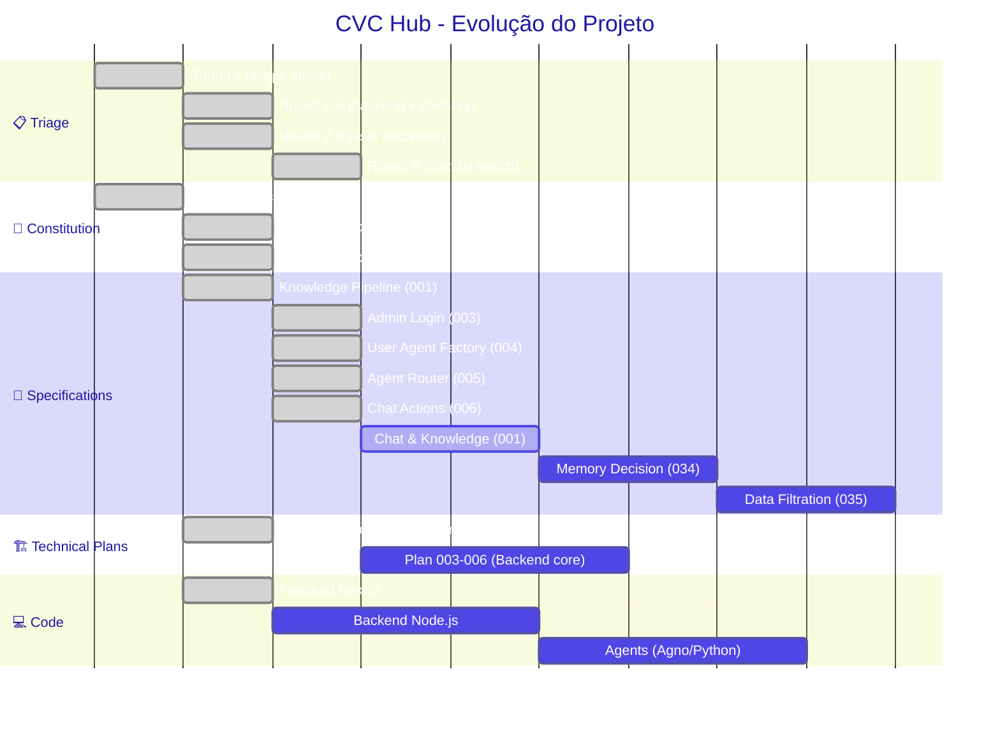
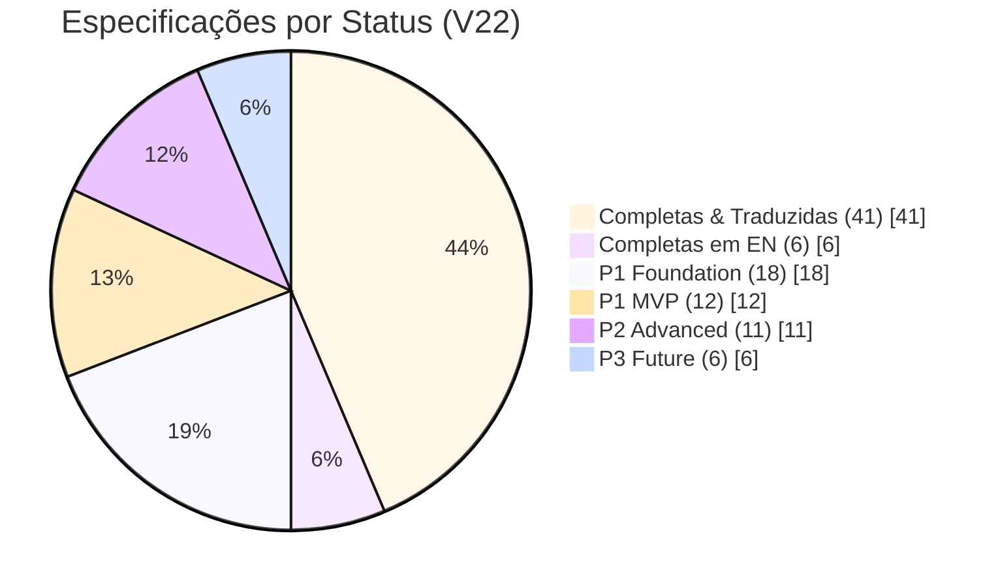
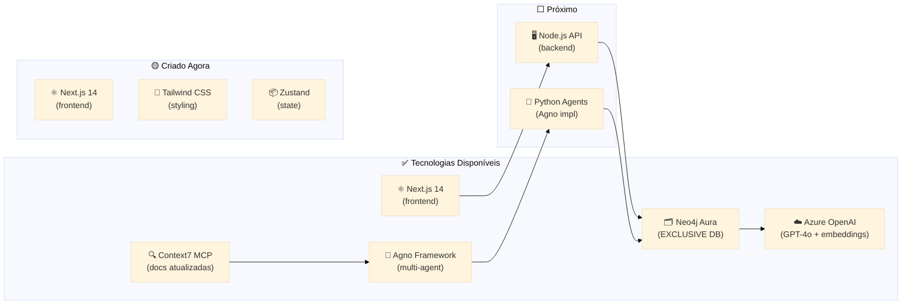
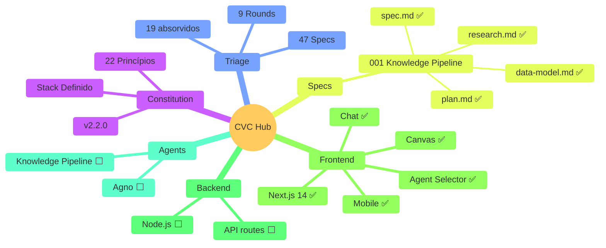

# Project Overview

> High-level, visual overview of the project, its status, and identified gaps

**Version**: V22 | **Created**: 2025-12-06 | **Updated**: 2025-12-29

> Incremental update (2026-03-01): Document ingestion validation flow aligned to meeting-transcription UX with preview-before-persist and collaborator assignment combo.
> Incremental update (2026-03-01): Web ingestion switched to deterministic fixed chunking (1500/200) for website pages/PDFs to avoid long LLM chunking stalls on large pages.
> Incremental update (2026-03-01): Web ingestion simplificado para curadoria de fonte (sem extração de entidades), com limite de tamanho aplicado por seleção real de páginas/PDFs.
> Incremental update (2026-03-01): WebSource linkage simplificado: ingest web agora vincula apenas uploader e vínculos explícitos (projeto/okr/objective); vínculo automático com departamento/organização do uploader foi removido.
> Incremental update (2026-03-01): Arquitetura de processamento especializado de documentos: 3 categorias (Rich Extraction com agentes especializados para contrato/proposta/ata/relatório, Knowledge Base sem extração para specs/políticas/manuais, Generic com extração leve para análise/outros). Pipeline unificado com especialização inteligente.

## 🎯 Project Macro View

**CVC Hub** é uma plataforma de gestão e mentoria para startups focadas em IA, desenvolvida pela **CoCreateAI** para o programa de investimentos da **CVC** (Corporate Venture Capital). A plataforma combina interface conversacional com visualização em canvas, utilizando grafos (Neo4j) para estruturar conhecimento, tarefas e relacionamentos entre stakeholders.

### Main Blocks Diagram

```mermaid
%%{init: {'theme': 'base', 'themeVariables': { 'primaryTextColor': '#000', 'secondaryTextColor': '#000', 'tertiaryTextColor': '#000', 'lineColor': '#333'}}}%%
flowchart TD
    subgraph UI["🖥️ Interface Layer"]
        Chat["💬 Chat<br/>(colapsável direita)"]
        Canvas["🎨 Canvas<br/>(área central)"]
        Menu["📋 Menu<br/>(colapsável esquerda)"]
    end
    
    subgraph Processing["🤖 Agent Layer"]
        PLA["🧠 Personal Lead Agent<br/>(orquestração)"]
        Router["🔀 Agent Router<br/>(seleção dinâmica)"]
        GlobalAgents["🌐 Agentes Globais<br/>(Admin)"]
        PersonalAgents["👤 Agentes Pessoais<br/>(User)"]
        PIATeam["🔍 PIA Team<br/>(Process Intelligence)"]
        MemorySteward["🛡️ Memory Steward<br/>(governança)"]
        TrustAgent["⚖️ Trust Score Agent<br/>(confiabilidade)"]
    end
    
    subgraph Decision["👤 User Decision Layer"]
        MemDecision["🧠 Decisão de Memória<br/>(Corp vs Pessoal)"]
        DataFilter["🔍 Filtração de Dados<br/>(Real vs Passageiro)"]
    end
    
    subgraph Storage["💾 Data Layer"]
        Neo4j["🗂️ Neo4j Aura<br/>(EXCLUSIVE DB)"]
        BIG["🎯 Business Intent Graph<br/>(OKRs, Objectives)"]
        IDG["🔄 Interaction & Delegation<br/>(Organizational Twin)"]
        Embeddings["🔢 Vector Search<br/>(Neo4j + Azure)"]
    end
    
    User([👤 Usuário]) --> Chat
    User --> Menu
    
    Chat --> PLA
    PLA --> Router
    Router --> GlobalAgents
    Router --> PersonalAgents
    Router --> PIATeam
    
    GlobalAgents --> Neo4j
    PersonalAgents --> Neo4j
    PIATeam --> IDG
    
    MemorySteward -.->|monitora| Neo4j
    TrustAgent -.->|avalia| Neo4j
    
    Neo4j --> BIG
    Neo4j --> IDG
    Neo4j --> Embeddings
    
    BIG --> Canvas
    IDG --> Canvas
    Canvas --> User
    
    classDef uiStyle fill:#e3f2fd,stroke:#1976d2,stroke-width:2px,color:#000
    classDef agentStyle fill:#fff3e0,stroke:#ff9800,stroke-width:2px,color:#000
    classDef dataStyle fill:#e8f5e9,stroke:#4caf50,stroke-width:2px,color:#000
    
    class Chat,Canvas,Menu uiStyle
    class PLA,Router,GlobalAgents,PersonalAgents,PIATeam,MemorySteward,TrustAgent agentStyle
    class Neo4j,BIG,IDG,Embeddings dataStyle
    class MemDecision,DataFilter uiStyle
```

### Global Project Mindmap (Mermaid)

```mermaid
%%{init: {'theme': 'base', 'themeVariables': { 'primaryTextColor': '#000', 'secondaryTextColor': '#000', 'tertiaryTextColor': '#000', 'lineColor': '#333'}}}%%
mindmap
  root((CVC Hub))
    Stakeholders
      CVC Capital
      CoCreateAI
      Startups
    Interface
      Chat colapsável
      Canvas central
      Menu lateral
    Agentes AI
      Personal Lead Agent
      Agent Router
      Agentes Globais (Admin)
      Agentes Pessoais (User)
      PIA Team (Process Intel)
      Memory Steward
      Trust Score Agent
    Decisões Usuário
      Memória Corp vs Pessoal
      Real vs Passageiro
      Conhecimento Confirmado
    Sistema de Memória
      Curto Prazo
      Médio Prazo
      Longo Prazo
      Caducidade
      Freshness
    Dados e Grafos
      Neo4j Aura (EXCLUSIVE)
        Business Intent Graph
        Interaction & Delegation
        Vector Search
        Trust Scores
      Memory Steward
        Quality checks
        Conflict resolution
      PIA
        Process mapping
        Organizational Twin
    Stack Técnico
      Neo4j Aura (ONLY)
      Agno Framework
      Node.js + Python
      Next.js 14
      Azure OpenAI
    Princípios (26)
      Ontological Anchoring (GR-002)
      Bitemporal Truth (GR-003)
      Provenance Mandatory (GR-004)
      Trust Transparency (GR-005)
      Graph as Source of Truth (GR-006)
```

### Business View

| Block | Objetivo de Negócio | Usuário Principal |
|-------|---------------------|-------------------|
| **Chat & Knowledge** | Capturar conhecimento pessoal/corporativo através de conversação natural | Mentores, Startups, CVC |
| **Document Pipeline** | Processar documentos (reuniões, relatórios) e extrair insights estruturados | CoCreateAI (mentoria), Startups |
| **Task Generation** | Gerar e visualizar planos de ação a partir do conhecimento capturado | Mentores, Gestores |
| **Canvas Visualization** | Visualizar dados, relações e planos de forma interativa e navegável | Todos os usuários |
| **Feedback Loop** | Melhorar continuamente prompts e personalização por usuário | Sistema (automático) |

### Technical View

| Block | Componentes Técnicos | Integrações |
|-------|----------------------|-------------|
| **Interface Layer** | Next.js frontend, Chat UI, Canvas renderer, Menu system | Next.js API routes |
| **Agent Layer** | Knowledge Agent, Task Agent, Feedback Agent, Persona Agent (Framework Agno) | Azure OpenAI API, Neo4j |
| **Document Pipeline** | Docling (ingestão), Chunking, Table→JSON, Embedding generation | Azure OpenAI Embeddings |
| **Graph Database** | Neo4j Aura (nodes: docs, chunks, pessoas, empresas, tarefas) | Neo4j driver (Node.js/Python) |
| **Backend API** | Node.js + Python services, REST/GraphQL endpoints | Neo4j, Azure OpenAI |

---

## 📊 Completion Status

### Project Artifacts

| Artifact | Status | Progress | Last Updated |
|----------|--------|----------|--------------|
| Constitution | 🟢 Complete | v2.3.0 - 26 principles (Neo4j-only) | 2025-12-29 |
| Project Context | 🟢 Complete | 100% | 2025-12-29 |
| Specs | 🟢 Complete | 47 specs (87% PT, 13% EN) | 2025-12-29 |
| Plans | 🟡 In Progress | 2 (Knowledge Pipeline, MVP Core) | 2025-12-07 |
| Tasks | ⚪ Not started | 0/? | - |
| Code | 🟡 In Progress | Frontend UI done | 2025-12-07 |

**Legend**:
- ⚪ Not started
- 🔴 Blocked / Needs attention
- 🟡 In progress / Draft
- 🟢 Complete / Validated

### Functional Blocks

| Block | Spec | Plan | Tasks | Code | Status |
|-------|------|------|-------|------|--------|
| **Chat & Knowledge System** | 🟡 | ⚪ | ⚪ | 🟡 | Frontend UI created |
| **Document Pipeline** | 🟡 | 🟡 | ⚪ | ⚪ | In progress (spec+plan Knowledge Pipeline) |
| **Task Generation & Canvas** | ⚪ | ⚪ | ⚪ | ⚪ | Not started |
| **Neo4j Graph Layer** | ⚪ | ⚪ | ⚪ | ⚪ | Not started |
| **Agent Ecosystem** | ⚪ | ⚪ | ⚪ | ⚪ | Not started |
| **Feedback & Personalization** | ⚪ | ⚪ | ⚪ | ⚪ | Not started |

---

## ⚠️ Identified Gaps

> Areas that require clarification or a decision before moving forward.

### Critical Gaps (Block progress)

- [x] **[GAP-001]**: Estrutura do código existente não mapeada → **RESOLVIDO**
  - Solution: Frontend Next.js criado do zero com estrutura moderna
  - Components: Chat, Canvas, Sidebar, MobileNav, AgentSelector
  - Stack: Next.js 14, React 18, Tailwind, Radix UI, Zustand
  - Status: ✅ Frontend completo em `frontend/`

### Attention Gaps (Can proceed with assumptions)

- [ ] **[GAP-005]**: Canvas rendering não especificado
  - Current assumption: Biblioteca de visualização será escolhida durante planejamento
  - Risk: Performance em grafos grandes
  - Action: Prototipar com biblioteca a definir
  - Status: 🟡 Pode prosseguir

### Resolved Gaps ✅

- [x] **[GAP-003]**: Docling pipeline → **RESOLVIDO** em Round 7 (fluxo completo documentado)
- [x] **[GAP-004]**: Modelo Neo4j → **RESOLVIDO** em `database-schema.md` (metadados universais)
- [x] **[GAP-006]**: Feedback strategy → **RESOLVIDO** em constitution (A.X, A.XI)

- [x] **[GAP-002]**: Framework Agno → **RESOLVIDO** em `agno-reference.md` (Context7 docs)
- [x] **[GAP-000]**: Stack técnico → **RESOLVIDO**: Node.js, Python, Neo4j, Agno, Next.js, Azure OpenAI

---

## 🔄 Next Steps

> What should happen next to move the project forward.

### ✅ Concluído
1. [x] ~~Executar triage~~ - **9 rounds completos** (47 specs)
2. [x] ~~Criar Constitution~~ - **v2.2.0** (22 princípios)
3. [x] ~~Definir modelo Neo4j~~ - **database-schema.md** expandido
4. [x] ~~Documentar fluxos~~ - **system-flows.md** (10 fluxos)
5. [x] ~~First spec~~ - **Knowledge Pipeline (001)** spec + plan
6. [x] ~~Frontend criado~~ - **Next.js 14** (Chat, Canvas, Mobile)
7. [x] ~~Backend core specs~~ - **4 specs**: Admin (003), User Agent Factory (004), Router (005), Chat Actions (006)
8. [x] ~~Refinar spec 001~~ - **Onboarding + Filtro de Conversa** (P0 blockers)

### 🔄 Próximo Passo

- [ ] Executar `/speckit-plan` para o **MVP Core**: Auth/Admin (003), User Agent Factory (004), Agent Router (005), Chat Actions (006), Chat & Knowledge (007/009), Memory Ecosystem & Conversas (017/025), Retrieval Orchestration (024), Observability (018) e Onboarding & AI Profile (022).
- [ ] A partir do plano, usar `/speckit-tasks` para quebrar em tarefas antes de iniciar implementação de backend e agentes.
- [x] Refinar ingestão documental para validação robusta: preview extraído → validação visual por tipo → persistência apenas de itens confirmados.
- [x] Alinhar UX de validação documental ao padrão de transcrição (cards coloridos por tipo, status de validação, seleção de responsável por combo de colaboradores).
- [x] Ajustar ingestão de website para chunking fixo com overlap (1500/200), removendo dependência de chunking LLM por página para casos de conteúdo grande.
- [x] Alinhar `sizeKb` de páginas no ingest com texto extraído (texto-only), coerente com a prévia de site.
- [x] Remover extração de entidades (Task/Decision/Risk/Insight) do pipeline de site; manter ingestão focada em WebSource/WebPage/Chunk e visibilidade (individual/área/corporativo).
- [x] Corrigir cálculo de limite para considerar somente páginas/PDFs selecionados e ajustar UX para seleção inicial da raiz com total selecionado mais preciso.
- [x] Remover vínculo automático do WebSource com departamento/organização do uploader; manter apenas vínculos explícitos (usuário, projeto, okr, objetivo).
- [x] Implementar arquitetura de processamento especializado por tipo de documento: 3 categorias (Rich/KB/Generic), agentes Pydantic AI especializados (Contract/Proposal/Meeting/Report), DocumentCategoryService + SpecializedExtractionService no backend, FastAPI agents API.

### ⬜ Depois
9. [ ] Testar frontend: `cd frontend && npm install && npm run dev`
10. [ ] Criar backend Python (`backend/`)
11. [ ] Implementar agentes Agno (`agents/`)

---

## 📈 Project Evolution (Visual)

### Timeline de Progresso

```mermaid
%%{init: {'theme': 'base', 'themeVariables': {'primaryColor': '#4f46e5', 'primaryTextColor': '#fff'}}}%%
gantt
    title CVC Hub - Evolução do Projeto
    dateFormat  YYYY-MM-DD
    
    section 📋 Triage
    Round 1 (scope inicial)       :done, t1, 2025-12-06, 1d
    Round 2-6 (backend + memory)  :done, t2, after t1, 1d
    Round 7-8 (user decisions)    :done, t3, 2025-12-07, 1d
    Round 9 (chat.txt enrich)     :done, t4, after t3, 1d
    
    section 📜 Constitution
    v1.0 (12 princípios)          :done, c1, 2025-12-06, 1d
    v2.0 (19 princípios)          :done, c2, after c1, 1d
    v2.2 (22 princípios)          :done, c3, 2025-12-07, 1d
    
    section 📄 Specifications
    Knowledge Pipeline (001)       :done, s1, 2025-12-07, 1d
    Admin Login (003)              :done, s2, after s1, 1d
    User Agent Factory (004)       :done, s3, after s1, 1d
    Agent Router (005)             :done, s4, after s1, 1d
    Chat Actions (006)             :done, s5, after s1, 1d
    Chat & Knowledge (001)         :active, s6, after s5, 2d
    Memory Decision (034)          :s7, after s6, 2d
    Data Filtration (035)          :s8, after s7, 2d
    
    section 🏗️ Technical Plans
    Plan 001 (Knowledge Pipeline)  :done, p1, 2025-12-07, 1d
    Plan 003-006 (Backend core)    :p2, after s5, 3d
    
    section 💻 Code
    Frontend Next.js               :done, code1, 2025-12-07, 1d
    Backend Node.js                :code2, after code1, 3d
    Agents (Agno/Python)           :code3, after code2, 3d
```

### Progresso por Área

```mermaid
%%{init: {'theme': 'base'}}%%
pie showData
    title Especificações por Status (V22)
    "Completas & Traduzidas (41)" : 41
    "Completas em EN (6)" : 6
    "P1 Foundation (18)" : 18
    "P1 MVP (12)" : 12
    "P2 Advanced (11)" : 11
    "P3 Future (6)" : 6
```

### Stack de Tecnologias Ativas

```mermaid
%%{init: {'theme': 'base'}}%%
flowchart LR
    subgraph Disponível["✅ Tecnologias Disponíveis"]
        Context7["🔍 Context7 MCP<br/>(docs atualizadas)"]
        Neo4j["🗂️ Neo4j Aura<br/>(EXCLUSIVE DB)"]
        Azure["☁️ Azure OpenAI<br/>(GPT-4o + embeddings)"]
        Agno["🤖 Agno Framework<br/>(multi-agent)"]
        NextJS14["⚛️ Next.js 14<br/>(frontend)"]
    end
    
    subgraph Criado["🟡 Criado Agora"]
        NextJS["⚛️ Next.js 14<br/>(frontend)"]
        Tailwind["🎨 Tailwind CSS<br/>(styling)"]
        Zustand["📦 Zustand<br/>(state)"]
    end
    
    subgraph Próximo["⬜ Próximo"]
        NodeAPI["🖥️ Node.js API<br/>(backend)"]
        AgentsCode["🐍 Python Agents<br/>(Agno impl)"]
    end
    
    Context7 --> Agno
    Agno --> AgentsCode
    NextJS14 --> NodeAPI
    NodeAPI --> Neo4j
    AgentsCode --> Neo4j
    Neo4j --> Azure
```

### Artefatos Criados (Resumo Visual)

```mermaid
%%{init: {'theme': 'base'}}%%
mindmap
  root((CVC Hub))
    Constitution
      v2.2.0
      22 Princípios
      Stack Definido
    Triage
      9 Rounds
      47 Specs
      19 absorvidos
    Specs
      001 Knowledge Pipeline
        spec.md ✅
        plan.md ✅
        research.md ✅
        data-model.md ✅
    Frontend
      Next.js 14 ✅
      Chat ✅
      Canvas ✅
      Mobile ✅
      Agent Selector ✅
    Backend
      Node.js ⬜
      API routes ⬜
    Agents
      Agno ⬜
      Knowledge Pipeline ⬜
```

---

## 📝 Version History

| Version | Date | Changes | Author |
|---------|------|---------|--------|
| V1 | 2025-12-06 | Initial overview creation | AI Agent |
| V2 | 2025-12-06 | Triage Round 1 - 9 constitution + 7 specification entries | AI Agent |
| V3 | 2025-12-06 | Triage Round 2 - Backend focus: ecosystems, routing, auto-improvement | AI Agent |
| V4 | 2025-12-06 | Constitution v2.0.0 consolidated - 12 project-specific principles | AI Agent |
| V5 | 2025-12-06 | Triage Round 3 - Memory system deep-dive, refinements, observability | AI Agent |
| V6 | 2025-12-06 | Constitution v2.1.0 - 19 principles consolidated (all absorbed) | AI Agent |
| V7 | 2025-12-06 | Triage Round 4 - Curadoria, Proveniência, Classificação (+5 spec) | AI Agent |
| V8 | 2025-12-06 | Round 5-6 + Fluxos Visuais (system-flows.md) + DB Schema expandido | AI Agent |
| V9 | 2025-12-07 | Round 7 - Decisão memória usuário, Filtração dados, Persistência conversa | AI Agent |
| V10 | 2025-12-07 | Refinamento geral - Constitution v2.2.0, Gaps fechados, Diagrama atualizado | AI Agent |
| V11 | 2025-12-07 | Round 8 - Markdown/Canvas Context + Agno documentado (GAP-002 fechado) | AI Agent |
| V12 | 2025-12-07 | First spec created: Knowledge Pipeline (001) | AI Agent |
| V13 | 2025-12-07 | Round 9 - Enriquecimento via chat.txt (+8 spec) | AI Agent |
| V14 | 2025-12-07 | First implementation plan: Knowledge Pipeline (001) | AI Agent |
| V15 | 2025-12-07 | Frontend Next.js criado - Chat, Canvas, Mobile + GAP-001 fechado | AI Agent |
| V16 | 2025-12-07 | Adicionada seção "Project Evolution" com diagramas visuais (Gantt, Pie, Mindmap) | AI Agent |
| V17 | 2025-12-07 | Spec TRG-SPC-048 Admin Node Manager + Frontend refatorado: foco em Tarefa, memória por conversa | AI Agent |
| V18 | 2025-12-07 15:00 | 4 novas specs backend: Admin Login (003), User Agent Factory (004), Agent Router (005), Chat Actions (006) + Spec 001 refinada (Onboarding + Filtro Conversa) | AI Agent |
| V19 | 2025-12-07 | Overview atualizado com specs de memória/observabilidade/multi-agente (017, 018, 019), onboarding (022, 023) e backlog alinhado. | AI Agent |
| V20 | 2025-12-07 | Sequências 3–5 consolidadas: criação/integr. de 024 (Retrieval Orchestration) e 025 (Conversation Persistence), refinamentos de onboarding/admin e atualização dos próximos passos para Planning do MVP Core. | AI Agent |
| V21 | 2025-12-07 | MVP Core Plan criado (`plans/mvp-core-plan.md`): arquitetura completa com diagramas Mermaid, 5 fases de implementação (Backend Foundation, Agent System, Core Features, Advanced Features, Polish), 10 semanas estimadas, integração frontend existente. | AI Agent |
| V22 | 2025-12-29 | **CONSOLIDAÇÃO COMPLETA**: 47 specs (87% PT), MongoDB deprecado (Neo4j-only), 6 specs traduzidas (041-046: GIN, GID, Memory Steward, Trust Score, Simulation, Hierarchical Brainstorm, PIA), Sistema de customização de agentes (Global/Pessoal/Sistema), Zero sobreposições, Diagramas atualizados. | AI Agent |
| V23 | 2026-03-01 | Ajustes de ingestão documental: fluxo persist-after-validation mantido com preview sem persistência e remodelagem do bloco de validação para padrão de transcrição (abas por tipo, cores por entidade, confirmar/retirar e combo de responsável com colaboradores do org chart). | AI Agent |
| V24 | 2026-03-01 | Ajustes de ingestão web para estabilidade/performance: chunking fixo determinístico (1500 chars com overlap 200) em páginas/PDFs no fluxo de website e sizing de páginas baseado em texto extraído, reduzindo travas por chamadas LLM longas no chunking por página. | AI Agent |
| V25 | 2026-03-01 | Simplificação do pipeline web: removida extração de entidades no ingest de site; limite de tamanho e UX de seleção refinados para usar apenas itens selecionados e seleção inicial da raiz. | AI Agent |
| V26 | 2026-03-01 | WebSource linkage simplificado: ingest web agora vincula apenas uploader e vínculos explícitos (projeto/okr/objective); vínculo automático com departamento/organização do uploader foi removido. | AI Agent |
| V27 | 2026-03-01 | Arquitetura de processamento especializado de documentos: 3 categorias (Rich Extraction para contrato/proposta/ata/relatório com 4 agentes Pydantic AI especializados + schemas completos, Knowledge Base para specs/políticas/manuais com chunking fixo sem extração, Generic para análise/outros com extração leve). Backend: DocumentCategoryService + SpecializedExtractionService + endpoint /extract atualizado. Agents: FastAPI com 5 endpoints especializados. Pipeline unificado com especialização inteligente por tipo. | AI Agent |

---

## 🔗 Quick Links

- **Constitution**: `Spec-Orchestrator/.specify/memory/constitution.md`
- **Specs**: `specs/`
- **Project Context**: `project-context/`
- **Triage Backlog**: `Spec-Orchestrator/.specify/triage/`

---

> **Note**: This file is updated automatically by Spec Kit commands.
> Treat it as the single source of truth for the current project status.
