# System Flows

> Fluxos visuais completos do sistema CVC Hub

**Last Updated**: 2025-12-06  
**Version**: V1

---

## 1. Fluxo Principal do Sistema

```mermaid
%%{init: {'theme': 'base', 'themeVariables': { 'primaryTextColor': '#000', 'secondaryTextColor': '#000', 'tertiaryTextColor': '#000', 'lineColor': '#333'}}}%%
flowchart TB
    subgraph USUARIO["👤 USUÁRIO"]
        U1[Chat Interface]
        U2[Upload Documento]
        U3[Canvas Visualização]
    end
    
    subgraph ENTRADA["📥 ENTRADA"]
        E1[Mensagem de Chat]
        E2[Arquivo]
        E3[Formulário]
        E4[API Externa]
    end
    
    subgraph ROUTER["🔀 AGENT ROUTER"]
        AR1[Análise de Intent]
        AR2[Contexto do Usuário]
        AR3[Seleção de Agente]
    end
    
    subgraph AGENTS["🤖 AGENTES ESPECIALIZADOS"]
        AG1[User Agent<br>Customizado]
        AG2[Knowledge Agent<br>Busca/Resposta]
        AG3[Task Agent<br>Geração Tarefas]
        AG4[Curation Agent<br>Validação]
    end
    
    subgraph PROCESSING["⚙️ PROCESSAMENTO"]
        P1[Docling<br>Extração]
        P2[Classificação<br>Corp/Pessoal]
        P3[Embeddings<br>Azure OpenAI]
        P4[Estruturação<br>Nodes/Edges]
    end
    
    subgraph STORAGE["💾 ARMAZENAMENTO"]
        S1[(Neo4j<br>Grafo)]
        S2[Vector Index<br>Semântico]
    end
    
    subgraph RETRIEVAL["🔍 RECUPERAÇÃO"]
        R1[Busca Semântica]
        R2[Graph Traversal]
        R3[Proveniência]
        R4[Cache]
    end
    
    subgraph MEMORY["🧠 MEMÓRIA"]
        M1[Curto Prazo<br>Sessão]
        M2[Médio Prazo<br>Contexto]
        M3[Longo Prazo<br>Consolidado]
    end
    
    subgraph OUTPUT["📤 SAÍDA"]
        O1[Resposta Chat]
        O2[Tarefas Canvas]
        O3[Reflexões]
        O4[Sugestões]
    end
    
    USUARIO --> ENTRADA
    ENTRADA --> ROUTER
    ROUTER --> AGENTS
    AGENTS --> PROCESSING
    PROCESSING --> STORAGE
    STORAGE <--> RETRIEVAL
    RETRIEVAL <--> MEMORY
    MEMORY --> AGENTS
    AGENTS --> OUTPUT
    OUTPUT --> USUARIO
    
    style ROUTER fill:#e3f2fd,stroke:#1565c0
    style STORAGE fill:#e8f5e9,stroke:#2e7d32
    style MEMORY fill:#fff3e0,stroke:#ff9800
```

---

## 2. Fluxo de Ingestão de Dados (com Decisão do Usuário)

```mermaid
%%{init: {'theme': 'base', 'themeVariables': { 'primaryTextColor': '#000'}}}%%
flowchart TB
    subgraph INPUT["📥 Entrada"]
        I1[Upload<br>Manual]
        I2[Chat<br>Conversa]
        I3[Form<br>Onboarding]
        I4[API<br>Integração]
    end
    
    subgraph DOCLING["📄 Docling Processing"]
        D1[Parsing<br>PDF/DOCX/etc]
        D2[Extração<br>Texto/Tabelas]
        D3[Chunking<br>Segmentação]
        D4[Certificação<br>Completa]
    end
    
    subgraph FILTER["🔍 Filtração de Dados"]
        F1{Dado REAL<br>ou PASSAGEIRO?}
        F2[Real:<br>Persistente]
        F3[Passageiro:<br>Temporário]
    end
    
    subgraph DECISION["👤 DECISÃO DO USUÁRIO"]
        direction TB
        DEC1[Sistema pergunta:<br>'Guardar como...?']
        DEC2{Corporativo<br>ou Pessoal?}
        DEC3[Corporativo:<br>Visível org]
        DEC4[Pessoal:<br>Só usuário]
        DEC5[Preview do<br>que será guardado]
    end
    
    subgraph EMBED["🔢 Embeddings"]
        EM1[Azure OpenAI<br>Embedding]
    end
    
    subgraph CURATE["✅ Curadoria"]
        CU1[Validar<br>Qualidade]
        CU2[Estruturar<br>Nodes/Edges]
        CU3[Atribuir<br>Metadados]
    end
    
    subgraph STORE["💾 Armazenamento"]
        ST1[(Neo4j)]
        ST2[Vector<br>Index]
    end
    
    INPUT --> DOCLING
    DOCLING -->|"Docling PRIMEIRO"| FILTER
    F1 -->|Real| F2
    F1 -->|Passageiro| F3
    F2 --> DECISION
    F3 --> DECISION
    DECISION --> DEC1
    DEC1 --> DEC5
    DEC5 --> DEC2
    DEC2 -->|Corp| DEC3
    DEC2 -->|Pessoal| DEC4
    DEC3 --> EMBED
    DEC4 --> EMBED
    EMBED --> CURATE
    CURATE --> STORE
    
    style DECISION fill:#e3f2fd,stroke:#1565c0,stroke-width:3px
    style FILTER fill:#fff3e0,stroke:#ff9800
    style DOCLING fill:#e8f5e9,stroke:#2e7d32
```

**Regra Fundamental**: Docling processa ANTES da decisão de memória. Toda certificação acontece primeiro, depois o usuário decide.

---

## 2.1 Fluxo de Persistência de Conversa

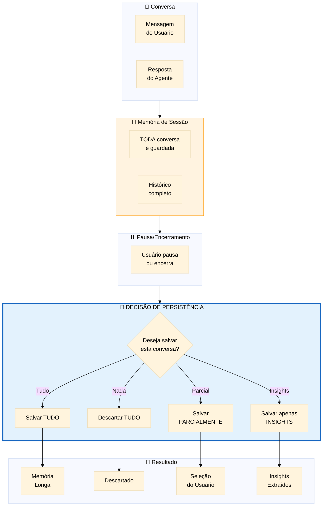

**Regra**: Toda conversa é guardada em memória temporária. Usuário decide o que persiste.

---

## 3. Fluxo de Recuperação com Proveniência

```mermaid
%%{init: {'theme': 'base', 'themeVariables': { 'primaryTextColor': '#000'}}}%%
flowchart TB
    subgraph QUERY["❓ Query do Usuário"]
        Q1[Pergunta<br>em Linguagem Natural]
    end
    
    subgraph REASONING["🧠 Raciocínio do Agente"]
        R1[PRE-QUERY<br>Entender Intent]
        R2[Definir Estratégia<br>de Busca]
        R3[Definir Profundidade<br>1-5 níveis]
    end
    
    subgraph SEARCH["🔍 Busca Multi-Estratégia"]
        S1[Busca Semântica<br>por Embeddings]
        S2[Graph Traversal<br>por Relacionamentos]
        S3[Keyword Search<br>Full-text]
    end
    
    subgraph CACHE["⚡ Cache"]
        CA1{Cache<br>Hit?}
        CA2[Retorna<br>Cache]
        CA3[Executa<br>Busca]
    end
    
    subgraph RESULTS["📋 Resultados"]
        RES1[Nodes<br>Encontrados]
        RES2[Metadados de<br>Proveniência]
        RES3[Confidence<br>Score]
    end
    
    subgraph POST["✅ Pós-Recuperação"]
        P1[POST-RETRIEVAL<br>Avaliar Relevância]
        P2[Filtrar por<br>Visibilidade]
        P3[Ordenar por<br>Relevância]
    end
    
    subgraph PROVENANCE["📜 Proveniência"]
        PR1[source_type]
        PR2[source_ref]
        PR3[created_at]
        PR4[confidence]
    end
    
    subgraph RESPONSE["💬 Resposta"]
        RESP1[PRE-RESPONSE<br>Formular Resposta]
        RESP2[Incluir<br>Citações]
        RESP3[POST-RESPONSE<br>Log & Validação]
    end
    
    QUERY --> REASONING
    REASONING --> CACHE
    CA1 -->|Sim| CA2
    CA1 -->|Não| CA3
    CA3 --> SEARCH
    SEARCH --> RESULTS
    RESULTS --> POST
    POST --> PROVENANCE
    PROVENANCE --> RESPONSE
    
    style REASONING fill:#e3f2fd,stroke:#1565c0
    style PROVENANCE fill:#fff3e0,stroke:#ff9800
```

---

## 4. Fluxo do Sistema de Memória Multinível

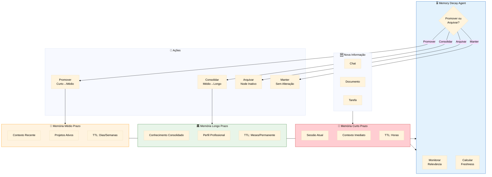

---

## 5. Fluxo de Contexto Adaptativo do Usuário

```mermaid
%%{init: {'theme': 'base', 'themeVariables': { 'primaryTextColor': '#000'}}}%%
flowchart LR
    subgraph USER["👤 Usuário"]
        U1[Login/Sessão]
    end
    
    subgraph CONTEXT["🎯 Coleta de Contexto"]
        C1[Quem é?<br>Role/Função]
        C2[O que faz?<br>Trabalho Atual]
        C3[O que precisa?<br>Necessidades]
        C4[Com quem?<br>Relacionamentos]
    end
    
    subgraph PROFILE["📊 Perfil Atualizado"]
        P1[current_focus]
        P2[current_needs]
        P3[current_project]
        P4[priority_relationships]
    end
    
    subgraph ADAPT["🔄 Adaptação"]
        A1[Filtrar<br>Conhecimento Relevante]
        A2[Priorizar<br>Relacionamentos Ativos]
        A3[Sugerir<br>Conteúdo Contextual]
        A4[Gerar<br>Reflexões]
    end
    
    subgraph OUTPUT["💡 Saída Personalizada"]
        O1[Resposta<br>Contextualizada]
        O2[Tarefas<br>Sugeridas]
        O3[Conexões<br>Recomendadas]
        O4[Insights<br>Proativos]
    end
    
    USER --> CONTEXT
    CONTEXT --> PROFILE
    PROFILE --> ADAPT
    ADAPT --> OUTPUT
    OUTPUT --> USER
    
    style CONTEXT fill:#e3f2fd,stroke:#1565c0
    style ADAPT fill:#fff3e0,stroke:#ff9800
```

---

## 6. Fluxo de Relacionamentos e Métricas

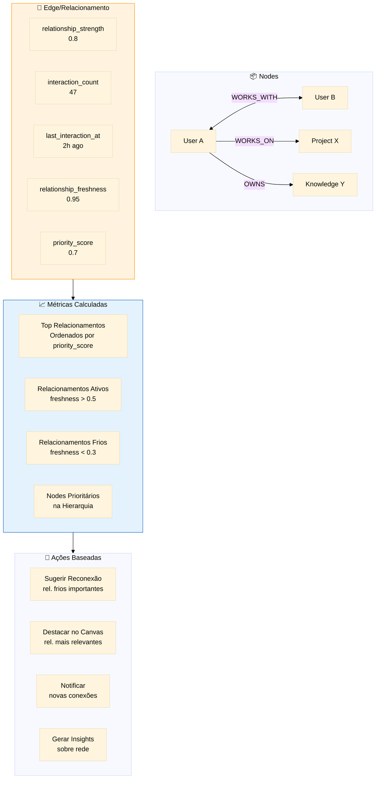

---

## 7. Fluxo de Gamificação e Engajamento

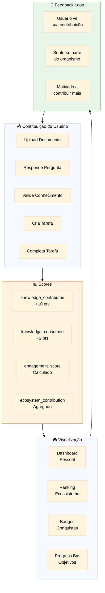

---

## 8. Fluxo de Agentes

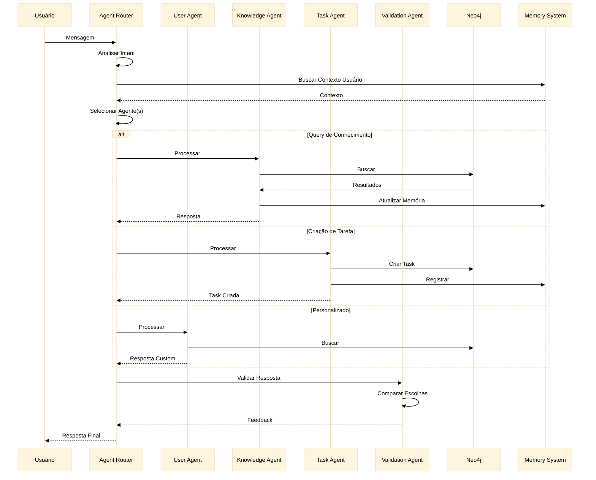

---

## 9. Fluxo de Visibilidade Hierárquica

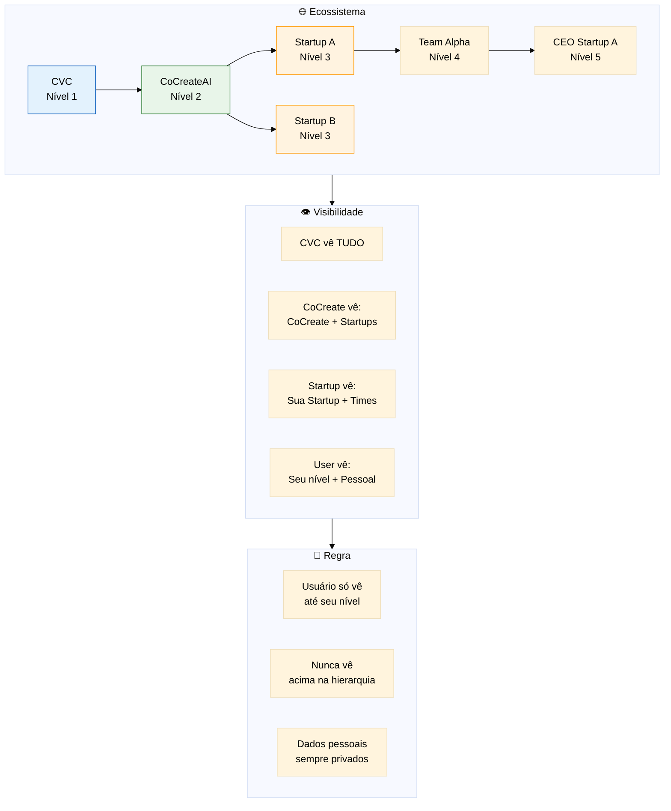

---

## 10. Resumo: Pipeline End-to-End

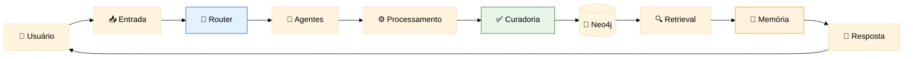

---

## Notas de Implementação

1. **Todos os fluxos usam os Metadados Universais** definidos em `database-schema.md`
2. **Proveniência é obrigatória** em todas as respostas
3. **Memória é gerenciada automaticamente** pelo Memory Decay Agent
4. **Visibilidade é aplicada em TODAS as queries**
5. **Cache deve ser invalidado** quando dados são atualizados

---

## Version History

| Version | Date | Changes |
|---------|------|---------|
| V1 | 2025-12-06 | Criação inicial com 10 fluxos principais |
