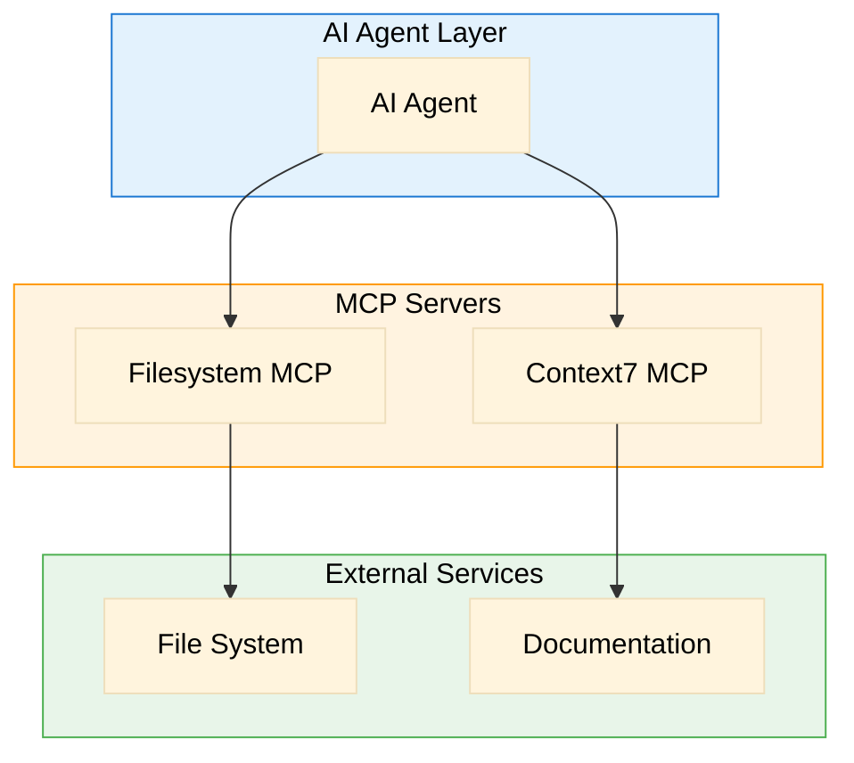
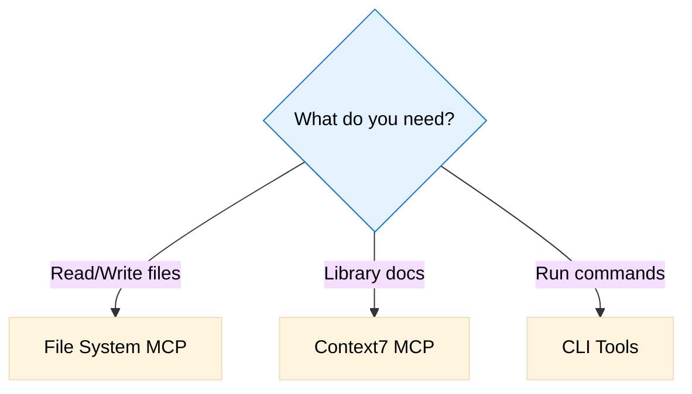

# Tools & MCPs Registry

> Inventory of all tools, MCPs, and integrations available in this project

**Last Updated**: 2025-12-06

## Overview



---

## MCP Servers

### Context7 MCP (Documentation)

**Purpose**: Access up-to-date library documentation for project stack

**Configuration**:
```json
{
  "mcpServers": {
    "context7": {
      "command": "npx",
      "args": ["-y", "@context7/mcp"]
    }
  }
}
```

**Available Operations**:
| Operation | Description | When to Use |
|-----------|-------------|-------------|
| `resolve-library-id` | Find library ID | Before fetching docs |
| `get-library-docs` | Get documentation | Learn about libraries |

**Priority Libraries to Document**:
- `/agnai/agno` - Framework Agno (agent orchestration)
- `/neo4j/neo4j-javascript-driver` - Neo4j Node.js driver
- `/vercel/next.js` - Next.js frontend framework
- `/docling` - Document processing pipeline
- `/openai/openai-python` - OpenAI Python SDK (if needed)

**Notes**:
- Use for current documentation, not training data
- Good for version-specific information
- **CRITICAL**: Always consult Context7 before implementing Agno and Docling features

---

### File System MCP

**Purpose**: Read and write files in the project

**Available Operations**:
| Operation | Description | When to Use |
|-----------|-------------|-------------|
| `read_file` | Read file contents | Inspect code/docs |
| `write_file` | Write file contents | Create/update files |
| `list_directory` | List directory contents | Explore project structure |
| `search_files` | Search for files | Find specific files |

**Notes**:
- Binary files not supported
- Large files may be truncated

---

## External APIs

### Azure OpenAI API

**Service**: Microsoft Azure OpenAI Service  
**Base URL**: Configured via `AZURE_OPENAI_ENDPOINT`  
**Authentication**: API key via `AZURE_OPENAI_KEY`

**Available Endpoints**:
| Endpoint | Purpose | Model |
|----------|---------|-------|
| `/chat/completions` | Chat and reasoning | GPT-4, GPT-3.5-Turbo |
| `/embeddings` | Generate embeddings | text-embedding-3-small |

**Rate Limits**: Depends on Azure subscription tier  
**Pricing**: Per token usage

**Notes**:
- Primary LLM for all agent operations
- Embeddings for semantic search in Neo4j

---

### Neo4j Aura API

**Service**: Neo4j Aura (managed graph database)  
**Connection**: Via Neo4j JavaScript/Python drivers  
**Authentication**: Username/Password via env vars

**Available Operations**:
| Operation | Purpose | Driver Method |
|-----------|---------|---------------|
| Cypher queries | Read/write graph data | `session.run()` |
| Vector search | Semantic similarity | `db.index.vector.queryNodes()` |
| Batch operations | Bulk inserts | `UNWIND` + transactions |

**Console**: https://console.neo4j.io  
**Rate Limits**: Based on instance size

**Notes**:
- Core data layer for all entities and relationships
- Vector indexes for embedding search

---

## Internal Tools & Frameworks

### Framework Agno (Agent Orchestration)

**Purpose**: Framework para orquestração de agentes AI  
**Language**: Python/Node.js  
**Status**: A ser pesquisado via Context7

**Key Features** (assumed):
- Multi-agent coordination
- Agent-to-agent communication
- Tool/function calling
- Memory management

**Usage in Project**:
- Knowledge Agent
- Task Agent
- Feedback Agent
- Persona Agent

**Notes**:
- Não usar como caixa preta - customizar quando necessário
- Avaliar se funções pré-definidas atendem requisitos
- Construir implementação própria se Agno for muito limitante

---

### Docling (Document Processing)

**Purpose**: Pipeline inteligente de ingestão de documentos  
**Language**: Python  
**Status**: A ser pesquisado via Context7

**Key Features** (assumed):
- Multi-format document parsing (PDF, DOCX, audio)
- Table extraction → JSON conversion
- Text chunking with context preservation
- Metadata extraction

**Usage in Project**:
- Processar reuniões (áudio → texto → chunks)
- Extrair tabelas de relatórios
- Criar chunks para embedding
- Gerar metadata para Neo4j nodes

**Notes**:
- Reuniões devem ser identificadas e tratadas especialmente
- Tabelas sempre convertidas para JSON
- Output deve ser compatível com schema Neo4j

---

### Neo4j JavaScript Driver

**Purpose**: Cliente Node.js para Neo4j  
**Package**: `neo4j-driver`  
**Documentation**: Via Context7

**Usage**:
```javascript
const neo4j = require('neo4j-driver');
const driver = neo4j.driver(
  process.env.NEO4J_URI,
  neo4j.auth.basic(
    process.env.NEO4J_USERNAME,
    process.env.NEO4J_PASSWORD
  )
);
```

**Operations**:
- CRUD de nodes e relationships
- Vector search
- Transações
- Batch operations

---

### Backend Stack

#### Node.js Backend

**Purpose**: API server e orquestração principal  
**Version**: 18+ (LTS)  
**Framework**: A definir (Express, Fastify, NestJS)

**Responsibilities**:
- REST/GraphQL API endpoints
- Frontend ↔ Backend communication
- Agent orchestration
- Neo4j queries

#### Python Services

**Purpose**: Document pipeline e AI operations  
**Version**: 3.10+  
**Key Libraries**:
- Docling (document processing)
- OpenAI Python SDK (embeddings)
- Neo4j Python driver (graph operations)
- Agno framework (agents)

**Responsibilities**:
- Document ingestion pipeline
- Embedding generation
- Heavy AI processing
- Python-specific agent logic

---

### Frontend Stack

#### Next.js

**Purpose**: Frontend interface  
**Version**: 14+ (App Router)  
**Status**: Infraestrutura já existe (a receber)

**Components** (existing):
- Chat UI (colapsável direita)
- Canvas central (rendering área)
- Menu lateral (colapsável esquerda)

**To Integrate**:
- API calls to Node.js backend
- Real-time updates (WebSocket?)
- Canvas interactivity

---

### CLI Tools

| Tool | Purpose | Usage |
|------|---------|-------|
| `npm run dev` | Start development server | `npm run dev` |
| `npm run build` | Production build | `npm run build` |
| `python pipeline.py` | Run document pipeline | `python pipeline.py --input <path>` |
| TBD | Neo4j migrations | TBD |

### Custom Scripts

| Script | Location | Purpose |
|--------|----------|---------|
| TBD | `scripts/` | Seed Neo4j with test data |
| TBD | `scripts/` | Backup graph database |
| TBD | `scripts/` | Run document ingestion batch |

---

## Tool Selection Guide



---

## Adding New Tools

When adding a new MCP or tool:

1. Add configuration to MCP configuration file
2. Document in this file with:
   - Purpose
   - Configuration
   - Available operations
   - Permissions and limits
3. Update related agents/specs if capabilities change
4. Test the integration before documenting as available
