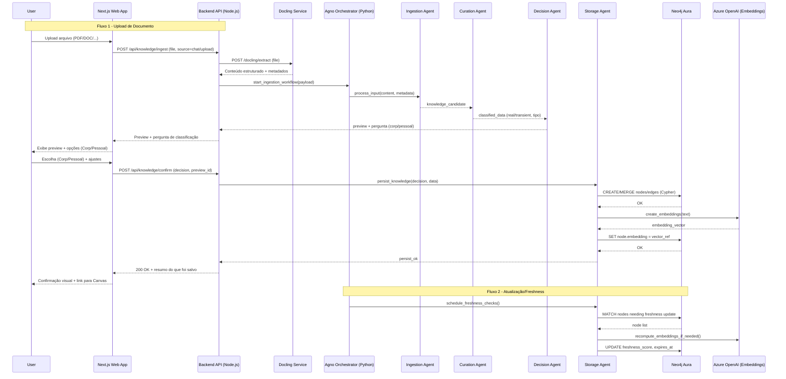
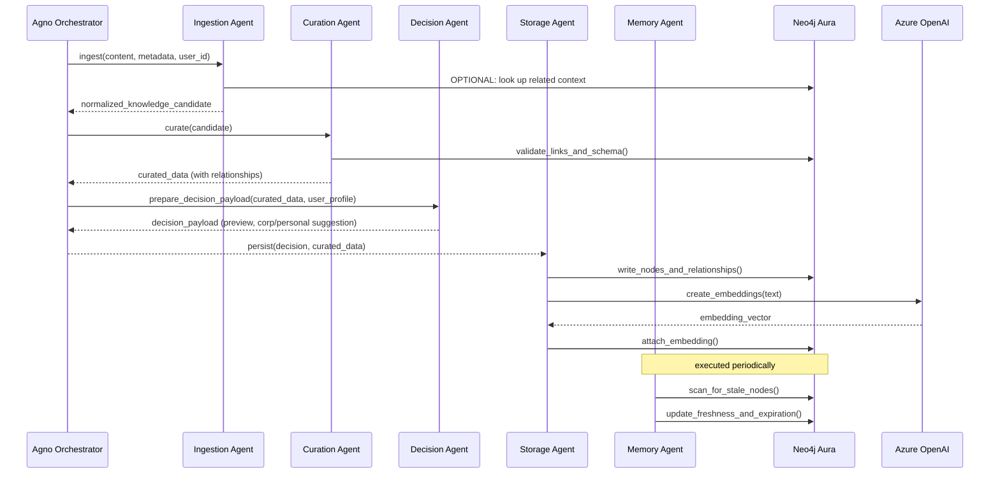

# Implementation Plan: Knowledge Pipeline

**Branch**: `001-knowledge-pipeline` | **Date**: 2025-12-07 | **Spec**: `specs/001-knowledge-pipeline/spec.md`
**Input**: Feature specification from `specs/001-knowledge-pipeline/spec.md`

## Summary

O Knowledge Pipeline é o fluxo técnico responsável por transformar entradas heterogêneas (chat, upload de documentos, formulários, integrações externas) em **conhecimento estruturado em grafos** (Neo4j) e **vetores de busca semântica** (Azure OpenAI), respeitando as regras de:

- Decisão de memória pelo usuário (Corporativo vs Pessoal)
- Filtração de dados (Real vs Passageiro)
- Conhecimento confirmado e versionado

Abordagem técnica de alto nível:

- **Frontend (Next.js)** provê chat + upload de arquivos + formulários.
- **Backend Node.js** expõe uma API de ingestão (`/api/knowledge/ingest` e `/api/knowledge/confirm`).
- **Pipeline de processamento** chama **Docling** para extração/estruturação de documentos.
- **Orquestração de agentes (Python + Agno)** aplica regras de curadoria, classificação e decisão.
- **Persistência em Neo4j Aura** armazena nodes/edges com metadados universais definidos em `database-schema.md`.
- **Azure OpenAI** gera embeddings para recuperação semântica.
- Mecanismos de **freshness** e **memory decay** mantêm o conhecimento atualizado.

---

## System Interaction Diagram (Technical View)



### Component Architecture

```mermaid
flowchart TB
  subgraph Frontend[Frontend (Next.js)]
    ChatUI[Chat & Upload UI]
    Canvas[Canvas de Conhecimento]
  end

  subgraph Backend[Backend (Node.js)]
    API[REST API /api/knowledge/*]
    OrchestrationAPI[Orquestração de Workflows]
  end

  subgraph Agents[Agno (Python)]
    Orchestrator[Agno Orchestrator]
    IngestA2[Ingestion Agent]
    CurateA2[Curation Agent]
    DecideA2[Decision Agent]
    StoreA2[Storage Agent]
    MemoryA[Memory/Freshness Agent]
  end

  subgraph Services[External/Internal Services]
    DoclingSvc[Docling Service]
    EmbSvc[Azure OpenAI Embeddings]
  end

  subgraph Storage[Storage Layer]
    Neo4jDB[(Neo4j Aura Graph DB)]
    Blob[(Blob Storage p/ arquivos brutos)]
  end

  ChatUI --> API
  Canvas --> API
  API --> OrchestrationAPI
  OrchestrationAPI --> Orchestrator

  Orchestrator --> IngestA2
  Orchestrator --> CurateA2
  Orchestrator --> DecideA2
  Orchestrator --> StoreA2
  Orchestrator --> MemoryA

  IngestA2 --> DoclingSvc
  CurateA2 --> Neo4jDB
  DecideA2 --> API
  StoreA2 --> Neo4jDB
  StoreA2 --> EmbSvc
  IngestA2 --> Blob

  MemoryA --> Neo4jDB
```

### Message Contracts (high-level)

| From | To | Method/Event | Payload | Response |
|------|----|--------------|---------|----------|
| WebApp | API | `POST /api/knowledge/ingest` | Arquivo, metadados de fonte, usuário | `202 Accepted` + `processing_id` |
| API | Docling | HTTP POST `/extract` ou chamada lib | Binário do arquivo + opções | Conteúdo estruturado (texto, tabelas, layout) |
| API | Orchestrator | RPC/HTTP `start_ingestion_workflow` | `{ content, metadata, user_id }` | `workflow_id` ou status |
| Orchestrator | DecideA | Mensagem interna Agno | `{ classified_data, user_profile }` | `{ preview, classification_suggestion }` |
| API | WebApp | `200 OK` | Preview + pergunta Corp/Pessoal | Renderização no chat |
| WebApp | API | `POST /api/knowledge/confirm` | `{ decision, preview_id, overrides }` | `200 OK` + resumo do que foi salvo |
| StoreA | Neo4j | Cypher via driver | Nodes/edges + metadados | Result + IDs |
| StoreA | EmbSvc | HTTP `POST /embeddings` | `{ text, model }` | `{ embedding: number[] }` |

---

## Technical Context

**Language/Version**: 
- Backend: Node.js 20.x (JavaScript/TypeScript)  
- Frontend: Next.js 14 (React 18)  
- Agents: Python 3.11 (Agno)  

**Primary Dependencies**:
- Frontend: Next.js, React, Tailwind (ou equivalente)  
- Backend: Express/NestJS (NEEDS CLARIFICATION), `neo4j-driver`, SDK Azure OpenAI  
- Agents: Agno Framework, `neo4j` (Python driver), HTTP client para Docling  
- Pipelines: Docling (como serviço externo ou lib – NEEDS CLARIFICATION)  

**Storage**:
- Grafo principal: Neo4j Aura (já definido em `database-schema.md`)  
- Armazenamento de arquivos brutos: Blob Storage (Azure Blob ou S3 compatível) – NEEDS CLARIFICATION  
- Logs/telemetria: solução de observabilidade futura (ligado ao TRG-SPC-016)  

**Testing**:
- Backend: Jest + Supertest (ou equivalente) – NEEDS CLARIFICATION  
- Agents (Python): pytest  
- Frontend: React Testing Library / Playwright (NEEDS CLARIFICATION de escopo)  

**Target Platform**:
- Contêineres Linux (Docker) orquestrados em ambiente gerenciado (Azure) – detalhes exatos NEEDS CLARIFICATION  

**Project Type**: Web application (frontend + backend + serviços de agentes)  

**Performance Goals** (alinhado com a spec):
- Processamento de documentos até 10MB em < 10 segundos (SC-002)  
- 95%+ dos documentos processados sem intervenção manual (SC-001)  
- Suporte a 100 documentos em paralelo sem degradação perceptível (SC-008)  

**Constraints**:
- Latência de UX aceitável para usuário interativo no chat (pré-visualização + pergunta não podem “travar” UI)  
- Custos de embeddings e armazenamento sob controle (aplicando memory decay e filtragem de dados)  
- Respeito à privacidade: visibilidade (personal/corporate) sempre configurada no ato da persistência  

**Scale/Scope**:
- Primeiro alvo: dezenas de usuários simultâneos, centenas de documentos/dia, milhares de nodes no grafo  
- Devem existir caminhos claros de escala horizontal do backend e dos agentes  

---

## Constitution Check

Principais princípios aplicáveis (resumo, não exaustivo):

- **A.XX – Decisão de Memória pelo Usuário**: Docling primeiro, depois perguntar (não persistir sem decisão).  
- **A.XXI – Filtração de Dados (Real vs Passageiro)**: pipeline deve separar conhecimento estável de dados transitórios.  
- **A.XXII – Conhecimento Confirmado**: informações centrais (ex: áreas profissionais) só são consideradas “confirmadas” com aceitação explícita do usuário.  
- Princípios de **auto-melhoria**, **observabilidade** e **gamificação** são consumidores futuros desse pipeline.

**GATE pré-Phase 0**: 

- Nenhuma violação direta detectada neste plano de alto nível.  
- Itens marcados como **NEEDS CLARIFICATION** (Docling como serviço/lib, escolha de framework Node, detalhes de observabilidade) devem ser resolvidos em `research.md` antes de travar o design final.

---

## Project Structure

### Documentation (this feature)

```text
specs/001-knowledge-pipeline/
├── spec.md          # Especificação funcional (pronta)
├── plan.md          # ESTE ARQUIVO - plano técnico
├── research.md      # Decisões técnicas e tradeoffs da pipeline
├── data-model.md    # Modelo de dados específico da ingestão/conhecimento
├── quickstart.md    # Como desenvolver/testar o Knowledge Pipeline
└── contracts/       # Contratos de API e mensagens entre componentes
```

### Source Code (repository root)

```text
backend/
├── src/
│   ├── api/
│   │   └── knowledge/           # Rotas /api/knowledge/*
│   ├── services/
│   │   ├── ingestion-service.ts # Orquestra chamada a Docling + Agno
│   │   ├── preview-service.ts   # Monta preview para o usuário
│   │   └── persistence-service.ts # Escrita em Neo4j + embeddings
│   ├── config/
│   └── lib/
└── tests/
    ├── integration/
    └── unit/

frontend/
├── src/
│   ├── components/
│   │   ├── Chat/
│   │   └── Canvas/
│   ├── pages/
│   │   └── app/(routes de chat/canvas)
│   └── services/
│       └── api-client.ts
└── tests/

agents/
└── knowledge_pipeline/
    ├── orchestrator.py     # Orquestrador Agno
    ├── ingestion_agent.py
    ├── curation_agent.py
    ├── decision_agent.py
    ├── storage_agent.py
    └── memory_agent.py

infra/
└── docling/
    └── (configuração de serviço ou cliente)
```

**Structure Decision**: Web application com backend Node.js, frontend Next.js e diretório separado para agentes Agno (`agents/knowledge_pipeline`). O Knowledge Pipeline será implementado principalmente em `backend/src/services/` (coordenação técnica) e `agents/knowledge_pipeline/` (lógica de decisão/curadoria).

---

## Complexity Tracking

No momento não há violações explícitas da constitution. Qualquer decisão que adicione nova complexidade (ex: novos serviços separados) deve ser registrada aqui futuramente.

| Violation | Why Needed | Simpler Alternative Rejected Because |
|-----------|------------|--------------------------------------|

---

## Agent/Component Interaction (Technical)



### Agent Contracts (initial draft)

| Agent | Input Schema | Output Schema | Side Effects |
|-------|--------------|---------------|--------------|
| Ingestion Agent | `{ content: string, metadata: {...}, user_id: string }` | `{ candidate: {...} }` | Pode ler contexto no grafo, registrar logs |
| Curation Agent | `{ candidate: {...} }` | `{ curated_data: {...}, relationships: [...] }` | Valida contra schema Neo4j, sugere relações |
| Decision Agent | `{ curated_data: {...}, user_profile: {...} }` | `{ preview: string, suggested_visibility: "corporate"\|"personal" }` | Nenhum efeito direto em DB |
| Storage Agent | `{ decision: {...}, curated_data: {...} }` | `{ node_ids: [...], status: "ok" }` | Escrita em Neo4j, chamada a embeddings |
| Memory Agent | `{} ou { policy: {...} }` | `{ updated_nodes: number }` | Atualiza freshness_score, expires_at em Neo4j |
