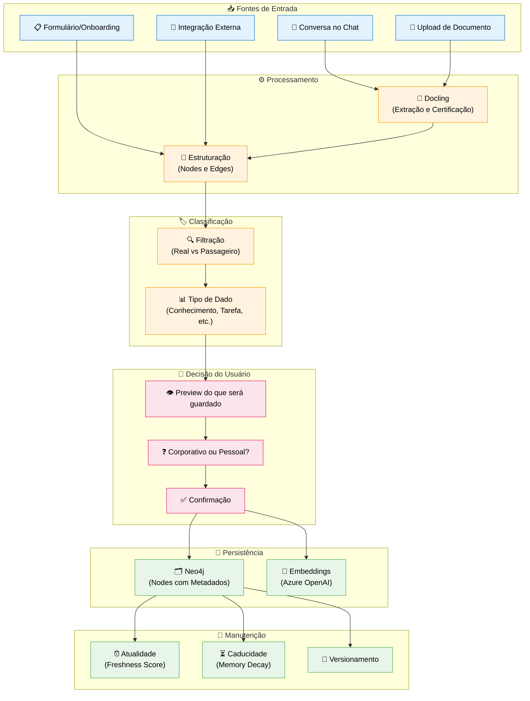
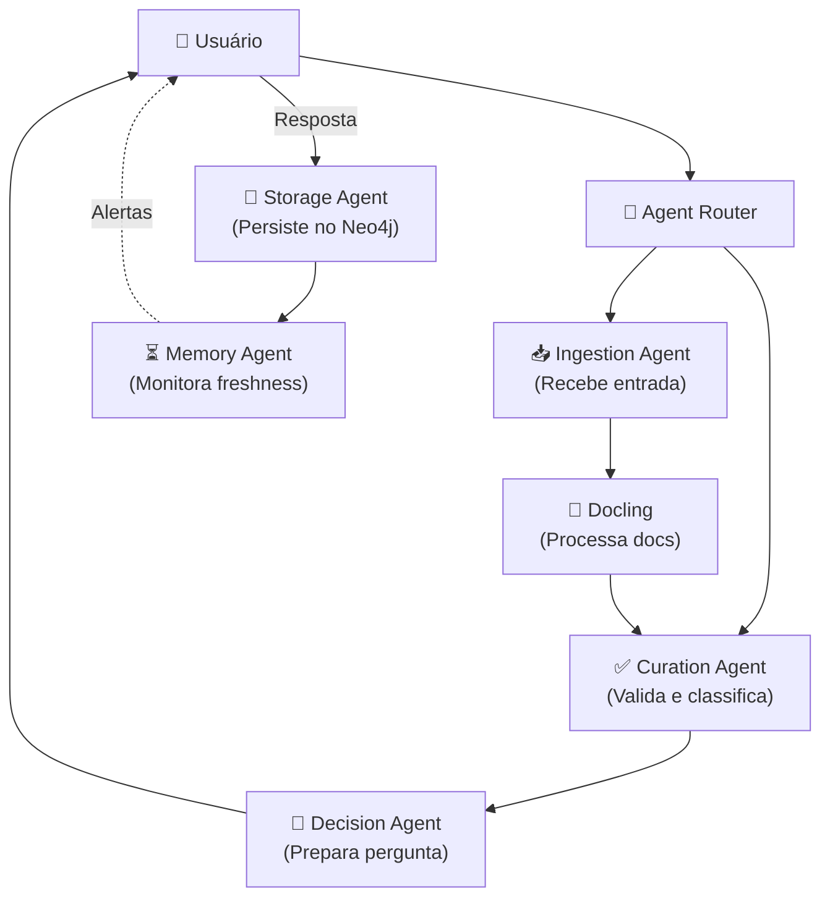

# Feature Specification: Knowledge Pipeline

**Feature Branch**: `001-knowledge-pipeline`  
**Created**: 2025-12-07  
**Status**: Draft  
**Priority**: P1 (Core)  
**Source**: TRG-SPC-20251206-028

## Process Flow (Business View)

### Flow Insights

- **Gaps identificados**:
  - Formato específico de preview para o usuário (UX a definir)
  - Comportamento quando usuário não responde à pergunta Corp/Pessoal
  
- **Oportunidades identificadas**:
  - Sugestão automática baseada em contexto (ex: documento de projeto → sugere Corporativo)
  - Aprendizado de preferências do usuário ao longo do tempo
  - Processamento em batch para múltiplos documentos
  
- **Riscos identificados**:
  - Sobrecarga de perguntas pode irritar usuário → implementar "lembrar escolha"
  - Latência do Docling pode afetar UX → processamento assíncrono

---

## Agent Collaboration

### Data Flow Between Agents (Conceptual)

| From | To | What is passed | Purpose |
|------|-----|----------------|---------|
| **User** | Ingestion Agent | Mensagem, arquivo, ou formulário | Iniciar pipeline |
| **Ingestion Agent** | Docling | Arquivo raw | Extrair e certificar conteúdo |
| **Docling** | Curation Agent | Conteúdo estruturado + metadados | Validar e classificar |
| **Curation Agent** | Decision Agent | Dado classificado (Real/Passageiro) | Preparar pergunta ao usuário |
| **Decision Agent** | User | Preview + pergunta Corp/Pessoal | Obter decisão |
| **User** | Storage Agent | Decisão (corp/pessoal) | Persistir com visibilidade correta |
| **Storage Agent** | Memory Agent | Node ID + metadados | Monitorar atualidade |

---

## User Scenarios & Testing

### User Story 0 - Onboarding Obrigatório (Priority: P0 - BLOQUEANTE)

Novo usuário faz login pela primeira vez. Sistema detecta que não tem node `:User` completo no Neo4j e redireciona para formulário de onboarding obrigatório. Usuário não pode acessar chat até completar.

**Why this priority**: **BLOQUEANTE**. Sem onboarding, não há dados básicos para criar agent persona, configurar preferências, ou filtrar conhecimento. É o primeiro node do usuário no grafo.

**Independent Test**: Login com usuário novo (sem node no Neo4j), verificar redirecionamento obrigatório.

**Acceptance Scenarios**:

1. **Given** usuário pré-cadastrado por admin faz primeiro login, **When** sistema verifica Neo4j, **Then** não encontra node `:User` completo e redireciona para `/onboarding` (não permite pular)

2. **Given** usuário no formulário de onboarding, **When** tenta acessar `/chat` diretamente, **Then** é redirecionado de volta para `/onboarding` até completar

3. **Given** usuário completa onboarding (nome, empresa, área, cargo, preferências iniciais), **When** submete formulário, **Then** node `:User` é criado no Neo4j com dados completos + agente persona base é gerado

4. **Given** onboarding completo, **When** usuário é redirecionado para chat, **Then** sistema mostra mensagem de boas-vindas personalizada usando dados do onboarding

**Dados Coletados no Onboarding**:
- Nome completo
- Empresa (`company`: CVC, CoCreateAI, ou Startup específica)
- Área de atuação (`area`: ex: Tecnologia, Marketing, Produto)
- Cargo/Posição (`position`)
- Preferências iniciais:
  - Conhecimento padrão: Corporativo ou Pessoal?
  - Filtro de conversa: Ativo por padrão?
  - Tipo de notificações desejadas

---

### User Story 1 - Envio de Documento (Priority: P1)

O usuário envia um documento (PDF, DOC, etc.) através do chat. O sistema processa, extrai informações relevantes, e pergunta ao usuário se quer guardar como conhecimento corporativo ou pessoal.

**Why this priority**: É o fluxo mais comum de entrada de conhecimento. Sem isso, o sistema não tem como aprender.

**Independent Test**: Pode ser testado enviando um PDF e verificando se aparece a pergunta de classificação após processamento.

**Acceptance Scenarios**:

1. **Given** usuário está no chat, **When** envia um PDF, **Then** sistema mostra "Processando..." e após alguns segundos exibe preview do conteúdo extraído com pergunta "Corporativo ou Pessoal?"

2. **Given** documento foi processado, **When** usuário escolhe "Corporativo", **Then** dado é salvo no Neo4j com `visibility: "corporate"` e confirmação visual é exibida

3. **Given** documento foi processado, **When** usuário escolhe "Pessoal", **Then** dado é salvo com `visibility: "personal"` e só aparece para este usuário

---

### User Story 2 - Filtro de Conversa e Contexto Persistente (Priority: P0 - BLOQUEANTE)

Durante conversa no chat, sistema mantém resumo dinâmico do que está sendo tratado. Quando usuário aciona ação (ex: "Nova Tarefa"), sistema tem contexto completo para executar sem perder informação.

**Why this priority**: **BLOQUEANTE**. Sem filtro de conversa, agentes operam sem contexto. Task Agent não sabe sobre o que gerar tarefas. Knowledge Agent não sabe o que extrair.

**Independent Test**: Conversar sobre projeto, clicar "Nova Tarefa", verificar que Task Agent tem acesso ao contexto da conversa.

**Acceptance Scenarios**:

1. **Given** usuário conversa sobre "lançamento de produto X", **When** envia 5+ mensagens sobre o tema, **Then** sistema mantém resumo atualizado: "Tópico: lançamento produto X. Pontos principais: timeline, orçamento, equipe"

2. **Given** resumo de conversa existe, **When** usuário clica ação "Nova Tarefa", **Then** Task Agent recebe resumo completo como contexto sem precisar reprocessar todas as mensagens

3. **Given** conversa muda de tópico, **When** usuário começa falar de "análise de mercado", **Then** sistema detecta mudança e cria novo resumo (mas mantém histórico do anterior)

4. **Given** conversa muito longa (>50 mensagens), **When** resumo fica grande, **Then** sistema comprime resumo mantendo pontos essenciais (via LLM summarization)

**Metadados do Filtro de Conversa**:
- `conversation_topic`: String descritiva do tópico atual
- `key_points`: Array de pontos principais mencionados
- `entities_mentioned`: Array de entidades (@mentions, docs, pessoas)
- `last_updated_at`: Timestamp da última atualização
- `message_count`: Número de mensagens consideradas no resumo
- `summary_text`: Texto resumido da conversa (max 500 chars)

**Regras de Atualização**:
- Resumo atualizado a cada 3-5 mensagens
- Mudança de tópico detectada via embeddings similarity <0.6
- Resumo antigo arquivado (não deletado) para histórico

---

### User Story 3 - Conhecimento via Conversa (Priority: P1)

O usuário menciona informações relevantes durante uma conversa. O sistema detecta conhecimento importante e oferece opção de persistir.

**Why this priority**: Conversas são a forma mais natural de input. Capturar conhecimento "em fluxo" é essencial.

**Independent Test**: Simular conversa onde usuário menciona "Nossa startup foca em HealthTech" e verificar se sistema oferece salvar.

**Acceptance Scenarios**:

1. **Given** conversa em andamento, **When** usuário menciona informação classificável como "Real" (não passageira), **Then** sistema detecta e sugere "Quer salvar essa informação?"

2. **Given** informação foi detectada, **When** usuário confirma, **Then** sistema pergunta classificação (Corp/Pessoal) e persiste

3. **Given** informação foi detectada, **When** usuário ignora ou recusa, **Then** informação permanece apenas no histórico da sessão

---

### User Story 3 - Formulário de Onboarding (Priority: P2)

Novo usuário preenche formulário de onboarding com informações profissionais. Sistema estrutura e persiste automaticamente como conhecimento confirmado.

**Why this priority**: Onboarding é menos frequente, mas essencial para contexto inicial.

**Independent Test**: Completar formulário de onboarding e verificar se nodes de área profissional são criados com `confirmed: true`.

**Acceptance Scenarios**:

1. **Given** formulário de onboarding, **When** usuário preenche área profissional (ex: "FinTech"), **Then** node `(:User)-[:WORKS_IN]->(:Area {name: "FinTech", confirmed: true})` é criado

2. **Given** formulário completo, **When** usuário submete, **Then** todos os nodes criados têm `source_type: "form"` e `confidence: 1.0`

---

### User Story 4 - Atualização de Conhecimento (Priority: P2)

Usuário atualiza informação existente. Sistema mantém histórico e atualiza freshness.

**Why this priority**: Manter conhecimento atualizado é importante, mas secundário à captura inicial.

**Independent Test**: Editar um node existente e verificar se `updated_at` e `version` são atualizados.

**Acceptance Scenarios**:

1. **Given** conhecimento existente, **When** usuário atualiza via conversa ou formulário, **Then** node é atualizado com novo `updated_at`, `version` incrementado, e histórico mantido

2. **Given** conhecimento atualizado, **When** freshness é recalculado, **Then** `freshness_score` aumenta para refletir atualização recente

---

### Edge Cases

- **O que acontece quando Docling falha ao processar um documento?**
  - Exibir mensagem de erro amigável
  - Oferecer opção de tentar novamente
  - Logar erro para análise

- **O que acontece se usuário não responde à pergunta Corp/Pessoal?**
  - Timeout de 30 segundos
  - Default para "Pessoal" (menos invasivo)
  - Permitir reclassificar depois

- **O que acontece com documentos muito grandes?**
  - Chunking automático
  - Processamento em background
  - Notificação quando pronto

- **O que acontece quando há conflito de informação?**
  - Sistema detecta conflito
  - Pergunta ao usuário qual versão manter
  - Mantém histórico de ambas

---

## Requirements

### Functional Requirements

#### Onboarding (BLOQUEANTE)

- **FR-000**: Sistema DEVE detectar se usuário tem node `:User` completo no Neo4j após login

- **FR-001**: Sistema DEVE redirecionar para `/onboarding` se node `:User` incompleto ou ausente

- **FR-002**: Sistema NÃO DEVE permitir acesso a `/chat` até onboarding completo (redirecionamento forçado)

- **FR-003**: Formulário de onboarding DEVE coletar: nome, empresa, área, cargo, preferências (conhecimento padrão, filtro conversa)

- **FR-004**: Sistema DEVE criar node `:User` no Neo4j com todos os dados do onboarding

- **FR-005**: Sistema DEVE gerar agente persona base para usuário após onboarding

#### Filtro de Conversa (BLOQUEANTE)

- **FR-006**: Sistema DEVE manter resumo dinâmico da conversa atual em tempo real

- **FR-007**: Resumo DEVE incluir: tópico, pontos principais, entidades mencionadas, timestamp

- **FR-008**: Sistema DEVE atualizar resumo a cada 3-5 mensagens do usuário

- **FR-009**: Sistema DEVE detectar mudança de tópico via embeddings similarity (<0.6 = novo tópico)

- **FR-010**: Sistema DEVE arquivar resumo antigo ao criar novo (não deletar)

- **FR-011**: Resumos DEVEM ser comprimidos via LLM summarization se >500 caracteres

- **FR-012**: Sistema DEVE injetar resumo como contexto em todas as ações (Nova Tarefa, Novo Conhecimento, etc)

#### Knowledge Pipeline

- **FR-013**: Sistema DEVE aceitar entrada de conhecimento via chat, upload de documentos, formulários, e APIs externas

- **FR-014**: Sistema DEVE processar documentos via Docling antes de qualquer decisão de persistência

- **FR-015**: Sistema DEVE classificar dados como "Real" (permanente) ou "Passageiro" (temporário) automaticamente, com possibilidade de override pelo usuário

- **FR-016**: Sistema DEVE perguntar ao usuário se conhecimento é "Corporativo" ou "Pessoal" após processamento

- **FR-017**: Sistema DEVE exibir preview do conteúdo extraído antes da decisão do usuário

- **FR-018**: Sistema DEVE persistir conhecimento no Neo4j com todos os metadados obrigatórios (created_at, source_type, owner_id, visibility, confidence, memory_level)

- **FR-019**: Sistema DEVE gerar embeddings via Azure OpenAI para todo conhecimento persistido

- **FR-020**: Sistema DEVE manter freshness_score atualizado para todo conhecimento

- **FR-021**: Sistema DEVE aplicar regras de caducidade (memory decay) conforme memory_level

- **FR-022**: Sistema DEVE manter versionamento de todo conhecimento atualizado

- **FR-023**: Sistema DEVE permitir que usuário configure defaults (ex: "sempre pessoal para documentos PDF")

- **FR-024**: Sistema DEVE processar de forma assíncrona documentos que levem mais de 5 segundos

### Key Entities

- **User**: Node do usuário no Neo4j. Atributos: id, name, email, company, area, position, onboarding_completed, preferences, created_at, updated_at

- **ConversationSummary**: Resumo dinâmico da conversa. Atributos: conversation_id, user_id, conversation_topic, key_points[], entities_mentioned[], last_updated_at, message_count, summary_text, is_active

- **KnowledgeNode**: Representa uma unidade de conhecimento. Atributos: content, source_type, source_ref, owner_id, visibility, confidence, memory_level, freshness_score, expires_at, created_at, updated_at, version

- **Relationship**: Representa conexão entre nodes. Atributos: type, strength, bidirectional, context, last_interaction_at

- **ProcessingJob**: Representa um documento em processamento. Atributos: status, file_ref, started_at, completed_at, error

- **UserPreference**: Preferências de classificação do usuário. Atributos: default_visibility, remember_choices, auto_classify, conversation_filter_enabled

---

## Success Criteria

### Measurable Outcomes

- **SC-001**: 95% dos documentos são processados com sucesso pelo Docling sem intervenção manual

- **SC-002**: Tempo médio de processamento de documento < 10 segundos para arquivos de até 10MB

- **SC-003**: 100% do conhecimento persistido possui todos os metadados obrigatórios (nenhum campo null)

- **SC-004**: Usuário consegue completar fluxo de "envio de documento → classificação → confirmação" em menos de 30 segundos (excluindo tempo de processamento)

- **SC-005**: Taxa de abandono do fluxo de classificação < 10% (usuários que iniciam e não completam)

- **SC-006**: 90% dos usuários definem preferências de classificação após 5 interações

- **SC-007**: Freshness score reflete corretamente a atualidade do conhecimento (nodes atualizados recentemente têm score > 0.8)

- **SC-008**: Sistema processa 100 documentos simultâneos sem degradação perceptível

---

## Assumptions

1. **Docling está disponível e configurado** - Pipeline depende de Docling para processamento de documentos
2. **Neo4j Aura está acessível** - Persistência depende de conexão com Neo4j
3. **Azure OpenAI está configurado** - Embeddings dependem de Azure OpenAI
4. **Usuário está autenticado** - Todo conhecimento precisa de owner_id
5. **Metadados universais já definidos** - Conforme `database-schema.md`

---

## Dependencies

- **Constitution**: A.XX (Decisão de Memória), A.XXI (Filtração Real/Passageiro), A.XXII (Conhecimento Confirmado)
- **Schema**: `database-schema.md` (metadados universais)
- **Flows**: `system-flows.md` (fluxo de ingestão)
- **External**: Docling, Neo4j Aura, Azure OpenAI

---

## Related Specifications

- **TRG-SPC-034**: User Memory Decision System (detalhamento da decisão Corp/Pessoal)
- **TRG-SPC-035**: Data Filtration System (detalhamento Real vs Passageiro)
- **TRG-SPC-021**: Graph Curation Ecosystem (validação antes de persistir)
- **TRG-SPC-029**: Neo4j Metadata Model (schema detalhado)
