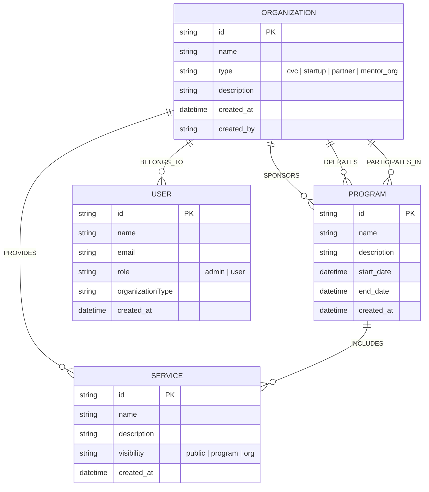
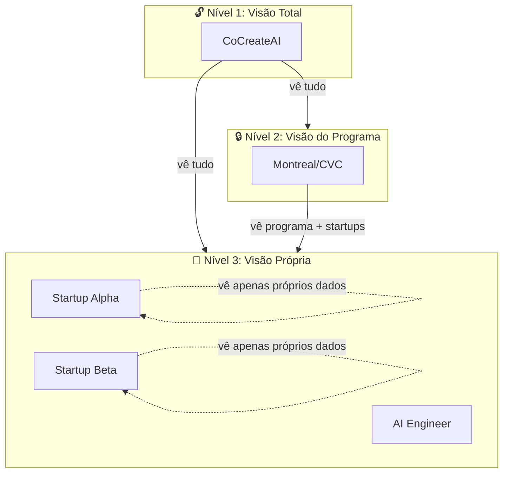
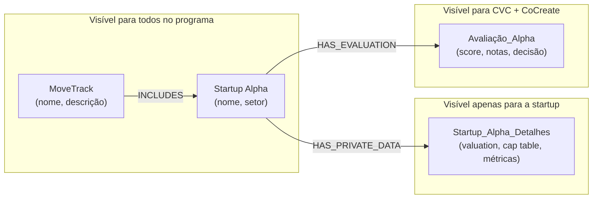
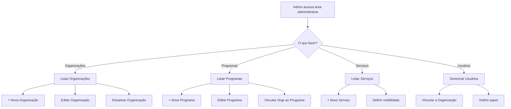
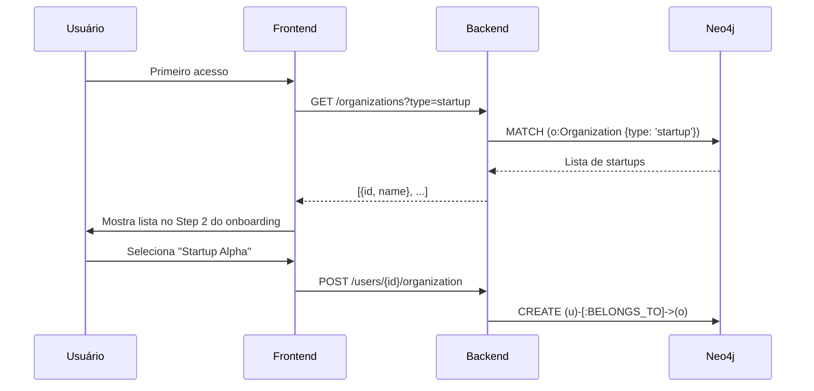

# TRG-SPC-048 – Admin Node Manager (Gestão de Nodes)

> **Status**: Draft  
> **Prioridade**: P1 Core  
> **Criado**: 2025-12-07  
> **Atualizado**: 2025-12-08  
> **Relacionado**: TRG-SPC-028 (Knowledge Pipeline), TRG-SPC-034 (Memory Decision)

---

## 1. Resumo Executivo

O **Admin Node Manager** é a funcionalidade que permite ao administrador do sistema cadastrar e gerenciar **nós genéricos** do grafo de conhecimento:

- **Organizações**: CVC (Montreal), CoCreateAI, startups participantes, parceiros (Procure.AI).
- **Programas**: Programas de aceleração (ex.: MoveTrack).
- **Serviços**: Serviços oferecidos pelas organizações.
- **Áreas / Trilhas**: categorias de atuação, trilhas de mentoria.

### 1.1 Princípios de Design

1. **Cadastro genérico de nodes** – não apenas usuários, mas qualquer entidade do grafo.
2. **Visibilidade via relações** – quem pode ver o quê é determinado pelas conexões no grafo.
3. **Hierarquia de acesso** – CoCreate/CVC vê tudo; startups veem apenas seus próprios detalhes.
4. **Propriedades sensíveis em relações** – dados confidenciais ficam em relações, não no nó público.

Esses cadastros alimentam:
- As opções de **startup/contexto** no onboarding do Usuário Operacional.
- Os **nós raiz** do grafo Neo4j usados pelos agentes.
- O **sistema de visibilidade** para segmentação de informações.

---

## 2. Problema / Necessidade

### 2.1 Situação Atual

- Não existe fluxo de cadastro de organizações/áreas.
- Usuário operacional não tem como escolher seu contexto (startup) porque não há dados base.
- Grafo começa vazio, sem estrutura organizacional.

### 2.2 Consequência

- Onboarding do usuário fica incompleto ("qual é sua startup?" → lista vazia).
- Agentes não têm contexto organizacional para trabalhar.
- Impossível separar conhecimento por organização/área.

---

## 3. Solução Proposta

### 3.1 Persona: Admin de Gestão de Nodes

| Campo | Descrição |
|-------|-----------|
| **Quem** | Administrador do CVC Hub (funcionário CVC, Procure.AI ou CoCreateAI) |
| **Acesso** | Área administrativa separada (não passa pelo onboarding padrão) |
| **Função principal** | Cadastrar e gerenciar nós base do grafo |

### 3.2 Entidades Gerenciadas (Nodes Genéricos)



### 3.3 Tipos de Nodes

| Label | Tipo/Subtipo | Descrição | Exemplo |
|-------|--------------|-----------|---------|
| `Organization` | `cvc` | Corporate Venture Capital | Montreal |
| `Organization` | `startup` | Startup participante | AI Engineer |
| `Organization` | `partner` | Parceiro de serviços | Procure.AI |
| `Organization` | `mentor_org` | Org de mentoria | CoCreateAI |
| `Program` | - | Programa de aceleração | MoveTrack |
| `Service` | - | Serviço oferecido | Mentoria Pitch |
| `User` | `admin` | Administrador | Admin CoCreate |
| `User` | `user` | Usuário operacional | Julio Lewkowicz |

### 3.4 Relações e seus Significados

| Relação | De → Para | Significado |
|---------|-----------|-------------|
| `BELONGS_TO` | User → Organization | Usuário é membro da organização |
| `SPONSORS` | Organization → Program | Organização patrocina/financia o programa |
| `OPERATES` | Organization → Program | Organização opera/executa o programa |
| `PARTICIPATES_IN` | Organization → Program | Startup participa do programa |
| `PROVIDES` | Organization → Service | Organização oferece o serviço |
| `INCLUDES` | Program → Service | Programa inclui o serviço |
| `MENTORS` | User → Organization | Usuário mentora a organização |
| `ACCOUNT_OWNER` | User → Organization | Usuário é responsável pela conta |

---

## 4. Sistema de Visibilidade e Acesso

### 4.1 Hierarquia de Acesso



### 4.2 Regras de Visibilidade

| Quem | Pode Ver | Não Pode Ver |
|------|----------|--------------|
| **CoCreateAI** | Todos os nodes e relações | - |
| **CVC (Montreal)** | Programa, todas as startups participantes, serviços do programa | Detalhes internos da CoCreate |
| **Startup** | Próprios dados, serviços públicos, mentores atribuídos | Dados de outras startups, detalhes internos CVC/CoCreate |

### 4.3 Visibilidade via Relações (não via propriedades)

**Princípio**: Dados sensíveis ficam em **relações** ou **nodes privados**, não em propriedades do node público.



### 4.4 Implementação da Visibilidade no Cypher

**Consulta padrão (respeitando visibilidade)**:

```cypher
// Dado o usuário atual, retorna nodes que ele pode ver
MATCH (currentUser:User {id: $userId})-[:BELONGS_TO]->(myOrg:Organization)
MATCH (n)
WHERE 
  // Regra 1: Nodes públicos do programa que participo
  (n:Program AND EXISTS {
    MATCH (myOrg)-[:PARTICIPATES_IN|OPERATES|SPONSORS]->(n)
  })
  OR
  // Regra 2: Minha própria organização e seus dados
  (n = myOrg OR EXISTS { MATCH (myOrg)-[*1..2]->(n) })
  OR
  // Regra 3: Se sou CoCreate/CVC, vejo mais
  (myOrg.type IN ['mentor_org', 'cvc'] AND n:Organization)
RETURN n
```

### 4.5 Pontos em Aberto [?]

> Estes pontos precisam ser clarificados antes do plano técnico:

- [ ] **[Q1]** O Program (MoveTrack) deve ter um `role` ou `type` próprio?
- [ ] **[Q2]** Serviços têm visibilidade própria ou herdam do Program?
- [ ] **[Q3]** Usuário pode pertencer a múltiplas organizações?
- [ ] **[Q4]** Como funciona a visibilidade de conhecimento gerado em conversas?
- [ ] **[Q5]** Nodes de avaliação (score, notas) são separados ou propriedades?

---

## 5. Fluxo de Uso

### 5.1 Diagrama Geral



### 5.2 Cadastro de Organização

1. Admin clica em "+ Nova Organização".
2. Preenche:
   - Nome (obrigatório)
   - Tipo (cvc / startup / partner / mentor_org)
   - Descrição (opcional)
3. Sistema cria o nó no grafo Neo4j.
4. Organização fica disponível para:
   - Seleção no onboarding do usuário.
   - Vinculação a programas.
   - Vinculação de usuários.

### 5.3 Cadastro de Programa

1. Admin clica em "+ Novo Programa".
2. Preenche:
   - Nome (obrigatório) – ex.: "MoveTrack"
   - Descrição (opcional)
   - Data início / fim (opcional)
3. Sistema cria o nó `Program` no grafo Neo4j.
4. Admin pode vincular:
   - Organização que SPONSORS (financia)
   - Organização que OPERATES (executa)
   - Organizações que PARTICIPATES_IN (startups)

### 5.4 Cadastro de Serviço

1. Admin clica em "+ Novo Serviço".
2. Preenche:
   - Nome (obrigatório)
   - Descrição (opcional)
   - Visibilidade: `public` | `program` | `org`
3. Sistema cria o nó `Service` no grafo Neo4j.
4. Serviço pode ser vinculado a:
   - Programa (via INCLUDES)
   - Organização (via PROVIDES)

---

## 6. Integração com Onboarding

### 6.1 Fluxo do Usuário Operacional



### 6.2 Impacto no Grafo

Quando Admin cadastra uma organização/área:
- Cria-se um **nó raiz** no grafo.
- Esse nó pode receber relações de:
  - Usuários (`BELONGS_TO`)
  - Tarefas (`CONTEXT_OF`)
  - Conhecimento (`RELATED_TO`)

---

## 7. Requisitos Funcionais

### 7.1 Gestão de Organizações

| ID | Requisito | Prioridade |
|----|-----------|------------|
| RF-001 | Admin pode listar todas as organizações | P1 |
| RF-002 | Admin pode criar nova organização com nome, tipo e descrição | P1 |
| RF-003 | Admin pode editar organização existente | P1 |
| RF-004 | Admin pode desativar (soft delete) organização | P2 |

### 7.2 Gestão de Programas

| ID | Requisito | Prioridade |
|----|-----------|------------|
| RF-005 | Admin pode listar todos os programas | P1 |
| RF-006 | Admin pode criar novo programa (ex.: MoveTrack) | P1 |
| RF-007 | Admin pode vincular organização como SPONSORS de um programa | P1 |
| RF-008 | Admin pode vincular organização como OPERATES de um programa | P1 |
| RF-009 | Admin pode vincular startup como PARTICIPATES_IN de um programa | P1 |

### 7.3 Gestão de Serviços

| ID | Requisito | Prioridade |
|----|-----------|------------|
| RF-010 | Admin pode listar todos os serviços | P2 |
| RF-011 | Admin pode criar novo serviço com visibilidade (public/program/org) | P2 |
| RF-012 | Admin pode vincular serviço a programa ou organização | P2 |

### 7.4 Gestão de Usuários e Relações

| ID | Requisito | Prioridade |
|----|-----------|------------|
| RF-013 | Admin pode vincular usuário a uma organização | P1 |
| RF-014 | Organizações do tipo "startup" aparecem no onboarding | P1 |
| RF-015 | Consultas respeitam hierarquia de visibilidade (CoCreate > CVC > Startup) | P1 |

---

## 8. Requisitos Não Funcionais

| ID | Requisito |
|----|-----------|
| RNF-001 | Operações de CRUD devem completar em < 500ms |
| RNF-002 | Área administrativa requer autenticação com papel "admin" |
| RNF-003 | Todas as operações devem ser auditadas (quem, quando, o quê) |

---

## 9. Critérios de Aceite

### 9.1 Organizações
- [ ] Admin consegue cadastrar uma nova organização do tipo "startup".
- [ ] Organização cadastrada aparece na lista do Step 2 do onboarding.
- [ ] Usuário operacional consegue se vincular à organização no onboarding.
- [ ] Nó da organização existe no Neo4j com as propriedades corretas.

### 9.2 Programas
- [ ] Admin consegue cadastrar um novo programa (ex.: MoveTrack).
- [ ] Admin consegue vincular CoCreateAI como OPERATES do programa.
- [ ] Admin consegue vincular Montreal/CVC como SPONSORS do programa.
- [ ] Admin consegue vincular startups como PARTICIPATES_IN do programa.
- [ ] Programa aparece no grafo com relações corretas.

### 9.3 Visibilidade
- [ ] Usuário da CoCreate consegue ver todos os nodes do programa.
- [ ] Usuário do CVC consegue ver o programa e todas as startups participantes.
- [ ] Usuário de Startup consegue ver apenas seus próprios dados e serviços públicos.
- [ ] Dados sensíveis (valuation, métricas) ficam em nodes/relações separados.

### 9.4 Serviços (P2)
- [ ] Admin consegue cadastrar serviço com visibilidade definida.
- [ ] Serviço com visibilidade "program" aparece para todos os participantes do programa.
- [ ] Serviço com visibilidade "org" aparece apenas para membros da organização.

---

## 10. Dependências

| Dependência | Status | Impacto |
|-------------|--------|---------|
| Neo4j Aura configurado | ✅ Pronto | Armazenamento do grafo |
| API de autenticação | ⬜ Pendente | Controle de acesso admin vs user |
| Backend Node.js | ⬜ Pendente | Endpoints CRUD |

---

## 11. Próximos Passos

1. **Plan**: Definir arquitetura técnica (endpoints, queries Cypher).
2. **Tasks**: Quebrar em tarefas de implementação.
3. **Implement**: Criar telas admin no frontend + endpoints no backend.
