# TRG-SPC-048 – Admin Node Manager (Gestão de Nodes)

> **Status**: Draft  
> **Prioridade**: P1 Core  
> **Criado**: 2025-12-07  
> **Atualizado**: 2025-12-08  
> **Relacionado**: TRG-SPC-028 (Knowledge Pipeline), TRG-SPC-034 (Memory Decision)

---

## 1. Resumo Executivo

O **Admin Node Manager** é a funcionalidade que permite ao administrador do sistema cadastrar e gerenciar **nós genéricos** do grafo de conhecimento:

- **Organizações**: CVC (Montreal), CoCreateAI, startups participantes, parceiros (Procure.AI).
- **Programas**: Programas de aceleração (ex.: MoveTrack).
- **Serviços**: Serviços oferecidos pelas organizações.
- **Áreas / Trilhas**: categorias de atuação, trilhas de mentoria.

### 1.1 Princípios de Design

1. **Cadastro genérico de nodes** – não apenas usuários, mas qualquer entidade do grafo.
2. **Visibilidade via relações** – quem pode ver o quê é determinado pelas conexões no grafo.
3. **Hierarquia de acesso** – CoCreate/CVC vê tudo; startups veem apenas seus próprios detalhes.
4. **Propriedades sensíveis em relações** – dados confidenciais ficam em relações, não no nó público.

Esses cadastros alimentam:
- As opções de **startup/contexto** no onboarding do Usuário Operacional.
- Os **nós raiz** do grafo Neo4j usados pelos agentes.
- O **sistema de visibilidade** para segmentação de informações.

---

## 2. Problema / Necessidade

### 2.1 Situação Atual

- Não existe fluxo de cadastro de organizações/áreas.
- Usuário operacional não tem como escolher seu contexto (startup) porque não há dados base.
- Grafo começa vazio, sem estrutura organizacional.

### 2.2 Consequência

- Onboarding do usuário fica incompleto ("qual é sua startup?" → lista vazia).
- Agentes não têm contexto organizacional para trabalhar.
- Impossível separar conhecimento por organização/área.

---

## 3. Solução Proposta

### 3.1 Persona: Admin de Gestão de Nodes

| Campo | Descrição |
|-------|-----------|
| **Quem** | Administrador do CVC Hub (funcionário CVC, Procure.AI ou CoCreateAI) |
| **Acesso** | Área administrativa separada (não passa pelo onboarding padrão) |
| **Função principal** | Cadastrar e gerenciar nós base do grafo |

### 3.2 Entidades Gerenciadas (Nodes Genéricos)


### 3.3 Tipos de Nodes

| Label | Tipo/Subtipo | Descrição | Exemplo |
|-------|--------------|-----------|---------|
| `Organization` | `cvc` | Corporate Venture Capital | Montreal |
| `Organization` | `startup` | Startup participante | AI Engineer |
| `Organization` | `partner` | Parceiro de serviços | Procure.AI |
| `Organization` | `mentor_org` | Org de mentoria | CoCreateAI |
| `Program` | - | Programa de aceleração | MoveTrack |
| `Service` | - | Serviço oferecido | Mentoria Pitch |
| `User` | `admin` | Administrador | Admin CoCreate |
| `User` | `user` | Usuário operacional | Julio Lewkowicz |

### 3.4 Relações e seus Significados

| Relação | De → Para | Significado |
|---------|-----------|-------------|
| `BELONGS_TO` | User → Organization | Usuário é membro da organização |
| `SPONSORS` | Organization → Program | Organização patrocina/financia o programa |
| `OPERATES` | Organization → Program | Organização opera/executa o programa |
| `PARTICIPATES_IN` | Organization → Program | Startup participa do programa |
| `PROVIDES` | Organization → Service | Organização oferece o serviço |
| `INCLUDES` | Program → Service | Programa inclui o serviço |
| `MENTORS` | User → Organization | Usuário mentora a organização |
| `ACCOUNT_OWNER` | User → Organization | Usuário é responsável pela conta |

---

## 4. Sistema de Visibilidade e Acesso

### 4.1 Hierarquia de Acesso

```mermaid
flowchart TD
    subgraph Nivel1["🔓 Nível 1: Visão Total"]
        CoCreate[CoCreateAI]
    end
    
    subgraph Nivel2["🔒 Nível 2: Visão do Programa"]
        CVC[Montreal/CVC]
    end
    
    subgraph Nivel3["🔐 Nível 3: Visão Própria"]
        S1[Startup Alpha]
        S2[Startup Beta]
        S3[AI Engineer]
    end
    
    CoCreate -->|vê tudo| Nivel2
    CoCreate -->|vê tudo| Nivel3
    CVC -->|vê programa + startups| Nivel3
    S1 -.->|vê apenas próprios dados| S1
    S2 -.->|vê apenas próprios dados| S2
```



### 4.2 Regras de Visibilidade

| Quem | Pode Ver | Não Pode Ver |
|------|----------|--------------|
| **CoCreateAI** | Todos os nodes e relações | - |
| **CVC (Montreal)** | Programa, todas as startups participantes, serviços do programa | Detalhes internos da CoCreate |
| **Startup** | Próprios dados, serviços públicos, mentores atribuídos | Dados de outras startups, detalhes internos CVC/CoCreate |

### 4.3 Visibilidade via Relações (não via propriedades)

**Princípio**: Dados sensíveis ficam em **relações** ou **nodes privados**, não em propriedades do node público.

```mermaid
flowchart LR
    subgraph Publico["Visível para todos no programa"]
        Startup["Startup Alpha<br/>(nome, setor)"]
        Program["MoveTrack<br/>(nome, descrição)"]
    end
    
    subgraph Restrito["Visível apenas para a startup"]
        Detalhes["Startup_Alpha_Detalhes<br/>(valuation, cap table, métricas)"]
    end
    
    subgraph Restrito_CVC["Visível para CVC + CoCreate"]
        Avaliacao["Avaliação_Alpha<br/>(score, notas, decisão)"]
    end
    
    Startup -->|HAS_PRIVATE_DATA| Detalhes
    Startup -->|HAS_EVALUATION| Avaliacao
    Program -->|INCLUDES| Startup
```



### 4.4 Implementação da Visibilidade no Cypher

**Consulta padrão (respeitando visibilidade)**:

```cypher
// Dado o usuário atual, retorna nodes que ele pode ver
MATCH (currentUser:User {id: $userId})-[:BELONGS_TO]->(myOrg:Organization)
MATCH (n)
WHERE 
  // Regra 1: Nodes públicos do programa que participo
  (n:Program AND EXISTS {
    MATCH (myOrg)-[:PARTICIPATES_IN|OPERATES|SPONSORS]->(n)
  })
  OR
  // Regra 2: Minha própria organização e seus dados
  (n = myOrg OR EXISTS { MATCH (myOrg)-[*1..2]->(n) })
  OR
  // Regra 3: Se sou CoCreate/CVC, vejo mais
  (myOrg.type IN ['mentor_org', 'cvc'] AND n:Organization)
RETURN n
```

### 4.5 Pontos em Aberto [?]

> Estes pontos precisam ser clarificados antes do plano técnico:

- [ ] **[Q1]** O Program (MoveTrack) deve ter um `role` ou `type` próprio?
- [ ] **[Q2]** Serviços têm visibilidade própria ou herdam do Program?
- [ ] **[Q3]** Usuário pode pertencer a múltiplas organizações?
- [ ] **[Q4]** Como funciona a visibilidade de conhecimento gerado em conversas?
- [ ] **[Q5]** Nodes de avaliação (score, notas) são separados ou propriedades?

---

## 5. Fluxo de Uso

### 5.1 Diagrama Geral

```mermaid
flowchart TD
    A[Admin acessa área administrativa] --> B{O que fazer?}
    
    B -->|Organizações| C[Listar Organizações]
    C --> C1[+ Nova Organização]
    C --> C2[Editar Organização]
    C --> C3[Desativar Organização]
    
    B -->|Programas| D[Listar Programas]
    D --> D1[+ Novo Programa]
    D --> D2[Editar Programa]
    D --> D3[Vincular Orgs ao Programa]
    
    B -->|Serviços| E[Listar Serviços]
    E --> E1[+ Novo Serviço]
    E --> E2[Definir visibilidade]
    
    B -->|Usuários| F[Gerenciar Usuários]
    F --> F1[Vincular a Organização]
    F --> F2[Definir papel]
```



### 5.2 Cadastro de Organização

1. Admin clica em "+ Nova Organização".
2. Preenche:
   - Nome (obrigatório)
   - Tipo (cvc / startup / partner / mentor_org)
   - Descrição (opcional)
3. Sistema cria o nó no grafo Neo4j.
4. Organização fica disponível para:
   - Seleção no onboarding do usuário.
   - Vinculação a programas.
   - Vinculação de usuários.

### 5.3 Cadastro de Programa

1. Admin clica em "+ Novo Programa".
2. Preenche:
   - Nome (obrigatório) – ex.: "MoveTrack"
   - Descrição (opcional)
   - Data início / fim (opcional)
3. Sistema cria o nó `Program` no grafo Neo4j.
4. Admin pode vincular:
   - Organização que SPONSORS (financia)
   - Organização que OPERATES (executa)
   - Organizações que PARTICIPATES_IN (startups)

### 5.4 Cadastro de Serviço

1. Admin clica em "+ Novo Serviço".
2. Preenche:
   - Nome (obrigatório)
   - Descrição (opcional)
   - Visibilidade: `public` | `program` | `org`
3. Sistema cria o nó `Service` no grafo Neo4j.
4. Serviço pode ser vinculado a:
   - Programa (via INCLUDES)
   - Organização (via PROVIDES)

---

## 6. Integração com Onboarding

### 6.1 Fluxo do Usuário Operacional


### 6.2 Impacto no Grafo

Quando Admin cadastra uma organização/área:
- Cria-se um **nó raiz** no grafo.
- Esse nó pode receber relações de:
  - Usuários (`BELONGS_TO`)
  - Tarefas (`CONTEXT_OF`)
  - Conhecimento (`RELATED_TO`)

---

## 7. Requisitos Funcionais

### 7.1 Gestão de Organizações

| ID | Requisito | Prioridade |
|----|-----------|------------|
| RF-001 | Admin pode listar todas as organizações | P1 |
| RF-002 | Admin pode criar nova organização com nome, tipo e descrição | P1 |
| RF-003 | Admin pode editar organização existente | P1 |
| RF-004 | Admin pode desativar (soft delete) organização | P2 |

### 7.2 Gestão de Programas

| ID | Requisito | Prioridade |
|----|-----------|------------|
| RF-005 | Admin pode listar todos os programas | P1 |
| RF-006 | Admin pode criar novo programa (ex.: MoveTrack) | P1 |
| RF-007 | Admin pode vincular organização como SPONSORS de um programa | P1 |
| RF-008 | Admin pode vincular organização como OPERATES de um programa | P1 |
| RF-009 | Admin pode vincular startup como PARTICIPATES_IN de um programa | P1 |

### 7.3 Gestão de Serviços

| ID | Requisito | Prioridade |
|----|-----------|------------|
| RF-010 | Admin pode listar todos os serviços | P2 |
| RF-011 | Admin pode criar novo serviço com visibilidade (public/program/org) | P2 |
| RF-012 | Admin pode vincular serviço a programa ou organização | P2 |

### 7.4 Gestão de Usuários e Relações

| ID | Requisito | Prioridade |
|----|-----------|------------|
| RF-013 | Admin pode vincular usuário a uma organização | P1 |
| RF-014 | Organizações do tipo "startup" aparecem no onboarding | P1 |
| RF-015 | Consultas respeitam hierarquia de visibilidade (CoCreate > CVC > Startup) | P1 |

---

## 8. Requisitos Não Funcionais

| ID | Requisito |
|----|-----------|
| RNF-001 | Operações de CRUD devem completar em < 500ms |
| RNF-002 | Área administrativa requer autenticação com papel "admin" |
| RNF-003 | Todas as operações devem ser auditadas (quem, quando, o quê) |

---

## 9. Critérios de Aceite

### 9.1 Organizações
- [ ] Admin consegue cadastrar uma nova organização do tipo "startup".
- [ ] Organização cadastrada aparece na lista do Step 2 do onboarding.
- [ ] Usuário operacional consegue se vincular à organização no onboarding.
- [ ] Nó da organização existe no Neo4j com as propriedades corretas.

### 9.2 Programas
- [ ] Admin consegue cadastrar um novo programa (ex.: MoveTrack).
- [ ] Admin consegue vincular CoCreateAI como OPERATES do programa.
- [ ] Admin consegue vincular Montreal/CVC como SPONSORS do programa.
- [ ] Admin consegue vincular startups como PARTICIPATES_IN do programa.
- [ ] Programa aparece no grafo com relações corretas.

### 9.3 Visibilidade
- [ ] Usuário da CoCreate consegue ver todos os nodes do programa.
- [ ] Usuário do CVC consegue ver o programa e todas as startups participantes.
- [ ] Usuário de Startup consegue ver apenas seus próprios dados e serviços públicos.
- [ ] Dados sensíveis (valuation, métricas) ficam em nodes/relações separados.

### 9.4 Serviços (P2)
- [ ] Admin consegue cadastrar serviço com visibilidade definida.
- [ ] Serviço com visibilidade "program" aparece para todos os participantes do programa.
- [ ] Serviço com visibilidade "org" aparece apenas para membros da organização.

---

## 9. Admin Agent Manager - Gestão de Agentes Globais

### 9.1 Visão Geral

Além de gerenciar nodes organizacionais, o Admin também gerencia **Agentes Globais** que ficam disponíveis para usuários. Isso complementa a criação de agentes pessoais pelos usuários (Spec 004 - User Agent Factory).

**Diferença-Chave**:
- **Agentes Globais**: Criados por Admin, disponíveis para múltiplos usuários/áreas
- **Agentes Pessoais**: Criados por usuários, visíveis apenas para o criador

### 9.2 Tipos de Agentes

| Tipo | Criador | Escopo (`scope`) | Visibilidade | Editável por |
|------|---------|------------------|--------------|--------------|
| **Global** | Admin | `"global"` | `corporate` / `area` / `project` | Apenas Admin |
| **Pessoal** | Usuário | `"user"` | `personal` | Apenas criador |
| **Sistema** | Sistema | `"system"` | Varies | Não editável |

### 9.3 Interface Admin - Agent Manager

**Funcionalidades**:

1. **Criar Agente Global**
   - Nome, descrição
   - Prompt base e personalidade
   - Ferramentas/MCPs disponíveis
   - Ícone personalizado

2. **Atribuir Visibilidade**
   - `corporate`: Todos usuários da empresa
   - `area`: Todos usuários de uma área específica
   - `project`: Todos usuários de um projeto específico
   - `user-specific`: Usuários selecionados manualmente

3. **Configurar Prioridade**
   - `priority_score` (0-10): Influencia roteamento do PLA (Spec 005)
   - Agentes com maior prioridade são preferidos em caso de empate

4. **Monitorar Uso**
   - Dashboard com métricas por agente:
     - Queries processadas
     - Tempo médio de resposta
     - Taxa de satisfação (feedback de usuários)
     - Top usuários do agente

5. **Ativar/Desativar**
   - `is_active: true/false`
   - Agentes inativos não aparecem no Agent Team dos usuários

### 9.4 Modelo de Dados

```cypher
// Node de Agente
(:Agent {
  id: UUID,
  name: String,
  description: String,
  prompt_base: String,
  personality: String,
  scope: "global" | "user" | "system",  // NOVO
  visibility: "corporate" | "area" | "project" | "personal",  // NOVO
  priority_score: Integer,  // 0-10, NOVO para agentes globais
  mcp_tools: Array<String>,
  icon: String,  // emoji ou URL
  is_active: Boolean,
  created_by: UUID,
  created_at: DateTime,
  updated_at: DateTime,
  usage_count: Integer,
  avg_response_time: Float,
  satisfaction_score: Float  // 0-5
})

// Relacionamentos de Atribuição (NOVOS)
(:Agent {scope: "global"})-[:AVAILABLE_TO]->(:User)
(:Agent {scope: "global"})-[:AVAILABLE_TO]->(:Area)
(:Agent {scope: "global"})-[:AVAILABLE_TO]->(:Project)
(:Agent {scope: "global"})-[:AVAILABLE_TO]->(:Organization)

// Relacionamento de Criação
(:Agent)-[:CREATED_BY]->(:User {role: "admin"})
```

### 9.5 Fluxo de Criação de Agente Global

```mermaid
sequenceDiagram
    participant Admin
    participant AdminUI as Admin Interface
    participant Backend
    participant Neo4j
    participant Users as Affected Users
    
    Admin->>AdminUI: Criar Novo Agente Global
    AdminUI->>Admin: Form: Nome, Descrição, Prompt, MCPs
    Admin->>AdminUI: Preencher dados
    AdminUI->>Admin: Configurar Visibilidade (corporate/area/project)
    Admin->>AdminUI: Selecionar visibilidade + priority_score
    AdminUI->>Backend: POST /admin/agents/global
    Backend->>Neo4j: CREATE (:Agent {scope: "global"})
    Neo4j-->>Backend: Agent created
    Backend->>Neo4j: CREATE [:AVAILABLE_TO] relationships
    Neo4j-->>Backend: Relationships created
    Backend->>Users: Notify new agent available
    Backend-->>AdminUI: Success + agent_id
    AdminUI-->>Admin: "Agente criado com sucesso!"
```



### 9.6 User Stories - Admin Agent Manager

#### User Story 9A: Criar Agente Global para Área

**Como** Admin, **quero** criar um agente global "Analista Financeiro" e atribuí-lo à área de Finanças **para que** todos os membros da área tenham acesso a análises financeiras especializadas.

**Cenários de Aceitação**:

1. **Dado** Admin acessa Agent Manager, **Quando** clica "Criar Agente Global", **Então** form é exibido com campos: nome, descrição, prompt_base, personality, mcp_tools, visibility, priority_score

2. **Dado** Admin preenche dados do agente, **Quando** seleciona `visibility: "area"` e escolhe "Finanças", **Então** sistema cria (:Agent {scope: "global"})-[:AVAILABLE_TO]->(:Area {name: "Finanças"})

3. **Dado** agente foi criado, **Quando** usuários da área Finanças abrem Agent Selector, **Então** veem agente com ícone 🌐 e tooltip "Agente Global - criado por Admin"

#### User Story 9B: Monitorar Uso de Agente Global

**Como** Admin, **quero** visualizar métricas de uso do agente "Especialista Jurídico" **para que** eu possa avaliar sua efetividade e fazer ajustes.

**Cenários de Aceitação**:

1. **Dado** agente global tem 3 meses de uso, **Quando** Admin acessa dashboard do agente, **Então** vê métricas: 245 queries processadas, 3.2s tempo médio de resposta, 4.5/5.0 satisfação, top 5 usuários

2. **Dado** satisfação está abaixo de 4.0, **Quando** Admin visualiza feedback negativo, **Então** pode editar prompt_base para melhorar qualidade

3. **Dado** agente não está sendo usado, **Quando** usage_count = 0 em 30 dias, **Então** sistema sugere desativar ou revisar atribuição

#### User Story 9C: Desativar Agente Global

**Como** Admin, **quero** desativar temporariamente o agente "Assistente de Vendas" **para que** eu possa fazer ajustes sem afetar usuários.

**Cenários de Aceitação**:

1. **Dado** agente está ativo, **Quando** Admin clica "Desativar", **Então** sistema define `is_active: false` e remove agente do Agent Team de todos os usuários

2. **Dado** agente foi desativado, **Quando** Admin faz edições e clica "Reativar", **Então** sistema define `is_active: true` e agente volta a aparecer no Agent Team dos usuários com acesso

### 9.7 Requisitos Funcionais - Admin Agent Manager

- **REQ-AAM-001**: Admin DEVE poder criar agentes com `scope: "global"`
- **REQ-AAM-002**: Admin DEVE poder configurar `visibility`: `corporate`, `area`, `project`, ou list de user IDs
- **REQ-AAM-003**: Admin DEVE poder definir `priority_score` (0-10) para influenciar roteamento do PLA
- **REQ-AAM-004**: Admin DEVE poder editar configuração de qualquer agente (global ou de usuário)
- **REQ-AAM-005**: Admin DEVE poder ativar/desativar agentes sem deletá-los
- **REQ-AAM-006**: Admin DEVE visualizar dashboard de uso com: queries processadas, tempo de resposta, satisfação, top usuários
- **REQ-AAM-007**: Sistema DEVE notificar usuários quando novo agente global é disponibilizado
- **REQ-AAM-008**: Sistema DEVE remover agente do Agent Team quando Admin desativa
- **REQ-AAM-009**: Agente global DEVE ter ícone distintivo (🌐) no Agent Selector dos usuários

### 9.8 UI/UX - Admin Agent Manager

**Wireframe Simplificado**:

```
┌─────────────────────────────────────────────────────────────┐
│  Admin > Gestão de Agentes                                  │
│                                                              │
│  [+ Criar Agente Global]  [📊 Dashboard de Uso]             │
│                                                              │
│  ┌──────────────────────────────────────────────┐           │
│  │ 🌐 Agentes Globais (criados por Admin)      │           │
│  ├──────────────────────────────────────────────┤           │
│  │ ✅ Analista Financeiro                       │  [✏️ Editar] [📊 Métricas] [🔴 Desativar] │
│  │    Descrição: Analisa dados financeiros...   │           │
│  │    Atribuído: Área Financeira (12 users)    │           │
│  │    Prioridade: 8/10 | Uso: 243 queries      │           │
│  │    Satisfação: 4.5/5 ⭐⭐⭐⭐⭐               │           │
│  ├──────────────────────────────────────────────┤           │
│  │ ✅ Especialista Jurídico                     │  [✏️ Editar] [📊 Métricas] [🔴 Desativar] │
│  │    Descrição: Auxilia com questões legais    │           │
│  │    Atribuído: Usuários específicos (3)      │           │
│  │    Prioridade: 9/10 | Uso: 89 queries       │           │
│  │    Satisfação: 4.8/5 ⭐⭐⭐⭐⭐               │           │
│  └──────────────────────────────────────────────┘           │
└─────────────────────────────────────────────────────────────┘
```

### 9.9 Integração com Outras Specs

| Spec | Integração |
|------|------------|
| **004 - User Agent Factory** | Usuários criam agentes pessoais; Admin cria agentes globais |
| **005 - Agent Router (PLA)** | PLA carrega Agent Team (global + pessoal + sistema) e respeita `priority_score` |
| **015 - Neo4j Graph Model** | Modelo :Agent com propriedades `scope`, `visibility`, `priority_score` |
| **016 - Main Interface Layout** | Agent Selector exibe agentes com ícones distintivos (🌐 global, 👤 pessoal) |

---

## 10. Dependências

| Dependência | Status | Impacto |
|-------------|--------|---------|
| Neo4j Aura configurado | ✅ Pronto | Armazenamento do grafo |
| API de autenticação | ⬜ Pendente | Controle de acesso admin vs user |
| Backend Node.js | ⬜ Pendente | Endpoints CRUD |

---

## 11. Próximos Passos

1. **Plan**: Definir arquitetura técnica (endpoints, queries Cypher).
2. **Tasks**: Quebrar em tarefas de implementação.
3. **Implement**: Criar telas admin no frontend + endpoints no backend.
