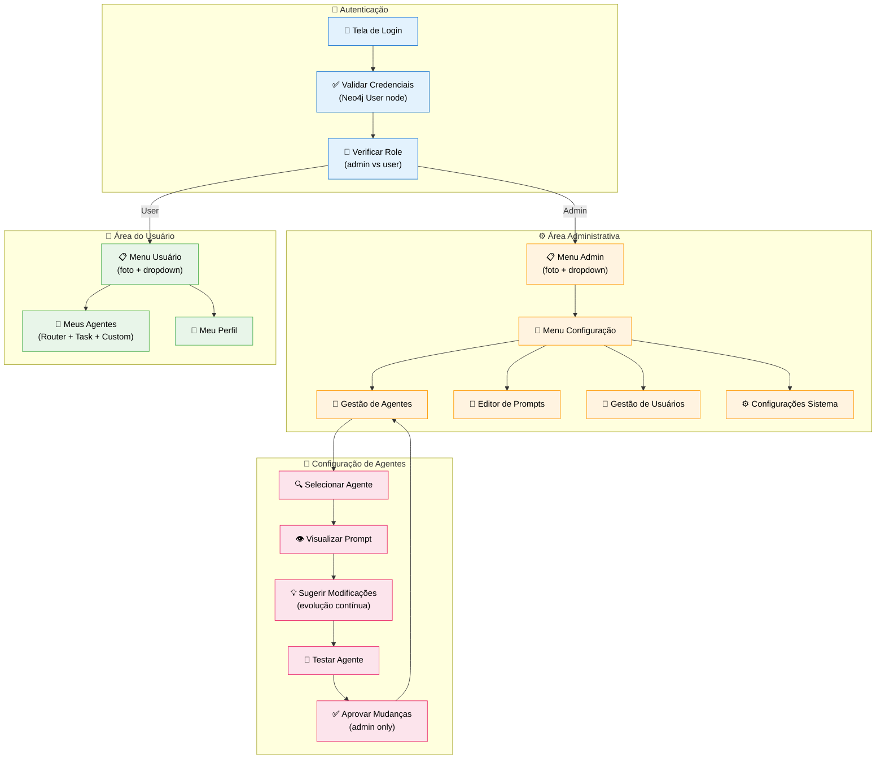
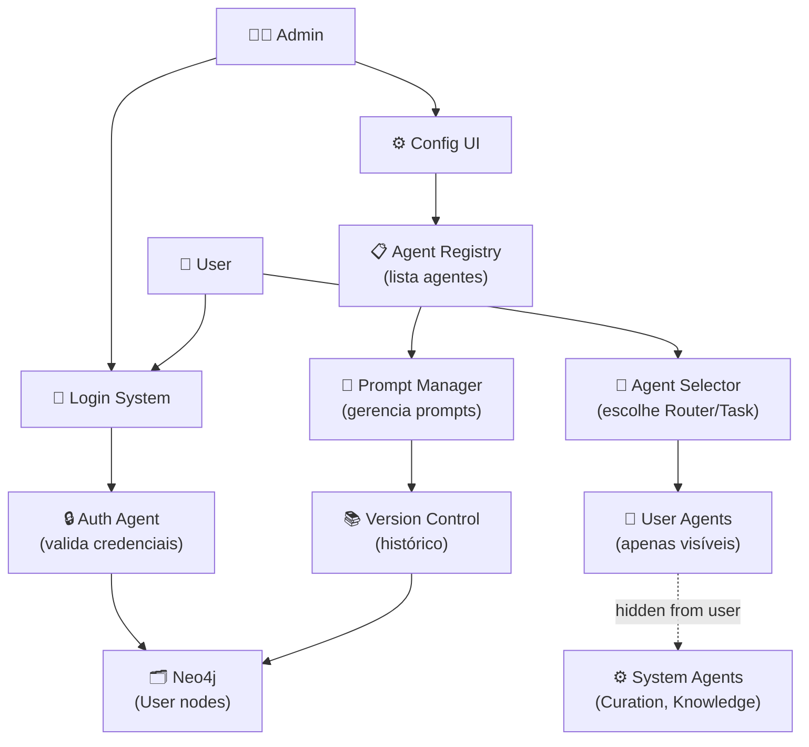

# Feature Specification: Admin Login & Configuration System

**Feature Branch**: `003-admin-login-config`  
**Created**: 2025-12-07  
**Status**: Draft  
**Priority**: P1 (Core)  
**Source**: User input (voice transcription + reference project)

## Process Flow (Business View)



### Flow Insights

**Gaps identificados**:
- Estratégia de senha: SHA256 hash com salt ou outra?
- Recuperação de senha: email, SMS, ou admin reset?
- Sessão: JWT com refresh token ou session storage?
- Auditoria: log de alterações de prompts?

**Oportunidades identificadas**:
- Versionamento de prompts (histórico de mudanças)
- Comparação side-by-side de versões de prompts
- Template de prompts por tipo de agente
- Estatísticas de uso por agente (qual mais usado)
- A/B testing de prompts

**Riscos identificados**:
- Prompt injection via edição maliciosa
- Perda de configuração ao atualizar prompt
- Conflito de versões entre múltiplos admins editando
- Agente quebrando após mudança de prompt

---

## Agent Collaboration



### Agent Visibility Rules

| Agent Type | Visible to User | Visible in Selector | Editable by User |
|------------|----------------|---------------------|------------------|
| **Router Agent** | ✅ Yes | ✅ Yes | ❌ No (system) |
| **Task Agent** | ✅ Yes | ✅ Yes | ⚠️ Can customize |
| **Knowledge Agent** | ❌ No | ❌ No | ❌ No (background) |
| **Curation Agent** | ❌ No | ❌ No | ❌ No (background) |
| **Custom User Agent** | ✅ Yes | ✅ Yes | ✅ Yes (own only) |

---

## User Scenarios & Testing

### User Story 1 - Admin Login (Priority: P1)

Admin acessa a plataforma, faz login e visualiza menu com opções de configuração que usuário comum não tem acesso.

**Why this priority**: Base de separação de permissões. Sem isso, usuários teriam acesso a configurações críticas.

**Independent Test**: Fazer login como admin e verificar presença do menu "Configuração" no dropdown.

**Acceptance Scenarios**:

1. **Given** admin na tela de login, **When** insere credenciais válidas, **Then** é redirecionado para dashboard e vê foto de perfil com menu dropdown contendo "Configuração"

2. **Given** usuário comum na tela de login, **When** insere credenciais válidas, **Then** é redirecionado para dashboard mas NÃO vê opção "Configuração" no menu

3. **Given** credenciais inválidas, **When** tenta login, **Then** vê mensagem de erro clara sem expor se email ou senha está incorreta

---

### User Story 2 - Admin Gerencia Agentes (Priority: P1)

Admin acessa menu de configuração, vê lista de todos os agentes (system + user), e pode visualizar/editar prompts de agentes do sistema.

**Why this priority**: Core da gestão de agentes. Admin precisa ter controle total para ajustes e melhorias.

**Independent Test**: Admin clica em "Gestão de Agentes" e vê lista com Router, Task, Knowledge, Curation, etc.

**Acceptance Scenarios**:

1. **Given** admin no menu Configuração → Gestão de Agentes, **When** visualiza lista, **Then** vê TODOS os agentes incluindo system agents (Knowledge, Curation)

2. **Given** admin clica em "Router Agent", **When** visualiza detalhes, **Then** vê prompt atual, histórico de versões, e botão "Editar Prompt"

3. **Given** admin edita prompt, **When** salva mudanças, **Then** nova versão é criada no Neo4j com timestamp e author_id

---

### User Story 3 - Admin Edita Prompt com Evolução Contínua (Priority: P1)

Admin edita prompt de um agente seguindo princípio de mudanças incrementais. Sistema sugere validações e registra histórico.

**Why this priority**: Garante que mudanças sejam seguras e rastreáveis, alinhado com princípio A.V (Mudanças Incrementais).

**Independent Test**: Editar prompt, testar em sandbox, aprovar mudança.

**Acceptance Scenarios**:

1. **Given** admin editando prompt do Task Agent, **When** faz mudança grande (>50% do texto), **Then** sistema mostra aviso "⚠️ Mudança significativa detectada. Considere iterações menores."

2. **Given** admin salvou nova versão de prompt, **When** acessa histórico, **Then** vê diff visual (antes → depois) com data, autor e justificativa

3. **Given** nova versão de prompt salva, **When** testada em sandbox, **Then** pode comparar resposta antiga vs nova lado a lado

---

### User Story 4 - Usuário Vê Apenas Agentes Permitidos (Priority: P1)

Usuário comum vê no seletor apenas Router e Task Agent (mais custom agents dele). System agents ficam invisíveis.

**Why this priority**: Separação clara de responsabilidades. Usuário não precisa saber que existem agentes de curadoria rodando por trás.

**Independent Test**: Login como user, abrir seletor de agentes, contar quantos aparecem.

**Acceptance Scenarios**:

1. **Given** usuário no chat, **When** abre seletor de agentes, **Then** vê apenas "Router Agent" e "Task Agent" (2 opções)

2. **Given** usuário criou custom agent "Meu Assistente", **When** abre seletor, **Then** vê "Router Agent", "Task Agent" e "Meu Assistente" (3 opções)

3. **Given** admin no chat, **When** abre seletor, **Then** vê TODOS os agentes incluindo system agents (para debug)

---

### User Story 5 - Usuário Cria Custom Agent (Priority: P2)

Usuário pode criar seu próprio agente customizado definindo prompt, nome e descrição. Agente fica disponível apenas para ele.

**Why this priority**: Personalização avançada. Não é bloqueante para MVP, mas é valor agregado importante.

**Independent Test**: Criar novo agente via UI, verificar que aparece no seletor.

**Acceptance Scenarios**:

1. **Given** usuário em "Meus Agentes", **When** clica "Criar Novo Agente", **Then** abre formulário com campos: nome, descrição, prompt base

2. **Given** usuário preencheu formulário, **When** salva, **Then** agente é criado como node no Neo4j com `scope: "user"` e `ownerId: user.id`

3. **Given** agente custom criado, **When** usuário abre seletor no chat, **Then** vê seu custom agent na lista

---

## Functional Requirements

### Authentication

**REQ-ADM-001**: Sistema DEVE implementar login com email e senha  
**REQ-ADM-002**: Senha DEVE ser armazenada com hash seguro (bcrypt recomendado)  
**REQ-ADM-003**: Sistema DEVE diferenciar role `admin` de `user` no node User do Neo4j  
**REQ-ADM-004**: Admin DEVE ter acesso total a configurações e visualização de todos os nodes  
**REQ-ADM-005**: User DEVE ter acesso limitado a seus próprios dados e agentes visíveis  
**REQ-ADM-006**: DEVE existir um **seed admin global da CoCreate** (ex.: `admin@cocreateai.com.br`) configurado via variáveis de ambiente ou script de seed (NÃO hardcoded em código), responsável pela configuração inicial da plataforma.  
**REQ-ADM-007**: No primeiro login do seed admin, sistema DEVE exigir troca de senha antes de permitir acesso à área administrativa.

### Admin Menu

**REQ-ADM-008**: Admin DEVE ver opção "Configuração" no menu dropdown da foto de perfil  
**REQ-ADM-009**: Menu Configuração DEVE conter: Gestão de Agentes, Editor de Prompts, Gestão de Usuários, Configurações Sistema  
**REQ-ADM-010**: User comum NÃO DEVE ver opção "Configuração" no menu

### Agent Management

**REQ-ADM-011**: Admin DEVE visualizar lista completa de agentes (system + team + user)  
**REQ-ADM-012**: Sistema DEVE separar visualmente agentes por scope: `global`, `team`, `user`  
**REQ-ADM-013**: Admin DEVE poder editar prompts de agentes `global` e `team`  
**REQ-ADM-014**: Admin NÃO DEVE editar agentes `user` que pertencem a outros usuários (apenas visualizar)

### Prompt Evolution

**REQ-ADM-015**: Sistema DEVE versionar prompts automaticamente ao salvar mudanças  
**REQ-ADM-016**: Cada versão DEVE conter: timestamp, author_id, prompt_text, change_justification  
**REQ-ADM-017**: Sistema DEVE mostrar aviso se mudança for >50% do prompt anterior  
**REQ-ADM-018**: Admin DEVE poder reverter para versão anterior de prompt  
**REQ-ADM-019**: Sistema DEVE permitir comparação visual (diff) entre versões

### Agent Visibility

**REQ-ADM-020**: User selector DEVE mostrar apenas agentes `scope: global` e `scope: user WHERE ownerId = currentUser.id`  
**REQ-ADM-021**: System agents (Knowledge, Curation) DEVEM ter flag `visibleInSelector: false`  
**REQ-ADM-022**: Admin selector PODE mostrar todos os agentes para debug (toggle "Mostrar System Agents")

### User Agent Factory

**REQ-ADM-023**: User DEVE poder criar custom agent via UI  
**REQ-ADM-024**: Custom agent DEVE ser criado com `scope: "user"` e `ownerId: user.id`  
**REQ-ADM-025**: Custom agent DEVE aparecer apenas no selector do próprio criador  
**REQ-ADM-026**: User PODE editar/deletar apenas seus próprios custom agents

### User Provisioning & Password Recovery

- **REQ-ADM-027**: Admin global da CoCreate (role `admin`, organizationType `"cocreate"`) DEVE poder cadastrar usuários (pessoas) via "Gestão de Usuários", informando ao menos: `name`, `email`, `organizationType` (`"cocreate" | "cvc" | "startup"`), `company` (ex.: nome da CVC ou startup) e `role` (gestor, founder, analista, etc.).  
- **REQ-ADM-028**: Ao cadastrar novo usuário, sistema DEVE avaliar domínio do email (`@cvc.com`, `@startup.com`, `@gmail.com`) para sugerir automaticamente `organizationType` e `company`, permitindo override manual pelo admin.  
- **REQ-ADM-029**: Sistema DEVE oferecer fluxo de recuperação de senha por email: usuário informa email, recebe link de reset com token de uso único e tempo limitado, e define nova senha sem expor senha atual.  
- **REQ-ADM-030**: Admin DEVE poder acionar reset de senha para qualquer usuário via "Gestão de Usuários" (gera link de reset ou define senha temporária, nunca exibe hash).  
- **REQ-ADM-031**: Após redefinição de senha (via link ou admin), sistema DEVE invalidar tokens de sessão antigos para aquele usuário.

---

## Success Criteria

### Security & Access Control
- ✅ Admin consegue acessar 100% das configurações
- ✅ User comum NÃO consegue acessar menu Configuração
- ✅ Senha nunca exposta em plaintext (hash verificado)
- ✅ Session token expira após inatividade (30 min default)

### Agent Management
- ✅ Admin vê todos os agentes incluindo system agents
- ✅ User vê apenas Router, Task e seus custom agents
- ✅ Edição de prompt cria nova versão no Neo4j
- ✅ Histórico de versões navegável e comparável

### Usability
- ✅ Login funcional em <2s com credenciais corretas
- ✅ Menu dropdown intuitivo e acessível via foto de perfil
- ✅ Editor de prompts com syntax highlighting e preview
- ✅ Criação de custom agent em <5 clicks

---

## Key Entities

### Neo4j Node Structure

```cypher
// User node (expandido com auth)
(:User {
  id: string,
  name: string,
  email: string,
  passwordHash: string,
  passwordAlgo: "bcrypt",
  role: "admin" | "user",
  organizationType: "cocreate" | "cvc" | "startup",
  company: string,
  area: string,
  active: boolean,
  createdAt: datetime,
  updatedAt: datetime
})

// Agent node (expandido com versioning)
(:Agent {
  id: string,
  name: string,
  tipo: string,
  scope: "global" | "team" | "user",
  ownerId: string (optional, for user agents),
  visibleInSelector: boolean,
  currentPromptVersion: string (ref to PromptVersion),
  active: boolean,
  createdAt: datetime,
  updatedAt: datetime
})

// PromptVersion node (novo)
(:PromptVersion {
  id: string,
  agentId: string,
  versionNumber: integer,
  promptText: string,
  changeJustification: string,
  authorId: string (admin who made change),
  createdAt: datetime
})

// Relationships
(:Agent)-[:HAS_PROMPT_VERSION]->(:PromptVersion)
(:Agent)-[:CURRENT_PROMPT]->(:PromptVersion)
(:User)-[:OWNS]->(:Agent) // for custom agents
(:PromptVersion)-[:PREVIOUS_VERSION]->(:PromptVersion) // linked list
```

---

## Technical Constraints

### Frontend
- Menu dropdown deve usar Radix UI DropdownMenu (já usado no projeto ref)
- Editor de prompts pode usar Monaco Editor ou CodeMirror
- Diff viewer pode usar `react-diff-viewer` ou similar

### Backend
- Auth deve usar bcrypt para hash (não SHA256 simples)
- Session pode usar JWT com refresh token pattern
- Versionamento de prompts deve ser append-only (nunca deletar)
- Fluxo de recuperação de senha via email deve usar tokens de reset armazenados de forma segura (hash + expiração), nunca guardar token em plaintext.

### Neo4j
- Índices obrigatórios: `User.email`, `Agent.id`, `PromptVersion.agentId`
- Constraint: `User.email` UNIQUE
- Constraint: `Agent.id` UNIQUE

---

## Assumptions

1. **Auth Strategy**: JWT com refresh token stored em httpOnly cookie
2. **Password Recovery**: Admin manual reset (email recovery = future feature)
3. **Session Timeout**: 30 minutos de inatividade
4. **Prompt Max Size**: 10KB por prompt (validação no frontend)
5. **Version Limit**: Guardar todas as versões (no pruning por enquanto)

---

## Open Questions

1. **Password Policy**: Exigir complexidade mínima (8 chars, 1 maiúscula, 1 número)?
2. **Multi-admin Conflict**: Como resolver se 2 admins editam mesmo prompt simultaneamente?
3. **Agent Testing**: Sandbox isolado ou testar em produção com flag `isTest: true`?
4. **Audit Log**: Criar node `AuditLog` para rastrear todas as ações de admin?

---

## Related Specs

- **001-knowledge-pipeline**: Usa system agents (Knowledge, Curation) que são invisíveis
- **TRG-SPC-008-user-agent-factory**: Detalhamento da criação de custom agents
- **TRG-SPC-009-agent-router**: Lógica de seleção dinâmica de agentes

---

## References

- Project Reference: `CVCHub - Copia` (CoCreateAI system)
- Constitution: A.IV (Gestão de Prompts), A.V (Mudanças Incrementais)
- Existing Code: `memory-scope-dialog.tsx`, `admin.ts`, `types/admin.ts`
